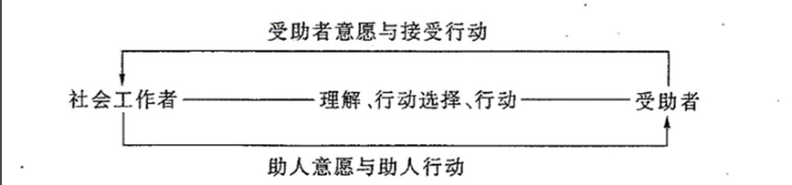

### 1. 社会工作的涵义与性质
#### 1.1. 涵义
##### 1.1.1. 社会工作的多重理解
1.	社会工作的定义 **（ 2011 名词解释）**
>社会工作是以利他主义为指导，以科学的知识为基础，运用科学的方法进行的助人服务活动。这一定义指出社会工作的本质是一种助人活动，其特征是提供服务。这个定义还指出，社会工作以受助人的需要为中心，并以科学的助人技巧为手段，以达到助人的有效性。社会工作是充分考虑到受助人的需要及其主体性，运用尽可能有效的方法帮助受助人满足其需要、摆脱困境的活动和过程。
2.	相关概念
（1）社会服务 **（ 2012 名词解释、2019名词解释）**
>社会服务是以劳务为主要形式向有困难的社会成员，特别是社会弱者提供的改善其处境的活动。它是将社会保障、社会福利传至有需要社会成员的过程。

B社会工作和社会服务的区别
B1社会服务是一个一般性概念:社会工作则是一个特殊性概念。社会服务的对象是全体社会成员;社会工作的对象一般是社会成员中比较特殊的部分,是社会中的弱势群体或困难群体,社会服务是一种涉及全面的服务
社会工作一般是指福利服务,是为将一个国家的社会福利政策转化为现实并使之成为社会弱势群体乃至其他成员能够享用的东西而进行的活动。
B2社会工作是一种注重工作程序的福利服务活动,它是通过各种服务程序,以实现社会福利的目标。而这种社会服务的程序是依据社会工作专业的知识、价值、伦理、方法及技术来确定和进行的,以确保福利服务达到预期的效果。

(2)	社会保障
>国家和社会依法保障社会成员的基本生活的社会制度。其目的是保障社会成员不因基本生活损而招致危险,并进一步达到社会的稳定。社会保障是通过政府立法而确定的,基本上属于政府行为.

社会工作和社会保障的异同：
A社会工作和社会保障的共同点在于,它们都是对社会上处于困难境地的人们提供帮助。
B二者的区别
B1社会保障基本上是由国家法律规范的救援措施与政策,属于社会政策的范畴;社会工作则是具体、直接的社会援助的提供。
社会工作将社会保障政策、项目转化为现实的服务,使之成为社会大众所共享的成果
B2社会保障属于收入或物质上的帮助;社会工作不仅提供物质上的帮助,而且提供精神上的帮助
B3社会保障的直接目的是维持有困难者的基本生活以不致发生危险,所以也叫社会安全;社会工作除了救助之外,还有发展受助者能力的任务
B4社会保障是对个人、家庭而言的;社会工作的对象包括个人、家庭及社区
B5社会保障的基本责任主体是国家和政府;社会工作的责任主体是社会工作者和受助者双方,是他们之间的合作。
(3)	社会福利 **（ 2014 名词解释 2012 名词解释**）
>广义指改善社会成员的物质与文化生活的一切措施,狭义指对社会弱者提供的带福利性的社会服务。社会工作与社会福利的异同

A社会工作与社会福利的联系
A1二者的对象趋向一致。从社会工作的发展趋势看,社会工作和广义社会福利的覆盖对象是逐渐重合的
A2社会工作是现代社会福利制度的一个重要组成部分,是推行社会福利的专业化、制度化手段
A3在我国由行政系统推行的社会福利(狭义的社会福利,如残疾人福利、儿童福利、妇女福利、老人福利),和社会工作实际上
混合在一起,难以作出明确的区分
B二者的区别
B无论是广义的社会福利,还是狭义的社会福利,社会福利都是指一种社会政策;社会工作则是具体服务的提供,是实现社会福利的手段
B 社会工作者还可以在社会福利政策提供的资源和社会弱势群体之间起桥梁和纽带的作用,使相应的资源为相关的人们所利用。

##### 1.1.2. 社会工作的构成要件
1.	作为社会行动的社会工作过程（助人自助）
社会工作是社会工作者有意识、有目的地帮助他人的活动。在这个助人活动中,社会工作者作为行动者,依自已的助人价值观去设计和实施助人活动,并积极吸引受助者主动参与这一行动过程,通过相互配合与协调,从而达到助人目的。在这个过程中,社会工作者是行动的主体,他设计并引导助人过程的进行,实际上,受助者也是行动的主体,他也将自己的意识、目的、对社会工作者行动的理解带入接受服务的过程,并直接影响这一过程因此,社会工作是社会工作者与受助者的互动过程.在这个过程中双方互为行动主体和客体.

2.	社会工作的要素 **(2013 简答题)**
    1.	服务对象
社会工作中的服务对象又称为受助者或案主，它是指在社会工作过程中需要帮助的一方，是在正常的社会生活中遇到困难需要帮助而解脱困难的个人或群体。
服务对象存在是社会工作得以发生的基本前提。没有服务对象或受助者，社会工作就失去了对象，社会工作也就不会发生。服务对象是在服务发生之后形成的，在这之前他们处于潜在状态。
    2.	社会工作者
在助人活动中，社会工作者是提供服务的一方，他依据助人价值观去设计和实施助人活动，并积极吸引服务对象主动参与这一行动过程，以相互配合与协调，从而达到助人。
    3.	价值观
（1）	社会工作价值观（values）是社会工作者所持有的评判助人活动的一套观念。
（2）	它包括社会工作者对助人活动的看法、对服务对象的看法以及对自己的看法等。
（3）	社会工作价值观的核心是利他主义，即社会工作者以帮助他人、服务于他人为自己行动的目标。这是社会工作区别于其他活动的基本特征之一。
    4 .助人活动
助人活动（或称服务）是社会工作者根据服务对象的需要，依据社会工作价值观向服务对象提供帮助或服务的行动，也是社会工作者与服务对象的互动及合作的过程。社会工作者向服务对象提供后者所需要的服务或帮助是社会工作的最基本的活动。
    5.	专业方法
社会工作的助人方法不只是指人们在实际工作中所使用的一般方法，而是指社会工作群体在长期的助人实践中形成的、经过实践检验行之有效的做法。这是一套基于多种科学知识而形成的处理人与人的关系、帮助人走出困境的方法，是一些操作性很强的实务工作方法。这些方法作为一种知识被社会工作者共享，并有效地支持着社会工作者的实践。

##### 1.1.3. 社会工作的类型
①普通社会工作
>普通社会工作是在高度集中的社会主义计划经济体制下出现的，是在本职工作之外所从事的不计报酬的服务性和管理性工作，包括教师兼任的班主任、学生兼任的团支部书记、职工兼任的党支部委员和工会委员等。它基本上不属于现代意义上的社会工作。

②实际社会工作/行政性社会工作
>在我国政府部门和群众组织中，有一些以专门进行福利服务活动为己任的职业或岗位，它们承担着为群众排忧解难的职能。如民政部门的社会救济、社会福利、工会、妇联等，他们的工作以服务工作为主，同时也是管理工作。这类工作当前是我国社会工作的主体。

③专业社会工作 **（ 2013 名词解释 2015名词解释）**
>专业社会工作是受过社会工作专业培训的人员，遵照社会工作的价值观，采用社会工作专业方法进行的服务。其工作人员系非政府官员，服务组织多是社会团体或民间机构。这类社会工作在我国尚处于发展初期。

#### 1.2. 性质
##### 1.2.1. 社会工作是应用社会科学
社会工作以科学的理论和知识为基础，以解决实际问题为目的。社会工作有多种理论，但是理论并不是社会工作的目的，理论最终是为社会工作实践服务的。在社会工作实践中，理论指导实践，实践修正和完善理论。在具体的社会工作实践中，社会工作者有自身的价值追求，而且这种追求有时带着强烈的理想化色彩，比如社会工作追求社会公平。社会工作要以解决社会问题为目标，所以带有明显的应用性。

1.	社会工作的科学性（如何具体地理解社会工作的科学性质？）
A.	工作态度的客观性。社会工作是一种助人的活动，是社会工作者为求助者提供资源以帮助其摆脱困境的过程。在这一过程中，工作者虽抱有助人的价值观念，但他审视问题的立场及态度却是客观的。他不是从感情出发，而是基于自己的知识基础、专业操守客观地对待问题，寻求合理且有效的解决问题的办法。社会工作者与受助者之间的关系是工作关系，他以“专业角色”开展工作，力求避免将其个人偏见、冲动等态度不经意地流露于助人过程中。
B.	工作方法的科学性。社会工作十分注意工作方法，因为科学的工作方法是成功开展社会工作的基本条件之一.经过近一个世纪的发展和不断积累、完善，社会工作已形成一整套针对不同任务的工作方法，包括社会个案工作、社会小组工作、社区组织与社区发展、社会行政，等等，这些方法反映了社会工作助人过程的基本规律，经受了无数次助人实践的检验，已成为社会工作者必须遵循的标准的工作准则。
C.	工作程序的合理性与严密性。从接触求助者到接受他的请求，从了解求助者的需要到设计工作方案直至最终解决问题，社会工作的过程是一个持续的、前后连贯的过程，每个环节都是必不可少的，都在为达成目标准备着条件，直至实现目标。当然，社会工作过程的合理性与严密性不是自动实现的，需要社会工作者在不断总结经验、教训的基础上做出精心的设计。

2.社会工作的实用性
社会工作不是一门以探讨学理为宗旨的基础学科或理论学科，而是以解决实际问题为宗旨的应用学科。与自然科学中以解决现实问题为宗旨的工程学类似，社会工作学是社会科学中以解决现实社会问题为宗旨的或可称为“社会工程学”其中的一门。社会工作虽然也要告诉人们如何看待和分析各种现实的社会问题，但它更看重的是教导人们如何去解决这些问题.社会工作学科所提供的各种理论、方法与技术、技巧，都是为解决社会问题服务的。
社会工作对象即社会问题的复杂性，决定了它必须善于运用多种社会科学甚至自然科学提供的理论、方法及技术为自己服  务。社会工作学科的知识体系是开放的，它通过不断地提炼、吸收一切有利于开展助人活动的各相关学科的知识，来充实自己的内容。应当指出，社会工作的综合性并不意味着其学科知识是杂乱无章、不成体系的。它是以实际利于助人活动、解决现实问题为标准或核心，去取舍相关知识的。因此，社会工作的学科知识是整合的、成体系的。

##### 1.2.2. 社会工作与其他学科关系
（1）社会工作与社会学的关系社会工作是社会学的二级学科
社会工作是作为对于社会问题的回应而出现的，社会学的分析常常成为社会工作分析问题产生原因及解决方法的基础和出发点，社会工作被称为应用社会学。
社会学的理论和知识是社会工作的基础；社会学的方法和方法论为社会工作厘清问题、找到对策提供了基本的手段。社会工作更注意应用，更注重社会福利的提供和社会服务的实施
（2）社会工作和社会心理学的关系
社会心理学的理论为社会工作提供了理论基础、分析框架和实施指导。社会工作的具体实施丰富和验证了社会心理学理论。
（3）社会工作与政治学的关系
政治学主要研究国家政治体制、政党和政府的政治实践活动以及国家的体制和制度是如何对于人的日常生活发生统治性影响的，而影响人们的日常生活的一项重要制度就是社会福利制度。
社会工作通过制定实施社会政策为弱势群体谋福利。社会工作者团体与政府是伙伴和压力群体两种角色。社会学和政治学有一定关系，要从事社会工作，必须了解国家政治，特别是社会政策。
（4）社会工作与经济学的关系
经济学一般来说关注效率，社会工作更关注社会公平。
经济学和政治学的结合点在于福利经济学，福利经济学的关键是如何使社会财富效用最大化。方法就是把社会财富用于最需要的人。社会工作实践中也会用到很多经济学的知识。
（5）社会工作与伦理学的关系
社会工作是在基督教伦理基础上发展起来的，反映了资产阶级的自由、平等、博爱等观念。
社会工作不但以人道主义、社会公平的社会理想去看待社会问题，而且用包含社会伦理的方法去对待受助者和相关事务

##### 1.2.3. 社会工作实务的属性

（1）社会工作的实务特征
社会工作实务是指社会工作者在科学理论的指导下，运用社会工作方法帮助受助者对象的活动。
社会工作实务的过程包括：与服务对象接触；对其求助的问题进行科学评估；确定问题并与服务对象一起确定解决问题的方法：合作解决问题；共同评估以确认问题的解决。
尽管以上的过程需要一定的理论指导，但是其最终还是要社会工作者用行动去诱发、引导、推动受助者处境的变化。
（2）社会工作是实践活动
社会工作的实践活动是在理论的指导下进行的，但是由于问题的复杂性，特别是助人活动的复杂性和动态性使得社会工作实践不是采取一种既定的模式机械地从事助人活动，而是社会工作成为社会工作者的一种实践。库恩在《科学革命的结构》  中，对于范式进行了如下的定义：范式是研究者共同体提出典型问题和典型解决方法的、被普遍承认的模式，即他们看待和解释世界的基本方式。社会工作在长期的实践中，形成了科学主义范式和社会建构主义范式。
科学主义范式把社会工作看成自然科学式的认识和活动过程，他们遵照被认为是一套科学的逻辑和方法去处理问题，并且用普适性的指标去评估工作效果。其强调规范化和标准化。
社会建构主义则强调社会工作过程中社会工作者与服务对象以及其环境因素在变动的情境中进行反思性的互动并寻求解决方法的动态过程。社会工作者和服务对象都是能动者，因此其服务过程和结果都具有建构性。社会工作者不只是作为助人者外在地、科学地去对待作为客体的服务对象，而是自己也已进入待处理的工作对象，即对象系统之中。
（3）社会工作是一种道德实践
社会工作具有明显的实务性和实践性的特点，但是这种实务和实践又不是自然科学式的、以社会工作者为主体的改变对象的活动，而是其中充满价值道德化的实践活动。
社会工作在长期的专业发展中，以自然科学为范本，强调其科学性、客观性和价值中立。但是随着这种科学性、专业化的追求的发展，社会工作的程式化、官僚化也在发展，这就不利于社会工作的实质追求助人，致使社会工作的异化。
本质上讲，社会工作是充满价值的，是一种道德实践，其包含两个方面的含义：其是以实现社会正义、增进社会和谐、推动社会进步而进行的活动，而这些社会价值都与道德联系在一起：社会工作在认识和界定问题、干预和处理问题的过程中都以一定的价值观为指导，从而使其助人实践带有道德的特点。从宏观层面来看，社会工作者是在认同社会正义和人道主义的价值基础上从事其助人活动的，社会工作者就是通过自己的实践来实现这种价值追求。在具体的助人与服务活动中，社会工作者也要不断地理解服务对象的想法，通过“双重诠释”去选择合适的助人行为。站在为服务对象增加福社的角度去分析问题和处理问题，反映了社会工作者“强烈的价值介入”，反映了社会工作实践的道德特征。

### 2. 社会工作的产生与发展
#### 2.1. 产生
##### 2.1.1. 西方社会工作产生的社会历史背景
1.资产阶级革命及人道主义的张扬 **（ 2014 简答题）**
以文艺复兴为先导的资产阶级思想革命主张恢复古代世俗的思想文化，主张以人为中心，一切为了人的利益。法国资产阶级革命进一步张扬了人道主义。资产阶级思想家强调天赋人权，认为所有的人在人格上都是平等的，都有追求幸福和自我发展的权力。资产阶级人道主义作为西方社会的一种意识形态与宗教伦理一起为后来兴起的慈善活动和广泛的助人活动奠定了思想基础。
2.工业革命及其引发的社会问题
18世纪60年代，英国首先完成了工业革命。接着到19世纪30年代，西欧主要国家法国、德国也相继完成了产业革命。工业革命不但使这些国家的经济结构发生了变化，而且也对社会关系、社会结构产生了深刻的影响。
①整个社会日益被划分为两大阶级，即资本家阶级和工人阶级。阶级的两极分化也是财富和贫困、特权和无权向两极的积累，两个阶级日益尖锐地对立起来。
②资本主义经济的高速发展打破了封建时代的封闭的农村经济，也迫使农业劳动力转化为大工业生产劳动力的出卖者。大规模的社会流动破坏了农村的社会结构和家庭结构。
③资本主义经济的发展及其价值的蔓延冲击着以往的社会关系，它使人与人之间的关系变为赤裸裸的利害关系，利已主义得到充分扩张。
④社会问题大量出现。在资本主义的发展中，自由竞争使得竞争中的失败者沦为贫困、无助的一群，贫穷、饥饿、失业、堕落充斥着社会。
3.制度背景
1601年,英国伊丽莎白女王颁布“济贫法”推动了英国社会对的制度化发展,也推动了慈善事业的发展。指出了政府在社会救助的责任,明确“助人自助”,规定由专业人员从事救助。

##### 2.1.2. 西方社会工作产生
1.解决社会问题的思路 **(2014 简答题)**
在试图消灭资本主义带来的弊端的途径方面，基本上分为改良和革命两种思路。
①改良主义者认为，要解决资本主义社会的社会问题可以采用补救和协调的方法，可以通过修改社会政策来调整各阶级、阶层之间的利益关系，减少社会问题。其具体措施包括实施社会救济、提倡人道主义和博爱互助等
②马克思主义从生产关系一定要适合生产力的发展的社会运行规律出发，指出资本主义制度的出路必定是它的灭亡和社会主义的产生。马克思主义不同意用宗教、道德和改良的方法去拯救资本主义社会，而是对之进行革命的改造。

2.社会工作的产生
西方的社会工作形成于19世纪末至20世纪初。
(1)	社会工作的形成
1.英国的伊丽莎白济贫法 **（2019 简答）** 
A.由来
英国的产业革命开始最早，社会对贫穷问题的威胁的感受亦最深，其济贫事业也最发达。英国原来是由教会办理济贫事务  的。但到了16世纪，贫民数量迅速增长，教会财力已不堪重负，于是改由政府接办。伊丽莎白女王登基执政后，针对贫穷问题，曾颁布了各种济贫法案，其中以1601年的法案（PoorLaw，史称旧济贫法）最为完备，也最为有名。该法案正式承认政府对济贫负有责任，并建立了初步的救济行政制度与救济工作方法，成为各国现代社会救济事业的开端。
B.基本内容及其特点
B1.规定每一教区每周应向地主征收济贫税。
B2.规定贫民救济应由地方教区举办，每一教区设立监察员若干人，中央政府设立监督人员。
B3.规定凡有工作能力的贫民必须参加劳动，不得行乞游荡，以工作换取救济（这可看做以工代赈的发端）。教区设贫民习艺所，配给原料及工具，强迫有劳动能力者从事生产。
B4.对不能工作的贫民，如患病者、老人、残疾人，实行教济。救济工作分院外与院内两种。对有家庭者给予家庭补助，使其回家从事生产（院外救济）；对无家可归者实行院内救济。
B5.规定人们对贫穷亲属负有教济的义务。教区即公共救济机构仅在贫民无法从其家人或亲属处获得帮助时，才给予救济。
C.缺陷
就与现代社会工作的关系而言，济贫法成为现代救济工作的开端，对专业社会工作影响很大。但也有不少严重缺陷：可能养成贫民的依赖心理；对贫民的自尊心注意不足；干涉了贫民谋生的自由。
D.对社会工作的意义
伊丽莎白《济贫法》对现代社会工作专业的形成产生了极其重要的影响，对社会工作发展的意义主要体现在以下几个方面：
D1.政府负起了社会救助的责任，并直接参与了社会救助活动的组织工作。这在某种意义上为社会工作的诞生创设了一个合法性前提，使社会工作专业的诞生有了良好的社会基础。
D2.伊丽莎白《济贫法》从立法的角度确立了助人自助的观念，这既是一个救助原则，又是一个救助理念。伊丽莎白《济贫法》承袭以前的济贫立法中关于“有劳动能力的乞丐”的概念，对不同情况的贫民施以不同的救助，使社会资源得以更有效的利用，同时也可以避免刺激一些人的“懒汉”思想。
D3.对于社会工作专业的发展来说，伊丽莎白《济贫法》最重要的作用还在于它确定由专门人员从事济贫救助活动。从某种意义上来说我们可以将救助人员的专门化视作社会工作职业化的开端。
D4.伊丽莎白《济贫法》所实施的院外救济也是社会工作提供服务的一种基本形式。

2.德国的汉堡制与爱尔伯福制
A.汉堡制
为解决日益严重的贫民问题，1788年在汉堡市曾实行了一种比较有特色的救济制度，史称汉堡制，对后来各国救济制度与方法影响较大。汉堡制是按布希（Busch）教授起草的计划制定的。它规定在该市设立中央办事处，综理全市救济业务。全市按救济需要设立若干区，每区设监察员一人，赈济员若干人。实施救济的原则是助人自助。其工作的内容或方式包括：为失业者介绍工作；将贫苦儿童送往职业学校习艺；将患病者送往医院诊治：对沿街乞讨者不予施舍，以取缔无业游民，使贫民不致依赖成习。汉堡制施行了13年，很有成效。但到后来，因城市人口增加太快，救济人员不足，趋于衰微。
B.爱尔伯福制
1852年，德国另一个小城市爱尔伯福（Elberfeld），也仿效汉堡制并加以改良，实施救济制度，史称爱尔伯福制，对后来救济工作的方法影响较大。其具体内容为：将全市划分为564段，每段约有居民300人。每段设赈济员一人，由政府委派地方    热心人士担任，为荣誉职。赈济员的工作有两个方面：其一是发放赈济款。求助者必须与账济员接洽。接案后，赈济员应首先赴求助者家庭做家境调查，经调查确实需要救济者方能给于帮助。救济实施后，每两星期再前往调查一次。发放顺济款依据法律所规定的最低标准，不许贫民养成依赖心理。其二是从事段内贫穷的预防工作，如介绍职业、训练与管理无业游民  等。全市每14段设一个济区，每区设监察员一人，领导区内各段赈济员，并由区内14段联合组成一个赈济委员会，由区监察员任主席，每两星期开会一次，讨论有关全区赈济工作。全市设立由各区联合组成的中央委员会，由委员九人组成，作为全市最高救济机关，统一管理和支配全市济贫所、医院及院外救济事宜，每两星期开会一次。

3.英美的慈善组织会社
A.由来
由于工业化的迅速推进，贫民、失业者人数大增，而当时实施的济贫法实际效果并不尽如人意。在这种情况下，各种具有不同目标的慈善组织纷纷出现，征募捐款，救济贫民。由于这些组织互不搭界，各自为政，造成了不少混乱与浪费。为纠正这种现象，索里（Reverend Henry Solly）牧师参考汉堡制及爱尔伯福制的做法，于1868年建议成立一个组织，以协调政府与民间组织的各种慈善活动。故于1869年在伦教成立了第一个慈善组织会社（Charity  Organization Socicty，COS）。该会社接受托马斯·查默斯（Thomas Chalmers）的理论，认为个人应对其贫穷负责。接受公共救济将损害贫民的自尊心、进取心与道德观念，致使他们依赖救济为生。因此，该会主张贫民应尽其所能以维持其本人的生活，外来力量只在必要时才介入救济。
B.实施救济的方法
B1.成立一个中央管理与联系机构，并将伦敦全市划分为若干区，每区成立一个分支机构，主持救济分配工作。
B2.各区办理区内所有救济机构受理申请救济案件的总登记，另特设咨询部，供济贫法执行人员、各慈善组织及个别慈善家搜集有关申请救济者的材料，使不少的同时向多个救济机构“求助”的职业乞丐暴露其真面目。
B3.各区派人对所有申请案件进行个别详细调查，其涉及的项目包括申请人的各种社会环境，如住房、健康、教育及工资
等。
B4.提高救济款物配额，使之能够满足申请人的生活需要。
C.对社会工作专业化的贡献
“慈善组织会社”的实践对社会工作的专业化有重要的贡献：
C1.“会社”首创派友好访问员（friendly vistors）访问申请救济者，以了解其社会背景并确定应采取的措施。
它强调依据调查，按个别情况的不同，对每一案件分别做出处理。这种强调“个别化”的做法，促进了社会个案工作这一社会工作专业方法的产生。
C2.“会社”促进各救济机构、慈善组织为解决社区问题采取协调合作的步骤，也为社区组织工作的发展奠定了基础。

4.英美的睦邻组织运动
A.由来
睦邻组织运动（the Social Settlement Movement，Settlements and Neiborhood Cen-ters），也称社区改良运动。19世纪末叶，牛津大学经济学讲师汤因比（Arnold Toyn-bee），为宣扬基督的博爱精神，消除人间不平，与贫民共同生活，并为他 们服务。但汤氏不幸患肺病于1883年去世，年仅30岁。汤因比的精神对另一位牛津大学毕业生巴涅特（Samuel A Barnet） 影响很大。巴氏为东伦教教区的牧师，该教区是伦敦最贫穷的教区之一，有很多失业者、患病者，以及居住于拥挤、肮脏住宅者。巴涅特发动当时就读于牛津大学、剑桥大学的学生前往该教区为贫民服务，与贫民同处，以便实际了解贫民是生活情行，研拟对策。为纪念亡友汤因比，巴氏于1884年在其教区建立了一个大学社区睦邻服务中心，取名为汤因比馆（Toynbee Hall）。
B.特点
汤因比馆实际上就是一个社区服务中心，具有以下四个特点：
B1.设于贫民区，备有宿舍，所有工作人员均与贫民共同生活。
B2.没有既定的工作计划，视居民实际需要而工作。
B3.尽量发动当地人才，培养其自觉的互助合作精神，为社区服务。
B4.社区睦邻中心不仅是服务中心，而且也是文化中心，向居民介绍本圈及国外文化。
C.对社会工作专业化的意义
睦邻组织运动对专业社会工作发展的意义在于：
C1.社会工作的目的在于谋求个人与社会生活的改善，工作方式应从个人与社会双方人手。
C2.社会工作应随时依社区实际需要而开展，应发动、组织或配合社会力量开展工作。
C3.社会工作应以整个社区为对象，以促进社区福利的全面改善为目的。
C4.社会工作进行的方法，不仅可运用社会个案工作方法，而且应运用社会群体工作、社区组织等方法。
(2)现代社会工作是实践的产物
社会工作是在解决社会问题的过程中不断发展的。首先是社会变迁产生的诸多社会问题需要人们去解决，其次是人们采用在一定历史时期和特定条件下适用的方法去应付这些问题，然后是人们不断探究更加有效、合理的解决问题的方法，并从中总结出一些经验。
(3)现代社会工作的特点
社会工作发展的历程和现代社会工作的形成表明，社会工作需要明确的价值观和理论指导，需要一套行之有效的工作方法和技巧，需要有应付新问题的能力。这是现代社会工作的特点。

#### 2.2. 发展
##### 2.2.1. 社会工作专业方法的发展
到19世纪末至20世纪初，社会工作在西方发达国家已进入专业发展阶段，它表现为社会工作专业培训和教育的发展及社会工作的科学化。
①1917年，美国学者玛丽·芮奇蒙（Mary E.Richmond）出版《社会诊断》一书，试图使社会工作方法成为一套独立的知识。
此后她又发表《什么是社会个案工作》，使社会个案工作作为一种专业方法被社会工作者普遍接受。到20世纪30年代中期，个案工作一直是社会工作界普遍承认的唯一的工作方法。
②自20世纪20年代开始，小组工作被纳入社会工作训练课程，研究者也积极地从事小组工作理论的建构。到40年代中期，小组工作作为社会工作的专业方法被接受。
③社区工作作为一种专业工作方法也逐步发展起来。起初，它只是一种服务于个案工作的间接方法。到60年代，社区工作已被正式承认为社会工作专业的一个基本方法。
④70年代，社会行政作为一种间接的工作方法被接受。

##### 2.2.2. 社会工作目标模式的变化
①最初，社会工作是为解决已出现的问题而存在的，即它只扮演着补救者的角色，任务是诊治受助者的问题。这在个案工作占主导地位的阶段尤其明显。
②随着社会问题的不断涌现和复杂化，预防问题的出现成为社会工作者的一项工作内容。另一方面，社会工作者认识到，不但要帮助受助者解决当前面对的困难，而且尤其要注意发展受助者的能力，以免其再入困境。这样，治疗—预防，救助—发展就成了社会工作基本思路。

##### 2.2.3. 中国社会工作的发展
（1）我国古代的社会福利思想
①《礼记·礼运大同篇》记述了孔子提出的社会福利主张：“大道之行也，天下为公，选贤与能，讲信修睦。故人不能独亲其亲，不独子其子，使老有所终，壮有所用，幼有所长，镖寡孤独废疾者皆有所养。男有分，女有归。货恶其弃与地也，不必藏于己。力恶其不出于身也，不必为己。是故谋闭而不兴也，盗窃乱贼而不作。故外户而不闭，是谓大同。”短短数语就道出了大同社会的理想，它希望能超越一家一户，在经济上互助互利，人与人之间融洽和谐，使每一个成员都能得到正当合理的生存，有一套较为完整的社会保障制度，从幼而壮而老，从男到女，到保寡孤独废疾者，都能生活下去，都过着没有欺诈，没有盗窃的安宁的社会生活。这一大同思想对我国后来的社会福利思想及实践有着极大的影响。它是我国古代福利思想的代表，同时也就是现代所实施的主要社会福利措施。
②孟子继承和发展了孔子的社会福利思想。他提出了“仁政”的政治主张，为了实现“仁政”，孟子提出以德服人，而不是以力服人的重要方法。孟子的这种“仁政”思想是孔子思想的延续，同样对我国后世的社会福利思想及实践产生着重要的影响。
③墨子是一位富于批判精神的思想家，他在揭露和批判当时不合理社会现象的基础上，提出要使广大人民能够生存，能够活下去，进而提出和平康乐的理想社会图景。墨子的理想社会是和平、非攻的社会，是“兼相爱”的社会。墨子的理想社会也是康乐的社会，交相利的社会，除了维持最低的生活条件外，更需要人民之间的互助协作。墨子的这些思想是从对现实社会的批判中引发出来的，是建设性的，对我国后来社会福利思想及实践的影响同样不可低估。

（2）我国古代的社会救助制度
①保息六政
a.《周礼》记载大司徒以保息六养万民，一曰慈幼，二曰养老，三日娠穷，四曰恤贫，五曰宽疾，六曰安富。用今天的话说，就是保护儿童，赡养老人，扶助穷人，社会救助，医疗保健，社会安全。同时还记载着大司徒以荒政十二项措施聚万民。
b.周代还以本俗六安万民，一日微宫室，二日族坟墓，三日联兄弟。四曰联师儒，五曰联朋友，六曰同衣服。用今天的话来讲，就是住宅修建和精神伦理建设。福利的真义应是物质与精神兼有，整体与个体兼顾，政府与民众并举，为使民众能够生得其所，活得愉快，死得安详，不仅要慈幼、养老，而且还要娠穷、恤贫、宽疾、安富来配合，此外还需以本俗来呼应。
②九惠之教
我国古代福利思想与措施的记载，除《大同篇》及《周礼》之外，还有《管子》一书。其中写道：“入围四旬五，行九惠之教，一日老老，二日慈幼，三日恤孤，四日养疾，五日合独，六日问疾，七曰通穷，八日娠困，九曰接绝。”此九惠之教，，在一定程度上类似于现代各国实施的老人福利，儿童福利，社会救助，医疗服务，婚姻咨询，健康服务，创业服务，就业服务，义亲奉视等等。
③社仓乡约
a.常平仓。此项措施自汉朝开始，其具体做法是：常平仓者置理仓舍，当粮食价格低时适当拍高粮价买人储存起来，到粮食价格高时适当压低粮价卖给百姓。
b.义仓。义仓是把政府征粮或由富户义捐的粮食储存到仓库里由官府派人管理，荒年或青黄不接时，出仓以娠济难民。
c.社仓。社仓是由人民自行组织，或由政府督导人民办理类似一种农贷合作组织的救济设施，由各地人民捐集粮食，或由政府贷给粮食，在各乡设仓储存，遇凶年或青黄不接时用以救济邻里贫户，仓务的管理由社仓参加人或设立者推选管理人员自行负责。
d.乡约。乡约制度是我国古代社区组织的创举，所谓“乡约”，即住在邻近地区的人，共同遵守的规约。此种规约起始于北末的“吕氏乡约”，为蓝田吕大钩及其兄弟、邻里亲友所发起。其内容分为德业相励，过失相规，礼俗相交和患难相恤等四大项。

（1）中国历史上缺乏专业社会工作
传统的中国一直是个农业国，经济上是自给自足的小农经济，文化价值上形成了以儒家思想为主，儒、释、道相杂合的生活文化。我国人民团于较为封闭的亲友圈子之中，对他人无多求助，因此不可能产生专业意义上的社会工作。

（2）20世纪上半叶社会工作在中国的发展
①20世纪初，一些传教士在中国的大学开始讲授社会学、社会服务等课程，一些大学开始从事社会服务教学并从事服务实践活动。
②一些在西方受过正规教育同时受西方文化影响的知识分子为了救国救民也从事农村发展活动，其中以晏阳初倡导并极力推行的华北平民教育运动最为典型。这是中国知识界施行的、具有一定专业性质的社会工作实践活动。

（3）1949年以后中国的社会工作
1949年中华人民共和国成立之后，我国建立了社会主义制度。在这种体制下，政府通过其代表者一一各种社会组织和单位，并通过国家干部、行政程序和手段向人们提供生存资源和力所能及的帮助，从而形成靠行政框架解决社会问题的模式。这样，在计划经济时期，我国就排除了专业社会工作存在的必要性。

（4）改革以来中国社会工作的发展
①1979年国家决定恢复社会学学科建设，社会工作课程作为应用社会学也在一些大学恢复起来。
②1986年，国家教委决定在高等学校设立社会工作与管理专业。一些学校随即开始招收社会工作与管理专业的本科生。这样，专业社会工作教育开始起步。
③与此同时，民政部门对干部进行在职培训，讲授社会工作内容，从而形成了此后的行政性社会工作与专业社会工作相结合的发展格局。

##### 2.2.4. 中国社会工作发展中的挑战 **（ 2018 论述）**
（1）社会工作在我国经历了一个曲折发展的过程。时至今日，我国正处于剧烈的社会转型时期，这为社会工作在我国的发展提出了客观的要求，其表现主要有四点：
①贫穷问题仍然是面临的一个重要问题；
②失业和半失业现象将不断涌现；
③老龄化问题迫在眉睫；
④青少年犯罪问题呈上升趋势。
（2）上述种种问题只是在我国需要大力发展社会工作的一个方面。另一个方面，随着我国社会的转型，原有的解决这些问题的机构也发生了这样那样的变化，不再能够圆满地解决这些问题，这就进一步显示出了发展社会工作的重要性。
①从政府的角度看，政府不想再包揽一切。在我国，政府以往对各种社会问题的解决负有很大的责任。但随着改革的深入和社会的发展，政府发现不能再像以往那样包揽一切，于是提出要转变政府职能。
②从企事业单位的角度看，企事业单位也不想把职工的各种问题全包揽下来。以往中国的状况可以说是“企业办社会”，企业
把职工的生老病死等各种问题都包下来，但随着市场经济的推进，企业深切感到“企业办社会“严重地影响和制约着其经济效益的提高，既造成企业内部不经济，也造成企业外部不经济，因而企业强烈呼呼把一部分已经承担的福利和服务项目转移出去。
③从家庭的角度看，家庭无力承担原有的全部职能。家庭是社会的细胞，传统上承担着诸多的取能，但随常社会的发展变化，我国原有的家庭结构发生了较大的变化，现在双职工夫妇又往往难于承受这种负荷，需要社会给予帮助
④从邻里角度看，邻里的互助显衰微趋势以往，邻里作为一个初级社会群体发挥着生产上的互相帮助，生活上的守望相助和情感上的相互交流等多方面的职能。但随着社会的发展，邻里的这些功能渐趋衰退，人们之间的交往主要不再是道德的或友谊的取向，而是金钱的或利益的取向，人们每天忙于自己的事务，对邻里的困难并不怎么关心。
（3）从以上分析不难看出，随着我国社会的转型，不可避免地会带来这样那样的社会问题，而原有解决这些社会问题的机构，其功能又纷纷外移。因此，在客观上也就提出了这些社会问题将由谁来解决的问题，这也就为社会工作在我国的发展及专业化提出了迫切的要求。
①加快发展经济，增加社会福利方面的投入。社会工作是需要以经济发展作后盾的，没有一定的资金作保证，社会工作很难发展，更谈不上专业化。
②大力发展社会工作教育，培养更多的社会工作专业人才。社会工作教育是社会工作专业化的前提，只有社会工作教育有了比较充分的发展，社会工作才可能实现其专业化。
③正确对待社会工作本土化的问题。社会工作产生于西方，在我国开展社会工作的确有个本土化的问题，而当前此问题在我国又集中表现为社会工作与民政工作的关系问题。
④实干加宣传。社会工作的发展及专业化不是凭空而来的，要靠实干和宣传。社会工作要走向社会，切实为人民群众排忧解难，让人民群众在亲身感受中知道社会工作是什么，同时引起政府的高度重视。宣传也是很重要的一个环节。大力宣传社会工作，让人民群众知道有了困难应该去找社会工作者或社会工作机构是十分必要的。只有如此，社会工作才能在我国有广泛的群众基础，并为政府所提倡和支持，进而迈入专业化的新阶段。

##### 2.2.5. 发展社会工作的必要性
（1）我国社会工作的发展还不成熟
①我国缺乏专业社会工作。现代社会工作是工业化、城市化、现代化的产物，我国传统社会缺乏产生社会工作的条件。传统的中国仍然是典型的、成熟的农业社会。虽然这种农业社会也不乏贫困和社会问题，但是人们主要是靠家庭、家族、亲朋来解决问题。社会的低度分化和低流动性不可能育化出现代社会工作。这样，虽然我国历史上有丰富的社会福利思想，但是却没有专业意义上的社会工作。
②我国社会工作的探索起步较晚。1979年国家决定恢复社会学学科建设，社会工作课程作为应用社会学也逐步在一些大学恢复。1988年，国家教委决定在部分高等学校试办社会工作与管理专业，在制度上开启了社会工作专业教育的进程。1991年中国社会工作者协会成立，1994年中国社会工作教育协会成立，推进了我国社会工作发展的进程。民政部门对干部进行在职培训，讲授社会工作内容，高等学校则参考国际社会工作的框架开办专业教育，从而形成了行政性社会工作与专业社会工作相结合的发展格局。在此后的进程中，民政部门在社会工作职业化方面做出了不懈努力，高等学校则在社会工作专业教育方面矢志不渝，并探索社会工作本土化的道路。
③虽然我国的社会工作发展已经取得了很大的成就，但是不得不承认，我国社会工作的发展水平与西方发达国家相比还有很大的差距，不论是社会工作的整体服务水平还是在社会工作的人才队伍建设方面。所以，如何建设一支高素质高理论水平的社会工作人才队伍是当前我国社会工作建设的重大议题，也是我国和谐社会建设的必经阶段。

（2）社会工作在维护社会稳定方面所起到的重大功能

（3）社会工作对和谐社会的建设有着重大的推动作用
社会工作的发展与国家的发展息息相关，建设一支高水平、高素质的社会工作人才队伍已经成为不可逆转的历史潮流。党的十六届六中全会通过的《中共中央关于构建社会主义和谐社会若干重大问题的决定》指出，社会工作是社会建设的重要组成部分，它是一种体现社会主义核心价值理念，遵循专业伦理规范，坚持“助人自助”宗旨，在社会服务、社会管理领域，综合运用专业知识、技能和方法，帮助有需要的个人、家庭、群体、组织和社区，整合社会资源，协调社会关系，预防和解决社会问题，恢复和发展社会功能，促进社会和谐的职业活动。

##### 2.2.6. 中国传统文化对中国社会工作发展的影响
价值观和职业伦理（或职业操守）不仅是社会工作专业的重要属性，也是社会工作实践的核心指南。作为社会工作知识基础的不可或缺的组成部分，价值观和职业伦理引领着社会工作者如何判断、澄清问题，以及如何采取适当的解决问题的方法与策略，以满足受助者的需要，改善他们的社会功能，促进个人与社会的发展。而中国的传统文化在价值观方面对社会工作所产生的影响尤为明显。
（1）中国的传统文化深受儒、释、道教的思想影响，对“自我”、“关系”及“权利”的看法与西方有明显的差异。在中国社会，个人与外部世界的关系，不仅受到个人地位及身份的影响，也受到权力关系中集体、群我利益的左右。
（2）在中国社会里，社会福利思想和制度对社会工作价值观的影响也是十分明显的。中国历史上的民间慈善实践强调互助仁慈，推崇尊老爱幼、扶贫济困，有一定的宗教传统。同时，在民间人们需要的满足，各种困难或危机的解决，家庭是一个最重要的依赖机制。在中国文化里，人与人之间有亲疏远近之分，强调推已及人。因此，对个人福祉而言，社会支持网络中家庭核心成员是最重要的。长久以来，儒家伦理和秩序情结深刻影响了中国人的福利观念。除了以家庭为核心的系统外，历代统治者为了维持社会秩序、稳定天下，都不同程度地强调推行仁政的重要性。各朝代都会在特定情形下（如发生重大天灾人福时”为民众提供有限的救济。而民间也通过各种方式，主要是通过亲友、邻里、同乡等渠道来救济穷人。
（3）传统文化根植于每个中国人心中，已经成为我们本身不可分割的一部分，对我国社会工作价值观影响深远。传统观念与社会工作价值观的相互影响、融合有利于社会工作为我们的文化所认同、接纳，使社会工作价值观的相互影响、融合有利于社会工作为我们的文化所认同、接纳，使社会工作能在中国顺利开展、持续，并进一步本土化、专业化。另一方面，文化与观念的冲突常常成为社会工作开展中的难点。但是，传统文化不是固定不变的，近代以来，受外来文化的冲击，传统文化已有很大改变。这也是社会工作价值观能在中国得到认同、接纳的原因之一，且影响不是单方面的，社会工作价值观受传统文化影响的同时，也将影响着文化的发展。

### 3. 社会工作的对象与服务领域
#### 3.1. 对象
##### 3.1.1. 按服务对象的生理和社会特征分类
按服务对象的生理特征标准，社会工作可分为儿童社会工作、少年社会工作、青年社会工作、老年社会工作。除了上述类别外，按生理特征，还可分为妇女社会工作、残疾人社会工作等。

##### 3.1.2. 按服务对象遇到的困难分类
服务对象所遇到的困难大致可以分为如下几个方面：
①日常生活方面的问题
包括因身体不适或身患疾病而难以自理，因心理发育不健全或受挫折而形成的自我封闭和心理失调，因婚姻变故或家庭成员冲突而造成的家庭关系不睦，儿童无人抚养、老人无人赡养或在抚养、赡养方面出现问题，因住房紧张影响正常生活等。日常生活给人们特别深刻的影响，为有困难者解决日常生活方面的问题是社会工作的重要任务。
②就业方面的问题
这方面的问题包括：失业问题，就业中的性别歧视，工伤、劳资关系不协调，职工合法利益未能有效保护， 退休金不足或退休后的福利、医疗缺乏保障，工作压力过重造成的精神健康问题等。
③个人行为方面的问题
这方面的问题包括：自我封闭、孤独与偏执，吸毒、酗酒、赌博和犯罪等。

##### 3.1.3. 按社会工作的特点分类
从社会工作内容的特点这一角度着眼，社会工作可分为救助、帮助和发展三种类型。
①救助是救人于危难的活动，舍此，受助者就可能陷入深刻危机，如贫困、无家可归、犯罪、吸毒等。
②帮助是就一般困难而言的，也即一般意义上的服务。
③发展则是在受助人自认为面对未来能力不足的情况下社会工作给予的帮助，包括知识的增长、处理人际关系能力的增强、社会适应能力的提高等。

#### 3.2. 服务领域**（2018 简答题、2012 简答题）**
##### 3.2.1. 社会工作实践与实践领域
社会工作实践领域也称社会工作实务，它指的是社会工作者或者社会工作机构介入有问题的社会生活，并促使其改变的专业活动。
首先，社会工作实践不是坐而论道，而是要行动的。
第二，社会工作实践是有目的的干预行动。
第三，社会工作实践是社会工作者的能动活动。
第四，社会工作实践是一个行动系统。

##### 3.2.2. 社会工作服务领域涵义
社会工作领域也称社会工作范围，是指社会工作在社会生活中实施并起作用的范围。社会工作领域可以分为理想的和实际的两种。
①理想的社会工作领域是按照人类理想应该进行干预并对之进行改变的社会问题的发生领域。其中包括社会工作者已经涉入其中的和由于社会工作者在认识、能力等方面的不足而暂时未能进行干预者。
②与之相对应，可以把社会工作者已经涉入其中者称为实际的社会工作领域。

##### 3.2.3. 社会工作领域与社会问题的关系对于社会问题的理解
①社会学认为社会问题是社会上的大多数人遇到某种问题，这些问题影响着他们的正常生活，因而需要改变的社会状况。它强调了该问题较大的影响范围和对人们正常生活的较深程度的不利影响。
②社会工作认为，社会问题是指那些非纯生理性的问题，即与社会因素有关的问题。这样社会问题就是社会性问题，它包括因经济、政治、文化、社会关系等各种原因而产生的问题。同时，社会工作对社会问题的看法并不像社会学那样看重受影响的人群范围。
③社会问题的产生使社会工作领域不断扩大
随着人们认识到的新的社会问题不断出现，就向社会工作提出了新的任务。作为应对和解决社会问题的手段， 社会工作的领域也就不断扩展。可以说，社会工作领域与社会问题发生和影响的领域是相同的。

##### 3.2.4. 社会工作领域随社会进步而扩大
（1）社会进步是人类的永恒追求
社会进步是人类的物质生活和精神生活条件不断改善、人们的生活质量不断提高的状态和过程。人类素有社会进步的理想并对之有执著的追求。对于以解决社会问题为己任的社会工作者来说，他们都承认社会进步的必要性和可能性。他们用自己不懈的努力去改变社会中不尽如人意的状况，也就在实际上推进着社会进步。
（2）人类对自己生活质量的关注扩大着社会工作领域
经济增长带来的问题促使人们思考发展经济的目的是什么这一问题。人们开始用新的发展观来看待社会进步，即不但关注经济增长，更注重社会发展，注重经济和社会的协调、持续发展。在这个价值体系中，所有伤害人、漠视人的尊严和平等、压抑人的发展的现象都将被社会工作者所反对，并成为社会工作的对象。

##### 3.2.5. 社会工作的领域
1.儿童及青少年社会工作
对于儿童，不同的国家有不同的界定，我国的儿童指的是幼儿到少年这一年龄段的人，而联合国认为儿童的上限可以拓展到青年。国际上的儿童服务指的是对幼儿、少年和青年的社会工作，是为了促进他们的健康成长而进行的福利服务。最基本的儿童社会工作包括对弃儿、流浪儿童、残疾儿童的救助，对受虐儿童的援助，对儿童受教育权的保护以及对查工的救助，对沾染不良行为的少年儿童的帮助等。由于儿童是社会的未来，所以各个国家都特别重视儿童工作，儿童社会工作也成为重要的社会工作领域。在现代社会，这些重要的儿童福利社会工作一般是由政府和社会工作机构共同进行的。按照《联合国儿童保护公约》的规定，要使儿童免于饥饿和威胁，要从儿童权益、儿童成长和发展的角度来看待有关儿童的行为。随着社会的进步和发展，儿童社会工作逐渐把儿童发展纳入自己的工作范围。总之，社会工作的介入为儿童提供了专业化的、更有利于其成长的服务。

2.老年社会工作
老年社会工作是社会工作的传统领域。任何民族都有敬老尊老的文化传统，在我国，尊老敬老养老更是民族文化和美德。然而，由于现代社会急剧变迁、家庭小型化、社会流动频繁以及老人寿命的延长，对老年人的生活服务及精神关照、支持老年人正常生活越来越成为政府和社会的重要责任。老年人的物质生活和精神生活都成为社会关注的焦点。在这方面，老人救助及福利、老人家庭服务、医疗保健服务、老人的社会适应与心理健康都是重要的社会工作领域。另外，老人发展服务、老人社会参与也是老年社会工作的重要内容。我国有促进“老有所养、老有所医、老有所学、老有所为、老有所乐”的相关政策，要更好地落实这些政策，就需要社会工作的介入。

3.妇女社会工作 **（ 2014 名词解释）**
妇女社会工作是针对女性需要，为了促进女性的正常生活和发展而开展的专业服务工作。这里的妇女包括所有的女性，从幼女到成年和老年女性。在历史上和现实生活中，由于社会制度、社会文化等多方面的原因，女性常常成为弱者，她们被忽  视、被歧视和被侵害，正当权益得不到应有的保护。这既有害于妇女，也有普于家庭和社会。当前我国存在的比较严重的问题有：女婴虐待、女童失学、女性被迫失业、就业中的男女不平等、对女性的家庭暴力、女性被迫卖淫等，这些都严重地影响了女性的权益。除了动用法律手段对这些伤害、歧视女性的行为进行遏制外，社会工作在解决这些问愿的过程中能发挥重要作用。妇女社会工作主要包括维护妇女权益、促进女性发展两个方面，就是要帮助女性解决她们面临的、阻止她们正常生活和发展的各种困难和问题。另外，女性发展也是社会工作不可忽视的工作领域，如女性自我保护意识的增强和就业市场中竞争能力的提高、处理家庭日常生活和家庭关系能力的增强等，社会工作都可以在其中发挥重要作用。

4.残疾人社会工作
残疾人社会工作是针对残疾人士开展的社会福利服务。残障人士因肢体残障或智力障碍常常被排除于正常的社会之外，这不仅有个人方面的原因，更有社会方面的原因。因此，康复服务包括物理治疗和精神康复两部分，旨在提高残障人士的机能， 创造适宜的环境条件帮助他们参与社会生活、融人社会。在对残障人士的康复服务方面，有机构内康复、社区康复和职业康复等几种重要的服务方式。社会工作在帮助有劳动能力的残障人士就业、对残障人士实施法律报助以维护他们的合法权益、促进残障人士社会参与方面发挥着重要作用。社会工作在残障人士服务方面发挥的作用是不可替代的。

5.矫正社会工作 **（ 2014 简答题）**
矫正社会工作是指专业社会工作者和志愿者运用专业理论和方法对罪犯、有犯罪危险的违法人员、吸毒人员提供思想教育、心理辅导、行为纠正，修正其行为模式以适应正常社会生活的服务。司法领域的矫治服务包括在监狱中的服务和在社区中的服务，后者又叫社区矫正，具有惩罚性行刑起不到的作用。矫正社会工作在改造罪犯，特别是挽救少年犯罪者方面发挥着独特的作用，其主要方式有司法前的调查服务、对在监服刑人员的辅导、对缓刑和假释人员的观护以及对刑满释放人员提供的服务等。解毒社会工作为服务对象提供生活关心、戒毒康复帮助、就业指导和行为督促等多项服务措施，在降低复吸率、预防犯罪等方面发挥着重要作用。我国矫正社会工作正在快速发展，这也反映了我国在这一领域的重要进步。

6.优抚安置社会工作
优抚安置社会工作是在优抚安置领域，综合运用社会工作的专业知识、技能和方法，帮助和协助优抚安置服务对象及相关人员和系统，整合社会资源，协调社会关系，预防和解决问题，恢复和改善社会功能，改善优抚安置人员的生活，促进其更好地适应社会和增进其福祉的活动。优抚安置社会工作主要包括优抚医院社会工作、光荣院社会工作、复员退伍军人安置社会工作、军休社会工作、烈士褒扬社会工作和军供社会工作。优抚安置社会工作可以帮助有困难、有需要的优抚安置服务对  象，提高他们的生活质量，为军队和国防建设作出积极贡献。

7.社会救助社会工作
社会救助是指政府或社会服务机构对经济缺乏从而物质生活面临危机的社会成员提供物质方面的支持和帮助。由于社会救助主要由政府承担责任，所以也叫公共救助。社会救助的目的是保障当事人的生命安全和基本权利，是社会保障、社会福利最初级、最基本的组成部分。由于社会救助是政府对其成员生存权利的最基本的保护，所以它往往是现代国家最基本的社会福利制度。社会救助社会工作不但是向困难人群发放金钱和物资，也包括向他们提供政策的、心理的帮助。我国自2014年5月1日起施行的《社会救助暂行办法》指出，要发挥社会工作服务机构和社会工作者的作用，为社会救助对象提供社会融入、能力提升、心理疏导等专业服务。社会工作者在实施这一制度的过程中扮演着重要角色。

8.家庭社会工作
家庭社会工作是对家庭因社会或家庭成员方面的原因陷入困境所进行的专业的支持性服务，它以家庭整体为对象的服务。当因社会与经济变迁使家庭的正常生活遭遇困难进而家庭成员之间的关系出现问题，或者因夫妻不睦、亲子关系紧张、失业、疾病、迁移以及单亲等原因而出现较严重问题时，社会工作者可以帮助家庭解决困难和问题，促进家庭和谐，这就是家庭服务。我国社会正处于快速转型期，家庭出现问题的可能性大大增加，家庭服务正成为社会工作的重要领域。家庭社会工作的主要任务是：提供物质性的服务，协助家庭生活有序运转；提供法律及心理援助，增强家庭的应变能力；开展教育与培训， 提高家庭整体素质；连接资源搭建网络，促进家庭增权与发展等。

9.学校社会工作 **（ 2017 名词解释）**
学校社会工作主要是以帮助学生正常学习和健康成长为目的的服务。由于家庭、人际交往以及学习适应方面出现问题，有些学生在学业上会遭遇很大困难，甚至会影响学业的正常进行，这些学生就会成为社会工作的服务对象。在社会急剧变迁、社会文化复杂多样的情况下，学生的成长面临着更多问题。依靠传统的老师对学生的训导、一般的思想政治工作已不能完全解决学生的问题，社会工作则可以在帮助学生成长方面发挥积极作用。学校社会工作主要有三种方式：一是治疗型学校社会工作，是针对“问题学生”失常的心理和行为而开展的工作；二是变迁型学校社会工作，是为了让学生适应社会的剧烈变迁而开展的工作，包括生活辅导、学业辅导和就业辅导等；三是社区一学校型学校社会工作，它把社会工作延伸到学校外的社区， 包括联系学生家长、支持学校的政策、实现家一校沟通、促进学校教育、对离校学生提供追踪服务、开展社区教育，以利学生学习与成长等。学校社会工作把学生作为主体，对于学生问题的解决具有重要意义。

10.	社区社会工作
社区是社会工作的重要领域，社区社会工作是以社区为对象的社会工作。在城市中，由于工作高度紧张、家庭小型化和城市重建，人们的正常生活受到了消极影响。这种情况下需要发展社区服务、进行社区建设来满足人们的要求，而社会工作在这方面发挥着不可替代的作用。20世纪中期以来，在世界范围内，大量发展学家、地区发展规划专家、社会学家、经济学家和社会工作者进入不发达的农村地区，同当地政府、居民一起从事经济发展、教育和卫生发展等方面的工作，这就是农村社区发展。农村社区发展是综合性的、长时间的发展活动，常常包括选择和推广新发展项目、社区规划、社区教育与卫生事业的发展等，涉及经济、政治、社会、文化等多个层面，社会工作者在其中发挥着重要作用。社会工作者介入农村发展也叫农村社会工作，社会工作者在社区居民的需求调查、社区发展项目的选择、社区组织与动员、社区建设等方面发挥着独特作用。中共中央提出要按照“生产发展、生活宽裕、乡风文明、村容整洁、管理民主”的要求，推进社会主义新农村建设。在新农村建设中，社会工作可以大有作为。

11.	医务社会工作
医务社会工作是在医疗、卫生、保健方面实施的社会工作。传统的医疗社会工作着重在医疗机构内对病人的服务，现在它的工作领域已扩大至促进保健和疾病预防。医务社会工作首先是针对患病者进行的服务工作。在这一领域中，社会工作者可以帮助患病者有效连接医疗资源；在医治过程中帮助建立良好的医患关系，促进医生与患者之间的良好合作。此外，社会工作者还可以在具体的医疗过程前后帮助患者建立与社区之间的良好关系。在发达因家，有相当数量的医务社会工作者在医院服务，协助医生解决患者的心理和社会关系方面的问题。在公共卫生政策实施和宣传方面，社会工作通过重视心理和社会因素而发挥着重要的作用。

12.	企业社会工作
企业社会工作在有些情况下也称工业社会工作，它是在企业中开展的社会工作。在企业中，职工是生产的主体，因此，如何激励和发挥职工的积极性就是意要的问题。同时，劳动条件、劳动者与劳动环境的相互适应、劳动者的压力、劳动关系（劳资关系）和职工的未来发展前景等都是影响职工发挥积极性的重要方面。企业社会工作一方面可以通过辅导、服务和改善劳动关系（劳资关系）维护职工的合法权益，另一方面可以通过帮助改善工作条件、职业生涯设计等方法提高职工的积极性。除了上述主要的社会工作领域外，社会工作还在促进就业、心理健康服务等方面发挥重要作用。社会工作可以在就业培训、职业辅导等方面做工作，促进服务对象就业。社会工作介入就业服务可以在如下方面有所作为：帮助求职者明确自己的要求以实现与就业市场需求的良好衔接，对求职人员进行知识和技能培训、就业政策辅导，与劳动就业管理部门、用人机构建立联系，促进双方互相了解和接纳。社会工作在促进就业方面发挥着独特的作用。社会工作者可以通过心理辅导帮助服务对象舒缓心理压力，进而使他们正常地投入工作和生活。对于那些有较严重精神疾病的人来说，社会工作者可以对他们进行精神健康方面的服务和治疗。与一般的心理咨询把服务对象当作有问题的人进行治疗不同，社会工作的心理健康服务关注对服务对象社会关系的协调，是通过支持使其走出困境状态。

##### 3.2.6. 扩展的社会工作领域
1.从困难人群到有需要人群
最初的社会工作关心的主要是困难群体，特别是极度贫困和处于严重困境中的老人、残疾人、孤儿，后来社会工作将工作范围扩大指其他遭遇生活困难而不能自拔的人群，如在适应学习生活遇到挫折的青少年学生，在婚姻家庭方面陷入困境的人，在事业发展中遇到困难的人等。
2.从关注社会问题到关注社会和谐发展
社会工作在传统上关注社会问题，并以解决社会问题促进社会公正作为自己的职责。社会工作从主要为处在极度困境中的人群服务变为为生活中处于一般困境中的群体服务，从关注贫穷问题到关注心理健康，都在关注社会问题。
现代社会工作除了关注社会问题，还特别关注社会和谐和社会发展。社会工作在关注社会问题的同时，也关注各类社会群体的正常需要的满足，关注人们共享社会进步的成果。它希望通过自己的工作去促进各群体的发展和社会认同，促进各群体的社会团结。

### 4. 社会工作的功能
#### 4.1. 社会工作者及其角色 **（2011 论述题）**
##### 4.1.1. 什么是社会工作者
社会工作者是遵循社会工作的价值准则，运用社会工作专业方法从事职业性社会服务的人员。他们是有一定专业知识并从事社会福利服务的人员。

##### 4.1.2. 社会工作者的一般特征 **（2012 简答题、2013 简答题）**
①认同并遵循社会工作的价值准则。在我国表现为有全心全意为受助者服务的思想，不以助人过程牟取私利。
②他们是从事社会福利服务的人员，而不是行政官员。他们从事的社会服务工作是其职业或社会生活的相当重要的组成部分，而不是偶尔为之。
③他们掌握一定的社会工作专业方法，这些专业方法可能是由国际通则所确定的，也可能是根据本地经验发展出来的。

##### 4.1.3. 社会工作者在助人过程中的作用
（1）助人过程特征分析 **（ 2014 简答题）**
①助人过程是帮助他人获利的过程。社会工作是帮助困难人士和群体满足其基本需要的过程。
②助人过程是社会工作者同受助者的合作过程。受助者的需要表达和有力配合与社会工作者的助人行为相结合，形成有效的助人过程。社会工作特别强调“与服务对象一同工作”。
③助人过程是不对称互动。所谓不对称是指互动双方在输入、输出方面的不对等，是双方在质和量上的差距。助人过程的不对称表现为：
a.	双方在信息占有方面的差异。社会工作者具有较多知识，了解获取受助者所需对象的方式和手段，而受助者则信息缺乏。
b.	互动效果上的不对称。社会工作者的助人过程是为了受助者获利，他不求回报，而只有使命感或实现感。
c.	合作促成力量的不对称。虽然社会工作过程强调受助者的主动参与，但由于诸多原因，受助者常显得被动，而社会工作者
则处于主动地位，他要积极地去推动合作过程。
（2）社会工作者在助人过程中的地位
社会工作者是助人活动的发动者。在助人过程中，社会工作者的职能是推进合作过程并向求助人提供服务。另外，社会工作者要控制整个过程，并期望更有效地实现最佳助人效果。由此看来，社会工作者在助人过程中居于主动的甚至是支配的地  位。

##### 4.1.4. 社会工作者角色
（1）社会工作者担当的角色 **（ 2013 简答题、2011论述）**
    （1）社会工作者的基本角色
①服务提供者
社会工作者首先是向受助者提供服务的人，这里的服务既包括提供心理咨询和意见咨询，也包括提供物质帮助和劳务服务。服务提供者是社会工作者的首要角色。
②支持者
社会工作者面对求助者不但要提供直接服务或帮助，也要鼓励受助者在可能的情况下自强自立，克服困难， 即“助人自助”。社会工作者应该成为受助人积极反应的支持者、鼓励者，并应尽量创造条件让受助人自立或自我发展。
③倡导者
当受助者必须采取新的行动才能有助于其走出困境时，社会工作者应该向其倡导某种合理行为，并指导他们以使其成功。这里的倡导不是不顾受助者接受程度的强行推动。
④关系协调者
社会工作者面对不同个人、不同群体之间的矛盾或冲突时，要承担起缓解和处理矛盾的任务，促进冲突双方相互沟通和理解，从而缓和、解决矛盾。

（2）社会工作者的间接服务角色
①管理者
在社会工作过程中，社会工作者应该对该过程进行有效控制，同时，他必须对与助人相关的诸多资源、信息进行协调、安排和管理，以实现该过程的高效率，特别是不出现意外问题。
②资源获取者
在许多情况下，社会工作者为了有效助人，常常需要联络其他社会工作者、福利服务机构、政府部门和广大社会，向他们争取受助者所需要的资源，并将它们传递到受助者手中。
③政策影响人
社会工作者应该将其工作经验反馈给政策制定者，以避免社会问题的再次发生或减缓社会问题。社会工作者还承担咨询服务、转介服务和进行社会工作研究的责任。

##### 4.1.5. 作为一名社会工作者应该具备哪些素质？
（1）社会工作者的价值观
社会工作是帮助社会上有需要、有困难的人群的工作。虽然助人是一种职业责任，但是社会工作者还需要有牢固的价值观，主要包括：①人类共同意识；②帮助社会弱者；③乐观看待变迁；④追求社会公正。
（2）社会工作者的知识素养
社会工作者要扮演好自己的角色，就要具备一定的知识，主要包括以下几个方面：
①学科知识。学科知识主要包括哲学、社会学、心理学、管理学等知识。
②文化知识。社会工作的服务对象多数是困难群体、贫弱群体和边缘群体，他们可能形成了自己的价值观念、行为方式、生活方式和表达方式。要设法理解他们的文化，就要具备所要服务的族群的文化知识。
③心理素质。社会工作者要同各种人打交道，要面对各种问题，特别是各种复杂的、难以解决的问题，就必须有良好的心理素质。
④政策知识。社会工作者要想有效地开展工作，特别是解决与政策相关的问题，就必须熟悉政策，包括理解社会政策的指导思想，熟悉某些政策规定。只有这样才能利用政策维护困难群体的利益。
⑤技术知识。社会工作者要有效地达到助人目的，就必须掌握多种技术知识，包括调查研究的技术、口语和文字表达技术、现代资讯工具使用技术等。
（3）社会工作者的能力要求
社会工作是实务型的工作，它以一系列的具体活动将社会工作者与服务对象联结起来，利用多种资源去实现助人目标，这就需要社会工作者具备较强的能力，以下几种能力对社会工作者来说是重要的。
①沟通与建立关系的能力。社会工作是做人的工作，也是与人一起工作，所以社会工作者要有良好的沟通和建立关系的能力。
②促进和使能的能力。服务对象因本身技能的问题或社会制度安排方面的原因而深陷不利处境，社会工作者要有能力把他们从不利处境中解脱出来，这就需要社会工作者有促进和使能的能力，协助服务对象改善其生活机会。
③评估和计划的能力。面对服务对象的特定问题，社会工作者要对问题进行预估，了解问题的现状和性质，确认并分析所遇问题可能给服务对象带来的风险与伤害，制订计划，动员和合理分配资源，与服务对象一起有效地处理和解决问题。这要求社会工作者具备问题评估、服务计划的能力。
④提供服务和干预能力。社会工作者的核心工作是向服务对象提供适当的服务，服务提供能力是其基本的能力。
⑤在组织中工作的能力。社会工作者是依靠组织化的运作来实现助人目标的，要能够合理配置组织资源，有效地输送社会福利资源，监督这一过程的合理性与有效性，有效地促进服务任务的完成。这都需要社会工作者具备在组织中工作的能力。
⑥发展专业的能力。社会工作者不是一般的服务提供者，而是运用专业方法助人并促进社会和谐及社会公平正义的专业力量。除了直接的助人活动外，社会工作者有责任去宣传社会工作的价值观，总结服务经验，促进社会福利事业的发展。

⑦适应能力和应变能力
（3）社会工作者的道德素养
①道德素养对于社会工作者的重要性
道德修养对于社会工作者来说尤为重要。首先这是因为社会工作是一种助人的事业，而受助者多是社会上的脆弱群体、弱势群体。其次道德对社会工作者来说是重要的指导力量。
②社会工作者道德素养要求
社会工作是助人的工作，这一实质决定了社会工作者所遵行的既不是为个人利益斤斤计较的利已主义，也不是合理利己的互惠模式，而是以奉献为中心的利他主义。这种利他主义起码由奉献意识、忍辱负重、敬业精神等要素组成。
（4）心理素质
心理素质是一个人对外部事物的刺激作出反应的能力和特征。较好的心理素质表现为一个人能正确地理解外部刺激，并选择适当的反应方式。社会工作者要同各种人打交道，要面对各种问题，特别是各种复杂的、难以解决的问题，就必须有良好的心理素质。这包括：遇到问题要沉稳、冷静，要有良好的判断力和快速反应能力，要经得住困难和复杂问题的压力，要富有同情心又不感情化。只有具备较好的心理素质，才能处变不惊、充满信心，才能有效地与服务对象合作，有效地应对和解决问题。

#### 4.2. 社会工作的功能 **（2011 简答、2013简答）**
①社会工作的助人功能
a.救难。危难是一个人因身体受损、经济破产等原因而危及自身生存的状态。危难涉及的是人的正常生活乃至基本生存问题，社会工作者首先应该把这项任务放在自己的肩上。
b.解困。当受助者遇到困难但尚未达到危及生存的程度时，社会工作者对其提供的帮助，可视为解困。解困是社会工作最重要的功能之一。
c.助人。助人是社会工作的基本功能。人们的需要是多种多样的，主要包括生存、参与社会和发展几个方面。当他们不能依靠自己的力量去满足这些需要时，社会工作应该把他们纳入自己的工作领域。
d.发展。社会工作尊重人，认为人是有潜能的，并把充分挖掘个人潜能、达至个人幸福和社会进步当作自己的工作目标。社会工作促进人的发展，主要是指促进受助者能力的发展，通过能力发展促进其功能恢复或增强其功能，并达至生活目标。
②社会工作的治疗功能
治疗就是针对社会病态采取措施，使之恢复和重建其良好的社会功能。治疗在微观层面上是指对个人、团体的直接服务，帮助它们恢复受创的社会功能。社会工作的治疗功能就是消除那些导致问题产生和使社会功能丧失的个人或环境因素，对失去的社会功能予以恢复和重建，获得原有的社会调适模式，或产生新的替代模式，从而得到常态的社会功能。
③社会工作的预防功能
预防就是指先期对有害于个人或系统、组织的任何因素的发现与消除，前提是要有准确的预测。要预测个人或团体社会生活所可能发生的障碍，预测对整体社会制度可能产生伤害或阻碍社会进步的任何潜在因素，以便对症下药，不使其成为现实或继续生长而对社会构成危害。预防可以从两方面进行：
a.采取措施，使问题不致发生。这是初级预防，是预防的最高境界。
b.在问题刚出现时就采取措施，不使其生长。这是二级预防，是亡羊补牢，犹为未晚。

#### 4.3. 社会工作的目标
（1）服务对象层面的目标
①解救危难
危难涉及的是人的正常生活乃至基本生存问题，面对这种境况，社会工作的基本目标就是寻找资源，支持他们，帮助他们走出危难。社会上作者在解救危难中的角色是多方面的，主要包括提供物质支持和心理支持。
②缓解困难
社会工作的基本目标之一就是帮助有困难、有需要的人缓解压力、克服困难，恢复正常生活。当前在我国，社会的快速转型引发了许多社会问题，社会工作的一项重要任务就是为困难群体解决困难，帮助他们恢复正常生活。
③促进发展
帮助服务对象实现自身发展是社会工作的基本功能。社会工作所秉持的“助人自助”理念的一个重要方面就是通过向服务对象提供服务和帮助，促进其潜能的发挥和能力的增长。在这里，个人潜能的发挥和能力的增长都属于人的发展的范畴
（2）社会层面的目标
①解决社会问题
社会工作认为，社会问题是指那些非纯生理性的问题，即与社会因素有关的问题，它包括因经济、政治、文化、社会关系等各种原因而在个人、群体那里产生的困难。社会问题不利于人们的正常生活和社会的健康发展。
社会工作的重要任务和目标就是要解决各种社会问题。社会工作者秉持专业价值观，用自己的专业方法介入社会生活，解决个人、家庭、社区方面的问题，帮助服务对象增强自身的功能，修复社会机制，解决和预防社会问题。
②促进社会公正
社会工作的基本价值观念之一就是追求社会公正。为了促进社会公正，社会工作者从多个方面介入社会生活，对不公正现象进行干预。这包括：为困难群体提供帮助，增强他们参与社会生活的能力；促进不公正制度的改变，为困难群体、弱势群体参与社会生活提供更多的机会和制度保障。

#### 4.4. 社会工作对维持社会秩序的涵义 **（2017 简答题）**
孔德认为，社会秩序是社会存在诸条件之间的持久的和谐。按照这一说法，社会秩序至少包括两层涵义：社会结构的稳定性和社会运行的有序性。社会结构的稳定性是指社会各组成部分之间关系的相对稳定，是对这些关系的静态描述。社会运行的有序性则从动态的角度，在过程之中考察关系的协调状态。
##### 4.4.1. 社会秩序对增进社会福利的意义
①社会秩序为社会成员提供了正常生活的条件
稳定的社会秩序向人们提供了一个安定的生存环境，满足着人们安全的需要，这本身就是一种福利。社会秩序是一种公共福利，对于社会弱势群体来说，秩序常常显得更为重要。
②社会秩序为获取福利提供了制度化的途径
社会秩序在宏观上表现为社会局势的稳定，在微观上则表现为社会成员行为规范的制度化，即人们可以按照既定的规范行动并达到自己的目标。从社会福利的角度来看，社会秩序向人们提供了获取福利的正常渠道，提高了人们获取福利行为的效率。

##### 4.4.2. 社会工作维持社会秩序的方式
①通过解决社会问题维持社会秩序
社会工作通过帮助人们解决问题不但可以使当事人过上正常生活，而且可以从更深层次上消除社会不安定因素，从而达到维持社会秩序的效果。
②通过预防问题保持社会秩序
社会工作者从预防问题的角度开展工作，不但使社会成员免遭痛苦，也避免了对社会秩序的冲击，从而社会处于持续稳定状态。
③通过实施和修订社会政策维持社会稳定
社会工作是在社会政策的框架下开展工作的，贯彻实施正确的社会政策可以促进社会团结。在社会政策不符合社会现实需要的情况下，社会工作者往往通过建议修改原有政策来追求社会公平，并在客观上达到真正维持社会秩序的效果。

##### 4.4.3. 社会工作对助人与维持社会秩序之间关系的理解
1.	助人与维持社会秩序的一致性与相悖性
①帮助有困难者走出困境会产生有利于社会秩序的效果，良好的社会秩序也有助于对有困难者的救助，这种一致性是就一般状况或者总体而言的。
②在某些情况下，二者之间可能互相冲突。在社会政策不尽合理的情况下，简单强调秩序的重要性可能会贻误对有困难者的救助，甚至会酿成重大社会问题。另一方面，只强调助人的至上性可能会冲击社会秩序，因为有时原有秩序并不一定能向有困难者提供制度化的帮助。这样就会发生强调社会秩序的社会本位观同强调助人的个人本位观之间的冲突。
2.	社会工作对助人与维持社会秩序关系的处理
在社会制度并不能合理地向有困难的人特别是社会弱势群体提供合理援助的情况下，社会工作者向原有政策的挑战也是可能的。在不得不改变原有政策从而触动社会秩序时，社会工作者也不应回避。他们对原有政策或秩序的触动又是以更好地解决社会问题、实现社会公正为目的，其后果也将有利于建立更加协调的社会秩序。

#### 4.5. 社会工作功能的实现

##### 4.5.1. 实现社会工作的一般过程
（1）社会工作是利用各种资源达致助人目标的过程
社会工作是运用科学方法的助人活动，它是一种经过设计的目标导向活动。对于社会工作来说，助人所需要的资源是多种多样的。为了收集和传递这些资源，社会工作者要建立自己的支持系统和服务传递系统，这是社会工作的工具性资源。社会工作者的任务就是要积极组织和有效运用这些资源为受助人服务。
（2）社会工作的过程模式
社会工作的过程模式是指社会工作者直接提供服务的实务模式，它是对社会工作者提供服务的经验总结。一般说来，实施社会工作经过以下几个环节：接触问题一进一步了解和确认问题一分析和诊断一提供服务一评估服务一终结。①接触问题
接触问题是通过各种途径初步了解可能的服务对象（包括个人、家庭、社区等）所面临的困难及问题。其途径有两种：服务对象的求助和社会工作者的主动发现。
②调查和确认问题
调查和确认问题是对所遇到的可能的服务对象的问题作进一步深入了解，包括了解服务对象的背景和所遇问题的性质、程度等。在此基础上社会工作者可以进一步确定是否把对方所遇到的困难作为双方合作解决的问题。
③分析和诊断
分析和诊断是对问题进行深入分析，找出问题的症结，分析解决问题的可能性。这里包括将服务对象的需求与可运用资源相比较，从而把服务放在坚实可靠的基础上。
④提供服务
服务也称对问题的干预，即在制定服务计划的基础上，有效组织和配置资源，对服务过程进行管理，实现对服务对象的有效支持，使其摆脱困境，满足其需求。
⑤评估
评估是对整个服务活动进行评价，包括效果评估和过程评估。
⑥终结

##### 4.5.2. 社会工作组织模式的涵义 **（2013 名词解释、2018 名词解释）**
社会工作的组织模式是指在一个社会中，如何组织和运用社会资源去实施社会工作，提供服务。组织模式是从制度层面着眼，它是指一个社会中提供福利服务的基本方式。社会工作的组织模式包括：
①福利服务提供者的组织模式即服务提供者采取何种组织方式去回应社会的需求，服务的提供是由政府组织还是由民间组织。
②受助者求助模式即有困难者怎样向福利服务提供者请求帮助，是主动求助还是被动，抑或他们并不表达自己的需要。
③资源获取模式即福利服务提供者如何获得提供服务所必需的资源，他们从哪里获得这些资源和如何获得这些资源，资源来自于政府还是来自于民间，是由政府拨付还是需要募集。
④服务提供模式是指服务提供者如何将资源传递给服务对象，是通过政府组织系统还是专业服务体系，抑或民间自然系统

##### 4.5.3. 发达市场经济体制下的社会工作组织模式
①在典型的市场经济发达的国家和社会，福利服务的提供有政府提供、民间机构提供和社区共同体提供三种方式。然而由于社会活动的频繁和社会分化的加剧，其服务提供一般以民间社会福利机构为主，虽然政府并不完全放弃服务的责任。
②在实行市场经济体制的“福利国家”，这种情况有所不同，政府操办的福利服务机构在服务提供方面发挥着重要作用，但目前正面临着改革，即向市场体制转化。
③在这些国家和地区，与市场经济相配套的是人们的明确的权利、义务意识和完整的社会政策。社会成员以一种权利意识向政府提出获得服务的要求，也以契约的方式希望得到福利机构的帮助。
④在这些国家和地区，社会工作的专业化程度高，有困难的人常常采取主动求助的行为方式。
⑤提供服务所需要的资源相当一部分来自于政府拨款，但来自民间的支持也占有相当地位。来自民间的支持使服务机构获得了更大的自主从事服务活动的机会，同时它们也就必须向社会负责。
⑥社会福利服务机构比较发达，服务提供更多地采用专业化模式，即由专业机构中的专业人员运用专业方法提供服务。服务过程的设计、实施多由专业社会工作者或受过一定训练的人员提供，社会工作的组织模式是专业化的。

##### 4.5.4. 计划经济体制下的社会工作的组织模式
在典型的实行计划经济体制的国家，政府几乎控制了全部社会资源，同时也承担了全部责任。专业社会福利机构没有发育， 社会成员在比较严密的社会组织体系中生活，其所遇困难也大多在这种组织体系内解决。在这种体制下，政府依靠其行政体系解决社会成员所遇到的问题，所需服务由相应部门提供，所需资源由政府拨付。有困难的人以一种权利意识向工作组织即向政府提出帮助的要求，政府则通过各种正式组织解决这些问题。因此， 在计划经济体制下，社会福利服务和社会工作的组织模式是行政化的。

我国长期以来实行计划经济体制，我国的社会福利服务和社会工作采取了行政化的组织模式。这表现为：
①国家将社会成员特别是城市居民的福利服务纳入国家经济与社会发展计划，并由国家拨付社会福利、社会保障、社会救济等资金。社会福利、社会保障、社会服务所需资金没有其他来源。
②政府机关、企事业单位依赖国家的统一政策对有困难的成员提供各种资助。
③在提供福利服务和帮助的过程中，行政部门与工会、共青团及妇联等群众团体一起通过行政程序并借助于思想工作对有困难的成员进行帮扶。
④这些福利服务及解困工作被当作政府、企事业单位的正式工作而列入工作议程。
⑤执行服务及解困工作任务的是国家干部，他们有本行业的经验，特别是思想工作的经验，而缺乏社会工作专业训练。所以，我国在计划经济时期实行的是行政性的、半专业化的社会工作模式。
⑥由于我国城乡之间的巨大差异，国家在农村实行了不同于城市的社会服务制度，除了在遭受灾害时政府组织实施救灾工作之外，农民所遇到的困难基本上由社区性生产集体和自然系统帮助解决，其制度性的服务相当薄弱。

##### 4.5.5. 当前中国社会工作的组织模式
1.社会工作组织模式的路径依赖
道格拉斯·诺斯在研究经济制度变迁时具体分析了路径依赖问题。他认为制度的变迁方向与制度的历史有直接关系。当人们认为在某些边际上改变现存的制度框架会使自己的境况更好时人们会采取渐进性变迁。也就是说， 当改变一种制度比建立一种新制度更有效时，人们会采取前一种策略。
我国的改革采取的是渐进策略，传统的行政性社会工作作为原体系的一部分也遵循着这一策略。在这一过程中，由于提供社会服务的主体、资源获得及传递渠道没有发生实质性变化，因此，当前我国社会工作组织模式明显地反映出对原有制度和经验的路径依赖。
2.社会工作的制度创新
①制度创新的含义
制度创新是指导人们行为的一套行为规则所发生的更有效地满足人们需要的变动。按照社会系统理论，制度创新的动力来自两个方面：
a.内生变量
内生变量是原制度的内部结构要素及结构关系的变化，包括制度的指导思想、行为主体、运行规则的变化。
b.	外生变量是制度的环境发生的变化。环境作为制度的支持系统和制度的消费者，其变化会对制度提出新要求，并影响制度的运行。
社会制度要满足内外两个方面的变化，必须做出新的调整，这就是制度创新。
②我国社会工作的制度创新
a.我国在理念上改变包揽式保障的做法，引进市场机制，并逐渐形成政府、社区、家庭、民问服务机构相结合的社会保障模式。
b.在制度的专业性方面，加强对原社会工作体制的专业化改造，加强社会工作专业培训，出台《社会工作国家职业标准》，
提高实际社会工作者的专业水平。
c.倡导建立民间社会服务机构，共同解决参与社会转型面临的问题。

##### 4.5.6. 我国体制转变中的社会工作 /转型期中国社会工作提供模式的特征**（2011 简答）**
转型期我国社会工作的提供模式特点有：
①不同模式并存
政府通过企事业单位继续承担一定的社会保障责任，并依靠社会政策解决重大社会问题。家庭将继续承担自我保障的职能， 并表现出更强的主动性。社区将承担互助功能，为人们的日常生活提供帮助。社会福利机构将逐渐成长，并在社会服务方面扮演越来越重要的角色。几种提供方式处于共生状态，并在互动过程中相互交融。
②不同专业水平的服务并存
社区提供的互助服务虽不是专业社会工作，但在互助解困中发挥着重要、不可替代的作用。政府提供的服务专业化水平有所增强，但仍带有行政色彩。专业社会服务将有一个明显的发展，民间社会服务机构将根据我国的社会状况以专业思想、专业方法和较高的服务水平发挥其影响力，并拉动整个社会服务向专业化方向成长。
③本土性社会工作的倚重
我国把长期以来实行的较为制度化的社会服务称为实际社会工作，它是本土性的社会工作。虽然国际性的专业社会工作在我国开始扎根，但它仍不能脱离中国实际从而发生专业社会工作的本土化过程。在社会转型期，本土性社会工作仍将是主要的社会工作模式。
④专业社会工作的发展
社会需要的日益强烈和社会工作专业教育的快速发展，为专业社会工作的发展提供了条件。随着我国社会管理体制的改革的推进和符合市场经济要求的社会福利体制的建立，社会工作专业制度的建立将成为一种现实要求。

##### 4.5.7. 社会制度对实施社会工作的影响
1.经济制度对实施社会工作的影响
一般说来在强调自由竞争的经济体制下，政府会采取刺激经济增长和削减福利的政策。在政府对市场经济有较多干预的情况下，政府则会通过利益再分配来减少贫富差距，缓解因分配不均而产生的社会问题。这样，不同的经济制度就会对社会服务和社会工作的发展产生不同的影响。
2.政治制度对实施社会工作的影响
当一个国家、政府的社会政策较能反映社会公平和社会进步的要求时，社会工作就获得了一个支持性的实施环境，并成为社会政策的执行者。相反，当社会政策不能反映社会公平及社会进步的要求时，社会工作的环境是约束性的，社会工作者就会扮演一个压力群体的角色，他们会以自己的工作去试图改变政策环境。
3.社会救助制度对社会工作的影响
社会工作是社会救助体系的组成部分。一般说来，专业社会工作功能的发挥与民间互助制度和政府的福利服务体系的功能范围及强度有关，即它们给社会工作提供了补充服务的活动空间。民间互助制度的衰退和功能不足， 政府的福利服务体系让渡的空间加大，都会增加社会工作存在的必要性，并使得其功能范围扩展。

##### 4.5.8. 中国体制改革的内容及其特点
1.内容
1978 年以来，中国实行改革开放政策。首先是由农村启动并逐渐推展到城市的经济体制改革，而后是逐渐进行的政治体制改革，使我国社会发生了重大变化。
①我国经济体制改革的实质是通过改变生产方式和经营方式，解放社会生产力。政治体制改革则通过简政放权、政企分开、发展基层民主等方式完善社会主义民主。
②我国体制改革的总体目标是建设富强、民主、文明的社会主义现代化国家。
③在农村，以家庭联产承包责任制为基础的经营体制、乡镇企业的发展和农村劳动力的自由流动给农村带来了摆脱贫困的机遇，也引发了一些新的问题。
④在城市，改革则要给企业以经营自主权，改变“企业办社会”的状况，减轻企业压力，把企业变为真正的经营主体并将其推向市场。
⑤精简机构、“财政包干”也激发着政府部门和事业单位的积极性。
⑥建立中国特色的社会主义市场经济体制是这场体制改革内容的集中表述。
2.特点
①整体性。这场变革不但是经济体制的变革，也是政治体制、科学教育体制、社会福利制度的变迁，它不但直接表现于经济活动之中，也深入到人们的价值观念及意识形态层次。这些不同的层面的变化相互交织，形成了一种整体性变迁的局面。
②渐进性。我国的改革以探索性改革为前导，获得经验后再推广经验，是以群众性创新为基础的，范围不断扩大，层次不断深入的改革。
③非同步性。从总体设计的角度看，我国的体制改革采取了如下的时序模式：先农村后城市，先经济后政治， 先体制外围后体制核心。
④计划性与自发性并存。在宏观方向和策略上，我国的改革是有计划性的，就具体的局部改革而言，它常由自下而上的群众创新活动所推动而带有自发性。有计划的改革积累了改革成果，自发性的改革则使各种亚体制之间出现不协调。

##### 4.5.9. 体制改革和社会进步对发展社会工作的要求
（1）十年“文化大革命”使我国积累了许多社会问题，加上某些政策带来的影响，社会问题的复杂性和尖锐性已十分突出。这些问题要靠适当的社会政策来化解，靠体制改革来解决。
（2）随着社会的进步，人们的需要也在提高。作为经济体制改革的配套工程，发展社会服务和完善社会保障体系被提上日程。
（3）为了缓解“企业办社会”给企业造成的压力，提高设施利用率和满足更广泛的社会需要，政府首先推出“社会服务社会化”的策略，即企事业单位的服务设施面向社会提供服务。
（4）针对城市居民的多重需要和下岗、退休职工回归社区的现实，民政部门倡导和推动了城市社区服务。
（5）为了响应党中央关于政府转变职能的号召，一些政府部门和群众团体也相继淡化管理职能而强化服务意识。
