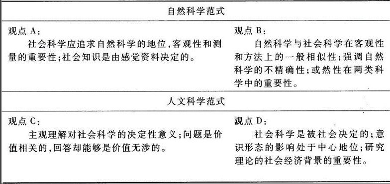
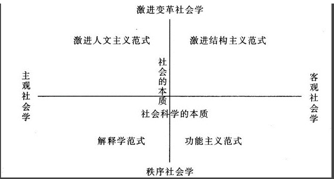
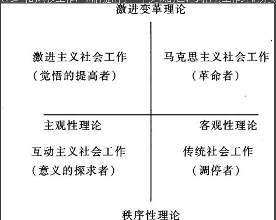
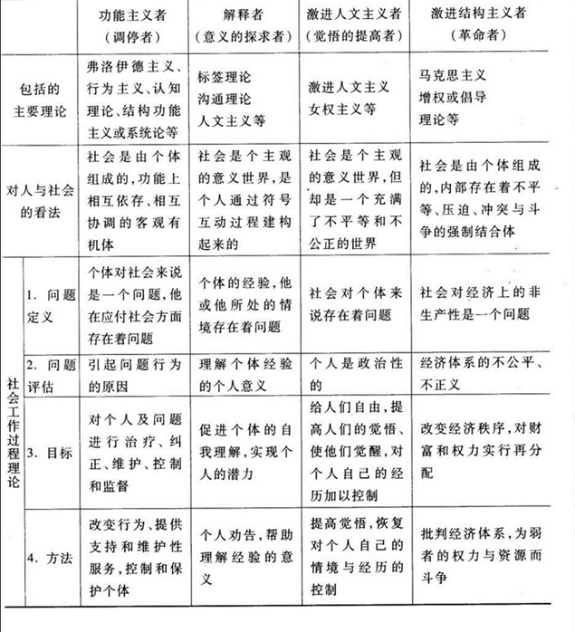

### 1.	社会工作理论的含义及地位
#### 1.1.	社会工作理论的含义
（1）	理论及理论的形式
理论是由一系列逻辑上相互联系的概念和判断组成的知识体系，它从一个一般性水平较高的层次上来描述和解释某类现象的存在与变化，是对经验知识的抽象概括。
美国社会学家乔·特纳曾根据理论陈述的不同组织格式区分了当代社会理论的四种主要形式：①思辨形式；②分析形式；③命题形式；④模型形式。
（2）	社会工作理论
社会工作理论是对社会工作者在社会工作过程当中所运用的各种理论知识的总称。

#### 1.2.	社会工作理论的地位
##### 1.2.1. 社会工作需要理论
1.理论在社会工作过程中的功能：
在社会工作过程中，理论至少具有以下几种功能或作用：
（1）	解释人的行为与社会过程，确定社会工作者将要协助解决的问题的性质与原因。
社会工作的基本职能就是帮助人们（个人、家庭、社区和群体）解决他们在生存与发展过程中所遇到的各种问题。确定社会工作者将要帮助人们去解决的问题到底属于何种性质，它产生的原因是什么等，是社会工作过程的首要环节。在这方面理论具有重要的指导作用。社会工作中的许多理论都可以帮助我们了解人的行为与社会过程，了解各种行为问题和社会问题的性质与原因，从而使社会工作者对将要面临的问题有一个清楚的认识。
（2）	根据其对行为与社会问题的性质与成因所做的解释，设定社会工作过程的工作目标。
大多数社会工作理论都会以它们对人的行为、社会过程以及行为和社会问题的看法为基础，明确地或含蓄地告诉我们社会工作过程的工作目标应该是什么。
（3）	提出一套达到上述目标的实务工作方法、技巧及模式。
这也是社会工作理论对社会工作最重要的功能之一。一个“好用”的社会工作理论，会对如何解决社会工作者与服务对象所面临的各类问题提供一套行之有效的程序、方法与技巧模式。这些程序、方法与技巧模式虽然不能为社会工作者提供一种处处灵验的“万应处方”，但却可以为他们提供许多宝贵的引导和启示。

##### 1.2.2. 理论对社会工作实践的意义
（1）	建立和发展社会工作的理论的目的
1.	发展出社会工作领域独有的概念，从而使它们能更精准地描述和分析助人实践中的“问题城”；
2.	有助于弥补其他外借理论解释和分析功能的不足。
（2）	理论对社会工作者的主要贡献
1.	理论可以帮助专业人员认识不同的情境并分析经验的异同之处；
2.	理论可用来解释专业活动，从而使社会工作的知识和技术被验证和评估：
3.	理论本身可以反映出社会工作者在特定情况下的知识状况；
4.	理论的储备使专业人员对实践更具信心，并对其他的理论有自己的判断。
总而言之，社会工作是集知识、价值观和技巧三个要素为一体的专业，它们彼此之间是互相影响的，而三者都需要理论的支持。从这个意义上说，社会工作者掌握必要的理论基础是十分有益的。

##### 1.2.3. 理论在社会工作过程中的功能 **（2015 简答题 2012 简答题）**
在社会工作过程中，理论至少具有以下几种功能或作用：
（1）	解释人的行为与社会过程，确定社会工作者将要协助解决的问题的性质与原因。
社会工作的基本职能就是帮助人们（个人、家庭、社区和群体）解决他们在生存与发展过程中所遇到的各种问题。确定社会工作者将要帮助人们去解决的问题到底属于何种性质，它产生的原因是什么等，是社会工作过程的首要环节。在这方面理论
 
具有重要的指导作用。社会工作中的许多理论都可以帮助我们了解人的行为与社会过程，了解各种行为问题和社会问题的性质与原因，从而使社会工作者对将要面临的问题有一个清楚的认识。
（2）	根据其对行为与社会问题的性质与成因所做的解释，设定社会工作过程的工作目标。
大多数社会工作理论都会以它们对人的行为、社会过程以及行为和社会问题的看法为基础，明确地或含蓄地告诉我们社会工作过程的工作目标应该是什么。
（3）	提出一套达到上述目标的实务工作方法、技巧及模式。
这也是社会工作理论对社会工作最重要的功能之一。一个“好用”的社会工作理论，会对如何解决社会工作者与服务对象所面临的各类问题提供一套行之有效的程序、方法与技巧模式。这些程序、方法与技巧模式虽然不能为社会工作者提供一种处处灵验的“万应处方”，但却可以为他们提供许多宝贵的引导和启示。

### 2.	社会工作的基础理论
#### 2.1.	西方社会工作理论的发展阶段 **（2011 简答题）**
参照大卫·豪（David Howe）在《社会工作理论导论》的描述，我们可以把这个发展过程大体划为七个阶段。
（1）	第一个阶段可以称之为“调查”阶段。在这个阶段中，社会工作者主要关注的是他们所从事的实际工作，而很少对这些 工作的本质、过程与方式方法等进行理论的思考。他们主要是实干家而不是思想家。对于大多数人来说，社会工作主要是一种“助人的艺术”。社会工作者对理论及理论的用途完全缺乏明确的认识。从理论发展史的角度来说，社会工作者在这一阶段上主要是起一个“调查者”的作用。
（2）	第二个阶段可称之为“精神分析学”阶段。在这个阶段上，一部分社会工作者开始意识到单以经验来指导自己的实践是不妥当的，社会工作不应只是一门“艺术”，而应是一门科学。他们开始采用一定的科学理论来指导自己的工作实践。然而这一时期唯一被社会工作者采用的理论是精神分析学理论。
（3）	第三个阶段是“精神分析学派”与“功能主义者学派”并立的阶段。
①对精神分析学派来说，个体的行为被视为过去事件尤其是儿童时代人生经历的结果。只有洞察了一个人心理世界所经历的早年过程，才有可能将他从当前行为模式的羁绊中解救出来。社会工作的任务就是探寻和治疗服务对象的心理疾患。社会工作过程的中心是社会工作者对问题进行诊断，对治疗方法做指示，对治疗过程做出计划安排。
②功能主义者则认为个体的行为主要是他当前（“此时和此处”）所处情境的结果。当前所处情境既包括环境也包括社会工作
机构的功能（故此名为“功能主义学派”）。社会工作的任务不是对（to）服务对象加以治疗，而是要与（with）服务对象一    道，建立一种有助于服务对象潜能得以发展的积极的、开放的相互关系，使服务对象的能力与行为发生变化。社会工作过程的中心也不再是社会工作者，而是服务对象本人。
在 50 年代，这两个学派不断发生冲突，每一派都坚持自己的观点并依据自己的观点向服务对象提供相应的服务。
（4）	第四个阶段被大卫·豪称为“获得”的阶段。20 世纪 60 年代，可应用于社会工作的理论在数量上获得了巨大的增长。社会工作的职业知识空间被迅速而非系统地充实起来。这是一个充满生机的时期。社会工作者对理论观念的竞逐被视为社会工作健康发展的一种标志。
（5）	第五个阶段则可称为“盘点”阶段。由于社会工作理论在数量上迅速增加，到 20 世纪 60 年代末，许多社会工作者感到有必要对这些理论做一次清点、整理和评估，以便对社会工作的“家底”有一个确切的把握。这一阶段的成果是产生了许多不同的理论清单。
（6）	第六个阶段是“理论统一”阶段。在 20 世纪 70 年代，许多人都相信所有的社会工作理论及实践都享有共同的目标和关怀，一些体现了社会工作本质的共同的概念原理与技巧能够从现有的各种理论与实践中抽取出来。人们竞相发展一种能把各种社会工作方法整合在一起的“一元化”的理论框架。然而，随着一批激进理论和人文主义理论的出现，它很快便受到了人们的攻击和批评。
（7）	第七个阶段可称之为“理论归类”阶段。在这个阶段中，多元理论并存被当作一个既定的事实，社会工作者们不再去追求构造“统一”的理论框架，而是通过对纷呈繁杂的各种理论进行整理、归类来使理论空间有序化，其结果则是产生了许多不同的理论分类模式。

#### 2.2.	西方社会工作理论的逻辑结构 **（2018 简答题）**
不同的学者对于社会工作理论的逻辑架构的划分是不同的，大卫·豪、皮拉利思等都有相应的论述
（1）	大卫·豪把社会工作的理论分为“为社会工作的理论”（theory for social work）和“社会工作的理论” **（ 2019 简答题）**
（theory of social work）
1.	“为社会工作的理论”是理论中对于人与社会的本质、人的行为与社会运行的规则和机制进行解释的那部分内容；
2.	“社会工作的理论”是理论中对社会工作实践本身的性质、目的、过程、方法进行说明的那部分内容。
 
3.	“为社会工作的理论”和“社会工作的理论”的区别：
A.	内容：前者是关于人与社会的本质、人的行为与社会运行的机制进行的说明；后者是关于社会工作实践的性质、目的、过
程与方法等进行的说明。
B.	功能：前者着意“如何解释人与社会”，其为社会工作的实践提供了抽象的背景假设；后者着重“如何改变人与社会”，其为
社会工作的实践提供了具体的行动指南。
C.	地位：前者在整个理论框架中处于前提的地位；后者处于结论的地位。
D.	与学科的联系紧密程度上不同：前者是许多社会科学共同使用；后者只有社会工作专业才能使用。
4.	“为社会工作的理论”和“社会工作的理论”的联系：
A.	相互依存：后者只有在前者的基础上，才能获得较为充分的理解；前着只有与后者连接，才能进入社会工作领域，成为真
正的社会工作理论。
B.	逻辑上相互蕴含：前者蕴含着后者，后者也总是蕴含着对于前者的理解。
（2）	皮拉利思把理论分为：宏观理论、中观理论和实践理论，其中中观理论又分为解释性理论和介入模式理论

#### 2.3.	西方社会工作理论流派与归类
##### 2.3.1.	理论流派
（1）	心理分析学理论
心理分析学理论认为人的行为是由本能所驱使、由人格结构中的“自我”与“超我”所控制的。不良行为的产生源于由各种本能集合而成的“本我”同“自我”、“超我”之间关系的失衡。社会工作的主要任务就是对服务对象的变态人格进行治疗，帮助服务对象恢复本我、自我与超我之间的平衡，并应用心理分析的基本理论方法来完成这一任务。

（2）	认知理论
这是以认知心理学为基础形成和发展起来的一种社会工作理论。它认为人的行为主要是受制于理性思考，而不是潜意识中的本能。不良行为主要产生于认知上的错误或理性思维能力的缺乏，社会工作的主要任务就是要帮助服务对象获得对世界的正确认知或完善理性思考的能力，从而使服务对象的行为能得到正确的、理性的指引。

（3）	行为主义理论 **（ 2019 论述）**
这是以行为心理学为基础而形成和发展起来的一种社会工作理论。它认为社会工作的主要任务就是要对服务对象的不适当行为进行治疗或矫正，但它不是应用心理分析或认知心理学而是应用行为心理学的理论（如条件反射、条件运算、学习理论  等）与方法（如实验等）来完成这一任务。它认为行为是个体对当前环境所作的反应， 不适当的行为是个体对当前环境所作的不恰当的反应，社会工作就是要帮助服务对象学习和掌握恰当的反应模 式。

（4）	社会系统理论
这是以一般系统论及其社会学版本——结构功能主义等为基础形成和发展起来的一种社会工作理论。它把人与生活环境看作是由功能上相互依赖的各种元素所组成的系统整体；协调或均衡是该系统运行与维持的基本条件，也即是个体生存与发展所必需的基本条件。社会工作的基本任务就是要帮助恢复各个子系统或元素之间的均衡关系，使它们能够重新有效配合、相互协调。

（5）	标签理论 **（ 2017 名词解释）**
这是以社会学家勒麦特和贝克的理论为基础而形成的一种社会工作理论。这种理论认为许多人之所以成为“有问题的人”，是与周围环境中的社会成员对他及其行为的定义过程或标定过程密切相关的。因此，社会工作的一个重要任务就是要通过一种重新定义或标定的过程来使那些原来被认为是有问题的人恢复成为“正常人”。

（6）	沟通理论 **（ 2011 名词解释）**
这是以社会心理学、人类学和社会语言学中有关人际沟通的一些理论为基础而形成的一种社会工作理论。这种理论强调人际沟通在人际关系中的重要性。它认为许多的行为问题都出在人际沟通方面。社会工作的一个基本任务，就是帮助人们消除这些沟通过程中的障碍，使人们的相互沟通得以顺利完成。

（7）	人文主义理论
这是以马斯洛的人本主义心理学、胡塞尔与舒茨的现象学与布鲁默的符号互动主义等为基础而形成的一种社会工作理论。它认为每个人都生活在“意义世界”当中，而每个人的“意义世界”都是通过自己对这个世界的“理解”或“解释”建立起来的。当人们    的“理解”或“解释”过程发生了困难时，问题便出现了。社会工作者的任务就是要去努力“理解”这些人（服务对象）的“意义世    界”及其内在矛盾，帮助他们顺利重构自己的“意义世界”。

（7）	激进的人文主义理论
这是以早期马克思与现代批判理论家（如葛兰西、马尔库塞、哈贝马斯等）的某些理论为基础而形成的一种社会工作理论。作为一种人本主义，它也认为人们生活的世界是一个“意义世界”。它认为人们在“意义世界” 里经历的许多人格的、心理的问题都只有依据现代资本主义社会的反人道特征才能被理解。社会工作者的任务就是要与服务对象一道，通过改造现存的社会秩序，来解决人们在“意义世界”所遇到的许多问题。

（8）	马克思主义理论
这是以马克思主义的基本理论（社会存在决定社会意识、经济基础决定上层建筑、阶级斗争决定社会结构及形态的变迁等） 为指导而形成的一套社会工作理论。它主张从社会存在、经济基础、阶级压迫中寻找社会问题产生的根源，主张社会工作的任务就是与服务对象一道，通过阶级斗争或其他集体行动改变现有的社会现实来解决这些社会问题。

（9）	“增权”或“倡导”理论
这是从马克思主义变通而来的一种社会工作理论。这种理论主张在宏观的社会变革未发生之前，社会工作者应协助服务对象为了他们的利益向现存的社会结构争取权利，促使现存的社会结构做出一些有利于服务对象的制度或政策安排。

（10）	女权主义理论
这是一种与激进人文主义或马克思主义理论有密切联系的社会工作理论，主要植根于 20 世纪 60—70 年代以来的妇女运动。它主要关注女性所受到的压抑，社会工作的目标就是探索并消除社会中由于性别主义所造成的女性痛苦，促使她们有更多的自由，有更大的能力去追求个人的成长与发展。

中国的社会工作者要想提高自己的专业化水平，也必须加强自己的理论知识，自觉将实践与理论相结合，用理论来指导自己的实践。为了使实践能够与理论相结合、能够有理论来指导实践，学习、了解和研究社会工作理论又是一个必要的前提。这里包括两个既相互联系又相互促进的任务。
①要虚心学习、了解和研究西方国家已有的各种社会工作理论。应该肯定，在社会工作的专业化水平方面，当代西方国家在发展程度上显然要高于我国。西方社会工作理论是对这种已高度专业化的实践过程的概括和总结，从这些理论中，社会工作者能够学习和了解到许多有益的东西。
②要认真研究和总结我国社会工作者自己的历史和经验，在此基础上，参照西方学者的理论成果，概括和发展出我国自己的社会工作理论。社会工作是一种既具有一定的普遍性、共同性，又具有较强的特殊性、本土性的实践活动。既要学习、了解和研究西方已有的社会工作理论，又不能简单地照搬它们的理论；而是要在它们的启迪之下，认真研究、分析和总结自己的实践经验及其教训，以此为基础，概括和发展出一套或一些既包含各国社会工作的一般特性，又能反映我国社会工作本土特色的中国化社会工作理论，以此来作为我国社会工作实践的指导理论，同时也为世界社会工作理论的发展做出贡献。

##### 2.3.2. 归类
（1）	范式
范式是科学哲学家库恩提出来的一个概念，意指一群科学家共同享有的一组世界观、价值观方面的背景假设及相应的方法和
 
技术类型。范式为共同享有它的那些科学家们的研究工作提供了一个共同的指南，把他们的活动联结成一个相对统一的整体。
在用范式概念整理西方社会工作理论的讨论中，李康特、伦纳德、大卫·豪等人的工作具有比较大的影响。
（2）	李康特（Recomte）的社会工作理论
李康特 1975 年在他的一部著作中提出，可以根据理论构造中所隐含的哲学性背景假设和专业性背景假设来分析、比较社会工作理论。
理论构造中的哲学性背景假设包括五个方面：
①理论构造的抽象水平；
②理论构造中的现实观与价值定位；
③理论构造的概念化程度；
④理论家在理论建构中的视点；
⑤理论构造的模式。
专业性背景假设则包括理论与实践的关系和理论与研究的关系两个方面。
根据理论与构造中蕴含的这两组假设内容上的不同，李康特将社会工作理论区分为规范取向和经验取向两种基本类型。在极端的情况下，这两种取向在上述两组背景假设的各个方面都是截然相反的。
（3）	伦纳德的四范式分类模型
伦纳德在 1975 年的一篇文章中，首先依据各种社会工作理论在世界观与方法论上的差别，将它们划分为自然科学与人文科学两大范式。然后又依据这两大范式内部的差别将它们各自再区分为两个亚类。由此得出一个四范式的分类模型，见表 ：

表 4-2 伦纳德的四范式分类模型
（4）	伯内尔和摩根（Burrell and Morgan）的社会学理论范式模型
他们认为，根据各个理论所蕴含的对“社会科学的本质”这个问题的不同看法或假设，可以将它们表达为一条以主观取向为一端、以客观取向为另一端的连续谱，每个理论都在这条谱线上占取一个位置；根据各个理论所蕴含的对“社会本质”这个问题的不同看法或假设，又可以将它们表达为一条以秩序取向为一端、以变革取向为另一端的连续谱，每个理论也在这个谱线上占取一个位置。将这两条谱线交叉，便可以将社会学理论划归为四个基本的范式即功能主义范式、解释学范式、激进人文主义范式和激进结构主义范式，详见图 4-3。

图 4-3伯内尔和摩根的社会学理论范式模型

（5）	惠丁顿、霍兰德和大卫·豪等人的社会工作理论分类模型
惠丁顿、霍兰德和大卫·豪等人认为，伯内尔和摩根提出的社会学范式分类模型非常适合于用来归纳概括社会工作理论。经过适当的转换工作，他们提出了一个类似的四范式社会工作理论分类模型，如图 4-4 所示。

图 4-4惠丁顿、霍兰德和大卫·豪等人的社会工作理论分类模型

（6）	大卫·豪的四范式模式
大卫·豪应用他的四范式模式，结合他提出的关于社会工作理论逻辑结构的两分法分析模型，对西方社会工作理论做了较详 细的描述和分析。他认为这四种社会工作理论范式之间，无论是在关于人与社会的本质、关于人的行为与社会运行机制的问题上，还是在关于社会工作实践本身的性质、目的、过程与方法等问题上都存在着明显的区别。大卫·豪对其四范式模式的 解释，以表 4-5 简介如下：表 4-5 大卫·豪对其四范式模式的解释

#### 2.4.	外借理论
### 3.	社会工作的实践理论
#### 3.1.	预估理论
#### 3.2.	干预理论
①心理社会治疗模式，它将心理学应用于个案工作之中，揭示受助者的精神状况和社会环境之间的关系。
②功能派个案工作，它认为个体的行为是其冲动力、理智、感受和意志平衡作用的结果，其中意志是主要原动力，它强调“能动性功能“，其理论基础包括心理、社会和过程三个方面。
③问题解决模式，其主导思想是：第一，人的一生是解决问题的过程，人从生到死都必须面对不同的问题并尝试去解决他们；第二，人生的目标是在寻找和获取。
④行为修正模式，其基本观点是，人或动物都期待特定的令人满意的行为，而反对造成不适的行为。因此，行为会经常改变，行为在这里被假设成习得的经验。
除这四种主要模式外，其他还包括任务中心模式，危机干预模式，一般系统模式，存在主义模式，完形治疗模式、生命模式和交流互动分析模式等。
（2）干预理论的主要内容和特点
干预理论主要是指工作者如何通过行动来影响受助者的人格、环境和社会系统，从而实现社会工作治疗和社会改良的双重目标。这一理论综合了治疗原则、项目（计划）发展、变迁过程及结果评估。社会工作的干预致力于两个系统的改变：①微观体系的改变，包括个体行为如何改变、家庭的重组、小组生活的促进等；②宏观体系的改变，包括复杂组织机构的改变，如社区组织、福利机构的制度改良、社会改革、经济与社会福利体系的整合发展。干预理论的核心是“问题解决”的方法和模  式，其重点是如何运用一系列概念和工具，来面对不同系统和问题，将人与资源联系起来，从而制定并有效推行相关的行动计划，具体的干预过程包括：计划制定、推行、监督和结果的评价等一系列相互联系的工作。

#### 3.3.	本土化社会工作理论不足的制约性
近年来，我国社会工作专业教育取得了快速发展，社会工作专业实践也取得了一定进展，但由于本土社会工作理论建构严重不足，在专业教育及实务中采用的理论、方法及技术技巧主要或基本是借用西方的，这种局面已极大地制约了我国专业社会工作的进一步发展。
（1）	社会工作职业化难以顺利、深入地推进。
推进社会工作的职业化需要一定的理论准备，其中对社会工作概念的本土界定就至关重要，会影响社会工作就业领域（部门）及就业岗位的认定。
（2）	社会工作教育难以实现稳定、持续发展。
自世纪之交以来，由于高等教育规模的迅速扩展，设置社会工作专业的高校也在急剧增加，高等社会工作教育的规模已达到了空前的水平。但是，由于理论准备不足，社会工作专业所培养人才的就业部门、岗位不明确，所学的专业技能和知识也难以在实际工作中有效运用，许多学生对这个专业的前景感到茫然，更多的学生毕业后从事了与社会工作无关的职业。
（3）	社会工作学科难以取得在学术机构中应有的地位。
新中国成立初期，社会学、社会工作被取消，这与当时这些学科的西方化色彩过于浓厚有关。20世纪80年代后期，社会工作学科在高校得以恢复重建，但在专业教育中采用的理论、方法等主要来自西方，对本土社会工作的理论与实务模式的总结与传授严意不足。一个起源于西方的学科，如果不加以本土化的改造，久而久之是很难在高校立足的。
（4）	社会工作专业难以取得国家和社会的最终认可。
《中共中央关于构建社会主义和谱社会若干重大问题的决定》做出了“建设宏大的社会工作人才队伍”的战略部署。固然，构建和谐社会需要大量的社会工作专门人才，但通过专业训练的这些人能否真正担当起推进和谐社会建设的重任，能否取得适当的职业地位及待遇水平，则取决于他们是否具备了解决各种社会问题的能力，这种能力的训练单靠取自西方的理论、方法是远远不够的。只有通过本土化了的社会工作理论、方法的训练，他们才有可能真正具备解决本土社会问题的能力，社会工作作为一种专业才能最终得到国家和社会的认可。
因此，对我国而言，要真正发挥社会工作的价值、发挥其利他主义的专业使命，固然离不开一线社会工作者的实践与努力， 更离不开理论工作者在建构本土化社会工作理论中做出的尝试与努力。

#### 3.4.	本土社会工作理论的构建之路
在我国专业社会工作发展初期，借鉴西方社会工作相对成熟的理论体系是必然选择。但随着这一进程的推进，对西方社会工作理论加以本土化改造及对本土社会工作传统加以科学提炼，在此基础上逐步形成本土化的社会工作理论，又成为一种现实的要求。
（1）	本土特色的社会工作理论基础或基础理论的建构
·	既要注重吸收其他学科的相关理论成果，又要注重整合化的基础理论的建设。借鉴西方形成的社会工作基础理论框架，吸收马克思主义及其本土化思想成果中关于社会福利问题的论述，批判继承中国传统社会福利思想，紧密结合社会转型时期的社会工作实际，在此基础上经过不断的理论概括，是可以最终形成本土特色的社会工作基础理论的。
（2）	本士特色的社会工作实施理论的建构
由于社会文化背景的不同，西方社会工作的实施理论也不能完全照搬照抄，必须加以本土化的改造。同时，本土非专业意义的社会工作也积累了一些有益的经验、方式方法、实践模式，经过总结提炼，也可以成为本土特色的社会工作实施理论的组成部分。

### 4.	相关理论
#### 4.1.	精神分析取向的社会工作理论
一.弗洛伊德的精神分析理论
1887年，弗洛伊德作为神经病理学家，开始采用催眠术对歇斯底里症进行治疗和研究，1923年发表《自我与本我》。弗洛伊德的精神分析理论包含两个主要部分：关于人格发展的理论和关于治疗的理论。二.精神分析理论盛行原因精神分析理论于20世纪二三十年代开始在欧美社会工作中产生影响，直到60年代都在临床社会工作中发挥主导作用。    促使精神分析理论在社会工作领域盛行的原因有三个：
（1）20年代社会工作方法在助人实践中所表现出来的不足：
（2）	儿童引导运动的推动：
（3）	社会工作专业需要面对第一次世界大战结束后大量战争受害者需要社会工作专业提供深入的精神服务。自此形成了所谓“精神分析洪流”。
三.精神分析理论的主要观点
1.	心灵的构成
弗洛伊德提出人的心灵是由意识、前意识和潜意识构成。
（1）	意识：是人在任何时候都可以觉察的想法与感受。
（2）	前意识：是很容易变为意识的潜意识，亦即通过思考可以觉察的部分。
（3）	潜意识：则是精神分析理论的核心。潜意识不仅包括趋力、防卫、超我的命令，也包括被压抑的事件与态度的记忆。
2.	人格结构
弗洛伊德的精神分析理论将人格分为本我、自我、超我。
（1）	本我：由内驱力和欲望组成，它遵循享乐原则。
（2）	自我：是本我由经验中发展出来的，包括意识和前意识，所以，自我具有管理人格体系的能力，它遵循现实原则，调节本我的欲望以及超越我与外界的要求。
（3）	超我：由自我发展得来，包括意识和前意识，也包含部分潜意识。超我包括两个层面：良心和理想。本我、自我、超我之间如果能够保持和谐平衡的状态，人格就是完善的。
3.	焦虑、防卫与转移
（1）	焦虑：是弗洛伊德理论的一个重要概念。弗洛伊德认为，当个人的本我欲望违反超我的原则时，自我就发出警告，内部出现无法接受的冲突。焦虑是一种痛苦的情绪体验，包括害怕失去所爱，失去所爱之人对自己的爱，害怕惩罚。
（2）	防卫机制：是自我为了消除不愉快的情绪体验所采取的方法，包括阻挠或掩饰不被允许的或不被赞同的欲望以减少内心冲突。防卫机制是一种自我调适的方法，包括正向和负向的。
4.	性心理的发展
弗洛伊德精神分析理论将人的性心理发展作为人的心理发展的基础。他将性心理发展分为五个阶段：口腔期、肛门期、性蕾期、潜伏期、生殖器期。

四、精神分析理论的实务原则
精神分析取向的社会工作遵循以下原则：
1.	在治疗过程中要坚持个别化原则：
2.	精神分析理论强调要与受助人签订治疗契约；
3.	治疗者要为受助人提供一个安全与支持环境，以保证能够顺利地了解他隐藏在潜意识中的经验，并保证治疗过程中产生的
负面情绪不会给受助人造成新的伤害：
4.	精神分析治疗采用的基本方法是自由联想；
5.	在治疗过程中治疗者要倾听和理解受助人的想法与感受，要给予支持和接纳。

五、精神分析理论在社会工作中的应用精神分析治疗过程可以分为三个部分：
1.	治疗情境的建立
（1）	在治疗开始时，治疗者要与受助者签订合约。在合约中要明确双方的角色分工、治疗计划和时间表。
（2）	治疗情境还包括治疗者对受助者的态度，治疗者要保持专业、同理的态度，同时还要以中立的态度分
2.	治疗关系的建立
在治疗过程中，治疗者要与受助者建立良好的关系，使其感受到支持与安全。这样，他才可能将痛苦讲述出
3.	治疗性对话
治疗性对话是治疗的实质阶段，包括：
①自由联想；
②治疗性倾听；
③诠释。

#### 4.2.	认知行为理论
一、认知行为理论的由来及其观念
1.	认知行为理论的由来
（1）	行为主义的理论基础来自巴甫洛夫的经典条件反射学说。行为主义理论的一个基本取向就是将心理与行为分离开来。
（2）	认知学派源自阿尔弗雷德阿德勒与弗洛伊德精神分析学派分道扬镜。认为过度强调被压抑的潜意识，没有太大的实质意义。来自性方面的动力远不如来自社会方面的动力。而人的行为是由个人整体生活形态所塑造的，认知起着至关重要的作用，它不仅影响人的行为，更会影响个人整个生活形态的形成。
（3）	斯金纳（B.F.Skinner）等又在巴甫洛夫经典条件反射学说的基础上发展出操作条件反射学说。
（4）20世纪60年代，班杜拉将经典条件反射、操作条件反射和观察学习学说结合在一起，提出了社会学习理论，这一理论    为认知行为学派的发展提供了直接的支持。
2.	认知学派的基本观念
人类的思想、感觉和行动之间是有相互联系的。
（1）	人的行为受学习过程中对环境的观察和解释的影响。不适宜的行为产生于错误的知觉和解释。所以在认知理论看来， 要改变人的行为，就要首先改变人的认知。
（2）	在大多数情况下，行为和认知是相伴而生的，认知可以改变行为，行为也可以改变认知。
二、认知行为理论的主要观点 **（ 2016 名词解释）**
认知学派认为，在认知、情绪和行为三者当中，认知扮演着中介与协调的作用。认知对个人的行动进行解读，这种解读直接影响着个体是否最终采取行动。认知的形成受到“自动化思考”机制的影响。
1.	艾利斯提出了认知的“ABC情绪理论框架”
（1）	Activating events真实发生的事件；
（2）	Beliefs人们如何思考、信念、自我告知和评估其所遭遇的事件：
（3）	Consequences人们思考、信念、自我告知和评估此事件的情绪结果。
2.	认知行为理论借用社会学习理论的三个要素来认识和改变人的行为，这三个要素是：
（1）	前置事件：是指环境中出现在目标行为之前的事件或其他相关行为。
（2）	目标行为：是指不想要的或问题行为，或即将予以改变的行为。
（3）	结果：是指在发出行为之后所导致的相关行为和事件。

三、认知行为理论在社会工作实务中的应用
（一）认知行为理论的实务原则
1.	界定对服务对象问题看法的原则
（1）	服务对象的问题不是固有的。服务对象的问题及其行为都是学习得来的，所以也是可以经由学习改变
（2）	问题的外在性与内在性。个人能力不足、习惯性思维都可能造成个人认知错误，以致无法发出正确的行为。不仅要通过行为训练修正行为，而且还要通过调整个人的认知来促进行为的改变。
（3）	服务对象及其处境的差异性。每个人都是独特的，注意服务对象问题及其处境的独特性是正确界定和评估其问题的前提。
2.	在社会工作实务中运用认知理论的原则
（1）	尊重个人的自主决定和信念。认知行为学派主张，个人的知识经验的形成是积极主动地，个人的认知和生活形态是通过正确解读外在环境事件的意义，有效的自我调适来构架和调节的。
（2）	帮助服务对象改变错误的认知、建立正确的认知。协助服务对象自助、自立、，调节和控制自己的情绪和行为。
（3）	在正确认知的基础上建立良好的专业关系，并鼓励服务对象形成积极的态度，以实现助人和自助的目
3.	关于助人目标的原则
（1）	改变错误的认知或不切实际的期待以及其他偏颇和不理性的想法。
（2）	修正不理性的自我对话。
（3）	加强解决问题和决策的能力。
（4）	加强自我控制和自我管理的能力。

（二）认知行为学派的助人过程
认知行为学派在助人的过程中为了使服务对象改变，一方面要协助他（她）做到自我了解、自我控制：另一方面也要提供外在监督，实现自我控制与外在控制的结合。从专业的助人过程来讲，有三个方面：
1.	确定评估重点
根据认知行为理论，评估的重点应该在于服务对象的思想、情绪和行为，即思想如何推动了情绪和行为，行为如何带动了思想和情绪，情绪又如何影响思想和行为。
2.	专业关系的建立
 
专业关系是助人者与服务对象之间在协商的基础上通过签订合约建立起来的结构性的、有期限的角色联系。所谓结构性的和有期限的专业关系是指助人者与服务对象见面的次数、每一次见面的主题及目标都是确定的。
3.	助人者的角色
（1）	教育者的角色：作为教育者，助人者要做到教会服务对象运用认知行为理论与技巧来检验自己的认知与行为的改变。
（2）	伙伴的角色：作为伙伴，助人者要陪伴他（她）一起探讨其思维方式，讨论应对其认知错误进行修正的目标与策略， 并协助他（她）学习正确的行为，规划自己的生活方式。

（三）助人的策略及步骤
认知行为学派助人的一般过程是首先帮助受助人改变错误的认知，然后根据社会学习原理用正强化、负强化和示范的方式帮助受助人逐渐形成想要的行为，除去不想要的行为，并使受助人在这个过程中获得愉悦的体验，一般包括以下几个步骤：
1.	确定不正确的、扭曲的思维方式或想法，确认它们是如何导致负面情绪和不良行为的。
2.	要求受助人自我监控自己的错误思维方式或者进行自我对话。
3.	探索受助人错误思维方式与潜在感觉或信念之间的关系。
4.	尝试运用不同的具有正面功能的、正常的思维方式。
5.	检验受助人新建立的对自我、世界和未来的基本假定在调整行为和适应环境上的有效性。

（四）结案和跟进
1.	在结案的过程中，助人者应该和服务对象一起商讨确定在结案以后的若千具体的行为改善目标：
（1）	作为服务对象自我监督和努力的方向；
（2）	作为助人者在结案以后进行跟踪访问的依据。
2.	认知行为理论经过长期的发展，已经形成了完整的理论与技术体系，但认知行为理论也存在一定的限制。
（1）	认知行为理论认为，个人的心理功能是认知、行为和环境之间交互作用的结果，而三者的交互作用的关系是非常复杂的，在助人实践中很难明确分清三者的不同作用。
（2）	认知行为理论对个体的认知能力有较高的依赖，所以在面对缺乏足够认知能力的个体来说，其适应性就受到很大限制。

#### 4.3.	社会支持理论
一、社会支持理论发展的历史
1.鲍尔拜首先在精神医学领域提出了依附理论，强调早期关系（特别是与父母的关系）的重要性。
2.20世纪70年代，柯伯和卡塞尔通过实证研究提出了两个重要概念：工具性支持和情绪性支持。
3.	在美国，社会支持网络用于临床治疗始于20世纪60年代。70年代斯拜科特以社会网络干预的方法训练治疗者，推广社会网络治疗理论。
4.	在美国20世纪70年代至80年代，社区支持计划迅速发展，特别是针对精神病患者离开治疗机构回归社区所提供的社会支持，帮助病患者学习社交技巧和参与休闲活动，从而帮助精神病患者真正回归社区。

二、社会支持理论的主要观点
社会支持网络指的是一组个人之间的接触，通过这些接触，个人得以维持社会身份并且获得情绪支持、物质援助和服务、信息与新的社会接触。个人所拥有的资源可以分为个人资源和社会资源。个人资源包括个人的自我功能和应对能力；社会资源是指个人社会网络中的广度和网络中的人所能提供的社会支持功能的程度。
1.	社会支持的概念
社会支持是由社区、社会网络和亲密伙伴所提供的感知的和实际的工具性或表达性支持。
（1）	工具性支持：包括引导、协助、有形支持与解决问题的行动等。
（2）	表达性支持：包括心理支持、情绪支持、自尊支持、情感支持、认可等。
2.	影响社会支持程度的因素
（1）	发展因素
从发展的观点来看社会支持，其关键的问题在于过去的经验如何影响其今后的社会生活。进一步从治疗的角度来看则在于如何改变个人过去生活中的负面经验或弥补个人生活经验的不足，以图改变个人生活中所出现的问题。
（2）	个人因素
个人因素主要是指个人的人格因素，包括自尊程度、社会性和控制场域对发展和使用社会支持的影响。一般来讲，低自尊对于建立关系是一个不利的因素，而高自尊者可能获得较高的社会支持。
（3）	环境因素
环境因素在个人的社会支持网络形成中的作用体现于不同类型的生活环境。在开放的社会环境中，个人更容易建立起社会支持网络，更倾向于利用支持网络：在封闭的社会生活环境中，个人对社会支持网络的利用就会相对减少。
 
三、运用社会支持网络帮助服务对象的实务模式
1.	社会支持网络
能够为服务对象提供服务的社会支持网络分为两种：正式的社会支持网络和非正式的社会支持网络。社会工作服务作为一种正式的社会支持网络，应该发挥两个作用：
（1）	以其所掌握的社会资源为服务对象提供直接的帮助，以满足其当前比较紧迫的需求，或者提供非正式社会支持网络所不能提供的社会支持。
（2）	社会工作可以帮助其补足和扩展非正式的社会支持网络，帮助其提高建立和利用社会支持网络的能力。
2.	社会支持网络理论的干预模式
社会支持网络理论的干预模式可以分为两个部分：
（1）	要对服务对象的社会支持网络进行评估：
（2）	是拟定具体的帮助计划，实施帮助。
3.	社会支持网络评估
（1）	对服务对象的社会支持网络评估包括：
①社会支持网络的结构：指的是网络的组成，包括人数、网络所包括的人员的类型（职业和领域）、网络中人们之间的距离等。
②社会支持网络的内容：是指网络所发挥的功能，大致可以分为工具性支持和表达性支持。
（2）	服务对象的社会支持网络评估可以在两个层面进行：
①个人层面的评估：首先要确定网络所包括的人员的生活领域，以及彼此之间的关系。
②社区层面的评估：可以是针对服务对象所生活的社区，也可以是一般性地对社区内的社会支持网络进行评四、社会支持网络理论在社会工作中的应用
运用社会支持网络理论帮助服务对象解决生活中的问题，重点在于帮助其学习如何建立社会支持网络和利用社会支持网络。在运用社会支持网络时需要注意，社会支持网络不仅是一个有效的工作手段，同时也是社会工作者的工作对象。社会工作者不仅要对社会支持网络进行评估，更重要的是运用和改善社会支持网络，使之能够满足服务对象的需要，解决其问题。

#### 4.4.	生态系统理论
一、生态系统理论的历史
1.1971年贝塔朗菲提出一般系统理论，认为生命有机体都是一个完整的系统，各个系统都是一个更大的系统的子系统。
2.社会工作对系统理论的应用始于美国人赫恩早期提出的全人或全貌的概念。
3.20世纪70年代高德斯坦提出统合取向的社会工作实务。
4.平卡斯和米纳军以系统的观点介绍整合的社会工作实务模式和方法，被看作是系统理论在社会工作领域的正式运用。

二、系统理论的主要观点
1.	系统理论与社会工作专业坚持的“人在环境中”的观点是一致的。
2.	平克斯和米纳军将人们生活于其间的社会环境分成三类，即非正式的或原生的系统、正式系统、社会系
3.	在系统理论看来，受助者的问题来自于其所在的系统，而不是单纯的个人问题。

三、生态系统理论
1.	生态系统理论
（1）	背景
生态系统理论是一个开放的理论系统，在不同的时代融入了不同理论概念，正因为如此，生态系统理论就是一个具有折中性和综融性的理论。
（2）	代表人物：
①玛丽里士满和珍亚当斯推行“人在情境中”的理论范式。
②杰曼和吉特曼等人综合生态系统理论的观点，提出了社会工作的“生态模型”。
2.	生态系统理论的主要观点
（1）	生态系统理论认为，人生来就有与环境和其他人互动的能力，人与环境的关系是互惠的，并且个人能够与环境形成良好的调适关系。
（2）	个人的行动是有目的的，人类遵循适者生存的法则。
（3）	个人的问题是生活过程中的问题，对个人问题的理解和判定也必须在其生存的环境中来进行。

四、生态系统理论在社会工作中的应用
生态系统理论的关键在于将服务对象放在一个有层次的系统之中，将服务对象与其所生活的环境作为一个完整的整体来看待，通过改变系统来实现个人需要的满足。
 
1.	埃文斯和科尼提出的系统模式社会工作
埃文斯和科尼提出了系统模式社会工作的基本原则，使系统理论能够更好地与社会服务实践相结合，其观点
（1）	系统观点有助于维持实践的一致性，从服务对象的处境出发，看到他们的限制和机会，分清社会工作者和服务对象的权利、责任及其可能的影响。
（2）	要充分认识情境的重要性，情境决定社会工作者的目标和可能的回应方式。
（3）	要采用积极视角，在不利情境中看到改变和进步的可能性。
（4）	要辨识行为模式以看到积极的可能性和应改变之处。
（5）	系统理论重视过程，即关系和互动是如何产生的，内容和结果如何。
（6）	与他人一起工作也是系统理论的重点，包括重视他人、个人支持网络、机构和社区资源。
2.	运用生态系统理论应该注意的问题
（1）	人们遇到的许多问题不完全是由个人原因引起的，社会环境中的障碍是导致问题产生的重要因素。
（2）	社会工作者为服务对象提供帮助的着眼点不能仅放在个人身上，要从与之相关的不同系统的角度分析问题和着手。
（3）	服务对象与各个系统的关系是动态的，社会工作者必须不断地对服务对象与环境的关系作出新的判断。
（4）	对服务对象的帮助要从整个生态系统出发，把他们的问题放到不同层面的系统中去看待和解决。

#### 4.5.	人本主义和存在主义理论
一、人本主义和存在主义简介
14世纪下半期文艺复兴运动的最大成果之一就是实现了“人的发现”，人的价值包括尊严、才能和自由得到了承认。
20世纪60年代初期，存在主义成为人本主义思潮的重要代表，从萨特的存在主义哲学中可以找到真正的、完全的人本主义。
人本主义心理学是第二次世界大战之后兴起的一场心理学革新运动。人本主义心理学家认为，心理学应着重研究人的价值和人格发展，他们既反对弗洛伊德在精神分析学中把意识经验还原为基本驱力或防御机制，又反对把意识看做是行为的副现  象。人本主义心理学家大都认为，人的本性是善良的，恶是环境影响下的派生现象，因而人是可以通过教育趋善的。
存在主义成为一种助人模式是从心理治疗开始的。20世纪30年代，弗兰克尔（Frankl）主张心理治疗的对象不是弗洛伊德理论所主张的“潜意识”，而是要针对人类的本质“存在”。

二、人本主义社会工作的主要观点及应用
1.	人本主义社会工作的主要观点
（1）	以人本主义取向的社会工作源于人本主义哲学，它相信人的理性，认为具有理性的人可以自主地选择行动。
（2）	人本主义学者卡尔·罗杰斯的思想直接影响了临床社会工作的理念。临床社会工作者吸收罗杰斯的观点，提出了社会工作专业治疗中的几个基本原则，即诚实和真诚，温暖、尊重和接纳，同理（或同感）。后来，罗杰斯的观点被应用于社区工作、组织和政治发展，提出社会工作应该促使人们掌握我们都拥有的“个人权力”
以实现其目标。
2.	人本主义理论在社会工作中的运用 **（ 2017 简答题）**
人本主义在个案工作、小组工作中得到了广泛的应用。小组工作的基本价值是：
（1）	强调人的内在价值和能力。强调每一个人都要受到尊重，每一个小组成员都要协同社会工作者一起对每一个成员表现出关注。
（2）	在社会生活中人们彼此负有责任。在小组过程中要强化每一个人对他人的责任感。
（3）	个人具有归属与被包容的权利。在小组工作实践中，强调每一个成员都要得到关注，小组成员的归属权利要得到尊重，小组要能够包容每个人的个性。
（4）	人们具有参与和被聆听的权利。强调小组是全体成员的小组，每一个人都具有参与小组事务的权利。
（5）	人们具有自由表达的权利。每一个成员要充分表达自己的情感和意见。
（6）	群体成员之间是有差别的，每个人的差别都要得到尊重。
（7）	人们具有质疑和挑战专业人员的权利。

三、存在主义社会工作的观点及其应用
1.	存在主义社会工作的观点
存在主义认为，个人的自由首先表现在他认识到由于受传统文化和习俗的束缚而缺乏自由。存在主义社会工作在实践中强调个人的自由和责任。
存在主义取向的社会工作临床治疗者强调，不应预先设定受助者应该如何生活，应该肯定受助者有独特的生活方式，有选择的能力与自由，而社会工作者只是起到协助的作用，协助受助者肯定自己的本质。
存在主义取向的社会工作提出了社会工作治疗过程的五个基本概念：
 
（1）	觉醒，即个人意识的觉醒。对自我不真实生活的幻灭，进而到对真实生活的正视过程。
（2）	痛苦是生命的一部分。痛苦是必然的，痛苦对人的生命具有指导性。存在主义强调对过去经验的解释对于未来行动具有十分重要的意义。
（3）	选择的自由。强调个人的主观性和选择的自由。
（4）	对话的必要性。人是无法独立生活的，个人必须通过他人的反映来彰显自己的意义，并根据这个意义来选择行动、进而成长。
（5）	实行。社会工作者如果希望受助者能够肯定他自己的独特性，就必须通过社会工作者对受助者的肯定来实现。
2.	存在主义理论在社会工作实务中的应用
存在主义社会工作强调个人生命的意义，强调个人的内存价值，认为包括个人痛苦的经历都是有意义的。人本主义和存在主义对社会工作的贡献主要还不在于相关服务模式的发展，而在于其为社会工作提供了最为基本的价值基础和思想基础。

#### 4.6.	增强权能理论
一、增强权能理论的历史
巴巴拉·索罗门1976年出版《黑人的增强权能：被压迫社区里的社会工作》首先提出了增强权能的概念，并使增强权能的观     点被社会工作界广为接受。
社会工作真正进入“增强权能时代”是在1980年左右。

二、增强权能取向社会工作的基本假设
增强权能是指增强人的权利和能力。增强权能的基本理论假设有以下几点：
1.	个人的无力感是由于环境的压迫而产生的
根据索罗门的总结，造成无力感的根源有三个：
（1）	受压迫团体的自我负向评价。
（2）	受压迫群体与外在环境互动过程中形成的负面经验。
（3）	宏观环境的障碍使他们难以有效地在社会中行动。
2.	社会环境中存在着直接和间接的障碍，使人无法实现他们的权能，但是这种障碍是可以改变的。
3.	每个人都不缺少权能，个人的权能是可以通过社会互动不断增加的。
4.	受助人是有能力、有价值的。
受助人的权能不是助人者给予的。社会工作者的作用在于通过共同的活动帮助受助者消除环境的压制和他们的无力感，使他们获得权能，并能正常发挥他们的社会功能。
5.	社会工作者与受助者的关系是一种合作性的伙伴关系。
社会工作者关注的焦点在于受助者与环境之间是否能够实现有效互动，从而能实现自己。

三、增强权能社会工作的取向
经过多年的发展，增强权能观点已经为社会工作者广为接受，并形成了较为完整的理论体系。
1.	增强权能社会工作在伦理价值上：强调推动社会正义、尊重受助人自决与自我实现，并让受助人充分参与服务计划的制
订。
2.	干预认可：指各方面的对千预计划可能的允许范围。权能指的是一种能力，具有权能的个体能够在社会中获得他们应该得
到的社会资源，他们能够掌控自己的生活空间。社会工作者要尽可能在各方面允许的范围内为受助者争取更多的资源。社会工作者要协调各方面的限制，使之能够在最大程度上达到一致。
3.	在概念框架方面，增强权能观点认为，权能不是稀缺资源，经过人们的有效互动，权能是可以不断被衍生出来的。权能一
般发生在三个层次上：
（1）	个人层次，包括个人感觉有能力去影响或解决问题：
（2）	人际层次，指的是个人和他人合作促成问题解决的经验；
（3）	环境层次，指能够改变那些不利于个人权能发展的制度安排，
4.	增强权能取向的社会工作注重独特的助人过程，包括以下五个方面：
（1）	受助者与工作人员要建构起协同的伙伴关系。
（2）	重视受助者的能力而非缺陷。
（3）	注重人与环境这两个工作焦点。
（4）	确认受助者是积极的主体，告知其应有的权利、责任、需求及申诉渠道。
（5）	以专业伦理为依据，有意识地选择长期处于“缺权”状态中的人成为服务对象。
四、增强权能理论在社会工作实务中的运用 **（ 2019 论述题）**
1.	索罗门提出要从以下四个方面帮助受助者提高权能：
 
（1）	协助受助者确认自己是改变自己的媒介。
（2）	协助受助者了解社会工作人员的知识和技巧是可以分享和运用的。
（3）	协助受助者认识社会工作者只是帮助其解决问题的伙伴，受助者自己则是解决问题的主体。
（4）	协助受助者明确无力感是可以改变的。
2.	李（Lee）根据增强权能理论的要求，提出了社会工作的十个实践原则：
（1）	所有压迫对于人们的生活都是破坏性的，社会工作者和服务对象应该挑战环境的压迫，
（2）	社会工作者应该对压迫的环境采用整体示威。
（3）	人们自己要增强自己的权能，社会工作者是协助者。
（4）	推动具有共同基础的人们需要相互增加权能。
（5）	社会工作者与服务对象之间应建立互惠关系。
（6）	社会工作者鼓励服务对象以自己的语言进行表达。
（7）	社会工作者应该坚信人是胜利者而非受害者。
（8）	社会工作者应该聚焦于社会持续不断的变迁。
（9）	在社会工作服务实践中，社会工作者与服务对象是一种双向合作关系。
（10）	干预可以分为三个层面：
①服务对象与社会工作者建立合作关系，满足服务对象眼前的需要，包括连接服务对象所需的资源、开始提供意识觉醒、寻找和申请资源；
②教授技巧和知识，并评估服务对象的权能动态机制，包括各类小组或团体的活动：
③集体行动，旨在形成集体、参与倡导或进行社会行动。
