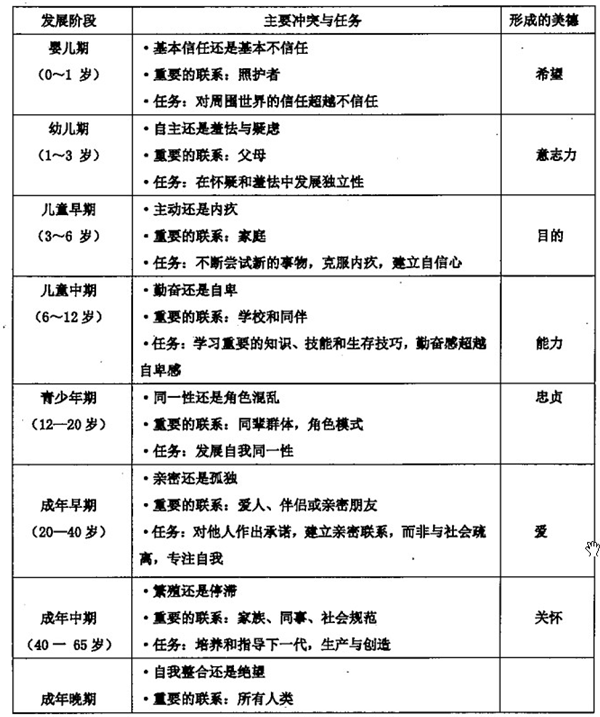

### 1.	人类的需要
#### 1.1.	人类需要的定义	
>人的需要是指人脑对生理和社会需求的反映，是个体对内部环境和外部生活条件的稳定要求，它通常以愿望、意向等形式表现出来。需要是人的基本特征，是人类活动和行为积极性的源泉。从某种意义上说，需要可以看成是人类一切活动的出发点和归宿。认得需要与动物的需要有效和本质的不同。人的需要具有社会性，它的发展变化受社会生产发展的影响。

#### 1.2.	人类需要的层次	
1.	马斯洛的需要层次论
（1）	生理需要。这是人类维持自身生存最基本的需要，包括饥、渴、衣、住、性等方面的需要。马斯洛认为只有这些最基本的需要满足到维持生存所必须的程度后，其他需要才能成为新的激励因素。
（2）	安全需要。这是人类要求保障自身的安全、摆脱事业和丧失财产威胁、避免职业病的侵袭、解除严酷的监督等方面的需要。
（3）	归属与爱的需要。归属的需要是指人都有一种归属于一个群体的情感，希望成为群体的一员，并相互关心和照顾。友爱的需要是指人人都需要伙伴之间、同事之的关系融洽或保持友谊与忠诚；人人都希望得到爱情， 希望爱别人，也渴望接受别人的爱。
（4）	尊重的需要。尊重的需要分为内部尊重和外部尊重，内部尊重，即自尊，是指一个人希望在不同情境中有实力、能胜任、充满信心、能独立自主。外部尊重是指一个人希望有地位、有威信，受到别人的尊重、信赖和高度评价。
（5）	自我实现的需要。只有基本满足了低级需要后才会产生高级需要，最占优势的需要将支配一个人的意识和行为，高级需要出现之后，低级需要仍然存在，但对行为的影响减弱了。同时他看到了人与动物在需要方面的区别，低级需要是人与动物共有的，而高级需要则是人所特有的。
2.	阿尔德弗尔的 ERG 理论
（1）	生存的需要
（2）	关系的需要
（3）	成长的需要
ERG 理论的主要特点：它并不强调需要层次的顺序，认为某种需要在一定时间内对行为起作用，而当这种需要得到满足后， 可能去追求更高层次的需要，也可能没有这种上升趋势。当较高级需要受到挫折时，可能会降而求其次。另外，该理论还认为，某种需要在得到基本满足后，其强烈程度不仅不会减弱，还可能会增强。
3.	莫瑞的需要理论
（1）	需要的特点和作用：
①需要与需要之间相互关联。联合、冲突、服务。
②需要作为力，影响并组织个人的知觉、统觉、思维、意向，以及心理和行为。
③需要永远作为力推动着活动，它是个性结构中不可缺少的成分。
④需要有不同的发展阶段。
（2）	莫瑞把需要分为两大类：
①第一需要，又称生理性需要，包括对食物、水、排泄、性、避免伤害等几种需要。
②第二需要，又称心因性需要，通过童年的经验而获得的，行为是由个人的内部活动与外部世界相互作用而引起的。其中包括两小类：
a.	与学习任务有关的需要和影响学生操作水平的一些需要；
b.	与人际关系有关的需要，包括使人们结合起来的需要及使人们分裂的需要。

#### 1.3.	人类需要的类型	
1.	生理性需要和社会性需要
（1）	生理性需要反映了人们对延续和发展自己的生命所必需的客观条件的需要。如对生活资料的需要、生理保健的需要、繁衍后代的需要等。
（2）	社会性需要是指人们在生理性需要的基础上形成的一种特有的需要，它是在维持人们的社会生产和社会交往的过程中形成的，如人对工作的需要、对知识的需要和实现理想的需要等。
 
2.	物质需要和精神需要
（1）	物质需要是指个体对物，如衣、食、住、行和日常用品的需要。在物质需要中既包括生理性需要，又包括社会性需要。
（2）	精神需要是指人对自己的智力、道德和审美等方面的发展条件的需要，如人对学习提高的需要、创造发明的需要、贡献能力的需要、独立自尊的需要等。
3.	间接需要和直接需要
（1）	间接需要是指那些比较概括的、抽象的需要，常常以理想、志向等形式表现出来，如由于环境的刺激 ，产生了当一个科学家的愿望。
（2）	直接需要是指随着间接需要的产生而产生出的一系列具体的需要。如学习科学技术的需要，上大学的需要等。

### 2.	人类行为、社会环境及其关系	
#### 2.1.	人类行为的含义、特点、类型、影响人类行为的因素
##### 2.1.1.	人类行为的含义
>人类行为又称人的行为，人类行为有广义与狭义之分。广义的人类行为是指由客观刺激通过人的心理活动而引起的内部与外部的反应。狭义的人类行为仅指外显的行为。
德国社会心理学家勒温认为，人的行为使个体与环境相互作用的结果。他提出的行为公式是 B=f(P．E)，P代表个体，E 代表环境。

##### 2.1.2.	人类行为的特点
第一，适应性。人类行为能够而且必须适应社会环境并做出反应，亦即人类行为是为了适应社会环境的需要而产生的。
第二，多样性。人类行为是个复杂的过程，它的变化会出现在各个不同的方面，既包括可以直接观察到的外显行为，如哭、笑等，也包括可以间接观察到心理行为，如思想、意欲、恐惧以及态度等。
第三，变化性。人类行为的变化是持续不断的，它既包括人类由于如身高、体重等的变化而造成的行为变化，也包括由于社会生活条件的变化而造成的行为变化。
第四，可控制性。人类的有意识性，使他们能够有意识地了解和分析周圈事物的本质特点及其内在联系，明确思考过程和方向，并有目的地控制和调节自身的行为。
第五，整合性。由于人类行为变化的复杂性，单一的学科无法对其进行全面的描述，这就使越来越多的学科互相渗透和整合。（中级，2015版）

##### 2.1.3.	人类行为的类型
1.	本能行为和习得行为
（1）	本能行为来自遗传，是一类不需要学习就可以出现的定型的行为模式，如吮吸、爬行等。
（2）	习得行为是人类在后天与环境的互动中逐渐学习而形成的，也可以叫学习行为，如工作、交往等。
2.	亲社会行为和反社会行为
（1）	亲社会行为指一切对社会有积极作用的行为，包括助人、遵守社会规范、友善、公共参与等。
（2）	反社会行为是一种攻击他人或社会的有消极作用的行为。例如，暴力行为、侵犯或攻击行为、伤害他人和破坏社会秩序等。
3.	正常行为和偏差行为
（1）	正常行为是指符合社会规范和正常模式的行为。
（2）	偏差行为是指显著异于常态而妨碍个人正常生活适应的行为。
（3）	划分正常行为和偏差行为的常用标准
①统计学标准。
②社会规范与价值标准。
③行为适应性标准。
④个体主观体验。

##### 2.1.4.	影响人类行为的因素
1.	生物因素
（1）	影响人的成长，是人的行为的物质基础；
（2）	生理因素的变化会影响心理因素的成长；
（3）	不同阶段的人生理发育不同，这直接影响到了人在不同时期的成长特征；
（4）	生物因素主要通过遗传基因影响人类的行为发展。
2.	心理因素
（1）	心理认知帮助我们正确认识自己，正确认识他人和社会，从而正确处理自我与他人、社会的关系；
（2）	只有正确的认识，才能确保人们行为的健康发展；
（3）	人是有感情的，情感对人类行为的影响十分重要；
（4）	心理的需要和动机影响行为的变化。
3.	社会因素
（1）	家庭、群体；
（2）	经济制度和政治制度；
（3）	社会事件与文化等。

#### 2.2.	社会环境的含义、特点、构成要素
##### 2.2.1.	社会环境的含义 **(2014 名词解释、2015 名词解释、2017 名词解释)**
>社会环境是指与人的生存相关的社会因素以及与人的生物遗传、心理状态相互作用而形成的社会系统。社会环境是一个极其复杂庞大的系统，它关注把不同的人联接在相同地点的系统关系，既包括日常活动的互动系统，也包括影响社会功能的环境系统。包括人造物质环境和纯社会环境。纯社会环境可简称为社会环境，主要包括家庭、学校、单位、社区、文化等子系统。

##### 2.2.2.	社会环境的特点
（1）	多样性
社会环境包括影响人类行为的众多因素，小到家庭、学校、群体和组织，大到社区和国家。社会环境可能是实体性的社会群体或组织，也可能是客观存在的舆论、文化、社会制度和社会政策，涵盖了影响人类行为的不同层次和方方面面的因素。
（2）	复杂性
首先，社会环境要素中的每一个子系统都是复杂的。其次，社会环境中各子系统对人类行为的影响是相互交织在一起的，各子系统既相对独立，又相互影响，它们相互作用的机制非常复杂，这也决定了社会环境的复杂性。
（3）	层次性
从对人的生存影响程度的角度来看，社会环境有其层次性。有的因素直接影响着人的行为，有的则比较间接；有的因素对人的生存状态影响巨大，有的则影响微弱。于是，对于人的具体生存或具体行为而言，社会环境就有了层次性。
（4）	稳定性
社会环境具有相对稳定性。从微观来讲，如一个人所生活的具体家庭环境、所在社区的文化价值观念、风俗习惯等在一定时期是相对稳定的；从宏观来讲，一个时代的制度、社会结构也具有相对的稳定性。正是这种环境的稳定性特征使得人类正常有序的生活成为可能。
（5）	变动性
社会环境并不是一成不变的，应该说社会环境始终处于动态变化之中，它是稳定性和变动性的相对统一。
尤其是在全球化和市场经济的影响下，社会环境的变化日益加剧，如果人们的行为和观念与变化的社会环境不相适应就会产生一系列问题。

##### 2.2.3.	社会环境的构成要素
###### 2.2.3.1. 家庭
1.	定义：是以婚姻和血缘关系，或者以法律领养关系所构成的一个社会单位，同时，应当有共同的生活具备的条件：
A.是个群体概念，至少应该有两个以上的成员构成；
B.婚姻是家庭的基础和根据（夫妻关系，是判断家庭的第一标准）；
C.由血缘关系或领养关系而构成的父母子女关系和兄弟姐妹关系，是判断家庭的第二标准；
D.家庭成员之间应当有共同的生活，有一定的经济联系和特殊的情感交往。
2.	家庭的社会特征
A.家庭具有历史性：家庭是社会的缩影，随着社会的发展而不断发生变化；
B.家庭是一个社会体系：任何一个家庭都不是孤
立存在的，一个家庭可能要受到邻居家庭的影响，也可能受到社区环境的影响；
C.家庭是一个社会群体；
D.家庭是一种社会制度：家庭被认为是人类社会中最普遍、最基本、最古老的一项社会制度。
3.	家庭的形式
A.	按照家庭成员所担当的身份的演变，可分为养育家庭和生殖家庭；
B.	按照家庭成员的关系及规模，可分为核心家庭和扩大家庭。
B1.扩大家庭的优点：
B11.人口众多，给人以家庭兴旺的感觉，家庭成员能够感觉到家庭是作为一种强大的力量而存在的；B12.能够给家庭成员提
供经济支持和保障，提高家庭成员承受意外变故的能力；
B13.再次，从情感上为每一个成员提供爱、关怀以及认同感等精神需求。
B2.扩大家庭的缺点：
B21.强调家庭是一个整体，家庭的利益高于个人的利益，成员的个性、价值、情感和自由常常遭到压抑和剥夺；
B22.产生了一种遗患无穷的后遗症，遇到困难时，不是诉诸个体或社会组织，而是依靠家庭的力量或家族的势力；
B23.容易产生独断的家长制而不是科学的管理方法。
B3.核心家庭的优点：
B31.为夫妻关系的健廉发展提供了一个良好的空间；
B32.有利于子女的健廉成长；B33.对家庭成员独立精神的培养。
B4.核心家庭的缺点：
B41.风险抵抗能力弱小，稍微严重的问题都可能引起核心家庭的刷烈震荡；岁
B42.成员交往有限，在感情上很难获得足够的支持和交流；
B43.子女的看护教育，赚养老人成为一大难题。
C.	按照婚后夫妻居住地点不同，可分为从男居、从女居、新居。
D.	根据家庭之中权力分配的不同，可分为父权、母权、平权家庭。
E.	按照婚姻形式的不同，可分为一夫一妻、一夫多妻、一妻多夫。
4.	家庭的生命周期（伊夫朴·社瓦尔）夫妇家庭—抚养孩子家庭一学前儿童家庭——入学儿童家庭——青少年子女家庭——家庭成员出走阶段——中年夫妇家庭—老年夫妇家庭
5.	家庭关系
一般包括夫妻关系、父母和子女关系、兄弟姐妹关系、祖孙关系、葵媳关系、翁婿关系、姑嫂关系、妯娌关系、连襟关系等特征：A.是一种社会关系；B.以婚姻和血缘为发生根据；C.明显的代际性；D.贯穿人的一生；E.亲密性、一体性。
6.	家庭教养模式
A.	娇纵型。父母盲目的漏爱和疏于管束，构成娇纵型教养模式。在这种澜爱娇惯的家庭环境中，容易使孩子养成自我中心、
骄横贼虐、疏懒散浸、贪婪无度的“霸王”心态，这种“霸王”心态如果不能得到及时矫正，很容易发展为反社会型人格。
B.	支配型。家长过分漏爱与严加管束结合，构成支配型家庭教养模式。在这种家庭中，家长在生活方面对子女无微不至，在
学习上严加管理。一方面是过度保护，包揽生活中的一切，一方面有期望过高。这种方式容易使孩子形成怯懦胆小、意志薄弱、既娇且骄、清高孤做等个性心理特征。
C.	专制型。家长缺少爱心或耐心，管理方式粗暴，构成专制型家庭教养模式。在这种家庭中，孩子的人格、自尊、意志、权
利等不被尊重，家庭亲子关系是一种命令与服从的关系。这种教养方式易使孩子产生不信任感、戒备心理严重、自卑、消极、暴躁、懦弱、依赖或反抗权威等人格特征。
D.	放任型。家长既缺少爱心、耐心，也缺乏责任感，对孩子放任自流，构成放任型家庭教养模式。在放任型家庭教养模式
下，孩子由于得不到必要指导和正常约束，会形成缺乏自信、自制力差、不负责任、情绪波动异常、待人处世具有攻击性、易受诱惑、做事权宜敷衍、缺乏理想等心理倾向。
E.	冲突型。家庭成员间人际关系紧张、不和谐，家庭气氛失调，价值导向不一致，构成冲突型家庭教养模式。冲突型教养方
式下的孩子也易形成缺乏安全感、意志力薄弱、残忍冷酷、撒谎等心理特征，且大多数有激烈的反抗性，可能出现反社会的倾向。
F.	民主型。家庭成员间互相尊重、平等交流，对子女既有约束，又有鼓励，构成民主型家庭教养模式。这种民主型教养方式下的孩子容易形成自尊、自信、自律性强、具有创造性、社交能力强、具有成就动机等良好社会适应性的个性特征。
7.	家庭的功能
家庭的功能是指家庭对其成员所起的积极作用。具体来讲，家庭的功能有情感支持、性爱满足、繁衍后代、社会化和经济功能等。
A.	情感支持。家庭作为初级社会群体，成员之间日常互动频繁，情感交流充分，彼此之间容易相互理解和支持。通过提供情
感支持，家庭可以帮助其成员缓解家庭之外社会生活带来的挫折和压力，获得情感的慰藉。
B.	性爱满足。家庭是为法律和社会习俗所认可的性生活的场所，性爱是家庭生活的重要内容。家庭中的性爱一方面保证了性
爱的排他性，促进夫妇之间情感的交流，能够更充分满足彼此性爱的需要；另一方面可防止因性的需要而引起的社会问题， 促进社会的和谐与稳定。
C.	繁衍后代。家庭通过建立双系抚育、确立婚姻、夫妇配合等一系列制度来实现繁衍后代，维持人类种族的延续。
D.	社会化。家庭是人的社会化的重要场所，家庭可以提供角色模型供孩子模仿学习，为其将来更好地适应社会、进一步社会
化打下良好的基础。
E.	经济功能。家庭经济功能主要是指家庭作为生产经营和消费的单位所发挥的作用。随着社会的不断发展，家庭生产经营的
功能逐渐弱化，而消费的功能却日益增强。
8.	家庭问题
A.	家庭暴力：一个家庭成员对另一个家庭成员所施与的暴力伤害，表现为内体上、心理上以及性方面的伤害。
B.	高婚：人们对婚姻的看法发生了改变，原来附加到婚姻至上的许多虚妄的东西被除去了；女性社会地位的上升；社会的宽容、开放和自由。
9.	家庭对人类行为的影响
家庭对个体的影响主要是通过家庭成员关系和家庭内互动发生的。家庭成员关系指家庭成员的关系类型和这些关系的性质。一个人的家庭是核心家庭还是主于家庭，家庭成员间的关系是好还是差，都会影响其行为。家庭内互动包括纵向和横向两个方面，纵向影响主要来自家庭背景和家庭中过去的事件对当今家庭成员行为的影响，横向影响主要是家庭成员间的互动对个体行为的影响。在家庭内互动方面，不同的家庭教养模式对孩子的影响是不同的，良好的教养模式可以使儿童、青少年向着积极主动的方向发展，不良的教养模式会导致他们向着攻击性、反抗性等消极的方向发展。例如，娇纵型、支配型、专制  型、放任型、冲突型的教养模式都不利于孩子的成长，而民主型的家庭教养模式有利于家庭成员的正常发展。

###### 2.2.3.2. 朋辈群体
1.	同辈群体的含义 **（ 2018 名词解释）**
是由年龄、性别、志趣、职业、社会地位及行为方式大体相近的人所组成的一种非正式的群体。同辈群体的形成大部分出于偶然性因素，随着年龄的增长，同辈群体形成的主动选择性变得越来越多。
2.	同辈群体的特点
A.	平等性。同辈群体成员的年龄、知识、能力等方面比较相近，他们之间的地位是平等的。
B.	开放性。同辈群体内部不存在特别严格的规章制度，成员之间的交流和交往在语言、方式、话题等方面都没有限制特定的形式。
C.	认同性。同辈群体是个人自由选择结合的结果，群体成员之间的交往是在自然随意的过程中进行的，成员之间相互依赖，
对群体有较高的心理归属感和较强的认同性。
D.	独特性。每个同辈群体都有自己独特的亚文化，这种群体的亚文化为群体成员提供了新的价值标准和行为方式。群体成员
在语言、服饰、行为方式甚至发型等方面都体现出自己的独特性。
3.	同辈群体对个体行为的影响：首先，它对个体的认知发展、行为塑造、情绪表达、精神迫求及支持系统均有直接影响；其
次，同辈群体往往有一套自己的价值标准，当这些标准与社会主流的价值标准一致时，会有利于群体成员形成积极的行为， 但当这些标准与社会主流的价值标准不一致时，会对群体成员的行为起消极影响；最后，伴随着个体的成长，同辈群体在不同的社会系统中扮演着不同的角色，这种角色的多样化对群体成员来说具有多种意义。社会工作者要充分利用同辈群体的正向功能开展服务工作。

###### 2.2.3.3. 学校
学校是个体社会化的重要场所，专门为社会成员，尤其是儿童和青少年社会化而设立的正规化的学习机构。学校对儿童和青少年的影响主要体现在两个方面：
（1）	学校对儿童和青少年进行长期的和系统的正规教育，传授现代社会所需要的文化和复杂的科学技术知识；
（2）  社会化。向儿童和青少年灌输特定社会的价值规范，教育他们学会遵守规章和制度，并按照行为规范的要求学习扮演各种社会角色。

###### 2.2.3.4. 工作单位
工作单位是个人在社会中从事一定职业时所归属的正式社会组织。工作单位对其成员的影响主要有：
（1）促使个人学习和实践专门的职业知识、技能和道德规范；指导个人建立各种社会关系，正确调适自我行为，以适应相应的工作需求与社会需求。

###### 2.2.3.5. 社区
社区是指以一定地域为基础的社会生活共同体，它强化了人类的群体意识和共同体意识，并拥有社区成员共同遵守的社会规范。社区对人类行为的影响主要有以下几个方面：
（1）	社区成员具有某些共同特征，如相似的社会经济地位、生活方式、文化和风俗习惯等。
（2）	社区成员之间存在着复杂的社会交往关系，在交往中彼此发生影响。
（3）	社区本身是一种社会组织，具有本身的社会规范，对社区成员的行为具有约束作用。
（4）	社区成员对社区具有强烈的认同感和归属感，这种认同感也会影响社区成员的行为。

###### 2.2.3.6. 文化
文化是社会发展过程中人类创造物的总称，包括物质技术、社会规范和精神体系，是所有物质产品和非物质产品的总和。文化是人类共同生活的基础，也是人类活动的重要社会环境。文化对人的行为的影响是通过对人的个性心理及行为模式的影响（内化和软约束）表现出来的。

###### 2.2.3.7. 大众传媒
大众传媒（包括广播、电视、报纸、杂志、书籍、互联网等）对人的行为和社会事件的影响越来越大。主要体现在以下几个方面：
（1）	可以为受众提供支持其固有立场、观点和行为的有关情况，从而增强受众的固有观念和行为。
（2）	在争议不大且没有其他因素干扰的情况下，大众传媒只要重复传播内容，就能直接改变受众的行为。
（3）	大众传媒可以使受众改变其原有的立场。
（4）	可以提供信息引导人们的行为。
（5）	为受众提供行为规范，供他们选择。

##### 2.2.4.	社会环境的层次
社会环境划分为微观系统、中介系统、外生系统和宏观系统四个层次。
（1）	微观系统（microsystem）是一个人在日常生活中与之有长期的和直接的接触的个人、群体、组织或机构，比如家庭、  学校、朋友、邻居等。微观系统是个人生活中最核心、最重要的环境，对个人行为及其发展有着直接而重要的影响。
（2）	中介系统（mesosystem）是在个人所处的微观系统之间发挥联结和中介作用的系统。中介系统也是个人生活的重要环  境，中介系统的好坏，对于问题的及时发现和解决，对于行为能力的提升都具有要意义。
（3）	外生系统（exosystem）是个人与之没有或很少有直接的接触和互动，但却可以直接影响个人生活的群体、组织或机构  等。对于一个学生而言，教育部就是他的外生系统，因为学生虽然与教育部各个部门、各位官员之间基本上不存在直接的、长期的互动，但其制定的招生政策、课程指南、教育发展规划等，却会对学生的生活造成直接影响。
（4）	宏观系统是指能够对外生系统造成直接影响的制度、文化、意识形态或社会结构等。比如，近年来政府推行的“减员增效、下岗分流”等国有企业改革政策，导致国有企业大量裁员，一些下岗工人家里的孩子面临无钱上学的窘境。对这些孩子 来说，“减员增效、下岗分流”政策就是宏观系统。
恰当地划分社会环境的层次，有利于准确地把握个人所面临的问题，制定正确的社会工作方案。

#### 2.3.	人类和社会环境的关系
##### 2.3.1.	人类行为与社会环境的基本假设
（1）	我们怎样看待世界以及环境与人的互动直接影响社会工作中工作原则的制定和工作手法的选择；
（2）	我们是社会工作者，也是普通人，也受自身成长环境的影响；
（3）	社会工作是一个助人的专业和职业，这并不意味着社会工作者比工作对象优秀，而应该理解为人与人之间的差异；
（4）	每个人都有值得欣赏和学习的地方，我们的工作对象也不例外；
（5）	人类行为与社会环境中每个因素都是不断变化的。

##### 2.3.2.	人类行为与社会环境的基本关系 **（2019 简答、2016简答）**
（1）就物质环境而言，一方面，人类能够改变物质环境（围海造田、劈山造林、最公移山、精卫填海）；另一方面，物质环境同样能够影响人类（积极一—适当的雨水，雪，消极—地震、海啸、台风、地球变暖）（2）就社会环境而言，一方 面，人类行为可以影响社会环境，如以“新新人类”自居的年轻人，他们的生活态度，行为方式等等都会影响社会风气或文化的改变；另一方面，社会环境同时也能够影响人类的成长，如婚姻法的修订，会影响人们的婚恋生活，中国文化与美国文化传统的差异，会导致中国人与美国人在思维方式、行为方式、生活态度的差异。
（3）	环境对人的影响
首先，社会环境为人类行为提供了发展的空间和方式其次，社会环境是人类成长的有力支持
再次，社会环境为人类成长提供了参照标准
最后，人类行为中的个人问题，其真正原因常常不是个人原因，而是深层次的社会原因
（4）	基本关系
人类是在环境之中生活的，同时又具有能动性。人类行为和社会环境相互影响，二者的关系是复杂关系，主要表现在以下几个方面：
1.	人的行为要适应社会环境
社会环境为人的生存和发展提供了具体的空间。在这个空间中，人们出于满足自身需要的动机.在现实社会条件及社会规范 的约束下行动，获取自己生存和发展的资源，发展自己的潜能，实现个人与社会的期望。这样，社会环境对人的行为来说既是资源获取空间，也是行为约束空间。人从社会环境中获取资源和受到约束这种关系决定了他在相当大的程度上要依赖环  境，从而环境对人的行为发挥着重要的制约作用。社会环境中资源的丰饶程度及分配规则引导和规范了人的行为。在这种意义上环境塑造了人，环境也决定了人的行为，人类行为要适应社会环境。要了解人的行为就必须认识他所处的环境及其性  质，要改变人的行为电要从改变他所处的环境人手。
2.	社会环境影响人的行为
社会环境为人的行为提供了参照标准。参照群体不是社会成员生活于其中的群体，而是社会环境的一部分。
在社会生活中，参照群体是人们进行比较和评价的标准，从而影响着人们的行为。实际上，能够起到参照作用的不只是社会群体，还包括阶级、阶层、社会集团以及其他个体。通过参照和比较，人们会产生对自己的满意或不满意的评价，会产生成就感、满足感或自卑感。同时，参照和比较也会产生社会公平感或相对剥夺感。通过参照和比较而产生的这些认识和心理感觉会影响人们的行为。满意的评价将鼓励人们按照常规去处理自己的行为，不满意的评价或者激励起人们的竞争、奋斗以致反抗，或者压抑个人的积极冲动，而形成心理忧郁，影响其心理健康。
3.	社会环境和生物遗传共同对人类行为产生影响
社会环境对人类行为的影响不能脱离生物遗传因素的制约。同样，良好的遗传特性也需要依托适当的社会环境才能发挥作用。人的发展是遗传和环境相互影响的产物，其路径取决于遗传因素和外部环境影响之间复杂的相互作用。
4.	人类能够改变社会环境
由于人类具有很强的能动性，所以人类可以改变自然环境，也可以改变社会环境。领袖人物或者大众的一致行为，对社会环境的影响作用巨大。
5.	人类行为与社会环境关系的非平衡性
总的来说，人类行为与社会环境相互影响的力度并不是平衡的，社会环境对人类行为的影响要大一些。社工要正确理解和把握人类行为和社会环境的关系，不仅要评估服务对象行为方面的情况，还要评估服务对象所处的社会环境。更重要的是评估服务对象与社会环境之间的互动状况，以帮助服务对象改变个人和环境，改变个人及其社会环境之间的互动状况，恢复和发展个人的社会功能。
（5）	人类行为与社会环境知识的应用
1.	在学术探究方面：各相关科系的师资与学生可以用于教材或是重要的参考数据。
2.	在实务工作方面：各类专业从业人员从中习得知识，形成对案主辅导之重要参考。
3.	在日常生活方面：使监护者或双亲能够更了解子女，成年子女亦了解如何与老年父母调适，使家庭生活更美满。

##### 2.3.3.	生命周期中的动态发展
##### 2.3.4.	人类行为与社会环境的理论基础
###### 2.3.4.1.	弗洛伊德的精神分析理论
西格蒙·弗洛伊德，出生于维也纳，奥地利精神病医生和心理学家
1.	无意识
人们常常认识不到自身行为的真正动机，而无意识则被他视为人类行为的主要驱动力；弗洛伊德将无意识部分称为伊特，它由利比多和塞纳托斯两个相互对立的驱动力组成；利比多代表着生本能，与他相关联的是，吃饭、呼吸、性以及其他身体需
要的满足；3塞纳托斯代表着死亡本能，与它相关联的是纵火、自廉、攻击、谋杀等破坏性东西。
2.	人格结构
本我——是本能的冲动，与生俱来，并且贯穿所有的冲动源泉。本我的功能是寻求能够满足本能冲动的目标。    本我追求的是性欲和攻击性冲动以及饥渴等自我保存需要的即时满足，遵循的是“快感原则”。
自我一—是从本我中发展出来的，属于意识结构部分，遵循的是“现实原则”。自我是本我和外部世界之间的中介，它努力寻求本我的冲动与社会现实的要求这两者之间的平衡。
超我—包括良心和自我理想两个组成部分，代表着道德标准和生活的理想，遵循的是“至善原则”。
本我传布着本能的冲动和需要；自我控制着本我的冲动，同时又寻找现实的途径来满足这些需要；超我则决定自我的问题以及解决的策略是否符合道德标准。
3.	心理性欲发展阶段
1.	口唇期：0-1岁
原始欲力的满足主要靠口腔部位的吸允、咀嚼、吞咽等活动。
此时期的口腔活动着受限制，可能会留下后遗性的不良影响，即口腔性格。在行为上表现贪吃、酗酒、吸烟、咬指甲等。
2.	肛门期：1-3岁
原始欲力的满足，主要靠大小便排泄时所生的刺激快感。
此时期卫生习惯的训练对幼儿是关键。如管制过严，可能会留下后遗性的不良影响，即肛门性格者，在行为上表现冷酷、顽固、吝啬等，可能就是肛门性格的特征。
3.	性器期：3-6岁
原始欲力主要靠性器官的部位获得满足。
幼儿在此时期已能辨识男女性别。出现男意以父亲为竞争对手而爱母亲的现象，称为恋母情结，同理女童以母亲为竞争对手而爱恋父亲的对象，则称为恋父情结。
4.潜伏期：6-12岁
此时期儿童兴趣扩大，由对自己身体和父母的感情，转变到周围的事物，原始欲力呈现出潜伏状态。此时期的男女儿童之间，在情感上较前疏远，团体性活动多呈男女分离趋势。
5.生殖期：12-
两性差异开始显着。
性的需求转向相似年龄的异性，开始有了两性生活的理想，有了婚姻家庭的意识，至此，性心理的发展以臻成熟。

###### 2.3.4.2.	埃里克森的心理发展阶段理论

埃里克森认为，个体在每个发展阶段都面临特殊的发展任务，都会经历一次心理一社会“危机”，或者说矛盾冲突。这些冲突包含着对立的两极，个体只有尝试面对并解决这一一冲突之后，才能顺利进入下一阶段，同时发展出某种特定的品质或“美 德”。如果冲突无法圆满解决，那么个体自我的发展就会出现困扰乃至停滞。在8个发展阶段中，埃里克森特别强调青少年期自我同一性的发展，认为这是自我发展的最关键环节。

###### 2.3.4.3.	皮亚杰的认知发展理论
瑞士心理学家，毕生致力于对儿童认识周圈环境并对之做出反应的方式和过程的研究，也就是获取信息、解决问题以及新的思想创立的过程。
1.	皮亚杰认为，发生认识论的结构涉及图式、同化、顺应和平衡四个基本的概念。
A.	图式—一个人用来对付环境中的情景时所应用的心理结构和思维模式；
B.	适应——帮助机体适应环境的生活过程；
C.	同化一一面对环境的刺激，吸纳新的信息，并将它们纳入机体已有的图式和结构之中，以加强和丰富认识主体：
D.	顺应—一当旧的图式不再起作用时，通过创造出新的图式从而做出调整并适应新的情况；
E.	平衡——图式和顺应之间的平衡。
2.	对儿童心理发展的研究：皮亚杰认为，影响儿童心理发展的因素主要有四个方面：
 
A.	生物成熟，主要是指神经系统的成熟：
B.	物理经验，即个体对物体做出动作时的练习和习得经验的作用，它包括物体经验（来自外物）和数理逻辑经验（来自动作）：
C.	社会环境，主要是指社会生活、文化教育以及语言等外界环境；
D.	平衡，即不断成熟的内部组织和外部环境的相互作用。这是影响儿童心理发展的决定因素。
3.	认知发展的阶段——不交的发展序列
A.	感觉运动阶段：从出生到2岁，新生儿运用感觉和身体运动来探索和获取对环境的理解；
B.	前运算阶段：从2岁到7岁，运用头脑而不是用手进行思考；
C.	具体运算阶段：从7岁到11岁，可以脱离物体在头脑中进行运算；
D.	形式运算阶段：从11岁以后，能够超越具体的、现实的经验，用更加抽象、更加逻辑的词语进行思维。

###### 2.3.4.4.	科尔伯格的道德发展理论
科尔伯格（L.Kohlberg）是继皮亚杰之后对儿童品德发展问题进行了大量的、章有成效的研究，提出了系统的道德发展阶段   理论。通过大量的研究，科尔伯格提出了三个水平六个阶段理论。三个水平是指前习俗水平、习俗水平、后习俗水平。六个阶段是指每个水平中又可划分为两个不同的阶段。
1.	前习俗水平（0~9岁）处在这一水平的儿童，其道德观念的特点是纯外在的。他们为了免受惩罚或获得奖励而顺从权威人
物规定的行为准则，根据行为的直接后果和自身的利害关系判断好坏是非。这一水平包括两个阶段。
A.	第一阶段：惩罚与服从定向阶段。在这一阶段，儿童根据行为的后果来判断行为是好是坏及严重程度，他们服从权威或规
则只是为了避免惩罚，认为受赞扬的行为就是好的，受惩罚的行为就是坏的。
B.	第二阶段：相对功利取向阶段。这一阶段的儿查道德价值来自对自己需要的满足，他们不再把规则看成是绝对的、固定不
变的，评定行为的好坏主要看是否符合自己的利益。科尔伯格认为，大多数9岁以下的儿童和许多犯罪的青少年在道德认识上都处于前习俗水平。
2.	习俗水平（9~15岁）处在这一水平的儿童能够着眼于社会的希望与要求，并以社会成员的角度思考道德问题，已经开始意
识到个体的行为必须符合社会的准则，能够了解社会规范，并遵守和执行社会规范。规则已被内化，按规则行动被认为是正确的。习俗水平包括两个阶段。
A.	第一阶段：寻求认可定向阶段，也称“好孩子”定向阶段。处在该阶段的儿童，个体的道德价值以人际关系的和谐为导向，
顺从传统的要求，符合大家的意见，谋求大家的赞赏和认可。总是考虑到他人和社会对“好孩子”的要求，并总是尽量按这种要求去思考。他们认为好的行为是使人喜欢或被人赞赏的行为。
B.	第二阶段：遵守法规和秩序定向阶段。处于该阶段的儿童，其道德价值以服从权成为导向，他们服从社会规范，遵守公共
秩序，尊重法体的权成，以法治观念判断是非，知法惯法，认为准则和法律是维护社会秩序的。
因此，应当蓬循权戚和有关规范去行动。科尔伯格认为，大多数青少年和成人的道德认识处于习俗水平。
3.	后习俗水平（15岁以后）后习俗水平又称原则水平，达到这一道德水平的人，其道德判断已超出世俗的法律与权戚的标
准，而是有了更普造的认识，想到的是人类的正义和个人的尊严，并已将此内化为自己内部的道德命令。后习俗水平包括两个阶段。
A.	第一阶段：社会契约定向阶段。处于这一水平阶段的人认为法律和规范是大家商定的，是一种社会契约。他们看重法律的
效力，认为法律可以帮助人维持公正。但同时认为契约和法律的规定并不是绝对的，可以应大多数人的要求而改变。在强调按契约和法律的规定享受权利的同时，认识到个人应尽义务和责任的重要性。
B.	第二阶段：普遍性伦理准则阶段。这是进行道德判断的最高阶段，表现为能以公正、平等、尊严这些最一般的原则为标准
进行思考。在根据自己选择的原则进行某些活动时，认为只要动机是好的，行为就是正确的。在这个阶段，他们认为人类普遍的道义高于一切。

###### 2.3.4.5.	学习理论
1.	也被称为行为主义，理论奠基人是伊凡·巴甫洛夫和约输·B·华生华生的行为主义理论
强调行为是研究的目标
强调环境对行为塑造的影响强调刺激一反应模式
反对阶段论，主张连续论
2.	斯金纳的操作行为主义理论：
A.	操作性条件反射行为的形成，包括经典性条件反射和操作性条件反射；
B.	强化对操作性条件反射行为发生的作用，强化分为二类：提供刺激和从情境中消除某些东西；
C.	操作性条件反射行为的消退，消退的关键在于强化；
D.	操作性条件反射行为的分化，分化是个体一种有选择的反应；
E.	操作性条件反射行为原理的推广和运用：程序教学与教学机器，语言行为，社会控制计划。
3.	班杜拉的社会学习理论
阿尔伯特·班杜拉美国心理学家，他的贡献在于强调认知在人类学习中的高度地位A.理论观点：人类行为不仅可以通过反应的结果进行学习，也可以通过榜样的示范进行学习，后者是人类学的主要方式。
B.	观察学习：个人通过观察他人的行为及其强化结果而习得某些新的反应，或使他已经具有的某种行为反特征得到矫正。
C.	观察学习的过程
C1.注意过程：注意榜样行为的重要特征，并正确地知觉。
C2.保持过程：以印象和言语形态保存在记忆中。
C3.动作复现过程：把保存在记忆中的行为表象转换成行为。
C4.动机作用过程：人们并不把学到的行为全部表现出来。

|  行为   |    结果	    |      效果       |
| :-----: | :---------: | :-------------: |
| 示范行为 | 有价值的结果 | 增强产生同样行为 |
| 示范行为 | 无报偿的结果 | 抑制产生同样行为 |

###### 2.3.4.6.	人本主义心理学
1.	亚伯拉罕·马斯洛美国心理学家一—需求层次理论A.生理需要：最原始、最基本的需要，如吃饭、穿衣、住宅、医疗等。若不满足，则有生命危险。
B.	安全需要：劳动安全、职业安全、生活稳定、希望免于灾难、希望未来有保障等。
C.	归属和爱的需要：渴望得到家庭、团体、朋友、同事的关怀、爱护、理解。
D.	尊重需要：自我尊重、自我评价、尊重别人。尊重的需要很少能够得到完全的满足，但基本上的满足就可产生推动力。
E.	自我实现的需要：满足这种需要就要求完成与自己能力相称的工作，最充分地发挥自己的潜在能力，成为所期望的人物。
F.	后来，马斯洛又在尊重需要和自我实现需要之间增加了认知需要和审美需要。
2.	需要层次理论的结论：
A.	人都潜藏五种不同层次的需要，但不同时期表现出来的需要的迫切程度不同。人最迫切的需要才是激励人行动的主要原因
和动力。
B.	在高层次的需要充分出现之前，低层次的需要必须得到适当的满足。
3.	评价
在任何时候，影响人的行为都不只是一种需要，而是多种需要，追求高一级的需要满足的人同时保持着低一级的需要。

###### 2.3.4.7.	库利的镜中自我理论
查尔斯·霍顿·库利美国社会学家，社会心理学家三个主要观点：
1.	人与社会的关系：孤立的个人，是在经验中不存在的抽象概念，同样，当人们把具体的个人从社会中抽掉之后，社会也就变成了一个抽象概念。
2.	镜中自我：在与他人的互动过程中，我们通过感知他人对我们的反映和评价，从而建立起我们的自我意识、自我形象和自我评价，他人犹如一面镜子，我们正是从他人这面镜子里发现了自我。
3.	首属群体：主要特征是亲密的以及面对面的交往、互动与合作。指的是家庭、邻里、儿童游戏伙伴，其中家庭是最重要的首属群体。

###### 2.3.4.8.	米德的符号互动论
乔治·赫伯特·米德，美国社会学家，社会心理学家，符号互动论的主要创始人和代表者自我的两个组成部分：主体我+客体我
1.	主体我：是主观的，涉及我们如何看待我们自己，主体我同时也是自发的、创造性的和不可预测的，代表的是本能的，自然的，非社会化的自我。
2.	客体我：是客观的，涉及他人如何看待我们，客体我代表的是自我社会化的一面。
3.	自我的三个发展阶段
A.	模仿阶段，大约处于婴幼儿时期。模仿是这一阶段的行为特点，婴幼儿只是无意义地模仿动作，不明白到底在做什么，动
作仅仅是模仿，缺乏意义和对符号的理解，不能运用语言对自我和客体定义。
B.	游戏阶段，大约处于儿童时期。这一阶段儿意可以用有意义的语言对客体定义，客体我形成。儿童开始形成自我，但是儿
童的角色模型是不稳定的。
C.	概化他人阶段，大约处于青少年时期。这一阶段青少年必须在情境中同时担当众多角色，即必须从几个重要他人的角度看
问题，并能从参与某些合作活动的人群中获得复合的自我形象，形成“泛化的他人”。

###### 2.3.4.9.	标签理论
埃德温·勒默特（Edrin   Lemet）和霍华德·贝克尔（Howard   Becker）是标签理论的重要代表人物。标签理论的代表作是《社会病理学》（1951）。标签是人们对自我形象的界定与产生，自我形象是通过与他人互动产生的，而他人的标签则是一个重要的因素。标签理论认为越轨行为是社会互动的产物。该理论主要探究越轨行为产生的过程。它认为一个人之所以成为越轨者，并不是因为行动本身，而是因为他人对这种行为的反应。在社会互动过程中，若他人或者社会组织给行为者贴上负面  的“标签”，被贴上“标签”的人也在不知不觉中修正了“自我形象”，逐渐接受社会对其的不良评价，并开始认同他人的观点， 确认自己是坏人。久而久之，越轨行为者意陷意深，最终无法自拔。标签理论强调社会对越轨者的反应，认为社会的反应是促使初级越轨者最终陷入“越轨生涯”的重要原因。

###### 2.3.4.10.	依恋理论
1.	婴儿依恋关系的形成阶段
英国心理学家饱尔比（Bowlby）把依恋发展划分为四个阶段，分别为前依恋关系阶段、形成中的依恋关系阶段、鲜明清晰    的依恋关系阶段以及纠正目标的依恋关系阶段。
A.	前依恋关系阶段。这个阶段包括出生后的几个星期，其典型特征是具有“预先适应性”，这种适应性好像为婴儿预先安排了人类的交流。
B.	形成中的依恋关系阶段。这个阶段典型特征是强调促进与意要成人保持联系的行为。此时，婴儿显示出“选择性的社会微笑”，这发生在认出熟悉脸孔的过程中，对不熟悉脸孔则较少作出微笑反应。
C.	鲜明清晰的依恋关系阶段。随着婴儿运动能力的发展，鲜明清晰的依恋关系变得十分明显。在这一阶段，他们能够清晰地指明他们依恋关系的对象是谁。
D.	纠正目标的依恋关系阶段。在第二年的某个时间，婴儿进入纠正目标的依恋关系阶段。此时，婴儿获得了自我观念，并且已经开始理解其他人的某些观点。婴儿学会对他人行为的结果作出推断，并能通过自己的方式影响他们的行为。
2.	依恋的类型
美国心理学家艾恩斯沃斯（Ainsworth）通过对婴儿的依恋行为进行实验研究，把婴儿的依恋行为分为三种类型。
A.	安全型依恋（secure attachment），这个类型的婴儿当最初和母亲在一起时很愉快地玩；当陌生人进入时，他们有点警
惕，但继续玩，无烦赚不安表现。当把他们留给陌生人时，他们会停止玩乐，并去探索，试图找到母亲，有时甚至会哭泣。当母亲返回时，他们显得比以前同母亲蔓亲热。当再次把他们留给陌生人，婴儿很容易被安慰。
B.	回避型依恋（aviodant attachment），这个类型的婴儿容易与陌生人相处，容易适应陌生环境，在与母亲刚分离时并不难过。但独自在陌生环境中待一段时间后会感到焦虑，不过很容易从陌生人那里获得安慰。当分离后再见到母亲时，对母亲采取回避态度。
C.	反抗型依恋（resistant attachment），这个类型的婴儿表现出很高的分离焦虑。由于同母亲分离，他们感到强烈不安。当再次同母亲团聚时，他们一方面试图主动接近母亲，另一方面又对来自母亲的安慰进行反抗。

### 3.	儿童发展与社会环境
#### 3.1.	婴幼儿阶段
（一）婴幼儿阶段的主要特征
（1）	生理发展
在晏幼儿阶段，个体的身高、体意和大脑的发育迅速。新生儿出生时，体重平均约3000克，出生后一年内前半年平均每月增长600克。新生儿的大脑重量只有成人的25%，半年后就会增长一倍，到2岁时就达到成人的75%。要幼儿阶段也是动作发  展最为迅速的时期，在此期问，晏幼儿学会独立行走和用手操作物体。
（2）	心理发展
在这一阶段，婴幼儿的记忆主要以无意识记忆为主，他们的机械记忆能力比较发达。在婴幼儿的后期开始出现有意识记忆的萌芽，2岁左右形成符号思维能力，这一阶段是孩子从直观行动思维转向具体形象思维的关键阶段。
1岁左右时孩子可能出现普羞、骄做和负罪感等情绪，母要依恋的形成是儿童情绪社会化的重要标志。2岁左右孩子的口语词句迅速增加，对语言产生明显兴趣，并学会了大量名词，喜欢听故事、儿歌和成人说话，能说出符合语法规则的复合句。
（3）	社会性发展
婴幼儿社会化的基本过程有三个阶段，出生至6个月是单纯社会化反应阶段，7个月到2岁是社会性感情联结建立阶段，2~3     岁是伙伴关系的发展阶段。
婴幼儿的自我意识发生要经历三个不同的阶段，第一个阶段是游戏伙伴阶段，第二个阶段是退缩阶段，第三个阶段是自我意识的出现阶段。在婴幼儿自我意识发展的过程中，依恋被认为是一个重要的原因。依恋产生于要儿与其照顺人的相互作用过程，是一种感情上的联结和纽带。拥有安全型依恋的婴儿往往有更多的探索行为，而这能够促进他更早地形成自我认识。

（二）要幼几阶段面临的主要问题
婴幼儿阶段孩子发展很快，但也存在着一些不利于孩子发展的因素，婴幼儿阶段面临的主要问题有哺乳、母爱剥夺和被遗弃等。
（1）	哺乳问题
婴儿出生后6个月内纯母乳喂养为最佳的喂养方式，但目前母乳喂养率却呈明显下降的趋势。影响母乳喂养的因素主要有：
1.	观念问题，一些年轻的母亲认为母乳喂养会伤害外在的形体美，因而过早使用代乳品喂养婴儿。
2.	工作原因，现代社会女性外出工作的比率大，而工作单位很少能够为女性提供方便的哺乳时间和场所，也使得母乳喂养率下降。
3.	剖腹产手术的大量使用，采用剖腹产手术的妇女由于身体虚弱、刀口疼痛以及临床抗生素、镇痛剂的使用等，开始喂奶的时间推迟，泌乳也较晚。
为推广母乳喂养，充分发挥母乳喂养的优势，要在法律法规和社会政策方面积极干预，同时要加强宜传，使人们多了解母乳喂养的优越性，并为孕妇、婴儿母亲和婴儿家庭提供母乳喂养的必要帮助与指导。
（2）	母爱剥夺
母爱剥夺，通常是指母亲与子女的互动不足以及一些导致亲子互动不充足的情境。母爱剥夺问趣的原因主要1.母亲照顾婴儿的时间较少，母亲外出工作或打工，将孩子交给爷爷奶奶或外公外婆照看，没有足够的时间与孩子相处。
2.父母关系紧张导致的母爱的缺失，如高婚或分居造成的母亲与孩子的分离，对孩子的健廉成长影响较大。
3，婴儿被母亲遗弃或母亲去世等原因，使孩子成为弃儿或弧儿，给孩子的成长带来毁灭性的创伤。
对于爱剥夺的问题，在宏观上要依赖于国家相关政策的改变和积极的干预，如户籍制度、教育政策、女职工育几休假制度的完善等；在微观上社会工作者可以对失去母爱的儿童，如孤儿、留守儿童开展更多的社会服务活动，帮助他们健康成长。
（3）	弃婴问题
由于贫困、法律道德观念薄弱、重男轻女封建思想浓厚以及社会保障制度不健全等多种原因，有些婴儿特别是一些重度残疾的婴儿遭到父母的抛弃。
1.	弃要绝大多数是女婴和残疾儿童。造成弃婴问题的原因首先是国家的社会保降体系不健全，家庭无力承担残疾、患病儿童
昂贵的医疗和康复费用，从而使得贫困家庭把患病或残疾的儿童遗弃；
2.	其次是由于传统的重男轻女、男尊女卑观念的影响，限于目前的计划生育政策，造成想要男孩的家庭遗弃女婴；
3.	最后是由于婚外生育和未婚生育，不能通过正常途径养育孩子而造成的遗弃。
4.	预防弃婴要做好以下几个方面的工作：一是要进一步健全和完善相关的法律法规；二是完善弃婴救助制度；三是建立困难
家庭医疗救助体系；四是积极发挥慈善部门、基金会和其他民办机构的作用，开展多种形式的专项救助；五是开展宣传工作，利用媒体进行相关报道，提升社会对于弃要这一社会极弱群体的关注程度。

#### 3.2.	学龄前阶段
（一）学龄前阶段的主要特征
（1）	生理发展
6~7岁儿童的脑重量已经接近于成年人的水平，这为儿童智能的迅速增长以及接受教育奠定了基础。3～6岁时，儿童的大肌
肉发展逐渐成熟，他们能够控制自己的身体以达到某种目的；小肌内与手眼逐渐协调，使儿童获得胜任感和独立感。
（2）	心理发展
语言的迅速发展促进了其思维发展，而思维的发展反过来又进一步促进了语言的发展。主要体现在从以表达机能为中心向以思维机能为中心的转换，主要有以下特点：能正确掌握本土语言，词句发展迅速，初步掌提语法结构，口语表达能力日益增强，开始形成内部语言，开始掌蒸书面语言。儿查生理机能的不断发展，尤其是大脑发育的逐渐完善，极大地促进了儿意认知的发展。
（3）	社会性发展
学龄前期儿童已经逐渐从以自我为中心，发展到学会区分他人与自我。通过在环境中与他人进行互动，自我意识得到发展。学龄前期儿童的自我意识主要由自我评价、自我体验和自我控制3方面因素构成。学龄前期儿查已经能从人的外表来认识性
别，开始了性别认同的发展过程。在这一阶段，儿童建立了性别角色判断的标准，取得对同性父母的认同，并形成了对性别角色的偏爱。学龄前期儿童开始了道德的发展，主要包括道德认识、道德情感和道德行为的发展。学龄前期儿童社会交往的范围从以家庭为主扩大到整个社会生活，他们社会交往的对象主要包括父母、同伴和老师等。

（二）学龄前阶段面临的主要问题
（1）	挑食偏食
挑食偏食在学龄前儿盖不良饮食行为中最为常见，这不仅容易造成学龄前儿童营养不良、发育迟缓，还会导致学龄前儿童缺乏一些生长发育所必需的微量元素，时间长了会严重影响学龄前儿童的身体和智力发育。
1.	造成学龄前儿童挑食偏食的原因主要包括：
A.家长方面的原因，包括忽视了对学龄前儿童正常饮食习惯的培养，对其过于迁就与放任，经常强迫孩子进食某些营养食
品；B.食物的种类、制作方法单一，引不起孩子的食欲；C.学龄前儿童平时吃零食比较多，造成对饭菜不感兴趣。
2.	预防学龄前儿童挑食偏食问题：
A.	要做到科学喂养，做到饮食多样化，在饮食制作上交换花样：
B.	养成良好的就餐习惯，和家人一起就餐，为孩子提供一个良好的就餐环境和就餐气氛；C.注意正确选择零食，为孩子选择一些有营养的零食；D.家长以身作则，带头养成良好的饮食习惯，给孩子树立良好的就餐榜样。
（2）	攻击行为
攻击行为是指个体因为欲望得不到满足而采取的有害他人、毁坏物品的行为。学龄前儿童攻击行为常表现为打人、骂人、推人、踢人、抢别人的东西等。攻击行为一般在3～6岁出现第一个高峰，10~11岁出现第二个高峰。攻击方式可分为暴力攻击   和语言攻击两大类，男孩以暴力攻击居多，女孩以语言攻击居多。
1.	儿童攻击行为存在的主要原因包括：
A.	生理方面的原因。孩子的某些生理特征对攻击性行为的表现有一定的影响。
B.	家庭方面的原因。有些家长惯于用暴力惩罚的方式来教育孩子，结果孩子也以同样的方式来对待其他幼儿，表现出攻击行
为。
C.	社会环境因素。电影、电视中经常有暴力、攻击的内容，学龄前儿童观看后会产生模仿行为。
2.	针对学龄前儿童的攻击行为，可以从以下几个方面来干预：
A.为孩子的成长创造一个和谐稳定的社会、家庭环境，家长需要以身作则，拒绝暴力攻击行为，为孩子树立榜样；
B.教会孩子正确宣泄自己的不良情绪。学龄前儿童的情绪自控能力较差，在愤怒等消极情绪的激发下容易出现攻击行为。因此，要教会孩子懂得宜泄自己的感情，把自己的烦恼、愤怒通过适当的途径宜泄出来；C.要净化社会环境，特别是大众传媒，为学龄前儿童的成长提供一个和谐的环境。
（3）	电视依赖
学龄前儿童喜欢看电视，超过必要的限度，就会对电视产生依赖，如果不让看电视，孩子就会哭闹、发脾气等。学龄前儿意对电视的依赖会影响到视力发育，严重的还会造成近视眼。由于长时间坐着看电视，可能加意儿童肥胖，影响孩子的身体健廉和智力发展。由于长时间与电视为伴，还阻碍了学龄前儿童与其他人的交往。防止学龄前儿童对电视产生依赖可以采取以下一些措施：
1.	对孩子看电视的时间加以限制，5岁的儿童一般每天看电视时问应控制在40分钟以内，家长要选择适合孩子的节目，让孩子定时观看；
2.	要多带孩子参加户外活动，提高他对其他娱乐活动的兴趣，从而转移孩子对电视的注意力；
3.	创造一个好的家庭环境，父母以身作则，少看电视。
（4）	自闭症
自闭症是发生于学龄前儿童早期的一种涉及感知、情感、语言、思维、动作与行为等多方面的发育障碍，也是广泛性发育障碍中最为常见和典型的一种。自闭症的发病率大约为万分之五，该病男女发病率有显著差异。
1.	自闭症的主要症状表现为以下几个方面：
A.	社会交流障碍明显：
B.	言语障碍十分突出；
C.	兴趣狭窄，行为刻板重复，强烈要求环境维持不变：
D.	大多智力发育落后及不均衡；五是多数患儿存在感觉异常的问题。
2.	社会工作者在自闭症的预防、康复和治疗过程中，可以从以下3个方面进行干预。
A.开展自闭症幼儿成长小组；B.对家长提供情绪疏导和心理支持服务；C.为自闭症患者争取社会福利和社会保障。

#### 3.3.	学龄期阶段
（一）学龄阶段的主要特征
（1）	生理发展
学龄阶段，儿意在身高、体熏、骨骼、心血管系统、呼吸系统、生殖系统和神经系统等方面都有进一步的发育。在学龄期， 儿童自身生理的发育、外界环境的变化以及学校教育，促进了儿童各方面技能的发展。在动作方面，学龄期儿童掌握了完整的动作，并且动作的熟练程度和协调程度日益提高。
（2）	心理发展
学龄期儿童语言的发展主要表现在口头语言、书面语言和内部语言的发展上。内部语言的发展是儿童语言发展的高级阶段， 这个阶段他们已经能够不出声地思考问题。在学龄期，儿意注意的稳定性逐渐增强，注意的范围逐渐扩大，注意的分配能力逐渐提高，注意的转移能力逐渐增强。
（3）	社会性发展
学龄儿查通过在校学习，对社会环境的适应性逐渐增强，他们的自我意识、道德和社会交往得到了进一步的发展。在这一阶段，儿童发展了更符合实际的自我观念、自我评价和自我体验。学龄期儿童逐步形成了自己的道德意识，能够以他人的立场来考虑问题，实事求是地评价他人。学龄期儿童的社会交往对象仍然是父母、同伴和老师，但儿童与他们之间的关系却有了新的发展。
（二）学龄阶段面临的主要问题
学龄阶段儿童面临的主要问愿有：意外伤害、校园欺负和性伤害等。
（1）	儿童意外伤害
学龄阶段儿童意外伤害是指突然发生的各种事件或事故对儿盖所造成的损伤。儿童意外伤客是一个重要的全球性公共卫生问题，目前它已成为世界范围内儿童的头号“杀手”。意外伤客不仅给儿童及其家人带来身心痛苦，也给社会造成极大的负担。
1.	导致儿童意外伤害发生的因素有：
A.	儿童自身的因素。学龄期儿意对周围的事物充满强烈的好奇心，注意力不集中，自控力差，对外界致伤因素缺乏警惕性，
防范意识差，缺乏丰富的生活经验和自我保护能力，因而成为意外伤害的高发人群。
B.	外在的环境因素。对于学龄期儿童来讲，外部环境存在很多的危险因素，如不安全的用电设施、混乱的道路交通状况、危险的河流和湖泊等，这些危险因素都有可能造成学龄期儿童的意外伤害事件。
2.	社会工作者在预防学龄期儿童意外伤客方面可以针对儿童和环境开展工作。
A.	对儿童和家长进行安全教育
B.	针对学校开展工作
C.	针对社区开展工作。
（2）	校园欺负
校园欺负是在学校内发生的儿童问的暴力、攻击行为。欺负对儿童的身心健廉和学习均产生不良影响。欺负行为的受害者会出现心理与行为问题，如焦虑、抑郁、缺乏自信、行为抑、低自尊以及各种躯体不适等问题。
此外，常被欺负的儿童可能会经常逃课、学习成缴下降。而对欺负者来讲，多次反复地欺负他人则可能会造成暴力犯罪或行为失调，如果不能得到及时矫正和干预，必然会对自身的健廉发展造成影响。社会工作者针对校园欺负问题可以在不同层面进行干预工作。
1.	针对学校进行干预工作。社会工作者应联络学校各有关部门，分别就学校中各子系统的干预对象制订特定的干预方案，推
动校园文化建设，推动成立包括学校、学生及家长在内的委员会，及时发现欺负行为并实施干预。
2.	针对受款负者、欺负者和旁观者开展的个体干预，应对欺负的原因、特点和后果进行评估与诊断，制订可行性的干预方案。
3.	针对家庭开展干预工作。社会工作者可对欺负者与受欺负者的家庭进行访视，评估家庭在欺负行为发生中的作用，对父母
进行教育和培训，提高父母的认识水平，要求父母对儿意的欺负行为进行监督，配合学校和社会工作者开展活动等。
（3）	儿童性伤害
儿童性伤害是指以性刺激、性满足为目的，对不满18周岁的儿童进行性接触以及引诱、强迫儿童从事性活动的违法犯罪行为。
1.	儿意遭受性伤害的主要原因有：
A.	儿童身心发育不成熟，缺乏辨别力、警惕性和自我保护意识。
B.	性安全教育的缺失。家庭和学校在儿童性安全教育方面的严重缺失，导致儿童对自身生理状况的认识模糊，难以辨明他人
的侵犯意图及行为，更会在遭受侵害后不懂得采取正确的应对措施。
C.	法律法规不健全。中国涉及未成年人保护的法律法规对许多问愿的规定过于笼统，给实际操作带来困难，使未成年人的合
法权益得不到有效保护。
2.	社会工作者在预防儿童性伤害中可以开展的工作有：
A.	推动相关法律制度的完善，不断健全儿童保护体系；B.开展社会教育，提高防范意识；C.对受侵犯儿童及家庭开展系统干预。

补充内容：
1.	儿童的心理特点：发展性、依恋性、可塑性。
2.	儿童的行为特点：探索性、模仿性。
3.	儿童的需要：生存的需要、爱的需要、学习的需要、游戏的需要、社会化的需要、被保护的需要。
4.	儿意社会工作的定义：儿意社会工作是在现有的社会经济基础上，在当前的法律、文化背景知识下，根据儿童的生理、心理特点和成长、发展的需要，以社会工作专业的价值为指导和科学的理论为基础，充分运用社会工作的专业方法和技巧对儿童开展的助人及自助服务活动。
5.	儿童社会工作的特点：
A.	儿童社会工作的开展，立足于社会的经济、文化、法律等客观背景：
B.	儿童社会工作的开展是建立在特定对象需要和特点的基础之上；C.儿童社会工作的实施过程中需要充分运用社会工作专业
的价值、理论、方法和技巧；D.儿童社会工作是一种助人及自助的服务活动。
6.	中国儿童社会工作的法律基础：《宪法》、《儿童权利公约》、《中华人民共和国未成年人保护法》、《中华人民共和国
教育法》、《中华人民共和国收养法》、《中华人民共和国预防未成年人犯罪法》、《中华人民共和国义务教育法》。
7.	儿童社会工作的理论基础：
A.	儿意生物学：进化论、生长顺序和时间理论、遗传学说。
B.	儿童心理学：心理分析理论、发展心理学、心理社会发展论、行为或学习理论。
C.	儿童教育学：陶行知的教育理论、多元智能理论、建构主义理论。
D.	儿童社会学：自我发展理论、认知理论。
E.	儿童文化学：文化人类学理论、场论。
8.	儿童社会工作的表现形式（宏观和微观两个层面）A.宏观层面：推动有关儿童立法；促进对儿童的养育；推动儿童教育事
业；创造儿童快乐成长的环境；加强儿童卫生保健；开展儿童家庭服务；增强儿童权益的保护；提供儿童的信息与资讯。
B.	微观层面：支持性服务（提高儿童所处环境的功能）；保护性服务（通过介入外部监督或者强制的方式，防止儿童被虐
待、忽视和剥前）；补充性服务（通过专业介入，对儿童境遇中存在的某些薄弱或者缺失环节给以适当的增强）；替代性服务（改变儿童生存环境的方法对儿童进行保护）。
9.	对儿童有重要影响的社会要素：家庭、学校、同辈群体、大众传媒。
10.	儿童社会工作的特殊性区别：对“服务对象自决”的差别化理解；意视环境的影响作用。

### 4.	青少年发展与社会环境
#### 4.1.	青少年阶段的主要特征
（1）	生理发展
1.	生理发展的三大变化
A.	身体外形改变：生长陡增
B.	内脏机能健全
C.	性的成熟2.身体意象
身体意象（body   image）指的是一个人对自己的身体即生理表象所形成的情感、态度、主观看法等。关心的是身体特征、服装穿着和修饰整洁。
A.女孩子主要关心长得太高、太胖、脸型不漂亮；B.男孩则担心身体矮小、太胖、没有力量等。
3.	生理危险
A.	营养需求
B.	神经性厌食症
C.	粉刺
（2）	情感发展
1.	情绪情感的两极性
指情绪的内容、强度、稳定性、概括性和深刻性等方面具有两极性。青少年情绪情感最突出的特点是两极性。
A.	情感的肯定与否定
B.	积极的、增力的或者消极的、减力的
C.	紧张或轻松的状态
D.	激动或平静E.程度上强弱
2.	心态的不平衡性
A.	热衷于有几小时、几天、几周或几个月精神过分旺盛的活动，然后走向反面—很容易疲偿，以至于筋疲力尽而无精打采。
B.	生活于快乐与痛苦的两极摆动之间：从得意洋洋、尽情欢乐到哭泣叹息，忧郁厌世。
C.	自我感增加了，于是出现所有形式的自我肯定（虚荣心、自信、自高自大），同时又怀疑自己的力量，担心自己的前途，害怕自尊心受到伤害。
D.	生活不再是自我中心的，出现了自私与利他之间的轮换更替。
E.	良心已可以开始扮演主要的角色，出现迫切追求正义与说谎、犯罪等好坏行为的更誉。
F.	许多社会性本能也有同样的情况：羞怯的、祖泥的、好孤独，沉浸于主观生活与不甘孤单，想搭伴结伙，崇拜英雄，对新的伟大思想的盲目崇拜，对文艺作品的过分倾向等交普。
G.	与此非常类似的变化是，从强烈的敏感到冷静，以至冷漠、无情或残忍。
H.	对知识的好奇和渴求，理智的狂热有时变得简直过于热切。
1.	在知与行之间摆动：手不释卷、热心读书、想有学问与自觉或不自觉地走到户外，欣赏大自然、创一番事业的冲动。
3.	青少年的性心理发展
A.	青少年性意识发展的阶段：（性意识：青少年对性的理解、体验与态度。）A1.抵触阶段—一朦胧阶段
A2.好感一—模糊向往的特点
A8.依恋——肤浅性、不稳定性
A4.爱情——深刻性、稳定性
B.	青少年性意识发展的引导
B1.抵触阶段：克服和防止异性青少年之间的对立情绪，从积极方向消除心理上的隔膜和反感。
B2.好感阶段：正确的认识和客观的对特青少年在这一时期所具有的特征，不能简单粗暴地加以干涉和制止，向青少年宣传
青春期发育的特点，消除对异性的好奇感，建立对性的科学的正确的态度。
B3.爱情阶段：循导善诱，正确引导。
C.	性教育
性教育的任务：
C1.应该让青少年对自己的身体有一个基本的了解，尤其是青春期身体的发展变化。
C2.应该让青少年更多地知道关于性的知识
C3.应该让青少年了解更多的有关社会和心理方面的知识。
（3）	社会性发展
1.	自我意识的发展。
A.	自我评价的发展：自我评价的主动性、自觉性和独立性有所提高；自我评价的途径有所增加；自我评价的形象有所丰富。
B.	自我体验的发展：
B1.成人感：青少年感到自己已经长大成人，渴望参与成人角色，要求独立，得到尊重的体验和态度。
B2.自尊感：是社会评价与个人的自尊需要之间相互关系的反应（自我尊重、受社会尊重）。
B3.自我控制的发展
2.	青少年道德的形成与发展。
A.	父母在青少年道德形成中的任务：父母要成为独立的人；与子女一起谈论独立的价值；帮助青少年择善而言：帮助青少年
观察受欢迎的程度并挑战群体道德。
B.	青少年道德发展的特征：能够逐渐的独立的按照伦理道德标准要求自己；道德心理中自我意识明显化；道德形成为习惯逐
步巩固；道德结构中的组织形式完善化。
3.	社会性交往的发展：
A.	与父母的交往：从教养方式上来看：父母对待学龄前期儿查的行为方式大体上有以下四种：权感型、专断型、放纵型和忽
视型。
B.	与同伴的交往，学龄前期儿童与同伴的交往，可分为有组织的交往和自发的交往两种形式。值得注意的是。每个儿童在与
同伴交往中的行为方式不同，同伴对其行为的反映也不完全相同，从而形成了以上四种同伴交往类型：受欢迎型；被拒绝型；被忽视型；中间型。

#### 4.2.	青少年阶段面临的主要问题
（1）	青少年早恋
1.	青少年早恋是指未成年男女过早的建立恋爱关系的行为。（18周岁以下）
2.	早恋的特点：朦胧性、矛盾性、变异性、差异性。
3.	早恋的类型及成因：
A.	爱幕型：由于爱幕而产生的早恋；
B.	好奇型：由于对异性的好奇心而产生的早恋；
C.	模仿型：因为模仿别人的行为而产生的早恋；
D.	从众型：迫于周圈人的压力而产生的早恋；
E.	愉悦型：为了获得愉悦的情感体验而产生的早恋；
F.	补偿型：为了获得感情的补偿和排解受挫的情绪而产生的早恋；
G.	逆反型：由于青少年在两性交往中，受到别人不恰当的干预所产生的早恋；
H.	病理型：由于病理原因而产生的早恋
4.	早恋的阶段：确定目标、有所行动、频繁约会、发生性关系。
5：早恋的解决办法：
A.	承认早恋是青少年身心发展过程中出现的一种正常现象。
B.	了解青少年情感发展的细节。
C.	提出具体的解决方法。
（2）	青少年犯罪
1.	青少年犯罪的特点：年龄低龄化、类型多元化、手段成人化、方式团伙化。
2.	青少年犯罪的原因：包括自身因素和社会因素的双重影响。
A.	缺乏正确的人生观。
B.	自身文化素质差。
C.	家庭影响。
D.	学校教育的疏漏。
E.	文化精粕的影响。
3.	青少年犯罪的对策
针对青少年犯罪的特点和原因，家庭、学校和社会应该积极配合，采取综合措施，预防青少年犯罪的发生。
（3）	青少年的适应不良
1.	青少年的适应不良是指青少年在成长过程中所产生的不适应行为，使青少年不能很好的适应环境、适应生舌、适应自己身心健廉的发展，从而造成学业上、生活上和人际交往上的困难。
2.	表现：学习厌倦，考试焦虑，自卑感，禁妒感，猜疑感，孤独感，挫折感等。
3.	矫治方法
A.	学习厌倦的矫治方法：适度强化动机、树立理想目标、拓展兴趣。
B.	考试焦虑的新治方法：积极的自我暗示、适当的转移注意力、自我松弛法。
C.	自卑心理的矫治方法：客观评价。合理比较。正确归因。努力补偿。适当表现。
D.	嫉妒心理的矫治方法：认识嫉妒的危害。客观的认识自我。克服狭险心理。注意人际交往。
E.	猜疑心理的矫治方法。要经常提醒自己不要陷入“敌对心理”的溅涡中。要值得尊重别人。要积极主动的与他人交流。
F.	孤独心理：真心持人；学会宽容；运用交往传感效应。
4.	挫折心理的处理方法：
A.	家庭方面：严格要求、因势利导与创造力相结合；既严格要求，又讲民主；既进行世界观、人生观、理想与目标的教育，
又要注意在日常生活中培养其良好的习惯，提高动手和动脑的能力，磨练意志。
B.	学校方面：加强人生观教育和生活管理。以多种形式开展挫折教育。建立健全学校心理咨询和心理辅导机构。创设挫折情
景，提高对挫折的承受性。情景的形式：以榜样的力量影响青少年；通过影视艺术预演真实的挫折情景；创设并演练真实的挫折环境；放手让青少年独立处理生活中的挫折事件。
（4）	网络成瘾
1.	含义
“网络成糖综合征”（Internet Addiction Disorder，简称IAD），临床上是指由于患者对互联网过度依赖而导致明显的心理异常
症状以及伴随的生理性受损的现象。
2.	影响
网络成藏对青少年的影响主要体现在生理、心理和社会交往上。
A.	长时间连续上网会造成情绪低落、眼花、双手颤抖、疲乏无力、食欲不振、焦躁不安、血压升高、植物神经功能素乱、睡眠障碍等肌体性的障碍。
B.	网络对青少年心理也带来了一些不利的影响，长期上网会引发青少年性格孤僻，缺乏与人的情感交往，人际情感淡漠，对现实社会产生逃避的心态。
C.	网络具有虚拟性、隐蔽性，青少年容易在虚拟的空间内建立交往关系，使青少年变得孤独、敏感、忧郁、警觉、不服从社会规范，甚至出现精神障碍、自杀等情况。
3.	干预
社会工作对青少年网络成意问题的干预可以从预防与治疗等两个层面进行。
A.	预防层面，成人社会要为青少年创造良好的成长环境，协助青少年有效融人家庭、学校和社会之中，防止青少年因为无法处理好现实生活中的压力而沉澜于网络。
B.	在治疗层面，社会工作者需要充分运用社会工作关于人类行为与社会环境之间关系的理论以及优势视角的理论，有效帮助。
 
青少年社会工作知识点补充：
（1）	青少年的需要（发展角度）
1.	接纳自己的身体与容貌，表现符合社会所规范的性别角色需求；
2.	个体与同伴发展适当的人际关系；
3.	追求独立自主，少依附父母及其他人；
4.	自食其力，寻求经济独立；
5.	为未来的生涯作准备：
6.	发展符合社会期望的认知技能和概念；
7.	努力表现负责任的行为，追求理想和抱负：
8.	为未来的婚姻和家庭做准备；
9.	建立个体的价值体系，符合现实世界的需求。
（2）	青少年社会工作的概念
青少年社会工作是社会工作的重要实务领域，是把青少年作为工作和服务对象，通过运用青少年成长和发展的规律，以及社会工作专业的理念、理论、方法和技巧，来最大限度地发掘青少年的潜能，促进其全面健康发展，使其更好地适应社会生活的专业活动。
（3）	青少年社会工作的层面
1.	微观层面：一般指个人层面的社会工作，即针对青少年个体需求而开展的个案辅导服务。
2.	中观层面：指家庭和小组层面的社会工作：即针对青少年家庭，以及有相同需要或背景的青少年群体而开展的社会工作服务。
3.	宏观层面：指社区社会工作和相关组织，或者是针对法规或政策而进行的倡导或改变性工作。如建立青少年组织，开展社区工作，进行青少年法规、政策或制度的修改及倡导工作等。
（4）	青少年社会工作的类型
1.	针对青少年的生理、心理和社会发展需要，提供社会资源，协助其正常发展而设计的发展性青少年社会工作服务；
2.	针对已经发生问题的青少年的个人、家庭、社区环境的不良因素而提供的矫正性青少年社会工作服务；
3.	针对青少年个人及其家庭、学校、社区现况而开展的预防性青少年社会工作服务。
（5）	青少年社会工作的特点
1.	社会工作价值观是青少年社会工作的核心基础；
2.	社会工作专业方法和技巧是开展青少年社会工作的主要载体；
3.	“人与环境互动”视角是青少年社会工作的基本介入焦点；
4.	青少年社会功能的改善和提高始终是青少年社会工作的主要目标。
（6）	青少年社会工作的主要内容：思想道德品格辅导、心理及认知辅导、生涯发展辅导、就学就业辅导、生活方式和人际交往辅导、行为偏差及矫正服务、弱势青少年保障服务。
（7）	青少年社会工作的理论基础
1.	青少年发展理论（生物进化理论、精神分析理论、学习理论、认知发展理论、社会文化理论等）
2.	青少年偏差理论：
A.	社会次文化理论：认为莱些人认同团体或小团体的特有的价值体系，这些价值体系可能与一般社会所能接受的价值体系不
仅有异而且不相容。若一些青少年的言行无法符合一般社会主流标准，他们会被社会排斥而成为社会适应困难者。他们慢慢聚集起相同利益和命运的小团体，且认同他们共同能接受的价值体系，渐渐形成次级问话，并合理化其偏差行为，共同以反社会行为来应付和解决其遭遇的适应困扰问题。
B.	社会互动理论：运用社会学的互动理论来解释犯罪原因的一种理论。社会互动者认为，当社会活动的参与者共同具有某些象征时，相互作用中的矛盾和问题就会少一些；反之当他们之间没有共同象征时，就会造成问题和冲突。这一理论关注越轨者怎样看待自己、怎样形成自我印象，并发现人们通过与他人的相互作用，可以学会解释自己活动的方式，而这种方式对他们的行为有深远影响。引申出“标签理论”。
C.	标签理论：没有一种行为是天生偏差的，偏差是要定义的。标签理论者相当注意少年犯罪者被速捕及受审判后的烙印影
响，并认为少年犯错在所难免，而他们的犯罪行为之所以会加重是来自于警察、法官或司法系统给他们的负面影响。初级偏差：未被人指认或惩罚的行为，这种行为是相当普遍的。
次级偏差：司法人员及一般社会人士对于偏差少年初级偏差行为的反应而形成的。
标签理论讨论的重点是次级偏差行为。认为标签的过程犹如一种烙印，是一种强烈的负面看法，会使个体改变自我意识，并陷入“偏差生涯”。标签影响人的自我认同，进而导致更严重的偏差行为。
3.	冲突理论：着重研究政府的制度、法律、道德规范等对偏差及犯罪的影响，认为青少年偏差或犯罪是社会不公平等权力团体冲突的产物，认为由于中上阶层掌握控制社会经济的条件，以致下阶层青少年较轻易发生偏差行为而被标签为犯罪。
4.	整合理论：一种试图把社会学理论中不同观点进行整合的理论，其目的是力图避免各个理论的缺陷。
A.	把社会控制理论和社会结构理论进行整合，认为生活在无组织的社会环境中的个人接受社会化过程不足，简章和被社会隔离的感觉及正常的社会制约关系的弱化导致其拒绝传统的社会价值，参与犯罪亚文化群；因得到犯罪团伙的赞许，进一步强化了犯罪的价值观念，从而更多地选择犯罪的行为。
B.	将紧张理论、社会学习理论和社会控制理论综合在一起，认为社会制约程度的降低以及自己的紧张感会驱使人们去寻找同样心态的犯罪团伙，并逐渐依赖犯罪团伙；与犯罪团伙的交往会强化其消极态度，从而导致犯罪行为。
C.	把整合理论进一步整合，提出了多种因素相互作用理论。强调青少年犯罪的各种因素是相互作用的，而青少年犯罪本身与这些因素也是相互作用的。
（8）	青少年个案过程的主要特点：
1.	青少年服务中，建立关系阶段具有主动性、外展性和技巧性等特点。
2.	青少年服务预估的焦点既包括青少年的需求评估，也包括开展专业服务所需要的资源评估。
3.	服务计划的制定必须充分尊重青少年的意愿。
4.	服务计划实施过程中，社会工作者着重在提升青少年的能力、改善支持关系、优化同辈群体、整合社区资源、优化社会环境等方面开展各类介入和行动。
5.	评估应兼顺结果评估和过程评估。

### 5.	成人发展与社会环境
#### 5.1.	青年阶段
（一）青年阶段的主要特征
（1）	生理发展
青年阶段，个体的生理发展已经成熟并呈现出稳定的状态。22岁左右，人的生理发展完全成熟，这种状态一般持续到35岁     左右。这是人的生理发展的“黄金时期”。
（2）	心理发展
在这个阶段，青年人感知、记忆、想象能力均达到成熟水平，并且进入人生最佳时期。青年人的心理机能处于相对稳定的高水平阶段，他们的机械记忆能力、思维敏捷性虽略有下降，但心智活动的效率却达到最高水平。青年人的认知发展表现为能力发展。能力的核心部分是思维，包括理解、命题、分析、推理和证明等，其基本特征是概括。青年人的能力发展包括一般能力的发展和特珠能力的发展两个方面。一般能力由思维感知、观察、记忆、想象、语言和操作技能组成，主要表现为认识能力和实际操作能力。特殊能力包括职业能力、处理人际关系的能力、管理能力和适应能力。
（3）	社会性发展
青年期的社会性发展更为成熟，主要表现在人生观、友谊和爱情、心理适应三个方面的发展。青年人人生观的稳定和成熟主要表现在价值观、道德观和社会观的发展和成熟上。由于社会角色的变化，青年人的社会情感有了明显的发展，其重要的表现形式就是友谊和爱情的发展。青年人在思想或行动上作自我调整，借以保持自身与环境间的和谐关系的过程，就是心理适应。青年期个体适应主要表现在对婚姻、职业和子女的适应上。

（二）青年阶段面临的主要问题
（1）	婚恋问题
男大当婚，女大当嫁。青年阶段面临着恋爱、择偶与成家问题。由于现代社会生活节奏加快，人们的婚恋观念也与传统的婚恋观念发生了较大的变化。很多青年人恋爱结婚的年龄推后，出现了社会上所讲的“剩男”“剩女”的现象。在婚姻方面，随着女性在经济上的独立性越来越强，人们对婚姻的认识也发生变化。传统的婚姻观多定义为责任，而现代的婚姻观则更多的是感情而非责任，只要两个人感情好就可以结婚。而且现在结婚手续不断简化，结婚变得越来越简单了，由此出现了“闪婚”一族。“闪婚”族由于双方被此缺乏深入的认识和了解，难以形成稳固的婚姻和家庭生活。因此，由“闪结”到“闪高”所形成的恶性循环，不仅会导致道德伦理的缺失殆尽，而且会导致个人主义和自由主义等不良思想在社会中蔓延，甚至会影响下一代的健廉成长。
社会工作者针对青年恋爱婚姻问题可从以下几个方面进行干预：一是对青年进行婚恋观的教育和引导，增强青年的家庭责任和社会责任意识，促使青年形成对自我行为的反思能力和习惯。二是帮助青年提供恋爱婚姻的咨询和辅导，在婚前、初婚、孕期、育儿等各个阶段为青年提供帮助和指导，提供有关爱情和婚姻的科学知识，解答他们在爱情和婚姻方面存在的问题， 指导他们的情感生活。
（2）	性别歧视
性别歧视是指一种性别成员对另一种性别成员的不平等对待。特别是女性，她们在求职、工资、职业生涯上以及行业、职业等方面容易遗遇到性别歧视。
造成对女性性别歧视的原因既有传统上“男尊女卑”观念的影响，也有目前我国法律法规不健全的因素。对于性别歧视问题，
一是在宏观方面要不断完善法律法规，建立平等就业机制。在劳动法、就业保障体系等方面进行修改、补充和完善，国家和各级政府及相关部门制定完善的性别平等的就业政策。二是要加强宣传，加大对男女平等基本国策和法律保障的宣传力度。
 三是在微观层面为女性开设一些自强小组，帮助女性认识到性别歧视的社会原因，增强自身的就业能力。
（3）	就业问题
就业是青年期重要的社会任务，是青年人从家庭、学校走向社会，从心理成熟走向社会成熟的重要标志。目前全国就业形势严峻，无论是高学历的大学生，还是中低学历的青年人，都面临巨大的就业压力。大学生就业已成为引起广泛关注的社会性问题。
1.	影响青年就业的主要因素
A.	用人单位方面的因素。这主要包括用人单位的录用条件高，提供的待遇较低，工作较差等。
B.	就业信息不完善。社会为青年提供权威、可靠的就业信息不足，就业信息渠道不畅通。
C.	服务不完善。各级政府、各部门之间相互连接、高效、有序的就业服务体系还没有完全搭建好，影响广大的青年就业。
D.	学校人才培养与产业人才需求脱节。学校教育与市场需求的脱节是造成青年大学生毕业即失业的意要原因。
2.	社会工作者的干预措施
A.	要帮助青年提高自身的就业能力，准确定位自己的职业发展目标，有的放矢地进行求职择业。
B.	推动政府不断完善就业的服务体系，健全就业市场、人才市场、劳动力市场的信息相互贯通和共享机制，营造有利于人才合理流动的大环境。
C.	帮助在就业中受挫的青年宣泄其负面情绪，促使其作冷静、理智和创造性的思考，协助其认识自身拥有的资源和潜能。

#### 5.2.	中年阶段
（一）中年阶段的主要特征
（1）	生理发展
中年阶段是个体各种生理机能发生不断变化的时期。人进入35岁以后，厕体细胞数目开始逐渐减少，致使人的各种生理功能发生变化。女性在50岁左右经历更年期，男性的更年期则要晚一些。更年期个体容易情绪波动、性格改变、烦躁易怒、消沉抑郁等一系列行为问题。
（2）	心理发展
中年阶段，个体的认知发展错综复杂。个体的固定智力继续上升，流动智力缓慢下降；智力技巧保持相对稳定，实用智力不断增长。由于长期的学习、反思和积累，中年人能熟练处理各种社会关系，解决问愿更加充满智慧。
（3）	社会性发展
中年人开始真正承担公民的责任和义务，并体现出符合其身份的社会行为。在这一阶段，人们工作养家、教育子女成为重要的责任。同时与朋友、亲戚、同事维持和谐关系。中年人在许多方面发生了变化，这主要表现在：第一，情感趋于深沉稳  定，性格也完全定型，意志成熟坚毅，情感控制能力加强，道德感和理智感上升；第二，婚姻中责任感已经超越情感，婚姻更加务实；第三，处于事业成败的关键期。中年人在事业、地位和财富上基本达到人生的巅峰状态。

（二）中年阶段面临的主要问题
（1）	早衰综合征
1.	含义
所调早衰综合征，是指由于各种原因，中壮年人过早地出现生理上衰老、体质上衰退和心理上衰弱的现象。早衰综合征是中年人特别是中年知识分子常见的身心疾病，在生理心理各方面均有所表现。
2.	中年人早衰的原因
A.	工作压力大。作为工作中的骨干，中年人承担了主要的工作任务，经常加班加点。同时，他们还要面对工作中复杂的人际关系、上下级的隔阀、同事间的摩擦等。面对来自青年人的冲击，要不断学习新的知识才不会被社会所海汰，这些压力都会使人感到情绪紧张，烦躁不安。
B.	家庭负担重。中年人是家庭中的主心骨，他们在家庭生活中既要扮演丈夫或妻子的角色，又要扮演父亲或母亲的角色，还要扮演儿子或女儿的角色，多重角色的转换常使他们感到心理上的不适应。人到中年，需要面对的问题增多，压力增大。这些都给本已忙碌的中年人产生疲惫厌倦的心理，往往让他们觉得走到“崩溃”的边缘。
C.	不良的生活习惯。在社会竞争激烈的情况下，中年人普遍忙于加班或应酬，抽烟、酗酒、睡眠不足、暴饮暴食、缺乏运动、早出晚归成为一道生活的常景。不良的生活方式致使高血压、高血糖、高血脂这些老年疾病低龄化，成为影响中年人健康的主要杀手。可悲的是，大部分中年人并不重视这些疾病，为了工作、生活依旧忙忙碌碌，不良习惯没有改变。
3.	预防中年早衰社会工作者干预
A.	在社区层面。动员社区的力量，坚持为中年人，尤其是中年知识分子每年至少进行一次全身检查。
B.	运用小组工作方法，为中年人组建各种运动小组，增强中年人坚持运动的兴趣。
C.	帮助中年人调节情绪，保持良好心态。

（2）	更年期综合征
1.	含义
更年期综合征是人体由成熟走向衰老的过渡阶段出现的以植物神经功能素乱代谢障碍为主的一系列症候群。
男女两性都可能患更年期综合征，但男性的症状表现一般比较轻微，女性的表现比较突出，在心脑血管、神经精神、泌尿生殖、骨骼肌肉、皮肤黏膜、消化吸收等各个方面都会产生影响，从而出现一系列程度不同的症状，如月经变化、面色潮红、心悸、失眠、乏力、抑郁、多虑、情绪不稳定、易激动、注意力难于集中等，称为“妇女更年期综合征”。症状严重者，会对生活和工作产生严重影响，需要药物治疗。所以现在引人关注的一般是妇女更年期综合征。
2.	妇女更年期综合征产生的原因
A.	生理方面的原因。更年期妇女卵集功能衰退，分泌雌激素和排卵逐渐减少并失去周期性，垂体分泌促卵泡激素和促黄体素相对过多，雌激素的靶器官如阴道、子宫、乳房、尿道等的结构和功能改变，从而出现月经不规则、潮热、多汗等一系列生理现象。
B.	社会方面的原因。在社会关系方面，更年期妇女面临一些社会问题，如职业困难、高婚、父母疾病或死亡、孩子长大离开身旁等，这一切都给她们带来精神压力，在一定程度上干扰了更年期妇女的生活、工作及其与他人的关系。
3.	对更年期综合征的预防和干预
A.	在生理层面。社会工作者要普及更年期健康知识，协调、整合社会资源为服务对象服务。
B.	在心理层面。社会工作者可以运用个案工作或小组工作的方法与技术对更年期女性的紧张、焦虑和恐惧等消极情绪进行疏导。
C.	社会层面。社会工作者可以通过整合社会力量帮助中年人解决社会生活中的难愿，为他们营造一个舒心的工作生活环境，保持积极健康的心态。

（3）	婚外恋
婚外恋是指已婚者与配偶之外的人发生恋情。中年期是婚外恋的高发期。
2.	婚外恋产生的主要原因
A.	生理方面的原因。生理因素主要指性生活不满意。由于男女生理和心理上的差异，中年夫妻很容易发生性方面的问题。夫妻双方对彼此的性生理及性心理的变化不了解、不理解，就很容易发生争执，导致感情出现问题。
B.	心理方面的原因。造成中年人婚外恋的心理因素是多种多样的，有的夫妻间感情基础薄弱，无法进行正常的沟通，长此以往，必然使得一方或双方在外面寻求精神上的安慰；有的夫妻间存在喜新厌旧心理；有的夫妻问追求公平心理显着，当发现婚姻关系中的不平等时，便试图用种种行为进行补偿，获得心理平衡。
C.	社会方面的原因。随着经济的快速发展，西方性解放思想随风而入，整个社会对婚外恋日益宽容。
3.	社会工作者对婚外恋问题的干预
A.	社会工作者可以灵活运用多样的工作方法与技巧引导中年人重新审视婚姻，学会经营婚姻，处理好事业与生活的关系，学习夫妻相处之道。
B.	对于对那些已经卷入婚外恋的中年人，社会工作者要以共情的态度，用个案工作的方法进行一对一的真诚帮助。

（4）	家庭暴力
1.	含义
家庭暴力是指在共同生活中，家庭成员对另一成员直接或间接的暴力行为，它所造成的伤害包括身体上的、精神上的以及对当事人各类权利的限制与侵犯。与其他暴力行为比较，家庭暴力具有行为隐蔽性、时间循环性、手段多样性的特点。家庭暴力的后果是严重的，不仅造成受害者身体、精神的痛苦、心理的压抑，还威胁到家庭的和睦与稳定，甚至会导致悉性案件发生，成为影响社会稳定的一个重要因素。
2.	针对女性的家庭暴力产生的原因
A.	传统文化对女性的歧视。在中国传统的家庭伦理中，女性往往处于依附和服从的地位，男尊女卑的传统观念使女性受到严
重的性别歧视。
B.	女性的经济地位低下。女性的收入水平大多低于男性，有些女性甚至没有稳定的收入来源。
C.	人们对家庭暴力的认识不够。人们往往x对家庭暴力简单地把它归为家庭纠纷，客观上助长了家庭暴力的肆D.法律法规不健全。
3.	对于家庭暴力社会工作者介入
A.	个别辅导。与家庭暴力受害者和施暴者进行面对面的沟通和交流，运用有关人际关系与个人发展的各种科学知识与专业技术，对发生家庭暴力的家庭提供物质救助、精神支持以及其他服务，协助家庭解决家庭暴力问题，调适家庭关系。
B.	小组辅导。将施暴者组成治疗小组，受客者组成支持小组，制定一个共同的小组目标，通过一系列的小组活动，重新审视自己和家庭，找到制止家庭暴力的途径和方法。
C.	在社区层面。组织和发动居民关注本社区的家庭暴力问题，提高居民的反家庭暴力的意识；提高社会成员对家庭暴力的认
知度和应对能力；建立家庭暴力庇护中心，为受家庭暴力伤害的妇女提供庇护服务。

### 6.	老人发展与社会环境
#### 6.1.	老年判断标准
时间年龄、生理年龄、心理年龄、社会年龄等指标。

#### 6.2.	老年行为与社会理论
（1）	埃里克森生命周期理论：完善与绝望（成熟期或老年期）阶段。老年的主要任务是对自己一生的成熟进行反思。老人面对的任务不是以整合意识来战胜绝望观念，而是在完整的体验中达到两者的平衡。
（2）	伯克莱的成长研究：老人人格和适应情况可分如下类型：
1.	成熟型：前半生顺利成功，平稳进入老年，客观接受退休和老化，不悲不弃，不过于进取也不过于防卫；
2.	摇椅型：不拘小节，胸无大志。认为退休正如可以安享晚年，放弃责任，得过且过，对年老无恐慌感：
3.	防卫型：防卫心强，固执刻板，守规负责，退而不休以保持活力和消除对衰老的恐惧；
4.	愤怒型：有失意经历，非常伤感，将失败归于他人，藏视他人，满腹牢骚，与人敌对，最后以悲剧收尾；
5.	自怨自艾型：有不得志经验，但将之归咎于自己，因此意志消沉，认为人老无用等。
（3）	卡朋和亨利的撤退理论：老年不一定是中年期的延长，而是老人从现存角色中、人际关系中及价值体系中撒离，这种撤高并非社会力量压迫的结果，而是老化现象中一种内在的成长过程，使老人形成自我中心、自我满足的现象，脱高了社 会，就可以避免许多社会规范的束缚，安养天年。
（4）	伯吉斯、哈维格斯特等人的活动理论：社会互动对每个人都有同等的价值，个人的角色建立在工作、婚姻和其他社会联结社团的基础上。如果老年人失去了工作和社交能力，又不能在其他地方找到替代角色或建立新角色，就会成为没有角色的角色，这种情况无论是自愿还是所迫，都是最后导致其放弃身份。社会价值及自我形象也会变得模糊。因此老年人在精神上和心理上与社会保持接触，有活跃的社交生活，积极开朗的生活形式，才能获得和维持开朗的心境，获得快乐和健康。

#### 6.3.	老年阶段的主要特征
（1）	生理发展
进入老年期后，个体的各项生理功能都发生较大退化，如毛发脱落、脊柱弯曲、骨质疏松、记忆力下降等。各种老年疾病开始出现，身体逐渐依赖他人。
（2）	心理发展
进入老年期后，人的认知既表现出成熟性和稳定性的一面，也表现出衰退性的一面。老年期的思维呈衰退趋势，但又具有较大的平衡性，思维的速度、灵活程度等衰退得较快，而与知识、文化、经济相联系的思维则衰退较慢，老年期仍有创造性思维。老年人的智力衰退是事实，但并不是所有智力因素都随着年龄的增长而衰退，到七八十岁以后才表现出明显的衰退趋势。
（3）	社会性发展
老年人会经历退休、儿女高家、丧偶、丧亲等重大人生事件，他们原来较为活跃的社会角色逐渐消退，这种角色的变化会使老年人产生失落感，从而导致社会地位下降。

#### 6.4.	老年阶段面临的主要问题
（1）	失智和失能
由于老年人体内各器官的功能和结构出现了退行性的变化甚至直接产生病变，而且老年人的免疫力大为减弱，负面情绪增  多，感染各种疾病的概率增加。疾病的困扰成为老年人最大的烦恼。除了常见的普通疾病和慢性疾病，老年人失智和失能也是两个重要的问题。
1.	老年人失智是一种渐进性认知功能退化，且此退化的幅度远高于正常老化的进展。特别会影响记忆、注意力、语言、解题
能力，严重时会无法分辨人、事、时、地、物。其典型的起始症状为记忆障碍。病人短期记忆力差，而长期记忆在发病初期受到的影响不大。
2.	老年人失能是指因老年人日常生活操作能力和日常生活能力减弱，不能很好地保持自我照顾的能力，而需要由其他人协助完成的情况。
失智和失能是老年人，特别是高龄老年人面临的两大问题。对于老年人失智和失能问题，主要以预防为主，从增强心理素  质、加强体育锻炼、注意饮食健廉几个方面进行预防。对于已经出现失智和失能问题的老年人要联系有关的机构，为其提供日常生活照顾服务。

（2）	精神健康问题
孤独、抑郁是老年人最常见的心境障碍，严重的称为抑郁症。抑郁症主要以抑郁、孤僻、悲观等负面情绪为主，表现为对自身极低的自我评价和对环境的极度悲观，丧失生活乐趣和对周围事物的兴趣，情绪极度低落，行为迟缓等。感到孤独、抑都又是导致老年人自杀的主要原因之一。老年期抑都症的发病原因与老年人的大脑老化和思维退化有关，但更多地与老年人弧独压抑的生活状况和社会因素有关。对于老年人孤独、抑郁和自杀问题，社会工作者可以从以下几个方面进行干预：
1.	对于老年人抑郁问题，关键在于平时多给老人关心和情感支持，改变不合理的认知，培养积极乐观的情绪。
对老年人而言，主动参与社会交往，培养健康的兴趣爱好，调动自己乐观向上的精神，是对抗抑郁的好办法。除了必要的药物和医学模式的治疗外，还可以辅助以心理疏导方法。其中专门针对老年人的缅怀往事疗法和人生回顾疗法比较有效。
2.	建立老年人自杀危险因素的评估体系和老年人自杀的危机干预机制。对于那些遭受了生活重大变故和创伤，经历了亲人亡故、婚姻破裂、身息意病、子女虐特等状况的老年人，要及时进行危机干预，社会工作着要使对方把内心的情绪、自杀的想法和冲动都表达出来，必要时对导致极端行为的外部因素予以于预。

（3）	死亡问题
死亡是人生无法回避的终极问题，也是老年人面临的最大危机，是导致内心焦虑和恐惧的根源。老年人的很多问题根源都与死亡焦虑有关。而老人内心对死亡的恐惧可能表现为对死亡问题的回避，对自身真实情感的否定。另外，老年人还要面对亲人特别是配偶的去世，他们会感到深深地孤单与空虚、抑郁，对未来丧失信心，甚至放弃自己的生活，消极等特生命的终  结。社会工作者可以为老年人提供的服务有：
1.	丧偶与哀伤辅导。协助老年人在面临悲伤事件时，能够在合理的时间内处理悲伤情绪，增进重新开始正常生活的能力。
2.	帮助老年人形成对死亡的理性认识，使其积极地应对死亡。
3.	为老年人提供临终关怀的服务。对临终病人及其家属进行的生活护理、心理安慰及社会服务等全方位的缓解性、支持性关怀照顾。

（4）	老年歧视和被虐特
1.	含义
老年歧视和被虐待是指社会对老年群体毫无理由的偏见、刻板印象和差别待遇，因年老而受到家人或其他人的虐待。
2.	老年人被歧视和被虐待的原因
A.	社会的急剧变迁在客观上使老年人丧失了原有经验的优势，老年人昔日的地位彻底被颠覆。
B.	以权力、能力、财富和健康等片面的指标来评价老年群体，忽视了老年人曾经为家庭和社会作过的贡献，将老年人视为家庭的负担，社会的累赘。
3.	会工作者在预防老年人被歧视和被虐待方面干预
A.	改变当下流行的评判人的标准，倡导尊熏老年人的特殊性和特殊价值。
B.	要给予老年人公平的发展机会和继续参与社会的权利，更多地满足老年人心理和精神需求。
C.	营造良好的社会氛围，在全社会树立尊老爱老、关心老人、服务老人的风气，给老年人创造身心愉悦的社会环境，实现老有所为、老有所学、老有所乐。
D.	帮助老年人培养积极健康的心态，适时调整角色行为，积极适应各方面的变化。

（5）	其他问题及对策
1.	问题：经济收入减少；情感生活弱化；多类疾病增加。
2.	对策：加强对老年人服务的对策。
A.	社会工作：社会工作应维护老人权益，促进老人实现其社会功能，并强化老人的自我权能。
B.	社会服务人员：积极了解老人的根本需要和主要需要，协助恢复其社会关系，避免社会隔离，对不可恢复的功能，要防止其老化，要整合资源，解决老人问题，满足其生活需求。
C.	社会工作人员：通过多种手段，鼓励老人在力所能及的情况下积极参与社会生活，扩大老人的社交圆，丰富与社会的联系，充实晚年生活；积极鼓励子女与老人共同生活，充满孝心地奉养父母，使他们享天伦之乐；社会工作人员要在举行针对性的个别服务和小组服务同时，多开拓适合老年人的教学项目和其他社区服务项目，训练老人的社会适应技巧，强化老人的自我权能。
D.	政府：作为强大的资源拥有者和分配者，要在动态预测老人各方面信息的基础上，逐步完善各项老人社会保障政策，确保
其基本生活和健康，维持其各项合法权利，推动其积极地社会参与，并适时进行动态调整，保证他们同步享受社会发展的成果。

老年社会工作补充：
（1）理论
1.延续理论：认为老年不是一个独立的阶段，而是人生延续的一部分，老年人若能延续一生所从事的活动的水平就能在社会中生活更好。延续理论认为人们年老的时候，不是自然而然地退出工作和社会生活，相反，他们选择能让自己继续获得满足感的生活方式，终止那些没有带来满足感的生活方式。
 
 
 
