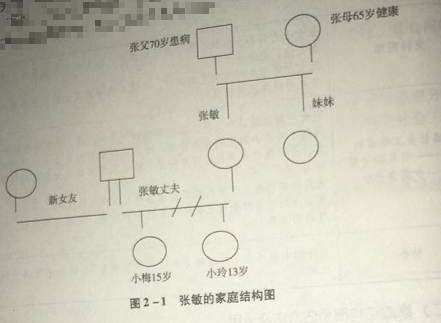
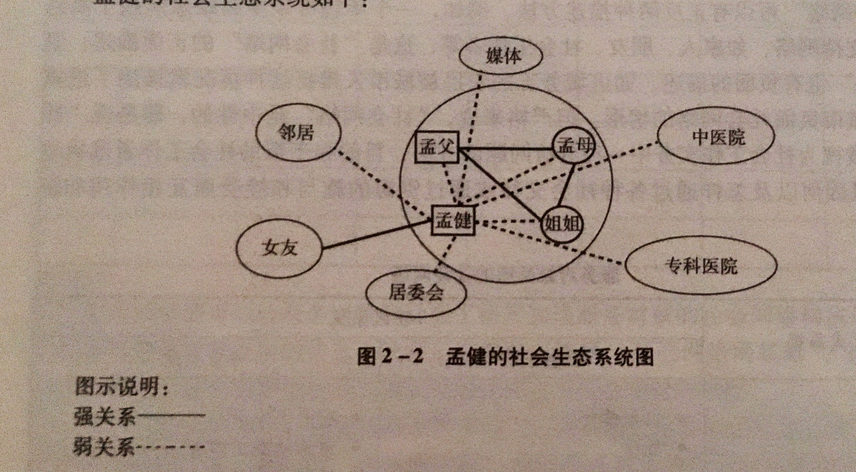
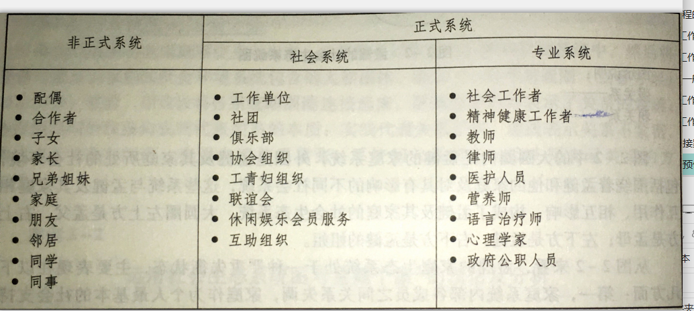
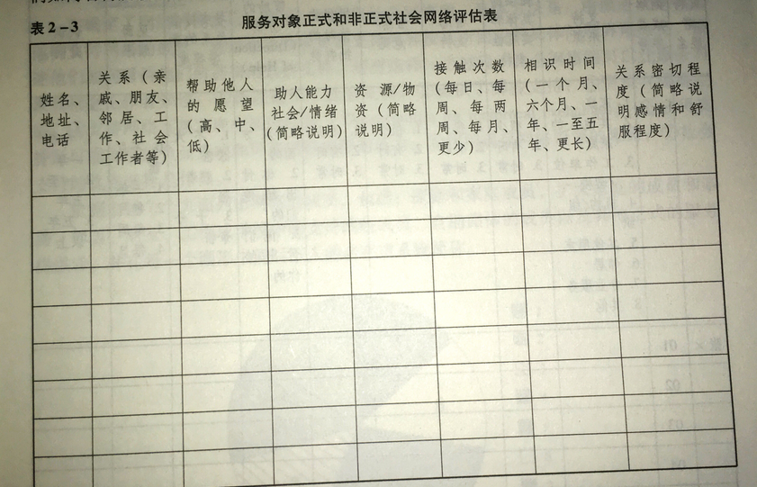
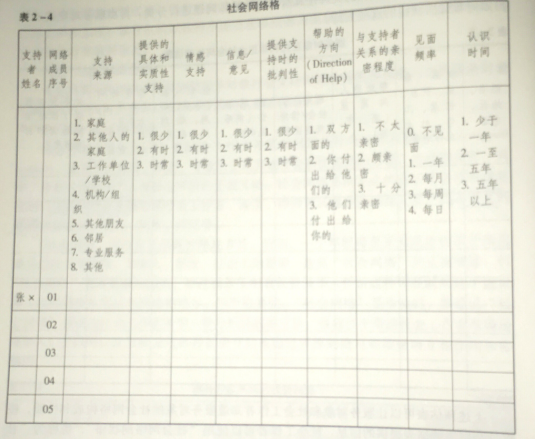
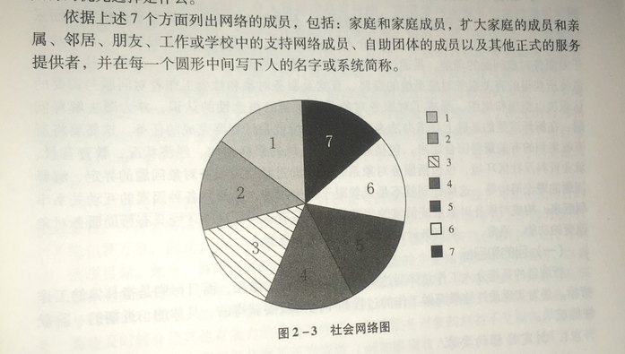

### 1. 社会工作实务通用过程
#### 1.1. 通用过程模式**（2018 简答）**
##### 1.1.1. 通用社会工作过程模式的概念
①	模式
“模式”是对现象所做的概括和总结，是以一种结构性、广泛性和一般性的方式描述事物发展运行的过程，是将现象所具有的共同元素进行提炼和概括后的一种抽象，它能够为行动提供指引。每个模式都描述了一个不断出现的问题，描述了该问题解决方案的核心要素。
②	社会工作实务的通用过程模式
社会工作实务的通用过程模式就是一种用于个人、家庭、群体、组织和社区工作的基本程序和方法，是对助人行动之基本程序和方法的概括，为社会工作者在助人过程中组织起助人思想和行动、为社会工作价值、知识和技巧的运用提供了一个框架，指示着助人活动的方向，是一个结构化的适用于所有社会工作领域和服务对象的一般性的实务方法。

##### 1.1.2. 通用过程模式的理论依据
###### 1.1.2.1. 人类行为与社会环境
人类行为与社会环境的理论是关于人的生理、心理和社会发展的理论，包括人们生活所处的各个社会环境系统的理论。重点放在个人、群体、社会和经济系统之间的交互作用上，这些知识对于社会工作者的工作实施都是最基本的，是认识服务对象需要与问题的重要理论。（狼孩、学校恐惧症、星期一上班综合征，“人在情境中”、“人与环境”交互作用的视角）

###### 1.1.2.2. 系统理论
系统论是关于研究一切综合系统或子系统的一般模式、原则和规律的理论体系，是由各部分（要素）组成的具有一定层次和结构并与环境发生关系的复杂整体，其功能取决于它的组成部分以及这些部分之间的相互关系。

（1）人类社会系统的特点
人类社会是一个复杂的大系统，每个子系统相互交叉，彼此渗透，形成错综复杂的网络。一个社会系统就是一个具有整体大于部分之和的社会组织，系统的每个部分与其环境相互作用形成稳定的社会秩序。（1+1>2）

（2）社会工作的系统视角
社会工作的系统视角强调超出服务对象自身问题来评估他们生活环境的复杂性，以及二者之间的关系，提出了关于系统的新知识，使整合社会和心理现象的概念成为可能，也使社会工作对环境由原先采取的静态观点转向一种动态的观点。
①系统视角的社会工作实务强调
a.注重个人的整体性和完整性。强调整体环境中完整的人。通用社会工作模式强调人与环境是交叉互动、相互影响的，强调整体环境中完整的人。
b.强调社会系统、特别是家庭系统在塑造和影响人的行为及生活状态中的重要作用。社会工作者努力了解个人与家庭、群体、组织和社区互动的形态和互动的规则，包括文化习俗等对人们互动的影响。
c.注重运用社会资源，包括正式与非正式的社会网络资源，帮助个人、群体、组织和社区解决问题，满足需要。
②系统视角下的社会工作实务对服务对象问题所持的观点：
a.对服务对象问题形成原因的分析不再局限于传统的疾病医疗模式或心理病理模式，即对问题的分析不再是一种个人归因。
b.对个人问题的评估，焦点不仅在于服务对象个人内在生理或心理的行为特征层面。而且涉及与服务对象问题相关的宏观、中观和微观等各层次相关的外在环境的特质、功能和运作情况。
c.服务对象问题的相关层面或系统的各部分是动态的，需要对问题进行不断的和连续的评估。
d.对服务对象问题的处理需要采取周延和连续的整合观点。

###### 1.1.2.3. 生态系统理论
（1）生态系统理论的含义
生态系统理论认为，有机体或有生命力的系统和其所处环境间维持着持续交流的关系。人们和他们所处的环境也被视为相互依赖且彼此辅助的一个整体，人和环境在这个整体里，互为对方进行持续的改变和塑造。生态系统理论认为，个体需握有取得资源的机会，否则无法建立自己的生存空间，主张人类发展是成长中的个人与其环境间长期交流的结果，而不是单一的个人特质因素的产物。
生态系统理论提出人类的发展公式是：D=f（PE），即发展是人与环境（Person in Environment）的函数，主张个人的发展是主动的、有目的和目标的，人会为自己做最好的决定及选择。
（2）生态系统理论的核心概念
①生命周期**（2016 名词解释）**
生命周期是指影响个人发展的相关社会结构及历史变迁中的生活事件对个人生活产生的意义，运用时间线方法可以重现服务对象所经历的集体历史事件。（时间线）
②人际关联
人际关联是指个人拥有与他人联结而建立关系的能力，并因此建构个人在未来生命周期中所发展出来的各种互惠性的照顾关系。
③能力
能力是指通过个人与环境间的成功交流经验，建立个人有效掌控环境的能力。具体而言，此种“能力”涵盖了从幼年生活经验发展出的自我效能感，能与他人建立有效而关怀的人际关系，有做决定的能力和自信，有能力动员环境资源及社会支持。
④角色
角色表现是一种互惠性期待的社会层面角色，而不是个人的角色期待，是个人内在历程及社会参与的桥梁，受到个人感受、情感、知觉和信念的影响。
⑤地位与栖息地
栖息地是指个人所在文化脉络中的物理及社会环境，地位是指个人在其所在的环境或社区中所拥有的成员地
⑥适应力
适应力是指在人与环境的交流过程中，人与环境间相互影响和反应以达到最佳的调和度。

（3）生态系统理论的工作切入点
①微观系统
微观系统是指个人在亲密情境下的人际关系活动形态与角色扮演；它包括影响个人的生物、心理和社会等子系统。
②中观系统
中观系统是指对个人有影响的小群体，包括家庭、工作群体和其他社会群体。中观系统分为两个层次，一为中间系统；二为外在系统。
③宏观系统
宏观系统是指比家庭等中观系统更大的群体和系统。影响个人的四个重要宏观系统是组织、机构、社区和文化。各系统层次在更宏观的文化环境和社会环境中发生关联。

（4）生态系统理论下社会工作实务的任务
社会工作实务具体应关注：
①人与环境的调和程度。即关注人与环境场的适应性、互惠性、相互性和调和度，环境对人的压力程度、人和群体的因应策略，以及环境的问题。
②环境的品质。环境包括物理和社会两方面。物理环境包括人们生活的自然世界和人为世界。社会环境包括复杂的各类科层组织，以及人际间的社会网络。
③生活中的问题。社会工作实务应聚焦于服务对象与环境交流时环境是否符合其生命任务和成熟发展的需要。

（5）生态系统理论下的整合社会工作实务
社会工作实务不仅要对服务对象进行直接的服务工作，也要对服务对象问题进行生理、心理、社会、经济、政治动力的全人系统分析与评估，同时进行个案倡导、社会政策及公共计划等宏观的间接工作，以有效地协助服务对象改善其与环境间的“调和度”。

###### 1.1.2.4. 优势视角和增能理论
（1）优势视角（能力视角）内容**（2016 名词解释 2015名词解释）**
每个人、群体、组织和社区都有其内在的能力，包括天赋、知识、社会支持和资源，只要存在适当的条件，就可以建设性地发挥自身功能。
（2）优势视角的宗旨：动员服务对象的力量（抱负、知识、能力和资源）来达到他们自己的目标和愿望。
（3）优势视角的社会工作实务强调：
①每个人、小组、家庭和社区都有优点，都有他们的内在和外在资源。
②创伤、虐待、疾病和挣扎可能是伤害，但它们也可能成为挑战和机遇。
③假定你不知道成长和转变能力的上限，认真地对待个人、群体和社区的抱负。
④社会工作者只有通过与服务对象的协作才能最好地为他们服务。
⑤每一种环境都充满资源。
（4）优势视角强调服务对象能力的提升，优势视角的社会工作实务是一个增能的过程，它鼓励服务对象的自决，支持对服务对象的尊重。增能“意味着帮助个人、群体、家庭，以及社区在其内部或周围探求和扩展其资源与手段的意图和过程”。优势视角社会工作实务目标要求社会工作者协助人们从压抑中解放自己，社会工作者的角色并不是为他人增能，而是帮助人们自我增能。

##### 1.1.3. 社会工作实务通用过程的分析范式
①	内外影响力范式
（1）含义**（2019 名词解释 2016 名词解释）**
内外影响力范式是指试图解释为什么对相同的处境每个人会有不同的反应行为，协助社会工作者理出其中的头绪，它是系统理论和生态系统理论的“人与环境”相互作用的观点的一种具体操作化。
（2）内外影响力理论的基本假设
人自身及其环境中的各种力量促成了他用某种方式行事，正是这些力量的相互作用产生了特定的行为。
（3）社会工作者可以用这个分析范式协助评估服务对象的需要和问题，制订干预计划。这个分析范式还可以帮助社会工作者进行预防性工作。

②	社会功能发挥
内外影响力范式是一个工具，它帮助社会工作者解释人在环境中不能发挥好作用的一些原因。通用社会工作实务关注个人与他人的关系，把着眼点放在个人、群体、组织和社区在不同的社会角色上的表现，考察他们的功能发挥得如何，是否有效地发挥了功能。

③	生命周期理论**（2016 名词解释）**
生命周期理论认为，人的发展都要经过几个普遍的阶段，每个阶段都是逐步攀升的，是成长的。从生命周期理论出发，通用过程模式的社会工作实务要求有系统地、全面地思考个人或者群体在成长与发展过程中所产生的问题，找出影响个人或群体的内外因素，进而给予协助，消除影响人们成长和发展的那些个人和社会因素。（流浪未成年人）

④	社会工作实务通用过程模式中的基本要素
（1）完成生命任务的条件与资源
①非正式（或自然）的资源系统
这个系统主要包括家庭、朋友、邻居、同事、亲戚等。非正式资源系统能够提供物质与精神的帮助，帮助个人获取和使用正式的社会资源。（借钱、照料）
②正式的资源系统
a.群团组织，包括工作单位、各种专业团体、群众组织及各种协会等。这些组织致力于提高人们的福利和扩大人们的权利，通过直接提供资源，帮助其成员与各种社会系统打交道。
b.社会性资源，它们是为适应社会公共生活与活动建立起来的、满足人们短期或特别需要的机构，例如学校、医院、社区机构。
以上两种资源系统组成了人们完成生命任务与履行社会角色的非正式和正式的社会支持网络，也构成了人们生活于其中的社会处境。
（2）人与资源系统的互动
社会工作对问题产生根源的认识，不是简单地归结于个人，而是认为，人之所以产生问题，根源在于人与他们所处的社会环境的互动。一般来说，人与资源系统的互动关系有三种类型：
①人在资源系统中的互动。
②人与资源系统的互动。
③资源系统之间的互动。
这三种互动关注到互动各系统之间联结的性质以及人与他们的各种资源系统之间的关系。
（3）个人问题与社会问题的关系
个人问题不但与其所处的社会情境相关，而且与社会公共问题有密不可分的内在联系，社会的公共问题是以个人问题为基础的。
社会工作不仅要为有需要的个人和群体提供服务和资源，而且要研究个人问题对形成社会问题的影响。将个人问题与社会问题的关系、社会问题对个人的影响反映和演绎出来是社会工作的责任。

##### 1.1.4. 社会工作实务通用过程模式的特点
①	通用过程模式的特点
通用过程模式将助人过程看作是一个有计划、有步骤的解决问题的过程，是一个系统的程序。
1.强调助人是一个过程
（1）社会工作只是协助人们改变现状的媒介，媒介作用的发挥离不开与服务对象的专业助人关系。
（2）改变是一种过程。改变是由量变到质变的积累过程，是服务对象逐步形成自我改变意识，达到助人自助目标的过程。
（3）改变必须是一种主动与自发的过程。改变是一种具有高度的自动性与自发性的行为，因此，必须启发与促进服务对象内心的动机与愿望，使改变成为一种自觉的行为。
2.运用综合方法
通用过程模式在理论取向上采取综合的立场，从各种知识和方法中选取最好和最适当的加以综合运用。
3.工作过程阶段化
通用过程模式将助人过程划分为逻辑上前后相连的几个阶段。通用过程模式将助人过程区分为不同阶段并不意味着助人过程是截然分开的、各自独立的。相反，分解划分的主要目的在于，显示助人过程中不同阶段的主要特点。在实际工作中，不同的阶段可以交叉和重叠。
4.工作任务阶段化
在通用过程模式中，助人的每一阶段对服务对象都是重要的，都有与之相联系的具体任务，社会工作者完成每一项任务也都需要专门的技巧。一个阶段的任务完成不好，会影响到完成下一个阶段任务的完成。
5.整合的价值观
通用过程模式整合了社会工作的核心价值观，在每一阶段的工作中都强调服务对象的参与，社会工作者对服务对象的接纳。整合的社会工作价值有助于社会工作者专业责任的履行。

②	运用通用过程模式应考虑的因素
1.助人过程各阶段的先后次序是有弹性的（危机介入）。
通用过程模式假定，社会工作者与服务对象都有面对面地接触，服务对象参与所有工作阶段。
2.工作过程可能是螺旋式的。
尽管通用过程模式的各阶段有先后顺序，但这并不是说必须完成一个阶段后才能进入下一个阶段。助人过程是螺旋式上升的，而不是直线式的，社会工作者在完成一项工作后都要看看上一个阶段的工作是否需要再进一步进行跟进。
3.模式本身只可作为实务过程的参考。
通用过程模式为社会工作者的工作方向提供重要的信息和引导；它只能作为助人过程中的路标，而不能将其看做是全部真实立体的助人场景。

##### 1.1.5. 通用过程模式的四个基本系统对社会工作实务的作用**（2016 论述）**
###### 1.1.5.1. 通用过程模式中的四个基本系统
1.改变媒介系统
“改变媒介”是指受雇于公立、志愿、非营利机构、组织和社区中的社会工作者，他是在“问题一解决”的改变过程中是促使服务对象发生改变的媒介。
在很多情况下，服务对象的改变媒介并不只是社会工作者，而是由与服务对象有关的具有不同专长的助人者所组成，形成一个“改变媒介系统”。这个媒介系统通过有组织的、结构性的工作，达到助人改变的目标。
2.服务对象系统
（1）服务对象系统是指：社会工作服务的对象，也是社会工作服务的直接受益人。服务对象系统可以是个人、家庭、团体、组织或社区。
（2）社会工作机构求助的服务对象的类型
①自己主动求助的。
②邻居、熟人、朋友介绍的。
③其他机构转介来的。
④有关司法机构要求的。
（3）“现有服务对象”与“潜在的服务对象”
①当服务对象前来社会工作服务机构求助，并已经使用社会工作服务时，即成为“现有服务对象”。（求助治疗网瘾的母亲）
②当服务对象没有求助，但可能需要社会工作的服务，或者是妨碍他人或系统社会功能的正常发挥时，他即成为“潜在的服务对象”。
3.目标系统
（1）目标系统是指为了达到改变服务对象系统的目的所需要改变和影响的系统。
（2）服务对象系统与目标系统
服务对象系统并不总是为达到改变目标而要被改变的系统，服务对象系统并不一定就等于目标系统。一般来说，目标系统大于服务对象系统，而且具有时效性。服务对象系统与目标系统有时是一致的，有时是不一致的，有时还可能是交叉的
4.行动系统
（1）含义
行动系统是指那些与社会工作者一起努力，实现改变目标的人，是社会工作者的合作者，这些人是与社会工作者一起进行改变努力的行动系统。
（2）改变媒介可以与一个或几个行动系统一道工作，完成不同的改变任务，实现不同的目标。

###### 1.1.5.2. 四个基本系统对社会工作实务的意义
1.四个基本系统帮助社会工作者识别出改变服务对象系统所必须完成的一般任务。
2.四个基本系统使社会工作者懂得需要改变的不只是服务对象系统。社会工作者不能假设求助的人就是主要的介入目标，因为服务对象系统不一定与目标系统完全吻合。
3.行动系统的规模或组成只有在确立了改变的目标系统之后才能确定。
4.由于社会工作者必须与不同的系统建立关系，所以与一个系统工作所需的知识和技巧，不一定适用于其他系统。
5.组织也是一个系统。组织作为一个系统在改变过程中常常扮演重要的角色。
社会工作者除了与个人、群体、社区工作以外，组织也会成为社会工作者处理问题时的改变目标。这要求社会工作者需要具备与组织工作所需的知识，同时也懂得如何推动组织的改变。
6.因为行动系统在整个改变过程中起着至关重要的作用，所以社会工作者也需要不断诊断行动系统的情况。

### 2. 社会工作过程的基本要素
#### 2.1. 社会工作过程的基本要素
（1）	社会工作者
社会工作者是指受过社会工作专门知识和技能训练的从事相关社会服务的实际工作与教学、研究工作的人员。狭义的理解只是那些受过专门训练的实务人员；广义的理解则应包括相关教学、研究人员。社会工作者是从事专业性助人活动的职业群体。这是社会工作专业的本质特征在社会工作者身上的体现。社会工作专业的宗旨是为有需要的人提供帮助，是通过社会工作者的努力而实现的。通过社会工作者的实际行动，帮助受助者恢复和提升社会功能，克服困难，解决问题，满足需要，并进而获得自我实现。一般而言，国际社会工作界认可的社会工作者应符合这样的条件：
1.	具有社会工作专业执照
2.	具有社会工作专业教育背景；
3.	受社会工作伦理制约；
4.	是社会工作专业组织成员；
5.	将社会工作视作一种职业生涯。

（2）	受助者
受助者（client）也称当事人、服务对象、案主等。这主要是由于西方社会工作专业首先是由个案工作发展而来的，在个案    工作中往往将受助者称为案主而造成的。近年来，不少境外学者建议用更具有主动性的“受助者”、
“服务对象”来代普看似较为被动的“案主”的称呼。案主可以是个人、家庭，也可以是群体、组织，还可以是社区乃至社会系
统。受助者是指社会工作专业实践活动直接的工作对象，社会工作的服务对象，社会工作的直接受益者。

1.受助者分类
A是否接受了服务：现有案主和潜在案主现有案主是指已经在使用或正在接受社会工作服务的人们；潜在案主是指可能需要社会工作服务或有权接受社会福利、接受社会工作服务而尚未提出要求的人员，潜在案主可以是全体社会成员。
B.来源：自动求助或自荐的案主、转介案主、外展的案主；
C.案主类型：自愿的案主、非自愿的案主、强制接受服务的案
主。
2.几种主要的受助者
个人、家庭、小组、团队、组织、机构与社区。

（3）	资源系统 **（ 2018 简答题）**
1.基本的资源系统
A.	非正式资源系统：主要包括家庭、朋友、邻居、同事、亲威等。
B.	正式资源系统：包括党派、专业团体、群众组织及各种协会等。
C.	社会性资源系统：是指为适应社会公共生活与活动建立起来的满足人们短期或特别需要的机构，包括学校、医院、各种社
会服务机构、派出所等。
2.社会支持和社会资本
A.	社会支持：人们从社会中所得到的，来自他人的各种帮助。
B.	社会资本：实际或潜在的资源的集合，这些资源与相互默认或承认的关系所组成的持久网络有关，而且这些关系或多或少
是制度化的。
C.	社会资本在社会工作中所发挥的作用
C1.激发案主潜能，帮助案主调适心理状态并勇敢应对压力，重塑案主自尊、自信的良好心理状态；
C2.帮助案主重建良好的人际关系网络，发挥社会支持系统的协助作用，与社会工作者一起帮助案主解决问题；
C3.帮助案主分析其所处微观社会资源环境中所能获得的各种社会资本，帮助他们通过正式渠道获取各种社会公共资源及服
务，如各种社会救助、社会福利、社区资源等；
C4.通过重建案主的社会关系网络系统，帮助素主实现由被动地接受帮助到主动寻找突破、解决当前问题的转变。
3.受助者与资源
在这个工作过程中，受助者的问题或困难常与其所在的环境、环境中的资源有密切关系，是由资源相应的缺乏造成的，主要有三种情况：
A.	在受助者所在社会环境中没有其所需要的资源；
B.	在受助者所处环境中虽有其所需要的资源，但受助者并不知遵而没有适用；
C.	在受助者所处的社会环境中有其所需要的资源，受助者亦了解，但因某些原因受助者无法获得这种资源。

（4）	环境
1.	社会环境：环境是指与人的活动、与人的生存发展有关的外在事物的总和，在社会工作视野中，环境一般为其中的社会环
境。社会环境指人类的生存和发展有关的所有外部社会环境的总和。
2.	社会小环境：直接生存的小环境，如家庭、学校、同辈群体等。
3.	人际关系环境：如邻里关系、同幕关系等。
4.	社会生态环境：社会中人们在环境中的生活、生活状态。如社会结构。
5.	社会文化环境：如知识、价值观念、法律、风俗等。
6.	社会环境的功能
A.	提供资源；
B.	资源竞争；
C.	资源获取中介：
D.	资源分配。

#### 2.2. 社会工作过程中工作者和受助者的关系
（1）工作者同受助者的关系
1.	什么是专业关系：所谓专业关系就是指工作者以一个专业人员的身份与各种他努力使之发生变化的系统之间所建立的关系，社会工作者与受助者之间的一种专业协助关系。

2.	专业关系的重要性
A.	专业关系是其他一切工作的基础，甚至被认为是社会工作的灵魂或基石。
B.	可以深化、增强工作的效果，增强社会工作者的影响力，使工作者提出的意见建议更容易为受助者所采纳，使工作者的工作技巧更易于见效。
C.	为受助者提供安全、有利的环境，使受助者能够有机会更好地省视自己，分析问题的原因，学习和寻找解决问题的方法
D.	在一定意义上，良好的专业关系本身对受助者的情绪和心理具有治疗作用。
E.	社会工作者与受助者之间的关系，在一定程度上影响到整个社会工作服务的成败，社工必须慎重对待。

3.	专业关系的基本特点
A.	目的性。专业关系是为专业的目的而建立的，是为了协助受助者，通过社会工作者与受助者的工作要能解决或防止个人、
家庭或社区问题，或发展受助者潜能。
B.	以受助者为本。建立专业关系是为了满足受助者的需求，在专业服务范围内，受助者利益高于工作者的利益。
C.	非平等性。在专业关系中，工作者与受助者的地位并非完全平等，双方互动以受助着为翼点。
D.	受制约性。专业关系不仅要以所要达到的社会工作目标为指导，也受专业明确且详尽的伦理道德守则制约。
E.	代表性。在专业关系中，社工代表的是自身所在机构。
F.	兼容性。兼工具性和情感性。

4. 建立专业关系的五要素
（1）与服务对象准确沟通想法与感受
（2）与服务对象沟通相互之间的资料
（3）沟通充满亲切感和关怀
（4）与服务对象角色互补
（5）与服务对象建立信任

### 3. 社会工作的一般过程
#### 3.1. 社会工作过程模式
#### 3.2. 社会工作通用过程模式 
（1）	约定阶段：工作者帮求助者逐渐成为案主并接受案主角色的过程。
1.	了解案主来源（自愿的案主、非自愿的案主、不自愿或强迫的案主）；
2.	初步评估：主要界定并确认案主问题，对照机构功能确定是否接受其为案主或转介；
3.	建立专业关系：与案主建立良好的专业助人关系是实现助人目标的重要一环；
4.	促使案主进入角色：建立专业关系同时，社工要和案主相互澄清并讨论双方对对方的期待，使双方有一致的目标，引导案主接受自己的案主角色；
5.	与案主以外的其他系统建立关系：积极同案主以外的有关系统和人员建立关系，共同合作；
（2）	评估问题阶段（清楚而又具体地了解案主和需要的时期）
1.	评估及其目的
A什么是评估：评估是依据既定情境中的事实与特点推论出有关问愿含义的暂时性结论的逻辑过程。简单来说，评估是认
识、了解案主问题的过程，包括收集与问题相关的详细资料，初步制定社会工作介入的目标和策略。评估既是了解的过程，又是了解的产物，是介入的行动基础。
B.	评估的目的：了解案主、案主问题及其环境。从而建构一个计划帮助案主去解决或消除问题。
C.	评估特点：持续性，重点是人的问题和需要；为以后制定计划和采取行动奠定基础，而不仅仅是了解情况；应有工作者和
受助者双方的参与，有计划有步骤的过程；广泛而深入，应进行横向和纵向的探索；个别化，有针对性；需要坚实的知识基础为指导；渗透了专业判断和决策。
2.	评估的步骤
A.	收集资料（案主个人方面资料、有关环境的资料、有关案主与环境相互作用的资料）；
B.	分析和解释资料（将整体分解为部分，以发现整体的性质、目的和作用，解释资料是努力阐明某事物的含义或使之更容易
理解，以便更好了解案主的处境）；
C.	认定案主的问题（是什么，为什么，怎么做）D.作出评估报告（一是资料和事实，二是专业判断）
（3）	计划及合约阶段（在分析评估的基础上制定社会工作目标和计划，并以合约形式与案主取得共识，明确工作者和案主同意的目标和责任）包括计划（指导介入行动的整体计划）和订立合约（工作者与案主达成协议，以便计划的发展互有承 诺）计划是一个理性思考及做决定的过程，包括制定目标、选择为达到目标而采取的行动（案主同工作者一起）
1.	计划的内容
A.	目的和目标：目的是期望在介入阶段最终总体上要达到较为笼统的，长远的方向和结果；而且目标是较为具体的，近期的
结果和指标）
B.	目标的要求：
第一，对案主而言清楚、明白、易懂：
第二，现实可行性；
第三，详细、具体而不空泛，太空泛的目标无法实现；
第四，要有完成任务的时间限；
第五，与案主能力、机构功能相一致。
C.	关注对象（即介入行动中要加以改变的系统）：
第一，当案主问题归结为个人时，或案主选择作出改变时，可以以个人为关注对象；
第二，当案主问题为主要与家庭有关；
第三，当事实表明群体对个人有极大影响或群体面对类似问题；
第四，虽组织、机构的存在为满足人的需要，但有时组织的政策结构或工作不能满足服务对象的需要。
D.	介入的策略：包括，解决问题的方法、技巧：为实现计划的目的和目标；工作者要承担的角色；需要完成的任务；案主需
要承担的义务。
2.	制定计划的原则：
A.	详细具体；
B.	具有可行性；
C.	与工作目的、目标相符；
D.	能够总结和度量。
3.	合约：是工作着和案主为解决问题而共同投入努力的承诺，体现了工作者与案主之间的互动合作关系，本质上，是双方间的明确协议，是一种约束机制。
合约内容：计划的目标和目的；工作者和案主各自的角色和任务；为达到目的和目标所要采取的步骤、方法、技巧；期望达到的结果及总结；测量的方法。
 
（4）	工作介入阶段
也称行动阶段，执行阶段或改变阶段。是社会工作者运用专业知识、方法和技巧，协助案主按前一阶段达成的社会服务计  划、合约开展工作和采取行动阶段、助人过程的重要阶段。介入的目的是为了界定和解决问题，促使案主成长，提高人们的生活质量。
1.	社会工作介入的特点
A.	社会工作介入是有目的有计划的行动，目的是实现双方共同制定的计划；
B.	是采取行动的，也可以是不采取行动的；
C.	可以是实质性的，也可以是非实质性的。

2.	社会工作介入策略
A.与案主一起行动（帮助案主认识和运用现有资源；对案主进行危机干预、危机调适；运用活动帮助案主）
B.代表案主采取行动
B1.争取有影响力的人士参与工作，共同为实现社会工作目标而努力；
B2.协调各种服务资源和系统，将它们连接起来，以达到服务的目的；
B3.发展、创造需要，满足案主需要；
B4.改变案主所处环境，从而达到服务的目标；
B5.改变组织和机构；
B6.集体倡导

（5）	评估总结及结束阶段
1.	评估总结的目的和内容
A.	目的：
第一，帮助工作者进行反思工作进程，总结得失，提升服务质量； 
第二，帮助案主回顾改变的过程，检查双方同意的目标是否实现； 
第三，向机构交代。
B.	内容：
第一，制定的目标是否恰当，是否有效达到； 
第二，工作方法和技巧是否运用得当；
第三，工作者任务和角色的完成。
2.	巩固案主已有的改变
A.	帮案主回顺工作过程，进一步帮案主学会如何解决问题；
B.	强调案主已取得的成绩，增强信心；
C.	假设一些问题，同案主讨论解决方法，给予必要的指导；
3.	终止、解除工作关系：转介、转移、终止。

##### 3.2.1. 接案
（一）接案的含义 **（ 2012 名词解释 2018名词解释）**
所谓“接案”，是指社会工作者开始与服务对象接触时的第一步工作，包括社会工作者与服务对象就社会工作者角色和服务对象的需要展开的沟通，包含了社工如何与服务对象开展工作的知识和技巧。成功的接案是专业助人活动的前提。

（二）接案的意义、目的：
（1）	澄清社会工作者与服务对象双方的期望和义务；
（2）	激励服务对象；
（3）	促进和诱导服务对象的改变；
（4）	影响后续工作关系；
（5）	影响今后的互动。

（三）接案阶段的主要任务：
（1）	了解服务对象的来源：主动求助的、他人转介的、由社工主动接触而成为服务对象的
（2）	认定服务对象的类型：自愿型服务对象、非自愿型服务对象、不自愿或被强制接受服务的服务对象
（3）	了解服务对象的求助过程
（4）	使潜在服务对象成为现有服务对象
（5）	与服务对象初步建立专业关系

（1）界定服务对象的问题。对服务对象问题的界定是通过会谈来进行的。社会工作者要注意，服务对象自己对问题的看法是界定问题时最重要的起点，因此，在使用沟通技巧与服务对象会谈时，服务对象所关心的问题、他们的困惑即是界定问题的入手点。这时的主要工作包括：
①了解服务对象寻求帮助的原因。了解他们生活中发生了什么使得服务对象需要求助。
②了解服务对象对自己的看法。
③了解服务对象期望达到的目标。
（2）澄清角色期望和责任。面谈的一个重要任务是澄清社会工作者与服务对象的期望和应尽的责任，通过协商减少差异，同时要互相澄清并讨论双方对对方的角色期望。包括：
①服务对象对自己的角色期望、对社会工作者的角色期望；
②社会工作者对服务对象的角色期望、社会工作者对自己的角色期望：
③对比并找出双方与各自想法的是异和距离：回协商并达成一致的看法。
（3）激励并促进服务对象进入受助角色。接案面谈是建立社会工作者与服务对象专业关系的开始，此时，社会工作者要帮助及引导服务对象逐渐接受自己的角色，以便双方能够相互配合工作，包括：
①进行角色引导；
②训练并帮助服务对象逐渐接受其角色。
（4）促进和引导服务对象态度和行为的改变。接案面谈时双方的良好沟通会成为激励服务对象改变的动力。当社会工作者和服务对象为改变态度和行为所进行的努力出现效果时，服务对象解决问题的动机也会得到强化。
（5）达成初步协定。经过以上的初步接触，社会工作者与服务对象对对方已有了一个基本的了解，此时社会工作者与服务对象就可以达成一个初步的协议。内容包括：机构和社会工作者可以提供的服务；对服务对象问题的初步界定；相互的角色期望及暂定的工作时间长度。
（6）决定工作进程。它的主要内容包括；
①终结服务；
②转介其他服务；
③进入下一个助人阶段。

（四）接案的步骤及核心技巧
（1）	做好面谈的准备并拟定初次的面谈提纲
1.	资料准备：包括研读服务对象的资料，了解其是否接受过服务；了解身体和精神健膝状况；走访社区，通过服务对象的社会网络来了解服务对象个人和社会处境两方面的情况；了解服务对象是否有特殊事项需要谨慎小心处理，例如，服务对象是否存在精神健廉方面的问题，因而需要对之进行预防等。
2.	拟定面谈提纲：提纲的内容一般包括
A.	介绍自己和自己的专长
B.	简要说明本次会谈的目的和内容、双方的角色和责任
C.	介绍机构的功能和服务、相关政策（如保密原则）和工作过程
D.	征求服务对象对会谈安排的意见，了解对机构和社会工作者的期望
E.询问服务对象是否有需要紧急处理的事情，以便提供及时的协助

（2）	面谈/会谈
1.	面谈的目的：社工同服务对象之间一个面对面地讨论以确定是否建立专业协助的关系，同时也是一种有意识、有目标的人际互动。

2.	面谈的主要任务：
A.	界定服务对象的需要和问题：
A1.了解服务对象寻求帮助的原因；
A2.了解服务对象对自己的看法；
A3.了解服务对象期望达到的目标。
B.	澄清角色期望和责任；
B1.激励并帮助服务对象进入受助角色；
B2.促进和引导服务对象态度和行为改变。

3.	面谈的技巧
A1.主动介绍自己；
A2.沟通：
A3.倾听。

4.	面谈中回应服务对象的方法
A1.对服务对象的想法与反应有透彻的了解；
A2.将自己与服务对象融合；
A3.敏锐地感觉服务对象的各种情绪态度及反应；
A4.向服务对象表达愿意协助的态度。

5.会谈中面临的问题和挑战
（1）留意服务对象对接受社会工作协助的看法并进行适当处理。
无论是自己主动申请帮助还是别人介绍或由他人确认转介来的服务对象，当他们决定接受机构提供的协作时，就会从前在的服务对象转为实际的服务对象。辨别服务对象的类型，弄清楚服务对象是如何来社会工作服务机构求助的，是接案前重要的准备工作，也是接案的第一步。
（2）中国人有困难时首先是向非正式的社会网络和组人系统求助，因为他们是服务对象生活中的“自己人”。
而作为社会工作者，是不清自来的，对于这样一个“外人”服务对象表示怀疑或挑剔是一种正常和自然的态度反应。事实上，从社会工作专业知识来看，这些反应恰好表现出服务对象具有良好“自我强度”。此时社会工作者首先要说明来意并表达热诚帮助的意愿。
（3）时刻保持对服务对象的敏感性。
由于经常要面对人们生活中的负面经验，这种职业特性很可能会使社会工作者对服务对象失去敏感性。
（4）要记住，在与服务对象一起分析反面实践和作评价时，实际是它们作为要解决的一个问题提出来的。

（3）	收集资料
1.资料收集的范围和内容
A1.个人资料：年龄、性别、籍贯、教育程度、家庭情况、婚姻状况、职业、收入状况等。
A2.身体情况；
A3.服务对象特点和能力：
A4.服务对象所处的社会环境。
3.收集资料的主要方法：亲自向服务对象询问；向服务对象的相关人进行咨询：查阅服务对象档案记录；进行家访。

（4）	初步预估
界定并确认辅导下的问题，对照机构功能看是否能够处理。通过了解服务对象对问题的看法看服务对象是否愿意由社工协助。

（5）	建立专业关系
1.	什么是社会工作专业关系
社会工作专业关系是社会工作者与服务对象之间态度与情感的互动，目的在于帮助服务对象与环境之间达到更适应的合作关系。
2.	社会工作专业关系的功能
专业关系的本质是，提供了服务对象与社会工作者之间一种有意义的联结，激发了服务对象的学习动力，使得服务对象愿意利用社会工作者的协助，自觉接受社会工作者的影响。专业关系能使工作过程有计划、有目标、有亲切感，成为促进服务对象改变的动力。
3.	社会工作专业关系的特点
①目的性。专业关系是为专业的目的而建立的，它的建立是为了协助受助者，即通过工作者与受助者的工作要能解决或防止个人、家庭或社区的问题，或发展受助者的潜能。专业关系具有一定的时间限制，是一种暂时性的工作关系，当受助者的问题得到解决后，双方关系建立的前提消失，关系必须结束。
②以受助者为本。从本质上说，建立专业关系不是为了工作者的需求，不以社会工作者自身的利益为前提，而是为了满足受助者的需求，在专业服务的范围内，受助者的利益高于工作者的利益。
③非平等性。在专业关系中，工作者与受助者的地位并非完全平等。双方的互动，以受助者为重点，受助者一般要提供必要的个人资料让工作者能够多方面地了解，从而使社会工作者的协助是有效的，而工作者则不必这样做。需曲标横寒的据熟新处间激束购人体改享
④受制约性。专业关系不仅要以所要达到的社会工作目标为指导，也受本专业明确而详尽的伦理道德守则制约。
⑤代表性。在社会工作者和受助者的专业关系中，社会工作者并不是代表自己，而是既代表着自己所工作的社会工作机构， 也代表着所从事的社会工作专业。
⑥兼容性。专业关系是兼工具性和情感性的关系。良好的专业关系是双方信任的基础，专业关系是带有目的的，即通过良好关系的建立来实现工作目标，这是其工具性之所在；同时良好的关系本身离不开双方情感的交流和表达，这样专业关系就具有了情感性的色彩。因此，它是一种兼容性的专业关系，兼有工具性和情感性两方面的特征。
4.	建立专业关系的技巧
同感、诚恳、温暖与尊意、积极主动

（6）	决定工作进程
1.	终结服务：机构缺乏合适的工作人员；服务对象问题不在机构功能范围内或其他机构资源服务更优；其他机构有处理特定
服务对象或问题的特权；服务对象不愿接受服务、机构功能不符合对象需要、已经解决问题；服务对象对问题的看法和期望与社工所能提供的不相符（不能解决问题）；社会工作者所能提供的服务不能解决问题；服务对象没有充分的动机投入必要的时间、力量和资源。
2.	转介其他服务：转介可以是正式的，也可以是非正式的。
3.	进入下一个助人阶段：如果服务对象与社会工作者对问题有共识，服务对象又愿意由和社会工作者提供协助，那么接下来
就要对问题的轻重缓急与先后顺序进行讨论，开始进入下一个阶段的工作。

（7）	签订初步的服务协议服务协议内容包括：
1.	对服务对象问题的初步界定；
2.	机构和社会工作者可以提供的服务；
3.	相互的角色期望及暂定的工作时间长度。

（五）影响接案成功的因素
（1）	社会工作者与服务对象的期望不一致；
例如，有些流浪儿童希望社会工作者给他们提供刮风下雨时的临时住所，而社会工作者却希望将他们安顿下来，并提供必要的教育，帮助他们回归家庭、回归社会。在这种情况下，社会工作者与服务对象的期望不一致，如果双方不能调和，就不能成功接案和提供后续
服务。
（2）社会工作者的能力不足以提供帮助
例如，当服务对象患有精神疾病，而社会工作者没有相关的专业训练时，就要将服务对象转介给其他相关的专业服务机构。
（3）临时事件和外部障碍
例如，当遇到服务对象搬迁、患病、被捕时，或服务对象的家人不愿接受服务，就有可能使服务中断。
（4）服务对象不愿接受帮助
有些服务对象对接受社会工作的协助存有偏见，不信任机构。有些服务对象认为，接受服务就意味着自己没有能力，因此拒绝受助。
（5）社会文化因素
社会文化对求助与受助的观念和看法也是影响能否成功接案的因素。因此，在初步接触、了解潜在服务对象成为正式服务对象的过程时，要特别注意了解服务对象的感受，即服务对象是如何看待助人与受助的。在接案阶段，了解服务对象对助人与受助的态度与观念对帮助其接受社会工作服务具有指导意义，即社会工作者要有策略地引导当事人成为服务对象。
（6）不同专业间的配合出问题
当服务对象需要接受不同专业的服务时，社会工作者要协调不同专业的工作，避免重复当服务对象需要接受不同专业的服务，或者相互竞争。不同专业会因争取服务对象而竞争，导致服务对象无所适从，最终终止专业关系

二、避免过早终止关系的策略。
1.增进彼此关系。在接案中与服务对象建立融洽的关系。避免过早终止关系，而不能从成功结案。增加关系的三个要点是信任服务对象，对服务象有吸引力和运用专业知识。
2.订立明确的接案工作指引。在接案过程中，社会工作者要让有关各方有机会表达自己的想法，期望和要求,并进行相互协商。如果人们清楚自己的角色和参与的原因，就能调整自己，投入助人的过程之中。当服务对象不了解服务的目标和意义时，便有可能退出或者放弃，所以建立明确的接案工作指引有助于成功结案。
3.订立初步协议。有些服务对象对社会工作者的协助抱有怀疑态度，所以接案时社会工作者要尝试与其订立短期初步协议，而不要求服务对象给予长期承诺，防止他们有畏难情绪，使服务对象逐步接受社会工作者的协助。
4.回应服务对象的迫切需要，要成功结案就要关注服务对象的当前需要。使其对社会工作者的协助产生信心和信任。例如，长期遭受丈夫暴力的妻子迫切需要一个安全的居住场所，如果此时社会工作者忽略他的需要，而将工作重点放在对夫妇婚姻关系的辅导上，就有可能使妻子觉得社会工作者不能提供她所需要的服务，接案就会遇到困难。
5.运用网络资源。社会工作者不是解决所有问题的专家，帮助服务对象需要不同系统和专业的协同工作。在接案阶段，如果社会工作者能能与不同系统和专业的人一同工作，获得他们对服务对象的支持，就能够增强服务对象对社会工作者的信任和对解决问题的信心，从而成功接案。例如，为解决社区脏乱差问题，社会工作者发动城管、清洁、规划部门一同与社区居民工作时，就比较能够得到居民的信任，增强他们解决问题的信心，从而顺利建立关系。
6.不断给予鼓励。对于求助和受助动机不强的服务对象，社会工作者要不断给予鼓励，得到鼓励的服务对象，其受助的意愿也会增强。

（六）接案时应注意的事项
（1）	决定是否需要紧急介入
并非每个案例都是从接案开始的，社会工作者要辨别服务对象问题的迫切性和严意程度，从而决定何时、如何开始工作。如果遇到紧急情况（如自杀、性暴力问题）时，就需要社会工作者直接进入千预程序。例如，对离家出走的孩子来说，社会工作者需要及时将他们安置在儿童保护中心；对发现有被虐待危险的孩子，则要提早进行预防。
（2）	权衡是否有能力处理问题
服务对象的需要是多方面的，接案面谈提供了机会使社会工作者通过与服务对象的沟通交流来了解他们的需要，权衡是否有足够能力提供服务对象所需服务。如果自己的价值观和专长与之有严重冲突并影响自己对他们的态度和行为时就要及时进行转介。此时通常应向机构的督导、行政领导报告，由他们安排合适的人选或者机构为服务对象继续提供服务。
（3）	决定问题的优先次序
很多时候服务对象的问题不只是一个，故需要协助他们理出问题的轻意缓急，以便能及时满足他们的需要，同时使服务更有效果。社会工作者需要与服务对象共同决定优先次序，要尊重服务对象的意向，使其愿意努力做出改变；先易后难，这样既能增强服务对象的信心，又使其认识自己解决问题的能力，从而成功与他们建立专业关系。
（4）	保证服务对象所要求的服务符合服务机构的工作范圈社会工作者要保证满足服务对象的需要，不因机构和社会工作者
的原因阻碍和延迟服务对象需要的满足而致使问题延铁或者恶化。例如，在现实情况下，一个非营利机构是不能为服务对象提供最低生活保障服务的，对于那些希望通过机构获取生活救助的服务对象社会工作者要向他们说明情况。

##### 3.2.2. 预估
（一）预估的概念 **（ 2013 名词解释）**
所调你预估，即是收集与服务对象有关的详细资料、了解服务对象问题形成的过程，是依据既定情境中的事实与特点推论出有关服务对象问题含义的暂时性结论的逻辑过程。换句话说，预估就是收集资料和认定问题的过程，是把所有有关服务对象的资料组织起来并使其具有意义的专业实践活动。

（二）预估的目的：
（1）      识别服务对象问题的客观因素；
（2）      识别服务对象问题的主观因素；
（3）	识别服务对象问题的成因与使问题延续的因素；
（4）	识别服务对象及环境中的积极因素：
（5）	决定提供服务的方式和内容。

（三）预估的任务
（1）	了解服务对象存在的问趣，问趣的性质、成因、程度及对服务对象的影响；
（2）	了解服务对象个人生活经历及行为特征，包括服务对象的人格特征、能力、优势弱点；
（3）	了解服务对象与环境的互动状况，及其对自身问题的认识和改变的动力和能力；
（4）	了解服务对象所处环境系统的状况，从中找出有利于和不利于服务对象改变的因素。

（四）预估的特点
（1）	持续性：预估是一个动态、持续和有焦点的过程。
（2）	社会工作者和服务对象共同参与。
（3）	行动取向。
（4）	有可识别的步骤。
（5）	渗透了专业判断。
（6）	有局限。

（五）预估的原则
（1）	个别化原则；
（2）	合作原则；
（3）	避免片面；
（4）	避免简单归因；兼顾服务对象的弱点和长处。

（六）预估的基本步骤
（1）	收集资料
1.	个人资料的收集：基本资料、主观经验、解决问题的动机、生理情感和质量方面的功能发挥。
2.	环境资料的收集：家庭状况；社会环境。
3.	交互作用。
4.	收集资料的方法：询问（会谈、角色扮演、问卷）、咨询、观察、家访、利用已有资料。
（2）	分析和解释服务对象的资料和问题
    1.排列次序
    2.发现问题
    3.识别原因
    4.对服务对象的问题与需要作出解释
    
（3）	认定问题
    1.描述服务对象的问题和需要
    2.描述问题是如何发生的及发生的原因
    3.描述服务对象的处境及其社会系统的情况
    4.探究服务对象问题得不到解决的原因
    5.描述服务对象系统的发展阶段
    6.描述并鉴定服务对象系统的资源状况
    
（4）	撰写预估报告
    1. 注意事项
        a.确定报告的目的和读者
        b.确定报告应使用的资料
        c.将资料组织成为有意义的不同部分
        d.将事实与判断分开
        e.语言精简精练

   2. 结构
        a.资料和事实
        b.专业判断
            b1.对资料的理解
            b2.对服务对象问题的评估
            b3.对形成问题原因的分析，对问题原因的理解和解释
            b4.判断改变的可能性与益处

（七）预估的主要方法
（1）	社会历史报告方法
是通过对服务对象社会生活历史的梳理、将各种信息进行整理分析后的综合报告。包括：服务对象社会生活历史的资料及社工对这些资料的思考和预估。
    内容包含：
    a.服务对象系统的资料
    b.服务对象关系的事项、需要、与需要相关的问题，以及这些事项的发展过程
    c.服务对象现在的能力和限制等。

（2）	家庭结构图描述方法 **（ 2017 名词解释）**
家庭结构图也称家庭树或家庭图谱，是以图形来表示家庭中三代人之间关系的方法。可以直观地提供有关家庭历史、婚姻、伤病等重要家庭事件、成员间的沟通和互动状况等重要信息，帮助社工了解服务对象的家庭模式，服务对象在家庭中所处的位置，以及家庭服务对象的影响等。

1.家庭结构图的内容：
    一、表达家庭的历史
    二、提供有关家庭婚姻、死亡、家庭成员所处的地位和位置、家庭结构等于服务对象有关的摘要式信息
    三、包含家庭几代的关系资料，提供服务对象的家庭关系、资源、问题与家庭间关系等资料

2.表现方式
    1. 方形表示男性，圆形表示女性
    2. 线段表示家庭成员的关系形态或者婚姻状况：
        a.实线代表已婚，虚线代表未婚
        b.粗细代表关系的紧密与不紧密。
    3. 夫妇分居用 / 离婚用 //
    4. 孩子以出生时间从左到右排列，死亡的家庭成员在方形或圆形图上用“x”表示
    5. 还可以在每个图示上标出家庭成员的名字和年龄
    6. 可以用一些简单的符号记录家庭生活中的重大事件

（3）	社会生态系统图方法**（ 2015 简答题）**
社会生态系统图也简称为生态系统图，是根据第一章通用过程模式的理论基础之——生态系统理论发展出来的。有效将服务对象与外在环境系统的关系通过图形的形式呈现出来，说明了系统之间能量的流动和各系统间的关系本质，以及上述关系与服务对象需要和满足需要的资源系统、服务对象问题之间的关系。

1.生态系统图的功能
    a.描述服务对象的社会功能
    b.以直观的方式呈现服务对象与这些系统的关系
    c.勾勒出系统间的交流
    d.呈现可使用资源的相关信息

2.绘制方法
    a.首先用圆圈将其家庭系统表示出来，并将服务对象置于圆圈的家庭系统中
    b.将服务对象及其家庭的社会环境系统包含的人和团体、组织、机构等用圆圈（或者方形）表示出来
    c.用线段将各系统即圆圈连接起来，圆圈间的距离表示了关系的亲疏
    d.连接圆圈间的线条构成则代表关系的本质（实现代表关系紧密，虚线代表关系不紧密，曲线代表关系有问题、有张力或关系紧张）
    e.系统间关系线条的箭头表示关系的方向性。

（4）	社会网络分析
社会网络在社会工作实务范畴里泛指社会支持系统，通常指由家庭、朋友、专业人员或其他社会系统提供的帮助指导和关怀。
其中，社会支持是指个人与社会环境的正面互动。社会网络是由正式和非正式系统组成的，正式的社会系统包括社会工作者、医生等，非正式的社会支持网络包括家庭、朋友等

1.社会网络评估工具
（1）.社会网络评估表
    方法：
    a.首先由服务对象找出他们支持网络的成员
    b.然后将支持网络成员和他们提供的支持按其所回应的具体问题进行分类
    c.再由服务对象描述他们所获得的这些支持
    

（2）社会网络格
    方法：
    1.询问服务对象社会网络有关的问题：网络可提供或从网络得到的支持类型；网络关系交流的程度，网络成员对服务对象的重要程度，关系的亲疏程度，接触的频率，关系维持的时间长度
    2.将上述问题写在提示卡上，请服务对象依据如下标准：从未、很少、有时候、总是，描述所获得的社会支持的状况。
    3.将这些内容汇总，填到网状格中，即可绘制出服务对象的社会网络格，并用之预估服务对象的社会支持。
    

（3）社会网络图
方法：
    a.由服务对象找出他们支持网络的成员
    b.将支持成员和支持内容按其所回应的具体问题界限分类，描述他们如何看待他们所获得的这些支持。
    

##### 3.2.3. 计划
（一）什么是服务计划
服务计划是基于对服务对象问题的理解，是通过预估阶段的探索获得的。

（二）服务计划的构成
（1）	目的和目标指定目标的要求：
1.	内容明白易懂，重在促进服务对象的成长；
2.	目标要可测量；
3.	目标要有可操作性和现实性；
4.	应说明完成目标的时间；
5.	目标要与机构功能和社工能力相一致，并符合法律。
（2）	关注的问题和对象
1.	问题：社会工作介入工作要关注的问题，是指介入工作要加以处理、以改善服务对象社会功能的问题。
2.	对象：个人、家庭、小组/群体、组织、社区。
（3）	介入策略
（4）	协同工作的合作者
（5）	社工与服务对象各自的角色
（6）具体工作程序及工作时间表

（三）制定服务计划的原则
（1）要有服务对象的参与
（2）	要尊意服务对象的意愿
（3）	计划要尽可能详细和具体
（4）	要与工作的总目的、宗旨相符合
（5）	要能够总结与度量，为评估打好基础

（四）制定服务计划的方法
（1）	设定目的和目标
“目的”通常不可测量，是服务对象对想要达到的境界的宽泛的、总体性的陈述，是社会工作者和服务对象通过努力期望最终
达到的总目标。为了完成这个总目标，需要设定很多具体目标，这些具体目标是现实可行的，并且是可以测量的。
1.	确定服务对象的需要和问题：再次确认双方对问题和需要的理解与认识，以使计划有的放矢并增加服务对象行动决心。
2.	向服务对象解释设定目标的目的：通过解释来让服务对象了解设定目标的意义，对目标产生认同和积极正向的行动反应。
3.	共同选择适当的目标
A.	筛选目标。一同找出期望达到的初步目标并对各个目标进行讨论，以决定具体的目标。
B.	定义目标。在目标筛选出来后将目标界定清楚，以具体、可操作的指标定义目标，以利于目标的执行。
4.	目标陈述要明白易懂，重在促进服务对象的成长
5.	目标要可测量、具有操作性和现实性：要考虑服务对象的动机和能力、能够投入的精力和时间，以及社会工作者的专长等
因素。
6.	与服务对象讨论目标的可行性和可能的利弊
7.	确定目标并决定目标的先后次序

（2）	构建行动计划
1.	选择介入系统
“系统”是指社会成员之间的相互交流域，如夫妻、家庭、邻居、医息关系、小组、机构、照顾系统等；也包括由这些交流引
发的生理、心理过程，如思维、情感等。社工选择介入系统的根据是对服务对象需要与问题预估的结果，包括根据对服务对象正式和非正式社会网络与支持系统的分析，来选择和决定正式和非正式社会网络与支持系统的介入策略。一般来说，社会工作的介入系统可以分为个人、家庭、小组、社区以及宏观社会系统。
2.	选择介入行动
A危机干预。当服务对象遇到突发性事件时，如失业、疾病或天灾人祸等问题发生时需要社会工作者立即进行干预，包括通
报相关机构、安置和安抚服务对象、进行物资救援等。
B.	资源整合。制订计划时，社会工作者要根据服务对象的需要和问题说明要建立和申联的资源网络，包括服务对象需要哪些
资源、谁能提供这些资源、如何动员资源以及什么时候和怎样使用资源等。
C.	经济援助。常规性的经济援助包括对低收入的服务对象给予正式制度性帮助。临时性经济援助是当服务对象出现特别需要
时提供的帮助，如紧急医疗救助、特别教育补助及临时性的物质帮助，以及从非正式社会网络和资源系统获取的资源等。
D.	安置服务。这类服务是指将服务对象带高原有生活场所进行暂时或善代性安置的服务，根据时间的长短分为暂时性安置、
短期安置、长期安置和永久性安置。根据安置场所包括儿童福利院、寄养家庭、领养家庭、少年管教所、养老院、日间照顾中心、戒毒所、精神病院、疗养院、社会救助站等。
（3）	签订服务协议
1.概念：服务协议也称为服务合同、工作契约等，是社工与服务对象经过讨论协商所达成的满足服务对象需要和解决他们问
题的工作方案，是双方解决问愿的承诺，是社工与服务对象之间的合作计划，体现了双方的伙伴关系。

2.内容：
A.计划的目的与目标；
B.双方各自的角色和任务；
C.为达到目的和目标所采取的步骤、方法和技巧：
D.期望达到的结果，以及进行总结、测量和评估的方法。

3.	特点和制定原则
A.明确性
B.得到认可
C.具有弹性
D.具有实用性

4.签订服务协议的技巧
    a.认定服务对象对问题的看法
    b.与服务对象分享对问题的看法
    c.描述为之工作的问题
    d.确定目的和目标并说明行动的具体策略
    e.总结和强调协议的主要内容

##### 3.2.4. 介入
（一）介入的概念：介入也称社会工作的实施、行动、执行和改变，是社会工作助人过程中的重要阶段。

（二）介入的特点：
（1）	介入是有计划、有目标的行动；
（2）	干预是介入的核心；
（3）	物质帮助和精神支持并重；
（4）	介入有短期效果和长期效果。

（三）介入的分类
（1）	直接介入
以个人、家庭、群体、组织和社区为关注对象，针对他们所采取的行动，重点在于改变服务对象家庭或群体内的人际交往， 或改变个人、家庭和群体与其环境中的个人和社会系统的关系和互动方式。
（2）	间接介入
以个人、家庭、小组、组织和社区以至更大的社会系统为关注对象，由社会工作者代表服务对象采取行动，通过介入服务对象以外的其他系统间接帮助他们的行动。
（3）	综合介入
社会生态系统理论认为，问题的出现和产生并不完全是“人”本身的原因，人们的生活“环境”在其中也扮演着重要角色。从这种“人与环境”互动的视角出发，社会工作将介入焦点放在两个环节：一是增强个人的生活适应能力；二是增加社会和物理环境对个人需要的回应，包括环境的改变和政策的倡导与实施。这种从人与环境两个环节进行介入的策略构成了将直接实务活动和间接实务活动结合在一起的综合介入行动，是对各种与服务对象系统有关的系统进行的介入，体现的是一种综合治理的理念。

（四）介入的原则**（2017  简答题）**
（1）	以人为本、服务对象自决
（2）	个别化
（3）	考虑服务对象的发展阶段和他们的特点
（4）	与服务对象相互依赖
（5）	瞄准服务目标考虑经济效益

（五）直接介入的行动及策略
1.促使服务对象运用现有资源
（1）帮助服务对象运用自己的内在资源，以达到改变的目标。在这里，社会工作者主要扮演辅导者、促进者、提供意见者和教育者的角色。
（2）帮助服务对象运用现有的外部资源。运用外部资源的目的是将服务对象系统与资源系统联结起来以增强服务对象的社会功能。

2.进行危机介入
危机介入是一种特殊的介人，目的在于去除服务对象的紧张情绪，恢复功能，使他们走出危机。
危机介入的技巧包括：
（1）将焦点放在帮助服务对象恢复和发挥功能上，而不是解决整个问题。
（2）帮助宣泄由危机带来的紧张情绪，给予支持，以防精神崩溃。
（3）介入目标要现实。
（4）担任教导角色，包括告诉服务对象应该做什么，同时也为他们做一些力所能及的事。

3.运用活动作为介入的策略
活动是指针对某些既定的目标或者任务的行动。社会工作者运用活动作为帮助服务对象的介入行动，协助他们发展某些特别的社会技能，达到解决问题的目的。
运用活动作为介入策略时，要考虑下列因素：
（1）介入目标。活动只是达到目的的手段，而不是目的本身，所以，活动一定要与介入目标相吻合。
（2）服务对象的情况。活动要符合服务对象的能力和特殊需要。
（3）资源和设备的配合。开展活动需要场地、资金和设备，所以活动要与机构的能力和资源条件相配合。

4.调解行动
调解行动是指社会工作者帮助服务对象与环境中的系统一起找到利益共同点、从而带来改变的介入策略。调解的重点是通过服务对象与环境系统的互动，消除冲突，满足共同需要。
进行调解介入时，社会工作者要做到：
（1）帮助服务对象与环境系统进行接触。
（2）协助环境系统回应服务对象的需要。
（3）协助双方界定共同目标。

5.运用影响力
为有效帮助服务对象，社会工作者要有意识地运用各种能够影响服务对象改变的力量，包括：诱导、劝导、利用关系、利用环境。

（五）间接介入的行动及策略
1.运用和发掘社区人力资源
社会工作者代表服务对象争取社区资源时，常用的方法是让社区内有影响力的人物参与。
运用社区人力资源时的主要技巧包括：
（1）识别谁是有影响力的人。
（2）具有与“有影响力”的人建立关系、与服务对象一道工作的技巧。
（3）具有说服和游说、令人信服的陈述和表达技巧。
（4）把握工作目标的技巧。

2.协调和连接各种服务资源
与系统在一个地区内能够为服务对象提供服务的常常不止一个机构或者组织，但它们都各有自己的助人计划。因此，社会工作者需要将这些服务资源进行协调，并注意掌握一些原则。
协调服务时，社会工作者要掌握下列原则：
（1）团结不同专业的服务人员以实现共同目标
（2）了解各方的不同观点，协助建立共同目标
（3）识别各专业的长处和差别，划分职责。
（4）与各方沟通情况，为有效协调打下基础。
（5）协调前广泛收集资料，提高协调效率，减少协调成本。

3.制订计划创新资源
当发现社会有新的需要但却缺乏有效服务资源时，社会工作者就要考虑筹划发展新资源。
发展创新服务和资源时要留意：
（1）控制规模。
（2）争取机构和社区的支持。
（3）设立必要的组织以承担工作。
（4）社会工作者角色依计划的性质而定。

4.改变环境
改变环境的工作也称环境介入、环境改变术，其目的在于改变服务对象周围的环境，以促成服务对象的改变，达到服务的目标。
环境介入中的“环境”一词意指围绕着服务对象的整个外部世界。环境介入不仅包括改变环境的意图和努力，同时也包含通过对环境状态的影响进行分析，而改变个人和集体观念的过程。

5.改变组织或机构的政策、工作程序、工作方式
当组织或机构不能满足服务对象需要、阻碍服务对象社会功能发挥时，就要尝试去改变组织的结构与功能来满足服务对象系统的需要。
当社会工作者希望从内部改变组织时要运用如下技巧：
（1）在了解评估机构的基础上识别需要改进的地方。
（2）全员参与。
（3）以合作而不是对抗的方法推衍改变。

##### 3.2.5. 评估
（一）评估的含义
指运用科学的研究方法和技术，系统地评价社会工作介入结果，总结整个介入过程，考察社会工作的介入是否有效、是否达到了预期目的与目标的过程。

（二）评估的目的
（1）考察社会工作介入效果、服务对象进步情况及介入目标的实现程度
（2）总结工作经验，改善工作技巧，提升服务水平
（3）	验证社会工作方法的有效性
（4）	进行社会工作研究

（三）评估的作用
（1）	监督介入工作进度
（2）	发展本土社会工作知识和方法，促进专业成长
（3）	巩固改变成果
（4）	社会问责

（四）评估类型
（1）	过程评估：对整个介入过程的监测，包括社会工作介入进行中的评估。
（2）	结果评估：在工作进程的最终阶段进行的评估，包括目标结果和理性结果两部分。
 
（五）评估的方法和技巧
1.基线测量方法与技巧
（1）定义
基线测量方法是在介入开始时对服务对象的状况进行测量，建立一个基线作为对介入行动效果进行衡量的标准基线，以评估介入前后的变化，并以此判断介入目标达到的程度。
（2）适用范围
基线测量方法可以应用于对个人、家庭、小组或者社区的工作介入评估，通过对服务对象介入前、介入中和介入后的观察和研究，比较服务提供前后发生的变化。
（3）操作程序：
①建立基线。建立基线的方法是：第一，确定介入的目标：第二，选择测量工具，包括直接观察或使用标准化问卷及量表；第三，对目标行为进行测量并记录目标行为的情况。
②进行介入期测量。建立基线后就开始对服务对象实施介入，并对基线调查中所测量的各项目标行为和指标进行再测量，以为数据比较之用。这个过程称为介入期。
③分析和比较。将基线期和介入期的数据按测量时间和顺序制成图表，将每个时期的数据资料进行连接，呈现数据的变化轨迹和变化趋势，并将基线期和介入期的数据进行对比。
（4）常用的基线测量
①单一个案设计。种设计是运用基线测量来评估社会工作者介入对服务对象的影响，并确定介入结束时依照基线对比服务对象是否发生了改变，以及发生了什么改变。
②对照组设计。这是通过与另一组没有接受社会工作服务的人进行对比来评估接受服务对服务对象影响的测量方法。
③时序性系列测量。这种设计是在工作过程中每隔一段时间测量一次数据的方法，将不同时序的数据进行对比以了解社会工作的介入与正在发生的改变之间的关系。
2.任务完成情况的测量方法与技巧
在实际工作中，服务对象的目标是被分解成许多具体的行动和任务的，因此，通过探究服务对象和社会工作者完成了哪些既定的介入任务也能确定介入的影响。
3.目标实现程度的测量方法与技巧
（1）目标核对表
选择一些目标来指示介入的方向，并将它们罗列出来。在工作介入过程中和介入结束时都用一些等级尺度来衡量介入后的行为，并记录下它们，将介入后的行为与介入前的行为进行核对，从而发现介入后有哪些新行为是介入前所没有、介入后才出现的，并讨论这些行为对服务对象的意义是什么。
（2）个人目标尺度测量
社会工作者和服务对象可以制定非常个人化的测量尺度来评估改变情况。具体做法是按照服务对象的具体情况，分别轻重缓急，制订出几个目标，然后使用一个大家认可的等级尺度来测量和计算出服务对象实现个人化目标的情况。
4.介入影响的测量方法与技巧
（1）服务对象满意度测量
做法是由服务对象用口头或书面形式，包括填写问卷来表达对介入的看法。
（2）差别影响评分
首先由服务对象对介入影响进行自我陈述，报告自己有哪些变化，然后分析区分出哪些是介入本身带来的变化，哪些是其他因素带来的变化，最后要做好评估。

##### 3.2.6. 结案
（一）结案的含义 **（ 2017 名词解释）**
结案是当介入计划已经完成，介入目标已经实现，服务对象的问题已经得到解决，或者服务对象已有能力自已应付和解决问题，即在没有社会工作者协助下可以自己开始新生活时，社会工作者同服务对象双方根据工作协议逐步结束工作关系所采取的行动。

（二）结案的类型
（1）	目标实现的结案。
（2）	因服务对象不愿意继续接受服务而必须终止关系的结案。
（3）	存在不能实现目标的客观和实际原因的结案。
（4）	社会工作者或服务对象身份发生变化的结案。

（三）结案阶段的主要任务
结案阶段的工作主要集中在对整个助人过程的回顾和总结方面，借着结案，社会工作者要帮助服务对象巩固已有的改变和取得的成果，增强他们独立自主的能为和对解决自己同题的信心，将工作成果转化为服务对象的实际行动。
①总结工作。即通过评估有目的地总结社会工作介入的成效。评估整个工作过程，对计划目标的完成情况、介入效果进行总结和评估，并将结果与服务对象分享，报告给机构（这部分内容即是评估阶段主要完成的工作），审慎处理服务对象因结案带来的与分离有关的感受和情绪，做结案记录并写成结案报告。
②巩固已有改变。社会工作的目标是助人自助，因此，确保服务对象在社会工作助人过程中获得的经验能够巩固下来并应用于日常生活中是社会工作者的责任。社会工作者要尽力帮助服务对象保持在助人过程中取得的进步，巩固和增强他们的自我功能。下面一些方法能够帮助社会工作者达到这样的目的：
a.回顾工作过程；
b.强化服务对象已有的改变。在回顾工作过程中，社会工作者通过指明和强调服务对象自己取得的成绩来增进他们的自信；
c.表达积极支持的态度。
③解除专业工作关系。结案并不是说社会工作者绝对不再与服务对象有任何接触，而是不再提供服务。如果服务对象还需要其他服务，社会工作者应给子转介，这对时机未成熟就必须结案的服务对象来说尤其重要。转介服务对象时，社会工作者需要与其他机构建立互联网络，了解转介条件，为服务对象作转介准备，妥善结案。
④做好结案记录。结案时要撰写书面结案记录。结然记录的内容包括：服务对象何时求助、求助原因、工作过程中提供了哪些服务、服务对象有什么改变、为什么结案、社会工作者的评估和建议等。
⑤跟进服务。**（2014 名词解释）**
结案并不意味着社会工作服务就结束了。结案后社会工作者要在服务结束后的一段时期内定期对服务对象进行回访和跟踪，了解他们的情况和服务需要，这就是跟进服务。跟进服务是结案阶段工作的有机组成部分。

a.跟进服务的意义
跟进服务重点要了解服务对象在结案后的情况，以提供必要的帮助。跟进可以帮助社会工作者知道服务是否真正有效，也使服务对象感受到社会工作者的关系，增强他们继续改变的动力和信心。

b.跟进服务的方法
1.电话跟进
2.个别会面
3.集体会面
4.跟进服务对象的社会支持网络

（四）结案时服务对象的反应及其处理方法
（1）服务对象的正面反应
（2）服务对象的负面反应
1.	否认：不愿承认已到了结案期，避免讨论关于结案的话题。表现为迟到、心不在对等。
2.	倒退：恢复到以前的状态，以此拖延结案的到来。
3.	依赖：对社工过分依靠。
4.	抱怨：对社工不满。
5.	愤怒：对社工不满，批评、攻击和挑战他人。
6.	讨价还价：延长服务期限，倒退行为。
7.	忧郁。
（3）结案反应的处理方法
1.	与服务对象一起讨论他们对结案的准备情况。
2.	提前让服务对象知道结案时间，早些做好准备。
3.	结案阶段社工要逐渐减少与服务对象的接触，提醒服务对象要学会自立，给服务对象以心理支持，告诉他们有需要时社工
将继续提供协助。
4.	社工要估计一些可能会破坏改变成果的因素，预防问题的发生，继续提供一些服务，并为服务对象提供能够对他们有帮助
的资源系统的支持，待稳定了服务对象的改变成果时，才最后结束专业助人关系。
5.	必要时安排正式的结案活动，让服务对象分享各自的收获，以建设性的方式表达感受，相互鼓励，面向未来。

### 4. 社会工作者的角色
（一）社会角色的含义
指与人们在社会关系体系中所处位置相适应的一整套行为规范。或者说，是反应社会位置的一套行为模式。社工担当的角色包括服务提供者、支持者、倡导者、管理者、资源获取者、政策影响人。

（二）社会工作者的一般特征
（1）	认同并遵循社会工作价值准则；
（2）	从事社会福利服务；
（3）	掌握一定的社会工作专业方法；
（4）在一定的组织框架内开展活动。
（三）社会工作实务的四个目标（功能）
目标1：提高人们解决问题、应对环境和发展自己的能力社会工作者的目标：关注“个人”
主要角色：实现者
目标2：把人和为人们提供资源、服务和机会的系统联系起来社会工作者的目标：关注人和与之相互作用的系统之间的“关系”
主要角色：经纪人
目标3：促进系统高效、人道地提供服务
社会工作者的目标：关注与人相互作用的“系统” 主要角色：呼呼者、督导、协调人、顾问
目标4：制订和修订社会政策
社会工作者的目标：与3相似，关注与人相互作用的系统。不同的是，目标3支持利用现存的资源为人们提供服务；而目标4 关注的是这些资源背后的“法律、政策”。
主要角色：计划者、政策制订者、呼吁者、行动者

#### 4.1. 直接服务角色
直接服务角色是指实务工作者面对面接触处在需要情境中的案主，提供直接服务，以帮助案主解决困难和问题的社会工作服务的方式。
①支持者。当案主遇到困难时，经常会寻求社会工作者的帮助，这时，社会工作者就扮演一个支持者的角色。能否给处于困境中的案主以心理上的支持，就在于工作者能否以一种恰当的方式表达理解与支持。
②指导者。给予案主指导或忠告，是社会工作者一个经常性的角色。患告只是一种建议、一种提议，给案主提示思考与解决问题的方向与思路，而不是代替案主做决定与行动。
③治疗者。社会工作者作为治疗者或辅导员的角色有很长的历史，甚至某些时期还是社会工作者的主要角色，它是回应某一时期社会问题的主要表现形式。
④照顾者。社会工作者对因生理或社会原因而处于特殊情境中的人经常给予照顾。照顾的角色有两方面：一是提供关怀和保护易受伤害的个人与团体；二是变成社会控制的力量。

#### 4.2. 间接服务角色
间接服务角色是社会工作者作为案主的代表去争取资源，改进服务的输送方式，或创造新的服务，以满足案主的社会需要。
①行政者。社会工作者在服务于社会时，经常以行政者的身份出现，目的在于在一个人群服务项目内计划、发展与执行政策、制定服务和工作方案。
②研究者。在努力使自己成为一个专业的过程中，社会工作越来越重视与强调研究的作用。
③中间经纪人。中间经纪人的角色是认为案主的需要可以通过社会服务机构、制度、资源与机会的分配更有效地得到满足。
④调解者。调解者的角色就是以最具建设性的方法和途径去化解纷争，目的是帮助处于冲突中的案主，对于冲突的问题达成共识。
⑤管理与协调者。管理与协调的角色就是通过将案主与适当的服务不断连结的过程，达到为个人或家庭提供持续性的服务，协调这些服务，以确保案主获得所需服务的目的。
⑥倡导者。倡导者的角色就是社会工作者与案主一起或作为他们的代表抵制或增进一个有目的的行为，为有需要的个人与群体争取权益和尊严，通过改进社会制度、社会规范来保护和促进这些新的权利。
⑦教育者。教育者的角色是提供机会，让案主学习特定的社会技能；供给信息，使其更有效地扮演与发挥角色功能，并预防问题与困难生活情境的发生。

#### 4.3. 合并服务角色
促进者、经纪人、调解者、管理与协调者、倡导者、教育者

#### 4.4. 社会工作者同志愿者的关系
（1）	活动方式：社会服务是社会工作者的职业，而对志愿者来说只是起“业余”活动；
（2）	专业技术能力不同：社会工作者受过专业教育和专业训练，志愿者则不必由此前提条件；
（3）	处理问题的难易程度不同：志愿者从事的多是对公众和困难群体的一般性服务，社工的服务一般会涉及政策、心理、社会关系等方面一般较难解决的问题；
（4）	社会约束不同：政府和社会对社会工作者的服务行为及效果有较严格的要求，而对志愿者服务要求一般，社会工作者有专业守则，而志愿者只需符合一般行为规范。

#### 4.5. 实际社会工作者和专业社会工作者
（1）实际工作者一般是行政或事业“干部”，而不是专业人员；
（2）实际社会工作者没有受过系统的社会服务方面的专业训练；
（3）实际社会工作者一般靠行政系统自上而下地开展工作，专业社会工作者强调与服务对象的平等关系；
（4）实际社会工作者的活动或多或少带有政治的色彩；
（5）实际社会工作人员遵循一般的行政权威，而专业社会工作者遵循的首先是专业权感。

 
 
 
