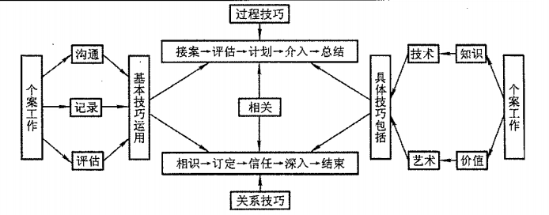
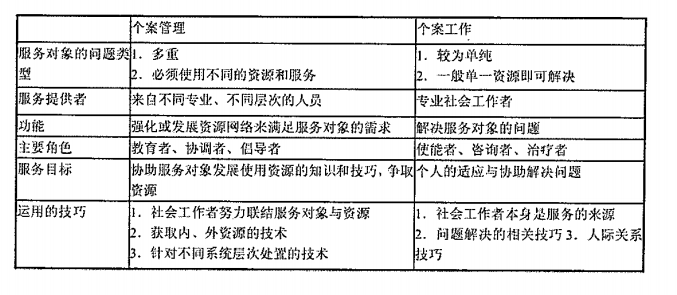

### 1. 个案工作的含义与特点

#### 1.1. 个案工作的含义**（2013 名词解释、2014 名词解释）**
（1）个案工作，即社会个案工作、个案社会工作，英文为social case work。个案工作是专业社会工作者遵循基本的价值理念，运用科学的专业知识和技巧，以个别化的方式为感受困难的个人或家庭提供物质和心理方面的支持和服务，以帮助个人或家庭减低压力、解决问愿、挖掘生命的潜能，不断提高个人和社会的福利水平。
（2）对个案工作的含义归纳
1.个案工作是个别化的社会工作方法；
2.个案工作的基本价值理念是尊意个性，承认人的价值和独特性；
3.个案工作融科学性、技术性、艺术性于一身；
4.个案工作的服务对象是感受困难的个人或家庭；
5.个案工作需要动用资源：
6.个案工作者能同时提高个人和社会的福利水平。

#### 1.2. 社会个案工作的要素
①方法要素，是一种助人的方法：
②工作对象要素，个人和家庭；
③过程要素，是一个面对面的工作过程：
④科学与艺术要素，立足于对科学知识和技术的艺术化运用：
⑤双向性要素，调动资源为个人和家庭服务，以协助个人和家庭对其所处社会环境进行调适。

#### 1.3. 本质特征
（1）个案工作是一种特殊的社会关系
1.个案工作关系是角色与个性的互动；
2.个案工作具有利益单向性的特色；
3.个案工作关系是专业的动态过程。
（2）个案工作是一种信息沟通过程
1.工作者与案主的沟通，从工作者接案、与案主会谈、搜集资料、判断评估、实际介入到结案，都离不开这种沟通手段。
2.工作者与其他人员的沟通，个案工作者除了大量的心理辅导，还要给予案主一些实际的帮助。
（3）个案工作是一项助人自助的专业
1.帮助案主恢复自助能力
个案工作不是替案主解决问题，而是协助案主，与案主一起解决问题，在解决问题的同时帮助案主恢复自助能力。个案工作的价值理念相信人对社会的适应能力是与生俱来的，个人产生无助感是因为遇到了暂时的困难导致认知、情感或其他心理方面出现了障碍。个案工作的目标是既治标，也治本，而且更注重治本。既要帮助案主解决面对的具体问题，更注重帮助案主恢复、培养自助的能力。个案工作的目的是助人自助，不是大包大搅，否则容易养成案主的依赖性，而这种依赖性的持续发展，会使案主原有的自助能力萎缩、丧失，这就要求个案工作者对助人自助原则要有较好的把提。
2.在助人的过程中工作者得到成长
从动机角度看，个案工作是以案主的需要为本，要求工作者所有的方案设计、工作实施以及整个工作过程，都必须是围绕着案主的需要，而且要求工作者时刻警疆自己是否为了满足自己个人的需要去与案主互动。但从工作效果角度看，工作者在乘持个案工作价值观、运用有关知识和技巧帮助案主的过程中，自己也将会得到成长。
因此，工作者应经常反思自己在与案主互动过程中的经验，不断觉知和巩固自己的成长和进步。

#### 1.4. 个案工作与心理咨询的比较
（1）同为助人专业，个案工作与心理咨询有许多相同之处
1.都以个别的方式、沟通的手段帮助需要的人；
2.关注受助者的困难或问题的心理因素；
3.注重对受助者的同感反应和情绪疏导；
4.心理咨询以受助者为中心、非评价、非指导和保密的专业原则与社会工作注意的尊意人的需要、相信人的潜能、案主自决等价值观念有相通之处。
（2）个案工作与心理咨询的不同之处
1.心理咨询特别注意专业技术的精深，个案工作更强调对人的尊重、接纳的价值理念和关怀的情怀；
2.心理咨询注重来访者问题的个人心理成因，个案工作更注重案主个人问题的社会成因；
3.心理咨询只限于咨询室内对心理因素的探素与治疗，个案工作更强调动用资源；
4.心理咨询只解决个人问题，不关心其他社会政治因素，个案工作更多了一些社会政治责任。

#### 1.5. 个案工作的目标
（1）目标界定：以个别方式帮助案主恢复、增强其社会功能。
1.人生任务：包括成长需要（指满足个人成长的种种需要）和生活任务（指个人在生命历程中需要完成的任务和角色职责）
2.应付能力：指人在其发展的每一个阶段都应掌握的必要的完成人生任务的能力。
（2）目标分层
1.终极目标：挖掘生命潜能，趋向自我实现；2.中期目标：恢复自助能力，选择适当生活；
3.具体目标：解决具体困难，排出情绪困扰。个案工作通常帮助案主解决的具体问题有三类：
A.帮助案主疏解情绪困扰
B.帮助申请经济援助
C.帮助案主做具体的事情
（3）目标制定的影响因素
1.案主的期望与要求
2.工作者的价值观
3.案主与工作者的互动

#### 1.6. 个案工作的应用领域
（1）学校个案工作：在学校设置专业人员为解决学生在学习、人际交往、个人成长及学校生活适应等方面的困难或问愿而提供的个别化服务；
（2）医疗个案工作：在医疗机构中开展的以病人及家属为服务对象的个案工作；
（3）矫治个案工作：在司法机构中开展的为犯罪青少年、服刑犯人、刑满释放人员、吸毒卖淫者等提供的个案工作；
（4）家庭个案工作：处于失衡状态中的家庭提供帮助，使其解除困难、恢复平衡的工作；
（5）特定群体个案工作：儿童社会工作、老人社会工作、残疾人社会工作、妇女社会工作；
（6）其他个案工作：军队社会工作、农村社会工作、企业社会工作。

#### 1.7. 社会个案工作的发展历史
（1）19世纪末到20世纪初——个案工作的起源
1.产业革命与贫民问题
产业革命在英国带来生产力发展的同时也带来众多社会问题。1601年英国政府出台《济贫法》（即伊丽莎白43号法案）。这部法案规定，要分区、分类对贫民进行救济。这种对社会问题的社会管理为个案工作奠定了对个人和家庭进行救助的基础。
2.宗教的源头
基督教为个案工作的开展提供了哲学基础，特别是“爱”、“给予”等慈善思想，促使富有的英国人帮助穷人；除此之外，人道主义、公平正义等思想也影响着英国人的思想和行为。
3.查默斯（Thomas Chalmers）的贡献
A.一对一的个人化工作：
B.注重对受助对象的精神品德的塑造；
C.强调对案主给予足够的个别化关怀，注重理解案主的个人和家庭环境对个人特质的影响；
D.强调对案主“自然资源”即家庭成员、亲成及朋友网络、邻里地区的使用；
E.注意挑选和训练工作者。
4.慈善组织会社
继查默斯之后，英国出现了很多友好访问者（friendly visitor）协会，后来演变为慈善组织会社（简称COS），其对于个案工作贡献如下：
1.对案主生活状况进行调查，记录并跟踪；
2.认为对整个家庭的福利和再生产的调查是诊断问题、进行治疗的基础；
3.对工作人员进行训练；
4.建立社会工作图书馆；
5.发展出学徒式的督导方法。
（2）20世纪初到20年代一个案工作的专业化与学科化
1.1917年玛丽·芮奇蒙的《社会诊断》一书，证明社会工作开始了专业化之路。
2.《社会诊断》一书采用医疗模式，认为贫穷是一种疾病，而友好访问员就是像内科医生一样的社会治疗师，运用“研究—诊断—治疗”的框架救人。标志着个案工作的专业化与学科化的开始，开启了社会工作作为“科学的慈善”专业的新时代。
（3）30年代—一个案工作中精神医学的洪流
1.早在1929年，米尔福德（Milford）会议上就指出个案工作必须建立在科学知识和科学分析的基础之上，弗洛伊德的精神分析学在这一时期得到广泛的运用，但是忽视了影响沟通的文化和社会因素。
2.功能学派在对于助人过程分析中，加入了机构的功能的概念，倡导机构为案主服务，满足案主的需要
（4）40年代以后社会个案工作多元化的发展
社会个案工作的多元化不仅体现为理论的多元化，而且还体现在工作模式的多元化。
（5）20世纪80年代以后一一综融取向和后现代主义的个案工作视角80年代以后提出生态主义的社会工作视角，90年代以后采用女性主义理论，叙述分析等治疗方法。

#### 1.8. 个案社会工作的一般程序
##### 1.8.1. 一般程序
一、接案或转介
1.接案
结案是指通过与求助对象的初步接触评估求助对象的问题，并与求助对象协商使其成为服务对象的过程。在接案过程中，对社会工作者有四方面的工作要求：
（1）了解求助者的求助愿望。
（2）促使有需要的人成为服务对象。
（3）明确服务对象的要求。
（4）初步评估服务对象的问题和需要。

2.转介
与服务对象初次接触的会谈过程中，对于那些立即需要帮助而本机构或者社会工作者无法给予必要帮助的服务对象提供转介服务，通常只有在以下两种情况下才允许提供必要的转介服务：
（1）服务对象需要解决的问题不属于本机构的服务范围。
（2）服务对象生活在机构的服务区域之外。

二、收集资料
1.收集与服务对象问题有关的资料
社会工作在收集资料时，既要关注服务对象个人的情况，也要关注服务对象所处的周围环境，了解服务对象与周围环境的具体交往方式和过程。个人资料包括服务对象生理、心理和社会等方面的情况，环境资料包括服务对象的家庭、同辈、社区、和工作环境等情况。
2.对服务对象的问题进行评估
（1）对服务对象的问题进行评估，需要确定三个方面的内容
①服务对象的问题。
②服务对象问题产生的原因。
③服务对象曾经做过的努力。
（2）社会工作者在确定服务对象问题过程中需要坚持五个方面的内容：
①从服务对象个别化的视角理解问题。
②注重服务对象的参与。
③警惕自己的价值偏见。
④避免简单归因。
⑤了解自己的判断标准。

三、制订计划
1.服务工作计划的基本内容
（1）服务对象的基本情况。
（2）服务对象希望解决的问题。
（3）理论依据
（4）工作计划的目标。
（5）服务开展的基本阶段和采取的主要方法。
（6）服务开展的期限。
（7）联系方式。
2.对社会工作者的要求
（1）准确分析服务对象的需要和问题。
（2）明确服务工作的目标、阶段和方法。
（3）熟悉服务机构提供的具体服务。
（4）清晰认识社会工作者具备的能力。
（5）了解服务对象拥有的资源。

四、签订协议
1.签订工作协议的目的：明确双方的责任和义务，增强服务对象改变的动力。
2.工作协议类型：书面、口头（常用）。
3.工作协议的基本内容
（1）服务目标。
（2）服务的内容和采用的方法。
（3）服务双方应有的权利和义务。
（4）服务的地点、时间、期限和次数。
（5）服务双方签字。

五、开展服务
社会工作者在服务工作计划实施过程中，要根据具体情况采取不同的策略和方法，扮演不同的角色：
1.使能者。
2.联系人。
3.教育者。
4.倡导者。
5.治疗者。

六、结案
1.可以结案的五种情形
（1）社会工作者与服务对象都认为工作目标已经达到。
（2）虽然问题没有彻底解决，但服务对象已经具备独立面对和解决问题的能力。
（3）社会工作者与服务对象的专业关系不和谐，希望结束服务。
（4）服务对象出现了一些新的要求和问题，需要其他社会工作者或者服务机构解决。
（5）因为一些不可预测的因素，需要结束服务。
2.社会工作者需要做好的四项工作
（1）预先告知服务对象，让服务对象对结案做好准备。
（2）巩固服务对象在以前服务工作中获得的改变和进步。
（3）帮助服务对象进一步探讨影响问题解决的因素，为结案之后独立面对问题做好准备。
（4）鼓励服务对象表达结案时的情绪，与服务对象一起探讨结案后的跟进服务。
3.结案的三种常用形式
（1）直接告诉服务对象。
（2）延长服务间隔的时间。
（3）变化联系的方式。

七、评估
评估是对个案工作的服务效果和效率进行评定，是服务对象获得有效服务的保证，社会工作者改进个案工作的前提。
1.评估工作的主要内容
（1）服务对象的改变状况。
（2）工作目标的实现程度。
（3）服务介入工作的人力、物力和其他资源的投入。
2.评估的常用方法
（1）由服务对象评估服务工作的开展状况以及对服务工作的满意程度。
（2）由社会工作同行评估服务工作的开展状况。
（3）由服务机构评估社会工作者的服务工作开展状况。

八、跟踪服务
结案之后还需要根据服务对象的情况安排追踪。追踪的三个主要任务
1.根据服务对象的状况安排一些结案之后的练习，巩固服务对象已经取得的进步，增强服务对象独立面对问题的能力。
2.调动服务对象的周围资源，增强对服务对象支持。
3.持续评估服务工作的效果。

##### 1.8.2. 社会个案工作者所需要的技巧
①沟通技巧
沟通即是在人们之间传递信息，它发生在一方向另一方发送信息时。在社会工作过程中，工作者无时不与案主沟通，这需要熟练掌握沟通技巧。
②关系技巧
关系是社会个案工作助人的核心要义。关系技巧包括真诚和有同理心地回应的技巧，表现温暖和关怀的技巧。
及表明尊重案主的技巧。
③过程技巧
过程技巧包括：
a.接案和约定技巧。它包括同案主建立和保持工作关系的技巧，帮助案主和工作者对各自的角色有一个现实性理解的技巧，也包括培养案主对助人过程有一个初步承诺的技巧。
b.评估技巧。它是指收集与案主情境相关的资料，以便能实际地理解案主的问题和需要的技巧。
c.签订契约技巧。这是指同案主订立工作的目标，并有能力清楚说出工作者和案主的责任的技巧。
d.介入技巧。介入需要广泛的技巧，它包括执行、介入计划并协助案主达到目标的技巧。
e.检讨及终结技巧。它包括定期进行回顾和修订介入计划，以便客观地检讨其是否有效的技巧，及有计划地结束关系以帮助案主独立的技巧。

（3）增进社会工作技巧的方法
莫拉尔斯和西弗（Morales&Sheafor）提出了三个能帮助工作者提高工作技巧的主要方式：
①做工作全程记录
记录是发展技巧的一个有价值的工具。在记录工作的过程中，工作者有机会重新思考自己的助人过程，反思与案主的相互关系和互动，详察使用的技巧和所作的回应是否正确。通过这些，工作者能够了解到什么类型的技巧有效。
②督导
督导涉及机构的行政程序，工作者的工作技巧能通过督导员所输入的教育元素而得到发展和改造。个案工作者应有意识地自觉运用和更积极地看待督导，发展一个好的督导关系，并在督导中获得技巧的发展。
③顾问与咨询
顾问与咨询是在某一领域有资深经验和知识的专家与个案工作的新手之间有时间限制、有目标、有契约的一种工作关系。它可以使工作者在资深专家帮助下增进为案主谋福利的助人过程中使用的技巧。

### 2. 个案工作的理论与主要模式
#### 2.1. 个案工作的理论基础
##### 2.1.1. 精神分析理论
（1）精神分析理论是弗洛伊德（Freud）提出的，他以无意识为研究对象，从人格结构入手，探讨心理发生的深层次动因。他认为人的行为是由性本能（力比多）决定的。

（2）适用于—“社会一心理”治疗模式
（3）人格分为本我、自我和超我
1.本我：是人格结构中最意要、最基本的部分，由先天的本能和欲望组成，力比多就储存在本我里，它是无意识的、非道德的，遵循快乐原则行事。
2.自我：介于本我和超我之间，是有意识的、理智的，遵循现实原则行动，它既要满足本我的本能需要，又要控制压抑不被超我所接受的冲动，其最终目的是为本我服务的，它会想方设法满足本我的要求。
3.超我：超我体现的是道德原则，象征的是理想，是一种内化。它包含两个层面，一是良心（即界定什么是不应该做的）；二是自我的理想（即规定什么是应该做的）。超我涉及心理奖赏和惩罚，当合乎超我要求之时，个人会有自尊和骄傲，反之则会感到罪恶和自卑。如果个人的自我、本我和超我三者之间能够维持和谐的关系，个人就具有完善的人格并能有效地与外界沟通。但如果三者之间的关系出现障碍，人格就会失调，需要予以回应。

（4）不良行为的产生源于由各种本能集合而成的三者之间关系的失衡（本我受到过度压抑、自我和超我发育不全）。该理论对个案工作中的社会心理治疗模式有很大影响，个案社会工作者应用精神分析理论对案主的不健全人格进行治疗，帮助案主恢复本我、自我和超我的平衡。

弗洛伊德认为人格发展是具有阶段性的，个人会经历五个连续发展的阶段，每个阶段的发展都有赖于前一阶段心理冲突的解决。这五个阶段是口腔期、肛门期、性器期、潜伏期和生殖器期。在任何一个阶段，自我、本我、超我之间的冲突在得不到解决的情况下就会出现焦虑、压加或压力，都会影响本阶段人格的发展和后续各个阶段的发展。

##### 2.1.2. 社会系统理论
（1）社会系统理论是以一般系统论以及社会学中的功能主义为基础形成的理论，它把人与生活环境看作是由功能上相互依赖的各种元素所形成的系统整体，协调或均衡是治疗系统运行与维持的基本条件，也是个体生存与发展的基本条件。当这个条件得不到满足，即系统内部的各子系统或各元素之间不能有效配合、相互协调时，系统均衡就会受到破坏，个体的生存与发展就会出现问题。
（2）适用于——“社会一心理”治疗模式
（3）社会心理治疗模式吸收了这一理论，一方面关注案主本身的心理问题，另一方面致力于帮助案主改善社会环境、恢复各子系统或元素之间的均衡关系，使它们能够重新有效配合、相互均衡。

##### 2.1.3. 沟通理论
（1）沟通理论是以社会心理学、人类学和社会语言学中有关人际沟通的一些理论为基础而形成的一种理论，这种理论强调人际沟通在人际关系中的重要性，它认为许多人的行为问题都是出在人际沟通方面，如不能恰当地接受、选择和评估信息，不能很好地给予或接受信息反馈等，几乎所有个案工作理论后来都很强调这一点。
（2）适用于所有模式
（3）强调人际沟通在人际关系的重要性，认为沟通是个人和他人互动的媒介，个人的自我强度、自我防卫机能及知觉等因素，对个人的沟通技术的优劣有决定性的影响。

##### 2.1.4. 行为主义理论
（1）行为主义理论是心理学的一个理论学派，研究人的外显行为，注重环境对人的影响、刺激一反应、强化等对人的行为的塑造。行为学派的个案工作更关心案主的外在行为，帮助案主学习和掌握恰当的反应模式，对案主不适当的行为进行治疗和娇治。
（2）适用于行为治疗模式、行为修正模式
（3）行为主义理论成为个案工作理论流派之一，成为行为修正理论的知识基础。

##### 2.1.5. 认知理论
（1）认知理论是以认知心理学为基础形成和发展起来的一种理论，与分析心理学不同，它认为人的行为主要受制于理性思考，而不是潜意识中的本能。不良行为主要产生于认知上的错误或理性思维能力的缺乏。
（2）适用于现实治疗模式、理性情绪治疗模式
（3）个案工作实施理论中的现实疗法和理性情绪疗法就是基于该理论，试图帮助案主获得对世界的正确认识和完善理性思考的能力，从而使案主的行为能力得到正确的理性的指引。

##### 2.1.6. 人本主义理论
（1）是以马斯洛的人本主义心理学、萨特的存在主义、胡塞尔与舒茨的现象学、布鲁默的符号互动主义为基础形成的一种理论。
（2）适用于一—人本治疗模式、任务中心模式、现实治疗模式、理性情绪治疗模式（3）人文主义理论认为每个人都有自我实现的需要和潜能，人的问题产生于人不能接受自我，所以应当帮助服务对象形成正确的自我概念，充分发挥服务对象本身的能动性，同时人也是有自由意志的，人有责任也有能力去改变自己的非理性的信念。

#### 2.2. 个案工作的主要模式
##### 2.2.1. 心理社会治疗模式**（2013 简答题）**
心理社会治疗模式是一种将案主的心理状态、心理过程同他生活的社会环境结合起来考虑并进行工作的方法。“人在情境中”（person-in-situation）是该模式的核心概念，强调人与环境的互动关系。其中的“人”是指个人内在的心理体系；“情境”是指个人生活的社会网络与物质环境。人、环境以及二者的交互影响是其中三个最重要的因素。在人与环境的交互影响过程中，任何部分的改变都将引起其他部分的改变，如此不断地相互影响、塑造，最后达到平衡状态。提出将服务对象的心理状态、心理过程同其生活的社会环境结合起来，只有将遭遇问题的人放在其特定的环境中去考察，才能真正理解人的行为，并找到对症下药的治疗方法。因此，该派认为治疗的首要任务在于调整个人的人格体系及环境体系，以增进人格的成长与适应。协助的目标在于适度满足受助者的基本需求，帮助其处理面对的问题，增强有效处理问题的能力，减轻痛苦，以增加实现目标与期望的机会与能力。在环境改普方面，则应尽量使案主自己担当改善环境的责任，只有在案主自己担当遇到的困难时，社会工作者才介入协助。受精神分析理论、自我心理学和学习理论、社会学的角色理论和互动理论、人类学的家庭理论以及系统理论等影响。

（1）七项原则：个别化、接纳、当事人自决权、不批判态度、表里一致、保密和受控制的情绪反应。

（2）理论假设
1.对人的成长发展的假设：认为个人生活在特定的社会环境中，个体的发展受到生理、心理和社会三个方面因素的影响，而且这三个方面的因素又相互作用，共同影响服务对象的成长过程，借用了系统理论的概念——“人在情境中”，把服务对象放到一定的社会环境中去认识，通过了解服务对象的所处环境把握服务对象的问题。
2.对服务对象问题的假设：强调服务对象的问题与服务对象感受到的来自过去、现在以及问题处理过程中的压力有关。压力主要来自三方面：
A.过去的压力：指服务对象在成长早期感受到的因愿望没有获得满足或者情绪冲突没有消除而产生的压力，干扰当前生活，妨碍适应新的环境；
B.现在的压力：当前社会环境压力过大，导致成长早期未被解决的问题表现出来，从而导致服务对象的行为出现偏差；
C.问题处理过程中的压力：与不良的自我功能和不良的超我功能有关，在这些不良的自我功能和超我功能的影响下，服务对象对外部环境的认识能力以及对自己情绪控制能力减弱，最终导致心理困扰和人际关系的失训。强调：把服务对象问题产生的背景和现状结合起来考虑，既要重视服务对象问题形成的原因，又要意视服务对象当前的人格强度。
3.对人际沟通的假设：保证人际互动有效进行的基础是沟通。人际沟通会影响服务对象的家庭关系和服务对象社会角色的扮演，对服务对象的超我和自我的形成也起着十分重要的作用，服务对象的自我功能的强度、自我防卫机制和知觉等都是影响其人际沟通技能形成的重要因素。
4.对人的价值的假设：每个服务对象都是有价值的，他们都具有发展自己的潜能，只是未被开发而已，因此开展心理与社会治疗的目的就是要挖掘服务对象的潜能，使服务对象健康地成长。

（3）治疗方法和技巧
直接治疗：个案工作者直接对服务对象进行辅导、治疗，不需要借助第三者；间接治疗：个案工作着通过改善外部环境或辅导第三者，从而间接影响、帮助服务对象。
1.直接治疗技巧（分为非反映性直接治疗和反映性直接治疗）
A.非反映性直接治疗：
Al.支持一核心是通过工作者了解、接纳、同感和信任等削减服务对象的焦虑和不安，给予必要的肯定和认可。
具体技巧—对服务对象的接纳、对服务对象的保证、向服务对象提供实物帮助。
A2.直接影响——工作者通过直接表示自己的态度和意见促成服务对象不良行为的改变和心理困扰的消除，如强调、提议、忠告、坚持和干预。
注意三点—
第一，工作者在使用直接影响治疗技巧之前需要了解服务对象的真实情况，最好与服务对象进行商讨；
第二，在可能的情况下，工作者需要征求服务对象的意见，让服务对象自己决定是否需要指导；第三，工作者在使用直接影响治疗技巧时，需要帮助服务对象，尤其依赖性比较强的服务对象，让他们学会自己做出决定，培养他们的独立性。
A3.探索一一描述——宣泄——工作者通过服务对象的描述和解释探索服务对象的问题，并为服务对象的情感宣泄提供机会，以便疏导服务对象的情绪冲突，改变服务对象的不良行为。
注意三点：
第一，帮助服务对象表达负面的感受，并提供机会让服务对象宜泄自己内心的愤怒和不满，以便减缓服务对象的心理压力，深入探讨服务对象问题的实质：
第二，帮助服务对象减轻意志控制，并鼓励服务对象表达各种被压制的感受，以便了解服务对象未意识到的各种内心矛盾和冲突；第三，在为服务对象提供情感宣泄的机会时，工作者需要区分两种不同的宣泄类型，建设性宣泄和破坏性宜
B.反映性直接治疗
B1.现实情况反映——工作者通过一些专门的治疗技巧协助服务对象对其目前所处的外部环境以及内心困扰做出正确的理解和评价；包括外在反映、内在反映、内外在反映、对环境刺激的反应、自我评估、对工作者和治疗的反应。
B2.心理动力反映——指出服务对象经常采用的不良反应方式，并引导服务对象对自己的问愿进行分析、理解，找到自己问题产生的原因以及发展的具体过程。
B3.人格发展反映—一指工作者帮助服务对象重新认识和评价自己早年的痛苦经历，调整服务对象的人格发展。
2.间接治疗技巧：核心是希望改善服务对象的外部环境来促成服务对象不良行为的改变（支持，直接影响，宜泄和现实情况反映），注意以下几个方面：
A.根据不同的情况采取不同的治疗技巧
B.尊重服务对象的自决权
C.选择合适的角色
（4）心理社会治疗模式的特点
治疗过程：研究——诊断——治疗
1.注重从人际交往的场景中了解服务对象
2.运用综合的诊断方式确定服务对象问题的原因
3.采用多层面的服务介入方式帮助服务对象
（5）贡献
1.全面探讨求助者的问题。心理与社会治疗模式把求助者的问题视为由生理、心理和社会各方面的因素共同作用的结果，要求工作者从各个方面、各个层次分析求助者的心理困扰和人际关系的失调，并帮助求助者改变不良的行为方式。
2.保持开放的态度。心理与社会治疗模式本身就是广泛吸收不同理论和见解的结果，它融合了心理学、社会学、文化人类学、病理学和系统理论等的有关认识，并加以发展，形成独特的治疗模式。心理与社会治疗模式在发展过程中始终保持一种开放的态度，不断吸取其他个案工作理论分析模式的优点，并将它们融入自己的理论分析模式中，丰富和发展自己的理论体系。
3.强调采用多种治疗技巧帮助求助者。在帮助求助者过程中心理与社会治疗模式强调采用多种治疗技巧，不仅包括直接影响求助者的直接治疗方式，还包括改善求助者外部环境的间接治疗方式。
（6）局限
1.分析的基础。心理与社会治疗模式把影响求助者的因素分为内部和外部两个方面，认为这两个不同方面的互相作用导致了求助者的不良行为。事实上，求助者任何问题都可概括为由内部和外部两个方面的因素导致的，影响求助者的不是这两个方面的因素，而是这两个方面的因素的结合方式，这种具体的结合方式就表明外部和内部因素相互作用的过程。因此，分析求助者问题的基础是求助者在人际互动过程中的感受，求助者如何认识和选拆就表明外部因素怎样对其发生作用。
2.分析的对象。心理与社会治疗模式把求助者的外部因素和内部因素的相互作用视为分析的对象，其目的是要揭示外部因素和内部因素相互作用的过程。但是这样的分析逻辑无法让人信服，因为无论是外部因素还是内部因素都必须借助求助者的理解，只有通过求助者才能把提内部和外部因素的影响。
3.分析的方法。心理与社会治疗模式希望通过工作者的帮助让求助者理清自己不良行为产生和发展的逻辑，它借助于求助者过去经历与当前状况、意识层面和无意识层面上的连接，找到求助者问题的实质。这样的分析方法是以工作者为中心，以工作者的逻辑整理求助者的问题，因此，带有工作者自己的主观价值判断。
4.分析的重点。心理与社会治疗模式通过把影响求助者的各种因素进行分类来理解求助者问题产生和发展的逻辑，这是一种类型的把提方法，它忽视了求助者的独特的精神发展逻辑，因而无法准确地认识求助者的问题。
另外，心理与社会治疗模式把工作者与求助者的关系理解为治疗关系，就像医生对特病人一样，这样的认识只会妨碍求助者心理困扰的消除。因为心理困扰与生理疾病不同，它与求助者的人际交往相关，受到他人评价的影响，所以把求助者视为病人对于求助者不良行为的改变是不利的，这不仅给求助者造成心理压力，而且对于工作者来说，也容易把自己视为权戚，忽视求助者的自决权等原则。

##### 2.2.2. 行为修正模式
行为修正模式以服务对象的行为作为分析的起点，探讨服务对象不良行为产生的外部条件、机制以及具体发展过程，以便指导调整或矫正其不良的行为方式，更好地适应外部环境。
（1）理论假设（经典条件作用理论、操作性条件作用理论、社会学习理论，都是对人的行为获得的学习机制进行探讨）
1.经典条件作用的理论假设
又称反射性条件作用，以无条件反射为基础，与中性刺激建立条件反射，由于人具有语言能力，因此就可以建立起以语言为基础的复杂的条件反射系统（强化、消退、泛化、分化和抗条件作用）
A.强化：伴随条件刺激的呈现给予无条件刺激，使有机体形成条件反射；
B.消退：由于不再有强化，有机体条件反射的强度就会逐渐减轻，甚至出现条件反射完全消失的现象；
C.泛化：是指条件反应扩散到类似原条件刺激的过程，这样，相类似的条件刺激就可以产生相同的条件反应；
D.分化：与泛化相反，分化是指有机体抑制泛化反应，形成只对特定条件刺激发生反应的条件反射过程：
B.抗条件作用：如果一个已形成的条件反应撒出原有的强化物，并同时设法使一个条件反应与原来的刺激建立联系，就会使原来的条件反应迅速消除（同时适用强化和消退，因此它对服务对象的行为改变具有明显的效果，像厌恶疗法、系统脱敏法等）。
2.操作性条件作用的理论
又称工具性条件作用，指有机体的某个行为会导致环境的变化，并进而影响到有机体的继后行为，如果这种行为是积极的，有机体就会倾向于做出同样的行为，如果这种影响是消极的，那有机体会倾向于抑制这种行为。这样有机体就可以根据自己行为的后果调节自己的行为。操作性条件作用力量主要涉及影响行为的单元、强化的秩序和强化类型等三方面的内容。
A.影响操作条件作用的刺激：需要性刺激、厌恶性刺激。
B.正增强：当有机体作出一个行为后，给予一个需要性刺激，使有机体的该行为出现频率增高；
C.负增强：通过消减厌悉型刺激使有机体期特行为的出现率增高；
D.正惩罚：通过给予一个厌恶性刺激使有机体的不适应行为逐渐消退；
E.负惩罚：当有机体做出一个行为，它所希望得到的需要性刺激消失，则该行为的出现频率下降。
3.社会学习理论的假设
社会学习理论提出了一种新的学习形式，即观察学习或模仿学习。观察学习不同于经典条件学习和操作性条件学习，强调认知在学习中的作用，认为人的大部分行为是通过示范、观察和模仿获得的。
A.班度拉：观察学习四阶段
注意阶段：对模仿行为进行观察；保持阶段：把观察到的行为信息储存在记忆力：
再现阶段：通过自己的行为组合再现观寨到的行为；动机确立阶段：确立行为模仿的动机。
B.班度拉强调个体观察模仿行为之后会产生三个方面的影响：
通过认知系统的整理使相关刺激线索连接起来；通过观察模仿行为产生蓄代性奖赏或惩罚，从而修正已经习得的行为；通过观察模仿行为强化已习得行为。
4.行为修正模式的一般理论假设
A.以行为作为理论研究的中心，不去研究行为背后的人格、动机和自我等问题；
B.以学习作为核心概念，这三种理论都关心行为学习的具体机制和条件，认为有机体的适应行为和不适应行为都是通过学习获得的，要想改变不适应行为或者获得适应行为必须通过具体的学习过程。因此，这三种学习理论认为，学习是实现治疗的手段，行为的修正其实是一些获得和消除行为的学习过程。
C.强调外部环境在行为习得中的作用，三种理论的共同特点是注重外部环境在行为学习中的作用。他们认为外部环境的刺激必须会导致有机体的特定行为，只要改变外部环境，有机体的行为就会发生改变，因此通过书和消除外部环境的刺激因素就可以调整和改变有机体的行为，使有机体产生适应性行为反应方式。
D.注意可观察和可测景。

（2）治疗方法和技术
1.放松练习：德雅各布森提出，通过服务对象的身体放松缓解服务对象生理和心理的各种紧张，以克服对象的焦虑。
常见—松弛放松法
首先，让服务对象身体的某组肌肉紧张，以便使服务对象了解紧张的感受；其次，让服务对象放松这组肌内，并要求服务对象与紧张状态比较，体会放松的感觉；再次，通过几组几次紧张和放松的练习，使服务对象逐渐能够自觉放松这组肌内，知道学会放松整个身体可以缓解服务对象的身心紧张和焦虑症状。
2.系统脱敏：行为疗法的一种，用于消除各种恐惧症状，如社交恐惧、广场恐怖和考试焦虑等。服务对条某物或某事感到客怕、恐惧、不敢接近。系统脱敏法要求服务对象在放松状态下逐渐靠近、接触恐惧对象，这就可以抑制或消除服务对象的靠虑反应，从而帮助服务对象逐渐克服恐惧症状。
3.满灌疗法：又称暴露法、快速脱敏法。它是让服务对象直接处于最严重焦虑中，直到服务对象的焦虑症消除。因为满灌疗法认为服务对象的害怕是一种条件反应，如果服务对象采取达避方式，只会增强服务对象的惧强度，起到负强化的作用，对此，就需要让服务对象直接处于最严重的焦虑情境中，使服务对象不得不面对己的恐惧，通过反复做这样的练习，真到服务对象对此变得习以为常，不再感到音怕。
4.自我管理：要求服务对象积极参与行为改变的整个过程，并对自己的行为变化负责。在行为修正过程中作者只是帮助服务对象指定行为改变的目标和计划，指导和监督服务对象行为修正计划中的执行情况，并对服对象行为改变的状况作出评价。
五步：选择目标：监测目标行为；改变环境因素；取得有效结果和巩固收获。
5.厌悉型疗法
当出现一个不适应行为时，就呈现厌恶性刺激，使服务对象的不适应行为与厌恶性反应建立联系，这样，务对象就会逐渐回避或放弃不适当行为（想象，药物，电击）。
6.模仿
来源于班度拉的观来学习理论。包括：榜样的示范和服务对象的模仿练习。首先，工作者需要让服务对象来那些需要模仿的行为，了解各种行为的要点；其次，在工作者的指导下服务对象具体联系正确的行为，工作需要及时给予服务对象各种行为反馈，不断强化服务对象的正确行为反应。
7.代币管制法
根据操作性条件学习理论发展而来的一种治疗技术，它假设一种原无强化作用的刺激物与真正的强化物建立联系后，就会获得强化的作用。代币管制与直接强化不同，它能在正确行为出现后及时给予强化，消除直接强化滞后的现象，使得服务对象的正确行为反应直接与强化物建立联系。
8.果敢训练
又称决断训练取自信训练等。主要适用于人际关系的调整，其目的是帮助服务对象在人际交往中顺利表达自已难于表达的各种正面或负面的感受，改善服务对象的人际关系。首先，确认需要进行果敢训练的问题；其次，提高服务对象进行果断训练的动机；最后，进行果断行为训练。

（3）运用行为修正模式的主要原则
1.建立良好的专业关系：重视工作者与求助者之间的积极合作关系，它要求求助者主动参与行为修正的过程，包括不适应行为的分析、治疗方案的制定和治疗效果的评估等。工作者需要倾听、理解、关注和接纳求助者，努力培养与求助者之间的相互信任，建立和谐的专业合作关系。
2.准确的行为评估：行为评估是要确定求助者需要修正的行为的范围，了解求助者修正行为产生的条件、过程和影响等。具体来说，这一阶段需娶明确三个问题：需要修正的行为是什么、影响修正行为的外部环境刺激是什么以及修正行为导致什么样的环境变化。
3.有效的行为修正：对求助者的行为进行修正是实施行为修正模式方法的核心阶段，在此阶段工作者需要制定行为修正的具体方案，并与求助者合作实施行为修正的计划，调整求助者的不适应行为。一般而言，工作者需要完成三项任务：确定行为修正目标、选择行为修正的治疗技术和实施行为修正计划。
4.合理的修正效果评估在求助者的行为修正计划完成以后，工作者还需要对求助者的行为改变状况以及求助者的满意程度进行评估，确定行为修正计划的完成情况，并对行为修正过程中的经验进行总结。另外，工作者还需要对求助者进行随访，了解求助者行为改变的保持状况，确定行为修正的实际效果。

（4）行为修正模式从求助者的行为着手，探讨求助者行为产生、发展和变化的规律，与其他个案工作理论分析模式相比，它具有明确、可观察、可测量和易操纵等特点。
1.行为修正模式以行为心理学为其理论来源，具有科学的实验基础。行为修正模式的方法和治疗技术来自经典条件作用理论、操作性条件作用理论和社会学习理论的科学试验，它们经过反复的实际验证，因此，具有较为严格的科学性。多年的临床实践也证明，行为修正模式的治疗效果比较明显。
2.行为修正模式的治疗方法和技术比较系统，而且也比较容易操作。经过几十年的不断探索，行为修正模式已形成比较系统的治疗技术，像经典条件作用的放松练习、系统脱敏，操作性条件作用的代币管制、厌恶性疗法以及社会学习理论的模仿治疗等，比较完备。对于工作者来说，这些治疗技术比较规范，因而也比较容易运用。
3.行为修正模式的治疗方法和技术比较明确，治疗的标准和效果易于观察和测量。行为修正模式的任何一项治疗技术都具有明确的操作程序和标准，至于操作的过程、治疗的效果等情况也比较容易观察和测量。因此，工作者很容易了解自己运用行为修正模式治疗技术的状况，并与他人进行比较分析，做出总结。

（5）局限
1.行为修正模式忽视对求助者内心的探讨。行为修正模式以求助者的行为为中心，只探讨求助者行为的产生、发展和变化的规律，不去理解求助者行为背后的意义，这样的方法是无法揭示求助者行为的实质的。而且求助者的认知、情感和行为是相互关联的，只从行为着手调整求助者的行为，无视其他感受的存在，只会妨碍行为治疗的效果。
2.行为修正模式把人的行为理解成对外部环境的适应。行为修正模式忽视了人和动物的区别，当人介入外部环境时，是以一定的价值观为标准的，人与外部环境的联系的基础是人与人之间的互动，对于人来说，外部环境只是人介入和观察的视角，不是纯粹的自然环境。
3.行为修正模式过分注重行为症状的消除。虽然求助者的行为发生了改变，但并不表明求助者的心理困扰消除了，可能只是使求助者的问题出现转移或隐藏，因为不同的动机可以有相同的行为表现，而同一动机也可以有不同的行为方式。
4.虽然行为修正模式本身也作了一些调整，逐渐注意工作者与求助者的合作关系的靠要作用，并积极鼓励求助者介入整个行为修正过程。但由于其理论分析逻辑的局限，使行为修正模式仍以工作者为中心，忽视求助者不同的价值观以及求助者对自己生活的理解和选择能力。

##### 2.2.3. 理性情绪治疗模式
认知疗法中一种重要的理论分析模式，由美国心理学家艾利斯（A.E11is）在1955年创立，他认为靠自由联想和反映感受等非指导性治疗技术都很难改变服务对象的非理性理念，而这些非理性理念恰恰是影响服务对象情绪的重要因素，同时它们对服务对象的情绪起着非常重要的作用。此外，艾利斯也对行为修正模式表示怀疑，因为他认为人和动物不同，人能对想像出来的刺激进行解释并做出反应，更为重要的是行为修正模式的治疗技术无法改变人的非理性信念。艾利斯希望从求助者的理性、情绪和行为等方面着手治疗，采取主动、指导的治疗策略，使求助者的情绪和行为发生彻底的改变。
（1）理论假设
理性情绪治疗模式采取明显的人本主义价值立场，对人的信念、情绪和行为之间的关系进行了深入细致的分
1.对人性的假设
假设人的存在具有价值，这是人先天同有的本性，使人趋向于成长和自我实现。对于人来说，追求快乐是生活的目标，这种快乐是长期的而非短期。艾里斯认为，人就是人，既有优点，也有缺点，人的价值不是绝对的，只能在某种程度上进行自由选择，改变生活，使自己的生活变得更好。
2.心理失调的原因和机制
ABC理论：
A代表引发事件，是指服务对象所遇到的当前事件，事件的形式既可以是具体的事件，也可以使服务对象思想、感受、行为或对以前事件的回忆；
B代表服务对象的信念系统，是指服务对象对引发事件的认知和评价，既可以是理性的，也可以是非理性的；
C代表引发事件之后出现的各种认知、情绪和行为。
AC的原因是B.
因此，有效的帮助是对服务对象的非理性信念系统进行质疑，即对非理性信念进行识别和辩论-D.
帮助服务对象克服各种非理性信念，最终使服务对象的情绪和行为困扰消除，形成一种有效的理性生活方式，达到目标E。
A（引发事件）—B（信念系统）—C（事后认知、情绪、行为）——D（识别、辩论）E（目标）
3.非理性信念
所谓非理性信念是指那些把特定场景中的经验绝对、普遍、抽象化之后与实际情况不符的想法和观点。所谓绝对化是指服务对象对自己的要求过高，希望自己的生活完美无缺；普速化是指服务对象把自己对某件或者某些事情的看法概括为所用事物的普遍特性，如经历几次失败之后，认为自己天生就是笨；而抽象化是指服务对象把具体场景中得出的经验抽象为一般的准则，例如，强调如果自己尊重别人，别人就会尊重自己。
4.辅导关系
工作者不应对服务对象的情绪和行为困扰做任何价值判断。人的价值存在不需要任何先决条件，因此工作者需要无条件地接纳服务对象，帮助服务对象改交非理性的信念，解决其情绪和行为的困扰。
5.其他一些重要的概念
次级症状—一服务对象会以非理性的信念对待自己的情绪和行为的困扰，从而造成情绪失调症状加重的现象，

（2）实施方法
1.辅导目标：第一步，帮助服务对象消除不适当的情绪反应；第二步，帮助服务对象改变不良的非理性信念。
2.个案工作者的辅导角色
A.采取综合的改变途径；
B.注重服务对象此时此地的感受；
C.强调顿悟：理解自己的行为和情绪就是由非理性信念导致的；理解自己的困扰没有消除是因为仍然坚持非理性信念；理解消除非理性信念是克服自己情绪和行为的唯一困扰。
3.治疗过程
理性情绪治疗模式以帮助求助者改变非理性信念为中心形成一套比较完整、明确的辅导方法，它主要包括五个方面的内容：明确辅导要求、检查非理性信念、与非理性信念辩论、学会理性生活方式和巩固辅导效果。
A.明确辅导要求。从第一次接触开始，工作者就需要根据求助者的理解水平和爱好浅显易懂的向求助者介绍有关理性情绪治疗模式的理论和方法，讲解具体的辅导过程和方法，让求助者明白，如果他（她）希望得到工作者的帮助，该怎样做，做些什么，并设法与求助者建立友好的合作关系。
B.检查非理性信念.工作者需要积极地介入个案辅导过程，承担指导、教育和咨询等主要角色，鼓励求助者探讨其情绪和行为困扰背后的非理性信念，帮助求助者认识和理解其非理性信念与困扰之间的关系。
C.与非理性信念辩论。指出它们的不合理和不切实际之处，让求助者认识到它们的危害，并鼓励求助者摒弃这些非理性信念，采取积极行动改变目前的生活状况。工作者在此阶段需要运用一些理性情绪治疗模式的专门辅导技巧，像质疑、辨析和语言精确法等，帮助求助者改变和消除这些非理性信念。
D.学会理性生活方式。在消晰辨别非理性信念的基础上，工作者就需要帮助求助者找出合适的、理性的情绪和行为反应方式，运用现实的理性信念去替代非理性的信念，并把理性信念与合适的情绪和行为反应连接起来，形成理性的生活方式。
E.巩固辅导效果。帮助求助者把所学到的理性生活方式运用到自己的实际生活中。在此阶段工作者的任务主要有以下几个方面：第一，帮助求助者继续练习理性的反应方式，巩固个案辅导的效果；第二，帮助求助者逐渐内化理性的信念，并鼓励求助者以此指导自己的现实生活：第三，布置一些家庭作业，并鼓励求助者在以后的生活中继续学习理性情绪治疗模式的理论和方法，不断地对自己的非理性信念进行分析、理解和质疑，使自己的生活变得更加积极、健康。
4.治疗技巧
A.检查技巧：反映感受、角色扮演、冒险和识别；
B.辩论技巧：辩论、理性功课、放弃自我评价、自我表露、示范、替代性选择、去灾难化和想象。
（3）运用理性治疗模式的主要原则
1.注意综合运用各种辅导技巧
除了工作者运用自己独特的辅导技术之外，还强调工作者运用其他个案工作理论分析模式的辅导技巧，以促使求助者的改变。因此，辅导技巧比较系统、全面，它包括认知辅导技巧、情绪辅导技巧和行为辅导技巧等。
2.注意对求助者的非理性信念进行分析、辨别和争论
理性情绪治疗模式以当前生活为分析的起点，探索求助者当前生活中存在的各种非理性信念以及与情绪和行为之间的关系，并对这些非理性信念进行辩论和质疑，从而消除求助者的各种非理性信念，改善求助者的生活处境。为此，理性情绪治疗模式根据自己的临床实成总结出一套独特的辅导技术，主要包括非理性信念的检查和辩论技巧。
3.注重把求助者的面谈辅导和自助辅导结合起来
理性情绪治疗模式不仅强调对求助者进行面谈辅导，而且还注重提供面谈以外的自助辅导，如布置家庭作业、让求助者阅读理性情绪治疗模式的有关读物等，希望把面谈辅导和自助辅导结合起来，以增强辅导的效果。
（4）理性情绪治疗的实施特点
理性情绪治疗法将人的情绪分为适当的和不适当的两种，认为不适当的情绪产生于人们不正确的观念与思维方式，因为人有“一定”、“应该”等想法，这使人们有不适当的情绪。因此，理性情绪治疗法从人们的观念和认识方式出发来改变人的不良情绪，帮助服务对象形成适当的情绪反应，放弃不适当的或自贬的情绪反应。
理性情绪治疗法与其他治疗方法的最大的区别在于：理性情绪治疗法不重视对历史的追测，而强调当下的现在；它不重视对心理机剂的分析，而直接从观念入手；它不采用非直示式方法，而采用工作者主导的意示方式；它不意视潜意识，而强调明确的思想；它不重视环境的影响，而强调人的自由选择。
（5）贡献
1.强调非理性信念对求助者情绪和行为的影响。认为真正导致求助者问题的因素是求助者的非理性信念，它使得求助着在理解自己生活状况时出现抽象化、绝对化和普遍化的特点，这已被临床实践证明是正确的。要消除求助者的情绪和行为困扰就需要对求助者的非理性信念进行检查和辩论，使求助者学会理性的生活方式。这些认识与实际观察到的现象比较接近。
2.强调工作者积极、主动介入个案辅导过程。要求工作者积极、主动地影响求助者，帮助求助者消除各种非理性信念。因此，理性情绪治疗模式的效果比较好，辅导的效率比较高。
3.采取开放的态度综合运用各种辅导技巧。不仅具有自己独特的非理性信念的检查和辩论技巧，而且广泛采用其他个案工作理论分析模式的技术，从而形成比较完备的辅导技巧系统，即包括行为、情绪调整技巧，也包括认知、信念改变技巧。另外还把面谈辅导和自助辅导结合起来，使辅导工作延伸到求助者的实际生活中，增进了辅导效果。
（6）局限
1.理性信念含义的不清。理性和非理性信念是理性情绪治疗模式的核心概念的一部分，对于它们的含义却认识不清晰，很难明确区分哪些是理性的信念、哪些是非理性的信念。另外，完全保持理性的生活方式是无法实现的，要求求助者完全消除非理性信念是不现实的。
2.过分强调工作者积极介入辅导过程。无论如何求助者应该是辅导工作的中心，只有当求助者体会到，并希望改变自己时，个案辅导工作才会有效。如果过分强调工作者对求助者的积极影响，就会造成一些虚假的现象，求助者为了迎合工作者，表现出有所改变。
3.忽视对求助者内部感受的分析和理解。求助者的各种非理性信念以其感受为基础，当求助者的精神发展出现偏差时，其内心感受就会产生各种矛盾和冲突，这些矛盾和冲突即是理解求助者非理性信念的基础，也是消除求助者非理性信念的条件。如果不对求助者的内部感受状况进行分析，也就无法理解求助者相互矛盾和冲突的情绪和行为表现，无法从整体上把提求助者的变化。

##### 2.2.4. 任务中心模式
（1）基本假设
任务中心模式（task-centered model）最早是由芝加哥大学雷德（Reid）与艾普斯坦（Epstein）于1972年正式提出的，试图以“有计划的短期处置”取代传统长期治疗，把力量集中在处理外显问题而非内在集因。这一模式整合了心理动力、问题解决、行为学派和实证研究结果等知识与技术。其基本假设是：
1.案主问题的产生是因为能力暂时受限，而不是病理因素所导致：
2.解决问题的困难在于环境或资源不足；
3.当人陷入问题时会产生改变问题的动力，但也有适应问题的本能；
4.人们只想把问题减轻到可以忍受的地步，而不是从根本上解决问题：
5.当个人了解到自身有问题时，会采取行动解决。
因此，工作者可通过专业服务过程增强案主解决问题的能力，并使案主成为解决问题及促成改变的主要媒介，而工作者只扮演资源供给者与链接者的角色。任务中心取向模式是一种短期的实务工作方法，主要用于解决个人或家庭特定的心理社会问题。具体而言，它主要应用于八类问题：人际冲突、不满意的社会关系、正式组织中的问题、角色困难、社会转型中的问题、情绪问题、资源不足问愿和行为问题。

（2）问题解决的过程
1.问思探索。运用行为治疗的方法探讨案主关心的问题、确定问题、清楚地定义问题并排出问题的优先次序。
2.协议。确定问题属于哪一种后与案主协商出一个改变的目标。
3.工作者与案主共同制定出具体的目标。
4.迈向目标，完成任务。
5.结束。这时要回顾已取得的成就。

（3）工作阶段中的步骤与方法
1.开始接触、探索和协议阶段
A.如果案主是被转介的，则首先要找出转介者的目标，然后与案主和转介者协商制定目标。如果案主是自己主动求助的，首先要鼓励案主表述自己的问题，鼓励案主宜泄感情。这时工作者要给予及时的帮助，帮案主自己采取行动，制定一些小的可达到的目标。
B.列出案主关心的问题，解释“任务中心”模式，如时间限制、优先要考虑的问题、需要介入的人（如家庭成员等）。
C.要定义问题，与案主决定“目标问题”。可以选择三个优先考虑的问题，由案主排次序，共同确定问题的种类，与案主协商制定合同（口头的或书面的）。
2.阐述目标及要完成的任务
如果“目标问题”是经过慎重选出的，就缩短任务选择阶段。要让案主自己思考任务及可能的效果，工作者则要提供问题解决的手段并支持案主履行任务。
3.结束阶段
在工作快要结束（大约在最后两三次会谈）时，工作者应该与案主讨论结束工作接触的可能效果。这时要与案主一起回顺重要的进步并给予鼓励，并帮案主确定进一步工作的领域。如果案主觉得需要更多时间并表现出完成任务的意愿，可以延长时限。在决定终结这项工作时，要评估每个人的“投入与产出”，并小心地说“再见”。

（4）工作技巧
①探讨。在界定问题、确定任务、履行任务的过程中都需要工作者与案主探讨。
②组织。组织工作者与案主的互动及确定互动的方向，包括解释介入的目的及性质、时间安排、行动计划和案主参与等。
③提高案主的意识水平。提高案主对其本身及其周围情况的了解。
④鼓励。用以强化或激励一些有助于完成任务的态度和行为。
⑤提供方向。工作者就案主的任务提出建议和忠告，让案主指导履行任务的有效途径，以帮助案主完成任务。

（5）任务中心模式的特点
问题的弄定、服务对象的界定以及任务的界定是任务中心模式实施过程中需要非常关注的问题，也是任务中心模式的夏要特点，因为只有清晰界定这些问题，才有可能为服务对象制订简要的服务。
1.清晰界定问题
任务中心模式认为，要成为可以处理的问题需要具备4个条件：一是服务对象知道这个问题存在；二是服务对象承认这是一个问题：三是服务对象愿意处理这个问题：四是服务对象有能力处理这个问愿，并有可能在服务以外的时间尝试独立处理这个问题。
2.明确界定服务对象
并不是所有的求助对象都能成为任务中心模式的服务对条，任务中心模式对服务对象具有明确的要求，主要包括两个方面：一是服务对象必须是愿意承担自己的任务并且作出承诺，愿意尝试完成任务解决问趣的求助对象；二是服务对象处于正常的生活状态，具有自主的能力。
3.合理界定任务
在界定任务时，任务中心模式强调，只有把以下3个因素融合到任务中，这样的任务才是最好的，而且也是可行的。这3个方面的因素：一是服务对象的问题；二是服务对象解决这个问题的能力；三是服务对象的意愿。

（5）任务中心模式的优点
1.在问题探索、协议和确定任务阶段，任务不仅是对案主的，也是对和案主有关的系统的
2.任务中心模式的工作对象可以是个人、夫妇或家庭
3.强调案主的优点与优势及他们网络资源的重要性4.将工作者和案主置于同等地位，而非单向地由案主向工作者倾诉。
（6）任务中心模式要求的能力
1.技巧要求：倾听的能力，抓住来主问题核心的能力，和案主达成协议的能力，沟通与回应的能力。
2.工作者不仅要提供服务，还要成为案主的伙伴；清楚界定时间限制，提醒案主将要结束“合同”不会伤害案主。

##### 2.2.5. 危机介入模式
（1）危机的涵义：危机是一种对平衡稳定状态的改变，危机可以是一种正常的状态，危机是一个过程，危机是问题与希望并存的；综上，危机随时可以在生活中发生，当意外事件发生时，或是由于积累了太多的压力时，就会发生危机。

（2）危机介入的有关理论
1.人格理论
人格是人的特点的一种组织化，人有表现在外，给人印象的特点，也有未必显露的，可以间接测试或验证的特点。
2.自我心理学
埃里克森认为人的自我心理发展经过了八个阶段，在心理发展的每一阶段都存在危机，危机的解决标志着人生从前一阶段向后一阶段的转折。
3.观察学习理论
强调环境或境况决定人的行为，行为的产生受到当时行为条件的制约，因此行为会因情景而变，每个人的人格特点是个人和环境变量持续相互作用的结果。

（3）危机介入的技术
1.开始阶段：第一次会谈时要搜集案主的基本资料，并将会谈集中在正在经历的危机事件上，第二步要弄清楚其最大的问题是什么，从而把问题集中在目标上，找出真正的问题。（在危机介入的开始阶段，其工作目标主要是与案主建立起牢固的专业关系基础，取得案主的信任）
2.中间阶段：工作者要进一步接集资料，扩大对案主的认识，如可以把现在发生的事情与案主过去的生活经历相联系，提出前后的因果关系，以帮助案主改正对问题的认识。
3.结束阶段：回顺开始时双方协议要做的事执行得如何，达到了什么目标。

（4）注意问题
1.危机介入时要把引起危机的事件或原因具体化、清晰化：
2.在危机介入中工作者要恰当地承担责任；
3.介入要限定时间，要鼓励案主面对未来。

（5）危机介入基本原则
1.及时处理。由于危机的意外性强、造成的危害性大，而且时间有限，需要社会工作者及时接案、及时处理，尽可能减少对服务对象及其周围他人的伤客，抓住有利的、可改变的时机。
2.限定目标。危机介入的首要目标是以危机的调适和治疗为中心，尽可能降低危机造成的危音，避免不良影响的扩大。只有把精力集中在目前有限的目标上，社会工作者才能与服务对象共同协商和处理面临的危机。
3.输入希望。危机发生之后，服务对象通常处于迷茫、无助、失望的状态中，所以在危机中帮助服务对象的有效方法是给服务对象输入新的希望，让服务对象重新找回行动的动力。
4.提供支持。在帮助服务对象面对和处理危机过程中，社会工作者需要充分利用服务对象拥有的周围他人的资源，如父母亲的关心、朋友的支持等，为服务对象提供必要的支持。同时也需要培养服务对象的自主能力。
5.恢复自尊。危机的发生通常导致服务对象身心的混乱，使服务对象的自尊感下降。社会工作者在着手解决服务对象的危机时，首先需要了解服务对象对自己的看法，帮助服务对象恢复自信。
6.培养自主能力。危机是否能够解决，最终取决于服务对象是否能够增强自主能力。虽然服务对象在危机中自主能力有所下降，但社会工作者不能认为服务对象缺乏自主能力。实际上，整个危机介入过程就是社会工作者帮助服务对象增强自主、面对和克服危机的过程。

（6）危机介入的方法和技巧
①方法：
a.一般性的方法相信面对同一个危机，每个人都需要经历类似的心理任务和问题解决活动。了解这些活动的性质，社会工作者便可就各活动的需要，按部就班地协助案主。这一方法的目的在于解除危机。技巧有直接鼓励适应性的行为、环境改善与预先辅导。
b.个别性的方法则认为由于各人有其独特的情形，因此没有任何预定的步骤可以依从，必须按个人的情况和需要去制定符合实际的介入计划。这一方法着重于遭受危机者的内在心理过程和人际关系的评估。调适方法是专为遭受危机者的特定需要而设计的，以期化解产生危机的特定情况。
c.一般性的方法忽略了个别情况和需要，个别性的方法又没有事前设定的步骤可以依从，只靠社会工作者自己的评估和设计。所以社工在设计自己的危机介入步骤时，可以结合这两种方法来加以综合考虑，尤其是要考虑案主的个别情况以切合其实际需要。
在危机初期阶段，可运用一般性的方法，重视密集性的社工介入，以协助案主恢复适应，所以案主的亲友和志愿者都是可运用的资源。
同时由于个别性的方法重视造成失衡的直接原因，以及案主重获平衡或得到较好功能的过程。所以，社工在运用时要吸引遭受危机的家庭成员和相关重要人物的积极参与，使他们能配合好社工的工作。
②技巧。常用的技巧有自我肯定训练、面对现实、环境改善、情绪宣泄等。
在开始阶段，社会心理模式的支持性技巧很重要，可以用来降低案主的焦虑和提供情绪支持，并配合使用探索和情绪疏通的技巧。在中间阶段可运用直接影响技巧和反映性讨论个人整体所处情境的技巧，以促成案主改变特定行为。

（7）危机介入模式的特点
1.迅速了解服务对象的主要问题：
2.迅速作出危险性判断；
3.有效稳定服务对象情绪；
4.积极协助服务对象解决当前问题。

##### 2.2.6. 结构家庭治疗模式
（1）基本概念与假设
结构式家庭治疗法（Structural Fanily Therapy）是由米纽秦（Minuchin）于20世纪60年代初创立，结构家庭治疗法是以一些对家庭动力与组织的基本假设为前提的，据此判断正常家庭与功能失调家庭，这些基本的假设与概念有“系统”、“结构”“功能失调”等。结构家庭治疗法假设个人问题与家庭的动力、组织有着密切的关系，它特别重视家庭结构的影响，认为个体的问题症状都是家庭结构缺陷造成的副产品，必须在家庭结构发生良性改变之后，个体的问题才能够减轻或消除。所以它以改变家庭的结构为治疗的首要目标，治疗者不直接去解决个人的问题，而是在意建家庭结构过程中扮演积极主动的促进者角色。当家庭的结构改善了，其正常的功能就得到发挥，困扰个体的问题也就迎刃而解。

1.家庭系统
家庭是一个系统，由家庭成员组成。在系统中，每个家庭成员都有它特定的角色与功能，他们被此信赖，互相影响。每个家庭成员的变化都会影响到家庭，而家庭的变化也会对每个家庭成员发生影响。
结构式家庭治疗法认为，单独地了解每一家庭成员，并不能达到对家庭的了解，只有通过观察家庭成员的具体交往过程，才能真正了解家庭成员的关系和相处方法，才能从整体上把握家庭的结构。

2.家庭结构（互补性）在家庭成员的交往中形成，也表现在家庭成员的交往过程中。家庭结构可以说是固化了的交往关系。
A.次系统：在家庭中，家庭成员间还可以分为较小的系统，叫次系统。
B.边界：家庭作为一个系统有其边界，使它与周围的环境分割开来，次系统也有边界，边界存在在次系统内成员间、次系统成员与其他成员之间的角色、分工与权利义务关系。
C.角色与角色分工：每一个家庭成员在家庭中都承担着特定的角色。角色可能是多重的，但应该是明确的，不同的角色界定着不同的责任与权利义务关系。一个正常的家庭应该是家庭成员各司其职、互相配合。
D.权力架构：谁在家庭中作决定、怎样作决定、谁是支配者、谁被支配。

3.病态的家庭结构
米纽秦具体总结了病态家庭结构的基本方式，包括纠缠与疏离、联合对抗、三角蕴和倒三角等。
A.纠缠与疏离。家庭系统中各子系统之间的边界不清晰就会出现纠缠与疏离的现象。如果子系统之间的关系过分密切，称为纠缠。如果子系统之间的关系过分疏远，称为疏离。
B.联合对抗。当家庭成员之间出现相互冲夹的现象时，有些成员就会形成同盟，与其他成员对抗，这就是联合对抗。
C.三角缠。家庭成员之间通过第三方实现相互沟通交流，这样就把第三方带入两人的互动关系中。这种现象称为三角缠。
D.倒三角。有些家庭的权力并不集中在父母亲手里，而由孩子掌握。这时就会出现权力结构的倒置现象，称为倒三角。病态的家庭结构会妨碍家庭功能的正常发挥。

（2）方法和技巧
1.过程一—进入、评估、介入。
A.进入家庭（三种立场：贴近的立场、中间的立场、远离的立场）注意点：入乡随俗，接纳家庭的规则、习惯；注意了解家庭交往的过程与关系而非谈话内容
B.评估
目的是要在是搜集资料的基础上对家庭的问题作一个判断，类似于诊断。
B1.家庭的形态和结构（家庭大小，家人教育程度等）
B2.家庭系统的弹性（适应力）
B3.家庭系统的回馈（家庭对个别成员的需要、感受、行为和思想的敏感程度）
B4.家庭生命周期；**（2014 名词解释）**

家庭生命周期又称家庭生活历程，是指家庭自成立之日（夫妻缔结婚姻关系）起，经历一系列发展阶段，并分裂出新的家庭，最终本家庭消亡的全过程。在家庭生命运行之中，家庭成员完成人生任务，家庭得到延续，母家庭孕育了子家庭。我国家庭生命周期大致可以划分为：第一阶段：新婚期（2年左右），从结婚到生育第一个孩子；第二阶段：育儿期（5至6年），从生第一个孩子至最后一个孩子上小学；第三阶段：教育期（15年左右），从孩子入小学至孩子独立；第四阶段：向老期（20年左右），子女相继离家；第五阶段：孤老期（10至15年），夫妻中只剩一人，直至该家庭生命终结。

B5.家庭成员的症状与家庭交往方式之间的关系。
C.介入
介入是治疗的过程，具体的治疗目标是由家庭与工作者共同制定的，而从大的方面来说，结构家庭治疗法有三大目标：
C1.改变家庭的看法，引导家庭成员认识其他成员的问题与他们表现的关系，从而使他们有所作为；
C2.改善家庭的结构，家庭中各次系统边界的建立以及边界的可渗透性很重要；
C3.改变家庭错误的世界观。

2.技巧
A.重演，即让家庭成员实际表现相互交往冲突的过程，呈现家庭的基本结构和交往方式；
B.集中焦点，即让家庭成员的注意力集中在家庭交往方式与问题的关联上，避免家庭成员回避问题；
C.感觉震撼，即利用重复、声调的高地和简洁的语词等方法让家庭成员明白社会工作着的谈话内容；
D.划清弄限，帮助家庭成员分清交往的边异线，使家庭成员的交往富有弹性；
E.打破平衡，协助家庭成员挑战家庭病态结构，改变家庭的权力运作方式，打破原来病态家庭结构的平衡；
F.互动方式，让家庭成员了解相互之间的关联方式，让他们知道每个成员是如何影响其他家庭成员的；
G.协助建立合理的观察视角，运用自己的专业知识和经验向家庭成员提供专业的意见和解释，协助服务对象建立合理的观寨生活的视角：
H.似是而非，通过强化问题让家庭成员之间的冲突更加明显，使原来模糊不清的错误想法显现出来；
J.强调优点。

（3）理论基础，亦称理论特点
结构家庭治疗法强调家庭的结构形态，认为家庭功能不良是因为结构不好，所以解决案主的问愿不是直接致力于个人问题，而是完善家庭结构，当结构完善后，家庭就能发挥它正常的功能了。研究表明，结构家庭治疗法对儿童精神异常，心因性厌食症，戒毒等有相当好的治疗效果。
结构家庭治疗法的理想模型就是西方中产阶级核心家庭，这使这一治疗法带有相当的保守性。人类的家庭形态在不断变化，随着单亲家庭的增多，西方家庭形态正处在意大变化过程中。所以把某一历史阶段中的家庭形态作为最理想的家庭模式来推广，有一定的局限性，而且西方中产阶级核心家庭，往往以父亲为主轴，而对这种家底形态的推崇具有强化父权与男权的倾向。

1.以家庭为工作的焦点
结构式家庭治疗模式非常注重对家庭结构的认识和把握，要求社会工作者进入实际的家庭环境中认识和了解服务对象家庭的基本结构和交往方式，并通过真个家庭结构和交往方式的改变消除服务对象的问题。
2.关注家庭功能失调的评估
结构式家庭治疗模式的观察评估的基本框架包括：
（1）家庭的形态和结构。
（2）家庭系统的弹性。
（3）家庭系统的回馈。
（4）家庭生命周期。
（5）家庭成员症状与家庭交往方式的关系。
3.强调家庭功能的恢复
（1）改变家庭成员的看法。
（2）改善家庭结构。
（3）改变家庭错误观念。

##### 2.2.7. 联合家庭治疗模式**（2012 简答题）**
联合家庭治疗（Conjoint Fami1y Therapy）也叫萨提亚模式（the Satir Mode1），由美国着名心理治疗师萨提亚女士创立。弗吉尼亚·萨提亚（Virginia Satir）是美国着名的心理治疗师，也是美国第一代的家庭治疗师，自20世纪50年代起她就居于家庭治疗的领导地位，被视为家庭治疗的先驱。1964年，萨提亚出版了家庭治疗的经典之作《联合家族治疗》，阐述她独特的家庭治疗的理论和方法，创立了萨提亚模式。
（1）联合家庭治疗也叫萨提亚模式，它建立在系统理论之上：个人本身是一个系统；家庭是另外一个系统；个人和家庭所处环境又是一个系统。
（2）个人系统的形成受家庭系统的影响最大；同时家庭系统的形成也是家庭中个人与系统互动的结果。个人系统与家庭系统呈现出复杂的、被此影响、被此决定的关系，它们互相戴造形成了特定的家庭氛圈与情境，系统理论强调“关系”，而非“实体”，由线性因果取向转向循环因果取向。
（3）萨提亚模式的创新：认识到家庭在人的自我观念与行为模式形成中的重要性，并且希望通过对家庭历史的追溯与家庭沟通方式的理解，找出家庭成员问题的原因，在此基础上通过家庭互动方式的改变达到个人的成长。

（4）基本的假设与概念
1.人性观
A.关于人的潜能：
对人性乐观，认为人渴望自尊，渴望满足自己，也渴望和他人建立关系，个案工作的目的就是协助案主重新发现与利用蕴含在他身上的潜力，去处理他面临的问题。
B.关于人性：
普遍的人性一—每个人都有价值的感觉，都有沟通，都尊循规则，都与社会联系
C.关于家庭：家庭是塑造人性的工厂。一个良好家庭塑造出来的人则是——自我价值感高。沟通是直接的、清晰的、特定的和坦诚的。规则是弹性的、人性的、合适的、依情境改变的。与社会的联系是开放的、有期许的。

2.自我价值（有关对自己的感觉和想法）
A.对自己的看法；
B.对别人的看法；
C.心目中认为别人对自己的看法；
D.根据别人如何看自己所产生的对自己的看法。
联合家庭治疗法的最终目的是要提升家庭成员的自我价值感。

3.人的基本需求
当人的基本需求在成长过程中被残酷拒绝，就会引发一系列的问题，最终结果是人的自尊心的低落和丧失。

4.家庭规则
人们决定应该如何感觉、如何行动的规则，成为家庭规则。

5.沟通模式
通过改善沟通的技巧可以达到解开家人自我形象的效果。

6.人对事物的反应过程
影响因素：错误的图像、歪曲的解释、感受、对感受的感受。
（5）方法和技巧
1.原有家庭生活经验的整合：人们当今的行为可以从他早年的家庭中找出原因，而且只有找到原因并进行妥善处理和澄清，才能真正解决问题。
2.工作者的角色：解释者：示范者：引导着。
（6）理论特点
萨提亚与马斯洛、罗杰斯同属人本学派，对人性的看法积极，坚信让你的内在潜力与改变的能力，把治疗目的定位在塑造出完善的人。落脚点始终是个人。
（7）萨提亚家庭治疗模式的特点
萨提亚家庭治疗模式不同于传统的治疗策略和方式，有自己鲜明的独特风格，主要表现在：
1.对自尊的强调。萨提亚家庭治疗模式不注重“症状”的治疗，而是关注“症状”背后的人，认为困难本身并不是问题，真正导致问题的是人处理困难的方式，提出提高个人的自尊和自我价值才是治疗的目的，并且通过改善个人沟通方式和家庭规则使人的潜能充分发挥出来。
2.关注经验的整合。萨提亚家庭治疗模式非常关注过往经验的梳理，强调个人的问题只有放在“现在一过去”的时间维度上考察，并且从新的角度来理解，才能找到新的意义和解释。但是新的经验未必能够自动转变成新的应对能力，因此萨提亚家庭治疗模式还把新旧经验的整合视为改善个人和家庭功能的关键。
3.注意感受的改变。注重感受的改变也是萨提亚家庭治疗模式的一个重要特点。萨提亚认为人的行为改变始于感官的印象和感受的变化。

##### 2.2.8. 叙事治疗模式**（2017 名词解释）**
也称为叙说治疗，是目前盛行的后现代主义个案工作的模式之一。以日常对话为基础，从多向价值视角出发，重新审视社会工作辅导过程以及由此带来的在辅导关系和辅导技巧上的一点变化。

（1）理论假设
1.后现代主义思想
后现代主义认为，所调真理是生活于特定情境中的人们架构出来的，而语言正是这种建构的工具和结果。叙率知识是人们在日常生活中所谈论的知识，远超过科学的范围，同时它不仅是人们用语言表达或描述有关对象的知识，还包含人们在日常生活中各种人际沟通和处理问题的实践能力。
注意差异，而非相似之处，关注“现实”对人的意义。
A.现实是社会建构起来的：
B.现实是由语言构成的：
C.现实是借助叙述组成的并得以维持的；
D.没有绝对的真理
2.社会建构主义
A.社会建构论的前提是认为信仰、价值观、制度、风俗、标记、法律、分工等构成我们社会现实的事物，都是由一个文化中成员的互动建构起来的。
B.社会建构主义强调“现实”不是存在于意识之外的世界，而是观察者的精神产品，是一种社会建构，这种“毫构”的现实也不完全是个人的产品，而是深受所处的语言系统的影响，所以，人绝对不是完全自主的，而是高度可塑的。由此社会建构主义认为，不存在必然的、绝对的客观真理，人们拥有的只是个人观点和在这种观点指导下的行为。最后，建构主义关注语言在人们的社会建构中所发挥的特殊作用，建构主义认为，所调客观的现实并不存在，现实是人们的语言建构出来的精神产物。

（2）叙事治疗模式的特点
叙事治疗模式不仅是一套治疗“工具”或“技术”，更重要的是能令工作者和案主反思，调整对生命的态度，明确生命的抉择，重写生命故事。治疗过程是工作者和案主一起辨识和输写另外的、对案主更有益的故事过程，这一过程将人们从压抑的文化假设中解放出来，成为自己的主宰。

（3）叙事治疗的过程
1.与案主或家庭一起对于困扰问题作出彼此均同意的定义：
2.将问题拟人化，并找出压迫案主的意图和方式；
3.探讨问题是怎样的干扰、支配或使案主失去信心；
4.发掘在哪些时候案主并未受问题的支配、或者生活并未受到干扰；
5.找出过去的证据，来证明案主和家庭有足够的能力站起来，应付和解决面临的问愿和困扰；
6.引导案主和家庭思考在上述能力之下，未来将要过的生活；
7.找出一群观众来听取案主表达新的认同感和故事。外化：最意要的是使案主确信自己并非问题的本身。

（4）叙事治疗的技巧
1.问话：“每当我们提出一种问话，就可能产生一种生活”——艾普斯顿
2.解构式问话：帮案主打开故事包装，从不同角度来看，并了解故事是如何建构出来的，通过解构式问话鼓励案主从更大系统或是不同的时间来定位故事，藉解释叙述的来历、背景和影响，并得以拓展案主的事业，描绘出支持问题存在的整个背景，揭示出有问题的信念、做法、感受和态度。
3.开启空间的问话。
4.发展故事的问话。
5.意义性问话
6.故事的建构
7.回响与强化

##### 2.2.9. 人本治疗模式
人本治疗模式是由美国心理学家卡尔·罗杰斯在总结自己的临床辅导经验后提出的。1951年，罗杰斯正式提出以当事人为中心的治疗模式，注重感受和反映服务对象的内心变化。1957年，罗杰斯经过反复地实验总结，得出促使服务对象改变的一些充分必要条件，把辅导介入的重点转向辅导过程中的伙伴关系的建立以及双方情感和体验的交流。1974年，罗杰斯将自己的辅导模式正式命名为以人为中心的治疗模式（又称人本治疗模式）。

（1）理论假设
1.对人性的基本看法：人的本质是好的，人具有能力发展自己，并能够和谐地与别人合作，逐渐变得成熟。
2.服务对象的主观经验世界：只有服务对象自己才是真正了解自己的人，而个案工作者只能通过建立和谐的、接纳的合作关系帮助服务对象更好地理解自己，在整个治疗过程中工作者应当以服务对象为中心。
3.自我概念：自我是服务对象真实、本身的个体，而自我概念则是服务对象对自己的看法，包括服务对象对自己的知觉和评价，对自己与他人关系的知觉与评价以及对环境的知觉与评价三部分。
4.心理适应不良和心理适应失调：当服务对象内化他人价值条件之后，就会出现服务对象的自我和经验不一致，甚至冲突的现象，服务对象为了维护自我概念就会曲解和否认经验。
常见方式：选择性知觉、曲解、否定。
A.心理适应不良：服务对象自我结构并不会受到真正的威胁，只是自我概念与经验不一致。
B.心理失调严重程度远远超过心理适应不良。

（2）治疗方法和技巧
1.注拿工作者的品格和态度：
2.注意个案辅导关系：表里如一、不评价、同感、无条件接纳、无条件的爱、保持独立性；
3.注意个案辅导过程
4.注重非指导性影响技巧：倾听、释义、澄清、情感反映、自我揭示。

（3）服务对象改变过程
1.服务对象不愿表达自己；
2.服务对象开始流露自己的感受，但是无法分辨感受本身：
3.服务对象开始直接表达自己的感受，但对很多感受不能接纳，大多谈论过去的感受；
4.服务对象开始体会自己当下的各种感受，开始怀疑自己的理解框架，存在担心和不安：
5.服务对象以现在的方式自在地表达自己的感受，对于自己体验中的矛盾之处，逐渐能够面对，而不是回避；
6.服务对象直接体会到自己生活在体验展开的过程中，意义和感受的分化鲜明；
7.服务对象对感受的变化过程逐渐产生信任感。

（4）人本治疗模式的特点
人本治疗模式改变了以往个案辅导模式的工作意点，注重以服务对象为中心创造一种有利于服务对象自我发展的辅导环境，具有注意社会工作者自身的品格和态度、强调个案辅导关系以及关注个案辅导过程等特点。

（5）贡献
1.人本治疗模式提供理解个案工作的新的视角。人本治疗模式以求助者为中心，注重求助者人格的发展。把求助者当作正常人，认为求助者完全具有能力改变自己，发展自己。工作者的辅导目标也从以往的治疗转向促进求助者的成长，求助者的发展是整个个案辅导工作的意点。
2.人本治疗模式强调从求助者的角度理解求助者。人本治疗模式要求工作者注重求助者此时此地的感受变化，帮助求助者探索其内心的各种矛盾和冲突，使求助者能够体会自己真实的需要，逐渐接近自己。
3.人本治疗模式注重工作者的品格以及工作者与求助者的融治、接纳的合作关系。人本治疗模式要求工作者具备同感、真诚和无条件的关注的能力，以便与求助者建立融治、接纳和真诚的合作关系，使求助者能够自由地探讨和表达自己的各种感受变化，促进自己的成长。这种辅导策略的转变为理解个案辅导工作提供更为广泛的视野，也为促进个案工作的辅导效果提供一些必要条件。
另外，人本治疗模式所主张的对人性抱有积极的态度、鼓励求助者主动地感受和表达等，都对求助者的改变起到积极的作用。因此，人本治疗模式特别适用人际关系欠佳、自我形象不好以及缺乏自信心的个案辅导工作。

（6）局限
1.对人性的基本假设缺乏根据。人本治疗模式对人性抱有积极的背定态度，认为人的本质是善良、宽容和有责任感的，在人的机体内有一种自我实现的倾向。这种理论假设与它强调人的存在和人的价值是不一致的，虽然它极力摆脱弗洛伊德的生物本能说，但在人性的认识上仍旧依据这种生物本能的观点。
2.忽视个案辅导的技巧。人本治疗模式强调通过工作者与求助者建立一种和谐的关系促进求助者的发展，但在实际个案辅导工作中，工作者无法回避帮助和指导求助者探索其内心感受的变化。一般而言，当求助者需要工作者的帮助时，其防部机制通常通到危机，求助者的许多感受被不自觉地压制和排斥，处于无意识状态，需要工作者的分析和解释才能让求助者了解自己的真实状况。事实上，人本治疗模式在发展过程也逐渐意识到这个问题，到了20世纪80年代，开始使用一些指导性辅导技巧。
3.人本治疗模式对于求助者内心变化的探讨显得有些不足。罗杰斯把求助者的困难理解成自我概念与经验的不一致性导致的，它区分了心理适应不良和心理失调两种情况，具体分析了自我防御机制。但对求助者内心矛盾的状况和表现形式没有给予足够的重视，没有进一步分析从心里适应不良到心理失调的具体发展过程。因此，在实际个案辅导过程中很难准确把握求助者所处的精神状态，无法及时给予求助者有效的帮助。

##### 2.2.10. 通才实务派个案社会工作
通才实务派个案社会工作（general approach social casework）又被称为“综融社会工作”，是时下受本专业人士青睐的工作方法。它主要受20世纪60年代系统理论的影响，及受巴勒特、戈登和其他社会工作教育人员拓宽社会工作实务视角的影响，试图打破传统社会工作方法分立的局面，倡导综合运用社会工作的三大专业方法。
通才取向社会工作的发展综合了慈善组织会社和社区睦邻运动分别对环境中的人与社会公正的目标倚重，反映了一种更整体化的社会改革与社会行动要求。20世纪60年代，伴随公民权利运动与反贫困运动的兴起，社会奥论对社会工作聚集于个人的有限治疗效果与伦理提出了质疑。在此背景下，社会工作研究者承认了这些不足，并开始回归其立足社会变革的使命，至少在政策层面，社会工作者做出了努力。在教育层面，自1974年以来，美国社会工作教育协会（CsWE）就对社会工作大学教育体系提出了通才取向的实务要求。
这一学派的基本假设是：
（1）每个人同时生存于不同的社会体系中，因而案主有待解决的困扰或问题可能兼及各个体系；
（2）大部分的问题是多面向的，仅较少的求助者是受单一议恶或单一因素而身处困境；
（3）有效的干预应是直指较大的体系，如制度或结构；
（4）预防与改革通常从跨越个人、家庭、小团体的层次着手，才能发生真正的改变。
通才实务模式以问题解决模式为基础，采纳的是系统观或环境中的人这一观点，在实施时结合了社会工作信奉的独特性、价值观和伦理守则。它要求社会工作者不仅需要具备扎实的个案工作理论、知识及技术，还需具备综合运用其他专业手法的能力，以便能够面对和服务于不同的服务对象，处理各种各样的问题。

### 3. 个案工作的原则和技巧
#### 3.1. 个案工作的原则
（1）案主的基本心理需求
1.需要被视为独特的人；
2.有表达内心感受的需求，包括负面、消极的感受：
3.需要被视为一个有价值、有尊严的人；
4.需要获得他人关切、了解与回应；
5.对个人的问题，希望能不被批评和指责；
6.对自己的生活，有自我选择和决定的机会和权利；
7.期望与自己生活有关的隐私获得保密。
（2）个案工作的基本原则（Biestek）：对应上面的需求
1.个别化原则：将案主看成独特的个人，重视案主对待困难和问题的个人感受与看法；
2.接纳原则：承认案主有自由表达情感（包括负面情感）的权利，个案工作者应投入地聆听，既不阻止，也不责备；
3.承认原则：承认案主作为一个人的价值、他的发展潜能以及改变的能力：
4.理解关怀的原则：工作者需要适度情感介入；
5.非评判的原则：工作者的角色是了解和帮助案主，而非对案主做出是非对错的评判：
6.案主参与及自决的原则：个案工作要取得成效，离不开案主的积极参与：承认案主有自己选择和决定的权利
7.保密性原则：保守案主在专业关系中所显露的秘密。

#### 3.2. 个案工作的技巧**（2012 简答题）**、
##### 3.2.1. 提升社会工作技巧的方法
莫拉尔斯和西弗提出了三个能帮助工作者提高工作技巧的主要方式：
（1）做工作全程记录
记录是发展技巧的一个有价值的工具。在记录工作的过程中，工作者有机会重新思考自己的助人过程，反思与案主的相互关系和互动，详察使用的技巧和所作的回应是否正确。通过这些，工作者能够了解到什么类型的技巧有效。
（2）督导
督导涉及机构的行政程序，工作者的工作技巧能通过督导员所输入的教育元素而得到发展和改造。从这一点来看，个案工作者应有意识地自觉运用和更积极地看待督导，发展一个好的督导关系，并在督导中获得技巧的发展。
（3）顾问与咨询
顾问与咨询是指在某一领域有资深经验和知识的专家与个案工作的新手之间有时间限制、有目标、有契约的一种工作关系。它可以使工作者在资深专家帮助下增进为案主谋福利的助人过程中使用的技巧。

##### 3.2.2. 个案工作沟通
（1）个案工作沟通
1.人际沟通
涵义——双方当事人（一个或多个）借助语言或非语言符号彼此相互交换观念、感受、态度、资料、情感等容的双向互动过程。可以从以下几方面理解
A.沟通是一种交叉式的信息交流，强调信息反馈式的双向互动；
B.所传递的内容包括知识信息和价值信息；
C.表现形式为符号互动；
D.沟通过程中信息损失的不可避免性；
E.沟通是创造意义的过程
F.可以有不同的形式或种类。
2.沟通的效果
人际沟通的目的无外乎分享感受、获取信息、寻求帮助、说服他人，因此良好的沟通效果应该是：
A.对方接收到信息
B.理解了信息
C.接受了信息
D.产生心理愉悦，良好的沟通效果必须是让对方心悦诚服。
3.沟通的原则：
A.树立尊重理念
B.培养同感能力
C.训练沟通技巧
4.沟通的技巧
A.运用语言符号：把话说得悦耳、把话说得清楚、把话说得准确、把话说得恰当、把话说得巧妙。
B.运用身体符号：原则是明意、自然、个性、美感。
C.运用环境符号：
C1.空间因素：人与人之间的距离、位置以及沟通场所的气氛人与人之间的距离：
0-15厘米，亲密距高，亲密而强烈：
15-75厘米，个人距高，亲切友好；
75-215厘米，社交距离，严肃而正式；
215厘米以上，大众距离，没有心理联系。
C2.时间因素：在传递信息中具有不可替代的作用。

个案工作的具体技巧主要包括“关系技巧”和“过程技巧”。关系技巧是指个案工作者如何与案主建立信任关系的技巧；过程技巧是指通过一个什么样的过程去帮助案主发生改变和促进成长的技巧。

##### 3.2.3. 个案会谈
1.个案会谈与一般谈话的联系和区别
个案会谈是社会工作者与案主之间的互有目的的专业谈话或交谈，是一种专业谈话，和一般谈话既有联系又有本质的区别。
A.联系
A1.谈话双方都是用语言或非语言的方式交换意见、态度与感觉。
A2.谈话双方都是面对面地相互影响。
B.区别
B1.个案会谈是一种有目的的谈话，其内容、程序、时间、地点经过了周密的设计与选择。
B2.在会谈过程中，社会工作者与案主的角色不同，前者负有推动会谈程序的责任。
B8.社会工作者将会谈作为一种工作途径或工具，以会谈的形式向案主提供专业服务。
B4.在个案会谈中，社会工作者的应对行动经过了详细计划。这种计划建立在经验的累积与对会谈规律的理论认识的基础上。
B5。个案会谈作为一种专业会谈，不是娱乐活动；但为活跃会谈的气氛，有时会融人少量幽默与读谐的话题。

2.个案会谈的类型
A.收集资料会谈：也称社会史会谈（social history interviems），这种会谈的目的是充分收集有关案主个人及其社会背景的资料，以作为分析诊断的根据。
B.分析诊断会谈：这种会谈的目的是针对案主的问题进行客观、合理的评判。通过社会史会谈收集得来的资料，其中有些是涉及案主的需求、助力及阻力等内容，对这些内容加以深入发掘、了解，便自然进入分析诊断会
C.治疗服务会谈：这种会谈以促进案主的调适、改变为目的。治疗服务会谈并非在分析诊断会谈结束之后才开始，实际上在收集资料的会谈中治疗服务的工作就已开始了。不过，严格意义上的治疗会谈却是在服务计划制定后，较完整而有序地通过会谈来推进服务计划，完成服务的目标。

3.个案会谈技巧
A.支持性技巧
A1.表达专注：专注是工作中面向案主、愿意和来主在一起的心理态度。社工借助友好的视线接触、开放的姿势以及专心的态度关注服务对象的表达；
A2.主动倾听：社工主动积极地运用视听觉器官去搜集案主信息的活动。社工用心聆听服务对象传达的信息，理解服务对象的感受；
A3.同理心：**（2019 名词解释、2014 名词解释）**
同理心是指工作者进入并了解案主内心世界，并将这种了解传达给案主的一种技术与能力。同理心包括情绪同理和角色同理两个层面的内容，情策同理即同感，是指工作者如同亲身体验地感受案主的感受，是一种受他人状况感动的能力。角色同理是指工作者了解案主的情境、参考构架及观点的能力。角色同理要求工作者尽量放下自己的参考构架和文化背景，站在案主的角度去理解案主的问愿及其相关的行为。

同理心作为一种会谈技巧，有三个层面的要素组成，包括：①觉知的能力，包括被感动的能力和理解能力。②语言表达能力，包括说话能力和身体语言能力。③传达的及时性，同理心的传达必须是及时的，迟到的表达可能完全失去意义，提前、急于的表达，会影响同理的准确性、正确性和全面性。

A4.鼓励支持：社工运用口头语言和身体语言的方式鼓励案主继续表达他们的感受和看法的技术。社工运用口头语言和身体语言的方式肯定服务对象的一些积极表现。

B.引领性技巧
B1.澄清：社工引导案主对模糊不清陈述作更详细、清楚的解说，使之成为清楚、具体的信息；
B2.对焦：社工将游高的话愿或过大的讨论范围、同时出现的多个话愿收窄，找出置心并顺其讨论；
B3.摘要：社工将案主过长的谈话或不同部分所表达的内容进行整理、概括和归纳，并作简要意点的摘述。

C.影响性技巧
C1.提供信息：社工基于专业特长和经验，向案主提供所需要的知识、观念和技术等方面的信息：
C2.自我披露：社工有选择地祖露自己亲身经历或者处理事情的方法，为服务对象提供参考；
C3.建议：社工对案主的情况、问题有所了解和评估后，提出客观、中肯、具建设性和有助于解决问题的意见；
C4.忠告：社工向服务对象指出某些行为的危害性或者必须采取的行为；
C5.对质：社工发现案主的行为、情感和认识等方面不一致时，直接发问或提出疑义的技术。

意义：
（1）会谈目的的明确性。
个案会谈具有明确的目标，即协助案主解决他们面对的困难或问题，并通过这一过程帮助案主培养、恢复、增强自助能力。
（2）会谈内容的选择性。
由于个案会谈具有明确的目的，是要有选择性地围绕会谈的目标开展，会谈的内容是有范围和用心选择的。
（3）会谈过程的计划性。
个案会谈是一个正式安排的工作者与案主的会面，工作者应该对一个个案工作需要的总的会谈时间会谈的主要内容会谈的场所等都有所考虑，进行精心准备，并且要将这些计划落实到文字上。
（4）会谈角色的规定性。
个案会谈对案主角色也有要求，个案会谈是工作者与案主朝向既定目标的互动过程，只有案主积极参与并努力配合，个案会谈才能收到好的效果。
（5）会谈的非互惠性。
个案会谈的唯一目的是协助案主解决其问题或困难，工作者的一切考虑，都应围绕着案主的需要。
（6）会谈的非娱乐性。
个案工作会谈的目的是帮助案主解决他（她）所面对的困难或问题，个案会谈不都是愉快的，不能只说对方想听或愿意听的话，不愉快的谈话在个案会谈中是不可避免的。

##### 3.2.4. 个案访视
1.含义：在个案工作的过程中，工作中为了了解案主的问愿或促进案主的适应，到案主平时生活过的环境中拜访有关人员的一种专业性访问。可分为家庭、学校、单位、社区访视。
2.个案访视的意义
A.了解案主的适应情况
B.协助有关人员了解案主的困难
C.协助有关人员对案主的适应产生积极的支持
D.协助案主增进适应能力
3.注意事项
A.明确访视目标和访视目的
B.做好访视准备
C.注意访视仪表
D.把握访视态度

##### 3.2.5. 个案记录
1.个案记录的异定：个案工作记录（简称个案记录）通常指文字记录，是工作者以专业知识为判断基础，对与案主互动过程中的有关情况进行条理性文字记录的活动。除文字记录之外，个案记录还有录音记录和录像记录两种方式。
2.个案记录的功能
A.是工作者执行工作的依据
B.是工作者进行专业反思的依据
C.是机构研讨和督导工作的依据
D.是接受转案的机构或工作者工作的依据
E.是个案工作评估的依据
F.可用于教学的案例分析
G.可用作有关社会研究的参考

3.个案记录的原则
A.资料的完整性：个案记录要求个案记录的资料是完整的、全面的，而不是残缺的、片面的。这些内容不可缺少：基本资料；案主“人在情境”资料；案主的“问题情境”资料：工作者的评估、处理及介入情况等。
B.资料的清晰性：个案记录要求所记载的资料是清晰可读的，而不是混沌不清、难以读解的。方法：尽量工整地书写，打印最好；根据谈话内容或谈话中的间歌，将个案记录分成几个段落；要进行简要地归纳。
C.资料的独特性：除了填写固定的表格，在具体内容的记录中，应体现不同案主及其问题的个性化色彩，也可以体现不同工作者的不同记录风格。
D.资料的真实性：工作者必须从实记来，不可随意添枝加叶或歪曲记录。需要三个层面的努力：在认知的层面上，要求工作者认同并重视真实性的意义；在意志的层面上，持守真实性原则；在具体的行为层面上，努力认真把握，真实地记录会谈的有关情况。
E.资料的保密性：保密性原则在个案记录中的体现有两个层面：一是在会谈过程中，工作者无论是做录音记录、录像记录或文字记录，都必须先征得案主的同意，向案主说明记录的目的和意义，并承诺案主为所记录的资料保守秘密，如果案主不同意录音或录像，绝不可以背地操作。二是，工作者及机构要妥善保管好案主的个案记录资料，不得随意存放或丢失，阅读个案记录必须经过严格的审批程序，只有符合使用个案记录资料的人员及目的，方可取卷阅读。个案记录保密性原则的体现，是严肃的专业伦理的持守问题，也是检验工作者专业修养的重要环节。

4.个案记录的要求
A.以会谈后记录为主
B.符合机构的要求
C.正确使用专业术语
D.简明扼要

5.个案记录的形式
A个案卡：记录着个来记录卷宗最精简的信息，包括案主的姓名、性别、年龄、职业、籍贯、住址、父母姓名、工作者的姓名、接案和结案日期、个案编号及简短的评估等资料。
B.个案记录：包括摘要表和个案史

##### 3.2.6. 个案评估
1.个案工作评估界定：个案工作评估是指系统的运用科学研究方法，对个案工作服务目标和介入计划的设计、实施过程及其服务的有效性进行专业判断的过程。

2.个案工作评估的含义理解把握：
A.个案工作评估的内容是广泛的。个案工作评估不仅是对个案工作目标、计划及结果的评估，也包括对案主的功能及问题情境、工作者的表现、相关的社会资源的评估。
B.个案工作评估的手段是多样的。个案工作评估内容的广泛性决定了个案工作评估必须运用多种手段收集资料。会谈、深入访谈，设计相关的问卷，通过向案主及相关人员发放问卷、回收问卷，获取相关资料。
C.个案工作评估是持续性的。个案工作评估贯穿在个案工作的始终。
D.个案工作评估渗透了专业判断。作为专业判断，评估不可避免地会带有主观色彩。因此，作为工作者，要有自己的警醒，一方面要认识到专业判断不等于自己就是独一无二的专家、权威，要避免自己的主观性主率了一切；另一方面要认识到，专业判断与决策一定要以事实为依据。
E.个案工作评估需要案主的参与。个案工作评估不只是工作者和机构的事情，个来工作评估必须要有案主的参与。

3.个案工作评估的功能
A.决定工作方向：面对每个具体案主，工作者需要通过深入的了解和准确的评估，才可摸索着带领案主朝向具体的目标前进。没有对相关资料不断地了解再了解、评估再评估，个案工作很难保持沿着对案主有利的方向发展。
B.反馈调整办法：评估是对个案工作中所实施办法的评定和检验，只有通过对个案工作过程中相关问题、情况及回应方法的不断评估，才会不断地反馈信息，使工作的失误降到最低点。
C.激发工作者热情：通过对工作者工作表现的评估，可以激发工作者的工作热情，激励工作者更关注于案主，更投入地工作。
D.对相关方面交代
D1.对案主有所交代。通过评估，案主能够随时知道或了解自己面对问题的真实情况、共商的策略是否已有效地付诸实施、问题是否解决及解决的程度、确定的目标是否实现以及自己的需要是否得到了满足。
D2.对社会有所交代。通过个案工作评估，个案工作者要向财政来源、社会服务机构及向全社会表明社会个案工作的作用和社会功能。
D3.个案工作评估也是对社会工作专业本身的交代。作为一项助人专业，我们需要确定介入与结果之间的关系，确定社会个案工作的理论、方法及工作者的操作实施是否具有功效。
B.促进专业发展：个案工作或社会工作这种专业的发展是需要专业评估来引路导航的，只有通过经常不断的专业评估，才能检验个案工作理论知识的正确性，不断促进个案工作的理论知识趋于完善；只有通过不断地专业评估，才能了解案主的实际需要，使专业服务更能满足案主意愿，得到社会的认可。

4.个案工作评估的类型
A.服务方案执行前的评估（预估或诊断）：包括案主问题或需求评估、案主生态系统评估、服务资源及资源障碍评估。其目的是保证服务方案的设计切合案主的需要。
B.服务方案执行中的评估：主要是形成评估。形成评估需要注意对“关系”、“计划（方案）”、“介入行动”三个持续意叠的过程进行不断的评估与调整。
C.服务方案执行后的评估：是总结性评估，指对整个个案工作实施程序和实施效果的评定，它包括结果评估、过程评估和效率评估。

5.个案工作评估的原则
A.主观性与客观性相结合
B.全面评估与重点评估相结合
C.质性方法与量性方法相结合
6.个案工作评估的方法
A.评估研究设计的方法选择：探索性设计、描述性设计、解释性设计、实验设计。
B.个案工作评估的单个案设计的结构与程序：AB设计、ABAB设计、多项设计、ABCD设计。
C.个案工作评估中收集资料的方法：叙述性资料、标准化测量（包括指标问卷和各种量表）。

6.评估的意义
（1）决定工作方向
面对每个具体案主时，工作者还需要通过深入的了解和准确的评估，才可摸索着带领案主朝向具体的目标前进。
（2）反馈调整办法
评估的结果也会告诉我们什么样的方法是需要调整和改进的。只有通过对个案工作过程中相关问题、情况及回应方法的不断评估，才会不断地反馈信息，使工作的失误降到最低点。
（3）激发工作者热情
对工作者工作表现的评估，可以激发工作者的工作热情，激励工作者更关注于案主，更投入地工作。
（4）对相关方面交代
从制度层面上讲，个案工作作为一项专业服务，需要多方力量的支撑：社会及政府支持、专业授权、案主需求等，因此，个案工作必须对有关各方作出交代。
①个案工作必须对案主有所交代。
通过评估，案主能够随时知道或了解自己面对问题的真实情况、共商的策略是否已有效地付诸实施、问题是否解决及解决的程度、确定的目标是否实现以及自己的需要是否得到了满足。
②个案工作需要对社会有所交代。
通过个案工作评估，个案工作者要向财政来源、社会服务机构及向全社会表明社会个案工作的作用和社会功能。
③个案工作评估也是对社会工作专业本身的交代。
作为一项助人专业，我们需要确定介入与结果之间的关系，确定社会个案工作的理论、方法及工作者的操作实施是否具有功效。
（5）促进专业发展
①个案工作或社会工作这种专业的发展是需要专业评估来引路导航的，只有通过经常不断的专业评估，才能检验个案工作理论知识的正确性，不断促进个案工作的理论知识趋于完善；
②只有通过不断地专业评估，才能了解案主的实际需要，使专业服务更能满足案主意愿，得到社会的认可。

#### 3.3. 同感
（1）含义
在个案工作中，同感是指个案工作者能够体会案主的感受，也能够敏锐地、正确地了解这些感受所代表的意义，并且能够把这种了解传达给案主。同感包括两个方面：一是体悟；二是体悟的传达。当然首先必须有体悟，然后才谈得上体悟的传达，但仅能够体悟，并不表示能传达体悟，传达体悟本身需要一些特殊的技巧。
同感就是尝试进入案主的内在心理世界，用案主的眼光来看问愿。工作者允许案主有属于自己的想法和感觉，同时又会尝试进入案主内在知觉世界中去体会和了解案主的感受和思想。正确的同感，不仅有助于专业关系的建立，还能协助案主硫解被压抑的情绪，增进案主的自我了解和解决问题的能力。同感是准确地知觉他人内在的参考架构和一直持续的情绪要素。同感强调“进入”，也强调“抽高”，个案工作者能进入案主的感觉和内在参考架构之中，同时又保持客观性，随时能够跳出案主的感受和思维。
（2）同感与一般的了解
同感不同子一般的了解。一般的了解只需站在客观的立场上，保持中立的态度即可，而同感则必须站到案主的立场上，与案主达到一定程度的感情共鸣。同感还需要了解案主感受背后的意义，也就是为什么案主会具体这样地感受，这样才能完整地探索案主内心世界。为了达到同感的了解，个案工作者首先要放下自己的参照标准，设身处地地以案主的参照标准来看待事物，将自己放在案主的地位和处境中来尝试感受其喜怒哀乐，经历其所面对的压力，并体会其作决定和采取行动的原因。
同感要求工作者能够从案主的语言与非语言沟通中推断出其内心的感受、信念和态度。它强调的是对于言语背后所隐藏的信息的把握，即从案主说话中体悟到言语背后所包含的意义。
（3）同感的重要性
1.同感是与案主建立良好关系的必要条件；
2.同感是工作者了解案主的必要途径；
3.同感也是工作者协助案主进行自我表达、自我探索和自我了解的方式。
4.在个案工作中缺乏同感对专业关系的损音
A.当案主觉得工作者不明白自己时，就会觉得工作者并不关心自己，就会感到失望，这样自我表达的欲望就会减弱甚至消失；
B.工作者没有同感，往往是因为没有放下主观的看法，这样就容易批评案主，使案主反感和受伤害，以致破坏专业关系的发展；
C.工作者不能充分了解案主时，会作出不适当的回应，这会影响到案主的自我探索；由于偏高了重要的课题，会妨碍案主的自我了解：
D.由于工作者的主观和对案主缺乏了解，工作者可能会为案主提供不适当的治疗方案；E.当案主觉得工作者对他没有正确的了解时，很可能退出治疗。
（4）同感与同情
1.同情既含有感情上过分投入与认同的意思，又包含着怜悯的意味。这两点都会损害个案工作的专业关系。工作者在全神员注地投入案主的内心世界，与其一同感觉身处的情况，分享其“主观世界”的同时，也必须保持自己的独立性，坚守自己助人者的角色。如果在感情上过分投入，把案主的困扰当成自己的困扰，就无法协助案主了解其问愿所在。在怜悯的态度中，给于者与接受者的地位是不平等的，给于者只有处于一种较优越的地位才有“资格”去怜悯别人。
2.在同感中包含着对案主的暮重，所以给予者与接受者的地位是平等的。在个案工作中我们极需要培养同感，但却绝对不要产生怜悯之情。有些人认为处于问愿困扰中的案主需要怜悯，其实不然，因为当案主需要别人帮助时，通常有一段时期自我形象会偏低，而且常常会过分敏感，害怕别人轻视他，所以怜悯对专业关系的形成是有损的。

#### 3.4. 移情与反移情
（1）移情
1.移情表现为案主不把工作者看作帮助他解决问题的专业人员，而是把早年情感生活经验中对某特定人（尤其是父母）的特殊感受或反应投射到工作者身上，把其当作案主早年情感生活经验中的某特定人看待。
2.在移情过程中，由于对象的错置，案主的态度与反应常常是不适当的，妨碍了正常的交往。来到机构求助的案主，大多处在无助的状况中，且有扭曲的感觉与心理，容易退缩到儿童时期对父母保护的需求以及对权威的恐惧的情绪状态。因而，在个案工作过程中，案主容易产生移情反应。
3.移情有正向与负向两种
A.正向的移情，表现为案主对个案工作者情绪的依恋和理想化，甚至于把异性的工作者当作恋人；
B.负向的移情如敌意、激动或愤恨，表现在无助的、抗拒的、否认的或追求赞许等行为上。
C.移情反应如不经适当处理与疏解，将被大地损合专业关系的形成与服务目的的达成。
4.移情的意义
A.移情是案主不健全的心理机制的一种反映，对于工作者了解案主与案主自我了解都有意大的意义。
B.专业人员对移情的发生应有足够的敏锐感觉，以便能深入探究移情的深层的心理意义。
C.对转移的感情除给予有效的释放与宜泄外，还需给予适当的澄清，使案主意识到其感情的非现实性，从而促进专业关系的建立。
（2）反移情
1.所调反移情是指工作者对案主产生一种非现实的感情、态度与反应。这种感情往往是专业人员过去与他人关系的经验之一，如今把它转到其所服务的案主身上。
2.反移情也有正向与负向两种，即工作者对案主的过分认同和认同过少。
A.过分认同使工作者完全站到案主的立场上，与案主同乐同悲，只看到案主的长处，而看不到案主的问题，这使工作者无法协助案主面对问题和寻求改变。
B.认同过少则往往产生于案主的粗暴与敌意，这激起工作者的感情困扰，使其把对早年经历中某个特定人物的态度转移到案主身上，因此无法客观地了解案主的能力或长处，无法提供温馨和支持的气氛，甚至不自觉地与案主作对。
3.反移情会严重影响专业关系的性质。为防止反移情出现，个案工作者应自觉排除任何不切实际、不正确的个人动机、主观愿望与感情色彩，以助人者的身份全力协助案主解决问题，一切以案主的利益为中心，不带任何个人的心理需求。自我认识、督导以及咨询服务有助于使反移情获得部分的改善。

### 4. 个案管理
#### 4.1. 个案管理的含义
>个案管理是指由社会工作专业人员为一群或某一案主统整协助活动，不同机构的工作人员相互沟通协调，以团队合作方式为案主提供所需的服务，达到扩大服务成效的主要目的的过程。在个案管理过程中，个案管理者使得各种不同福利及相关机构的工作人员沟通协调，并以团队合作的方式为当事人提供所需要的服务，以扩大服务的效果为其主要目的。
#### 4.2. 个案管理的工作原则**（2016 简答题）**
（1）个案管理服务的提供者需要具备专业社会工作者的资格，并且应该接受过专门的个案管理技能训练。
（2）个案管理服务的对象是同时面临多种问题、困境和需要的案主。
（3）个案管理过程具有连续性与重叠性。
（4）个案管理具有整合取向。
（5）个案管理服务强调成本控制与服务成效。
（6）个案管理强调服务的团队合作。
（7）个案管理服务以社会福利体系的相对完整为基础。

#### 4.3. 个案管理的运作程序
（1）整合服务原则：“整合”意指资源和方法的整合。
（2）整全服务原则：“整全”意指对服务对象全人关怀。
（3）外展服务原则：“外展”意指在案主真实生活情境中为案主提供服务。
（4）连续照顾原则：“连续”意指服务的连续不断。
（5）注重倡导原则：“倡导”意指公正与正义的倡导。
（6）成本效益原则：“成本效益”意指节约成本、注意效益。

#### 4.4. 个案管理的特点
1.服务对象遭遇多重问题
个案管理的服务对象通常有两个共同特质：一是他们所遭遇的问题复杂，需要多位专业人员的服务才有可能解决；二是他们在获得与使用潜在的助人资源方面有特殊困难，如果服务对象只有单纯的问题或障碍，或是其在获得及使用资源方面没有困难，则不需要接受个案管理服务。
2.“全貌”的工作方法
个案管理有两个工作重点：一是为面临多重问题的案主寻找其所需的服务网络；二是协调这个网络中的各项服务，让他们被此相互配合，即在关注每一项个别服务提供有效性的同时，把工作焦点案集在整个服务网络能否，有效解决服务对象的问愿以及网络中的各种服务的彼此协调上。
3.双重功能
个案管理具有双意功能：一是经过各项服务的协调实现服务的合理配置，即通过计划并协调不同的服务提供者与服务对象建立关系，来保障服务对象获得最适当、最完整的服务。二是强调服务的效率，在成本效益的原则下来运用社会资源与提供相关的服务。

#### 4.5. 个案管理的运作程序
（1）建立与案主的信任关系
1.案主愿意让个案管理师协助
2.案主相信个案管理师有能力协助自己
（2）评估案主需求（问题）、资源网络及资源障碍
1.确认案主需要解决的问题
2.确认案主解决问题的资源
3.确认案主的资源障碍
A.外在障碍
B.内在障碍
C.恒久性失功能
（3）制定个案管理服务计划
1.制定计划的步骤
A.确立个案管理服务目标
B.排列目标的优先次序
C.选择达成目标的方法，即介入的策略及行动步骤
D.确定评估成果的时间及程序
2.服务计划书撰写
（4）排除障碍与获取资源1.外在障碍的排除：连接、协商、倡导
2.内在障碍的排除：
A.找出内在障碍的本质；
B.找出案主可以对抗内在障碍的内在资源；
C.找出一组可以动员案主内在资源的过去经验；
D.把所需要的过去经验浓缩成一组可行的行动任务。
3.恒久性失功能的处理
A.与相关专家合作
B.发展支持系统
C.详细记录服务过程
（5）整合与监督
（6）结束关系

#### 4.6. 个案管理与个案工作的比较

### 5. 社会个案工作在中国实践
1.中国社会个案工作的经验积累
（1）理念
①个人与家庭工作介入的视角。传统上，中国社会一直是家本位，家庭有责任承担有关家庭成员福利的所有责任，而每个家庭成员都有义务为家庭做贡献。对个人和家庭进行干预与帮助，即通过提供物质援助以解决需要不能满足的问题，通过对个人提供面对面的沟通疏导工作，解决个人思想、心理与认知方面的问题。
②个人问题与环境关系的整体观和综合治理。这种对个人和家庭问题的综合治理思想表现为：
a.无论是基层单位对个人的帮助，还是基层社区对个人和家庭的工作，都注重动员案主的社会网络资源，与一起共同营造有利于案主改变和成长的环境：
b.注重在与个人和家庭工作的同时，做他们的环境的工作，包括帮助和改善案主的社会网络和生活环境，从整体上介入案主的社会生活系统。
（2）组织机构和工作者的身份
①中国的社会个案工作广泛分布在工会、妇联、青年团、居民委员会、人民调解委员会以及基层单位与基层社区等不同组织和机构中。上述组织和机构内的工作都是受薪的，具有职业化的特点，而人民调解委员会的工作目前仍然是志愿性工作。
②这些工作者的工作对象具有个案工作对象的性质，工作方法也具有个案工作的元素，同时也是专职工作，故是一种职业性工作。
（3）方法
①直接疏导法
当个人或家庭出现问题时，工作者首先是做“思想工作”，即从“认识”上澄清问题，这里的“思想”、“认识”，也包括行为主义所指的认知（cognitive）层面。
②运用网络和改变环境
网络是指受助者的社会支持系统，包括同事、亲戚、邻里和朋友。工作者经常运用这种网络来帮助受助者。
环境改变是指介入受助者的生活环境和社会网络，与其合作为受助者的改变提供良好的环境条件。
③行政一一辅导方法
在计划经济条件下，个人和家庭问题的解决与协助很多时候是通过组织或行政机构来解决的。伴随社会的转型与发展，传统行政者的角色已经有了新发展，从注重服务角色的扩展中，“实际社会工作者”开始发展多种具有社会工作者性质的角色。④社会个案工作的领域与内容
中国社会个案工作在工会、妇联、青年团和司法部门、社区居委会、非政府组织等不同系统内开展，内容涉及需要的满足与问题的解决。
特别值得一提的是人民调解工作。人民调解工作是当个人与他人出现冲突时，由调解员给予帮助，解决纠纷，帮助案主避免陷入司法诉讼程序。这是中国社会个案工作的独特之处，这一工作方法已经在国际上广泛应用于婚姻和民事调解领域中。
2.社会个案工作的实践问题
在中国，社会个案工作是一种“实际”和“实践着”的社会工作。在计划经济时期它表现为行政性的工作架构和行政性助人特征，它的工作理念和方法具有社会个案工作的元素。
（1）社会个案工作的实践
①中国已有的社会个案工作是在中国社会政治、经济、文化架构下发展起来的，它在适应社会需要、满足个人需求和解决问题方面发挥了一定作用。但它主要是问题解决取向，即着重于问题的解决。随着市场经济的发展，社会对个案工作提出了新的任务，社会个案工作不仅要帮助人们排忧解难，而且要帮助人们发展，为人们提供咨询与辅导。为回应这种社会需要，应用现代社会个案工作知识和技术的工作在一些新型组织和机构内发展了起来，
②专业性社会个案工作在青少年工作（例如一些城市的青少年工作站）、对越轨人员的工作（例如社区矫正工作）、和城市低保对象的工作等领域中开始萌芽和发展起来。
③社会的发展也要求社会个案工作在传统工作领域之外适应社会需要，发展新的服务。如为个人职业发展提供职业辅导，为家庭提供婚姻和家政辅导，为个人提供人际沟通、心理健康教育服务等。
（2）我国社会个案工作的完善
①随着经济和社会的发展，中国的社会个案工作应该在总结已有经验的基础上，学习借鉴专业社会工作的理论与方法，加强对“实际”社会工作者的专业培训，促进专业身份认同。
②要总结以往中国本土的工作经验，特别要注意国人的文化和心理特点对个案工作理论与方法的意义，加强个案工作研究，如在助人关系、助人与受助的关系、工作者与案主的关系等方面，总结和发展出服务于国人的实践理论和方法技术。