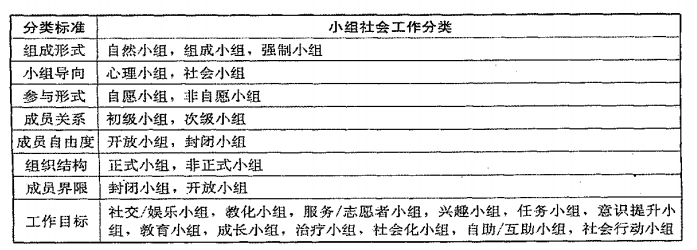

### 1. 小组工作的涵义与特点
#### 1.1. 小组工作的涵义
>小组工作是社会工作的工作方法之一，它在小组工作者的带领下，通过组员之间的相互支持、充分互动和分享，激发组员的能力和潜能，改善组员的态度和行为，提升他们的社会功能性，解决个人、集体、社区和社会问题，促进个人、小组和社区的成长和发展，实现社会和谐、公平、公正发展。

#### 1.2. 小组工作的特点
小组一般有六个基本特性：小组存在于一人以上；成员之间有共同的目标和利益；成员对小组持有认同感；成员之间相互依存和相互影响；小组中有自己的控制方式；形成特定的小组文化和氛围。

#### 1.3. 小组工作的功能**（2013 简答题）**
1.影响个人发生转变
A.当人出现生存能力方面的各种问题或心理行为有偏差时，通过小组过程，可以恢复人的原有能力，达到社会化
B.小组过程可以影响个人的价值观念、态度及行为发生转变，成为家庭和社会中负责任的积极角色
C.通过不同经验的分享，可以丰富和扩大经验和见识，改善人际关系
D.可以使其成员发展面对问题与解决问题的能力，学习适应危机情景，促进个人成长
2.社会控制
矫治性、教育性、治疗性的小组工作，可以通过小组过程使其成员学习遵从适应社会需要的行为规范，培养起社会责任心，在社会生活中担当起积极而有用的社会角色。
3.用集体的力量解决问题
在小组中，小组成员必须学习共同思考、团结协作、共同面对环境。这个过程既会增进小组成员与他人配合解决问题的能力，也可以用团队的力量来共同解决问题。
4.再社会化
小组工作通过帮助其成员建立适应社会需要的新价值观、新知识、新技巧，来改变小组成员的行为，使他们成为更适应社会生活的积极角色。

#### 1.4. 小组工作的类型
关于小组的类型，有多种多样的分类标准。按社会工作的目标，可以将小组划分为：
（1）朋辈小组。朋辈小组的目标是促进成员之间的朋友关系或社会互动。
（2）教育小组。教育小组的目的是帮助小组成员进行相关知识的学习，增进小组成员的知识与技巧。
（3）服务或自愿小组。服务或自愿小组的目标是通过小组过程发展成员的潜能和社会责任意识。
（4）兴趣小组。兴趣小组的目的是通过组织文娱体育等活动，发展和培养成员在社会生活中的特别兴趣。
（5）成长小组。成长小组的目的是帮助成员最大限度地发挥自己的潜能，促进健廉成长的社会情绪。
（6）治疗小组。治疗小组的目的是帮助成员改变反社会的行为或非正常行为，克服个人问题，治意创伤。
（7）社会化小组。社会化小组的目的是帮助成员学习社会技巧，培养能被社会接受的行为模式，增强社会生活能力。
（8）自助或互助小组。自助小组或互助小组的目的是通过小组使成员相互支持、相互影响，实现态度和行为的转变，并解决环境适应问题。

#### 1.5. 小组工作的价值观
1.互助：这种互助式的助人关系，是导致改变的主要来源。
2.尊重组员的权力和能力：强调和重视组员的能力，相信组员有改变的能力和潜能。
3.民主参与和决策：通过民主决策培养组员的民主参与精神。
4.赋权：小组工作者促进个人和小组的自治，小组目标强调个体组员的成长、权利的提升和社会变革。
5.高度的个别化：因人而异，有针对性地设计干预方案；个别化的对特每个小组。

#### 1.6. 小组工作的历史
（1）缘起
①小组工作方法的产生与工业化过程中的社会问题紧紧相连。工业化、都市化带来了人口流动，使城市中出现了大量居无定所、没有生活保障的移民。1844年，在处于工业化发展时期的英国伦敦，一位名叫威廉·乔治的商店学徒创立了世界上第一个青年会。之后，针对青年人的各种娱乐性、教育性小组活动不断地开展起来。
②1851年，“美国基督教青年会”（YWCA）在美国的波士顿成立。1854年，美国基督教青年会全国协会成立，旨在通过组织团体的活动促进青少年的身心正常发展。之后，更有针对性的相近团体美国基督教女青年会（YWCA）也于1866年成立。稍后，一批针对不同对象需要提供服务的团体相继出现。
③1873年，在伦敦成立了以发动居民自助解决移民适应生活问题的第一个睦邻会社“汤恩比馆”。随后，美国芝加哥创立了霍尔馆：在犹太移民中发展起来的犹太人社区中心，及青年希伯来人协会等。这些为贫民设立的睦邻会社，是小组工作发展初期的重要形式。但在小组工作的发展初期，对这种方法的专业认同是缺乏的，也未被纳入社会工作的专业课程。
（2）小组工作的形成
1923年，查德希（Mi1dred Chadsey）在美国西部储备大学开始讲授有关的小组工作课程。1927年，这种以讲授用团体工作的方式来为案主服务的方法的课程被正式定名为“小组工作”（Group Work）。1935年“全美社会工作会议”接受并讨论社会小组工作的文章。1936年社会小组工作研究协会成立。在1946年的“全美社会工作会议”上，小组社会工作研究协会的代表再次强调“迈向专业”的小组工作，使这一意见被大会接受并正式成为社会工作的方法之一。
这一阶段小组工作的方法继续运用于女工、儿童、老人、成人教育、失业工人等方面的实践，即用小组的方法去促进个人的成长，更以小组的形式服务于社会的各个阶层。
（3）小组工作方法的发展
①20世纪40-50年代，弗洛伊德的心理分析理论开始对社会工作领域发生主导性影响。在此影响之下，小组工作进入到医院中，工作者接受并研究医疗模式。
②60年代以来，小组工作进入到多元化发展过程。受民主理论的影响，它已形成了有影响的社会目标、治疗、互动三大理论模式。

### 2. 小组工作的理论与主要模式
#### 2.1. 小组工作的相关理论
##### 2.1.1. 需要理论
（1）马斯洛的需要层次理论
1.生理需要：指人对食物、水、空气、性、睡眠的需要。所有需要中最基本、最有力量的需要。
2.安全需要：表现为人们要求稳定、安全、受到保护、有秩序、能免除恐惧和焦虑等。
3.归属和爱的需要：指一个人要求与他人建立感情联系或关系。高级需要
4.尊重的需要：包括自尊和受到别人尊意。高级需要
5.自我实现的需要：指人们追求自己能力或潜能的发挥和完善的需要。高级需要
（2）舒茨的人际需要理论
主要是阐述人际关系的形成、取向类型以及小组聚散过程特征的理论。了解这一理论会提高工作员在小组工作过程中对成员的行为和成员间关系的洞察力。
1.每个人都有三种基本的人际需要：
A.包容需要：与人接触、交往，获属于小组的需要；
B.支配需要：控制他人或被控制的需要；
C.感情需要；爱别人或被爱的需要。
2.需要满足方式相对的继承性与连续性：童年的人际需要是否得到满足，以及满足所形成的行为适应方式，影响并决定着个体在成人期对待他人的方式。
3.基本人际取向：主动包容型、被动包容型、主动支配型、被动支配型、主动感情型、被动感情型。
4.关于“相容”存在三种人际关系
A.互换的相容：两人在上述六种人际关系上所表达和希望的行为总和相等
B.发动的相容：一个人有意的使自己的表现去和另一个人发生互补
C.交互的相容：双方在某种需要上表现与对方一致
5.小组的形成和瓦解。
与不相容小组相比，相容小组有更大的凝聚力，能有效地达到目标或产生高生产率。形成的三个阶段是沟通（是否留在小组）控制（责任和权力的分配）爱（情感加深，情绪整合）。瓦解的三个阶段是情绪依恋破坏一支配关系松弛一脱离小组。
（3）需要理论对小组工作的启示
1.帮助小组工作员把握小组方向；
2.帮助小组工作员明白小组目标；
3.帮助小组工作员更好地理解组员的互动关系。

##### 2.1.2. 小组动力学理论
研究内容包括小组的形成、维持、发展、小组内部的人际关系、小组与个体的关系、小组的内在动力、小组的冲突、领导方式对小组的影响、小组行为等。勒温始终强调小组是一个动力整体，应把小组的每个部分放在整体中研究。
其中包括场域理论、小组气氛研究、小组凝聚力、小组规范等。
（1）小组动力的含义
小组动力是描述小组在实现目标的过程中，参与小组生命发展的各种复杂力景以及其相互作用及交互方式，这个过程包括小组的形成、启动、发展、成熟、落幕、结束、跟进等所有过程。
（2）小组动力因素分析
1.静态：机构、小组特性、领导者的个人特点、小组成员四个部分。
2.动态：小组的领导方式与形态、小组气氛和凝聚力、成员的参与、沟通模式、冲突和冲突的解决模式、小组的成文与不成文规范、小组的决策过程、问题解决过程等。
（3）小组动力学对小组工作的启示：
1.小组工作是借助小组场工作的一种形式：
2.民主型是小组工作的主要领导形态：
3.共同活动为中介增进小组凝聚力。
（4）组建一个小组，所涉及的内容
1.小组的类型：教育小组、行为矫正小组、治疗小组、自助小组、成长小组
2.小组的对象：同质性的还是异质性的
3.小组的原理：对小组对象及其问愿的研究和理论认识，以及小组设计的理论准备4.小组的目标：是整个小组存在的理由和小组工作的方向，对服务目标、工作者的目标、个人目标和小组目标进行整合
5.小组的名称：既做到名副其实又不会贴标签
6.小组的主题：
7.小组的规模：
8.小组的形式：开放式还是封闭式
9.小组的结构：结构化的、非结构化的还是半结构化的10.小组的时限：是短期的小组还是长期的小组，一共要活动多少次：
11.小组的空间安排：活动场所的考虑、物理环境和成员位置、领导者位置的设置
12.小组的时间安排：聚会的次数、每次聚会的长短、聚会的频率与聚会的具体时间
13.小组的契约形式：目标阐幕、达成目标的方法、维持小组活动的承诺、参与活动的规则、违约责任等

小组凝聚力：
小组凝聚力时指小组成员愿意留在小组的程度。小组凝聚力时小组现象，是小组历程里的结果、组员互动过程后的产品，以力量吸引其组员，把组员与组员、组员与小组紧密地联系起来。组员对小组认同而产生归属感，因而愿意及渴望留下，组员之间结合成一体，共同朝着小组目标进发。

##### 2.1.3. 社会学习理论
（1）社会学习理论内容
1.强调教育和环境的重要性
2.强调人的行为、思想、情感反应方式不仅受到直接经验影响，同时也受到间接经验的影响；
3.行为和环境具有交互作用；
4.观察和模仿学习是学习的重要过程，在学习过程中，认知是非常拿要的；
5.人在学习过程中具有特别的自我调节的功能。
（2）社会学习理论的核心内容
1.观察学习和模仿
通过观察别人的行为及其结果而进行的学习。特点在于学习者并不是通过直接的刺激—一反应模式来学习，学习者不直接介入行动过程本身，不亲自接受强化，不直接做出反应，只是通过观案别人的行为即可学习和获得这个新的行为和反应模式。
模仿是指没有外养控制的条件下，个体受到他人行为的刺激，自觉或不自觉地使自己的行为与他人相仿。（适应性的模仿之人为了积极达到目的而观察别人的行为；选择性模仿之人们经过思考有选择地选取模仿行为）。
2.替代强化
在社会学习理论中，班杜拉强调人们通过观察别人的某种行为受到赞赏或惩罚就可以得到强化，这种强化被称为替代强化。
3.认知的重要性
学习的成功很大程度上在于个人的认知能力的发挥。
交互决定论
人及其环境互相称为各自的决定因素，人的行为可以被解释为认知、行为和环境诸多决定因素之间连续的、互惠的、相互的结果。
（3）社会学习理论对小组工作的启示
1.社会学习理论强调人们通过观察和模仿他人的行为就可以获得改变，形成新的行为方式，对此，小组可以向成员提供一个行为汇总，组员通过观察、模仿和学习，增加个人的适应性行为；
2.小组可以提供丰富的替代强化资源；
3.班杜拉强调学习过程中认知的重要性，对人的尊严和能动性给于充分肯定。这会使工作员在带领小组时更有信心，也更能放松。

##### 2.1.4. 镜中自我理论
（1）镜中自我理论的内容
库利是最早提出自我发展理论的社会学家。与自我发展相关的三个观点
1.人与社会的关系
库利将人和社会对立、剖裂开来。社会是一个有机体，是一个通过互动而存在和发展的各种过程的复合体；社会是一个统一体，在这个社会庞大的互动组织中，它的任何一部分变化都不可避免地会影响到这个有机体所有其他部分。
2.镜中自我
库利理论的核心概念。在与他人的互动过程中，我们通过感知他人对我们的反映和评价，从而建立起我们的自我意识、自我形象和自我评价。
3.首属小组
库利首次正式提出并使用了首属小组这个概念，它指那些亲密的、面对面的交往以及有直接互动和合作的小组。主要包括家庭、邻里以及儿查的游戏伙伴。它是对人的成长和发展影响最深远的小组，很多积极的品质和消极的品质都是在其中获得并强化的。
（2）对小组的启示
1.小组是一个微型的社会缩影，是一个通过互动而存在或发展的有机体；
2.小组工作所提供的密切的互动和真实的回馈，可以帮助组员在小组中感知他人对自己的反映和评价，建立更正确的自我意识、自我形象和自我评价；
3.重视首属小组的作用，特别是家庭对个人成长的影响以及给个人终生发展打上烙印，是许多理论都涉及到的观点。在小组中，尤其是治疗性的小组适用。

##### 2.1.5. 交流分析理论
（1）理论的内容
1.波恩于1959年创立的以精神分析为基础的心理治疗的理论和方法。
2.社会交往就是相互影响的过程，当两三个人或更多人互相碰在一起时，迟早某人要说话或者向其他人致意，这叫相互刺激，另外的人会说一些或做一些与这种刺激有某种联系的事情，叫相互作用反应。
3.目的是了解在我们的交往过程中，双方的关系是相辅的、互补的，还是矛盾的、冲突的。帮助人们了解自己与他人互动的实质，对人际关系获得深刻的领悟力，从而促使当事人改变生活态度，建立更成热，更有自尊的人际关系。
（2）核心内容
1.关于自我状态：
A.父母状态（父母意识）：由父母或父母型人物的行为内化而来，是个人脑中早年获得的印象深刻的外部经验，包括“必须”和“应该”；
B.成人状态（成人意识）：注意事实资料的搜集，能在客观的立场上冷静分析；C.儿意状态（儿童意识）：常凭感觉，这种状态一方面表现为服从性，另一方面又表现为任性胡闹。
2.沟通状态：
A.互补型：刺激和反应是平行的，一方发出邀请，另一方做出回应；
B.交叉型：交错型交流，指当一个人发出信息后，没有得到预期的反应；
C.隐含型：“暧味型”交流，总是涉及两种以上的自我状态，真正的信息未明确表达出来，而是隐含在另外的社交客套的交流中。
3.人生的四种基本态度：
A.“我不好一一你好”抑郁型：依赖他人的施含，需要被爱抚和承认
B.“我不好——你也不好”严重精神紊乱或厌世者的态度：放弃自我，陷入绝境
C.“我好—你不好”怀疑和独断的态度：孤做和仇视一由于童年长期受父母虑待和侮辱
D.“我好——你也好”德廉的生活态度：认可自己也认可他人，有积极的情感。
（3）对小组工作的启示
1.交流分析理论解释和描述了人与人之间的互动、沟通，因此非常适用于小组工作，尤其是治疗模式和发展模式的小组工作；
2.交流分析理论对人格的描述，尤其是强调个人的三种自我状态的自然出现，可以帮助我们在小组过程中分析和领悟自己的人格结构，学习顺畅地与他人沟
通：
3.小组可以帮助当事人把焦点放在个人的早年生活上，帮助组员了解自我的生活态度、沟通形态以及个人的能力不能发挥与个人早年束缚的关系；
4.小组可以提供一个互动的情景，使成员可以尝试和练习新的沟通方式，增加他们的自我察觉，改变他们的生活态度，最终开始新的生活。

#### 2.2. 小组工作的主要模式**（2016 简答题）**
##### 2.2.1. 社会目标模式
最早的小组工作模式。社会目标模式是透过一系列原则和方法培养成员的社会责任感、社会意识和社会良知，原则是在小组中强调参与、共识与任务的完成，更重要的是强调自我了解和专业训练。
（1）理论基础
1.参与、意识提升和赋权
A.社会政治民主理论的假设：第一，主权在民，参与是人民的一种民主权力；第二，沟通、理解和平等都是从对话开始的；第三，教育也是一种权利。基于此，参与可以学习民主的技能，可以激发个人的潜能，可以提升人的意识；对话可以增进不同人群的理解，可以促使不同群体平等关系的建立；参与过程也是一个民主化教育的过程。
B.赋权：赋权既是一个过程也是一个结果，它实际涵盖了三个层面：
B1.个人层面的赋权：发展一个更加积极的更具有影响力的自我意识；
B2.社区层面的赋权；获得知识、提高能力，以面对个人周围的社会政治环境有一个更具批判性的理解；
B3.社会层面的赋权，获得更多的能力和资源，以实现个人和集体的目标。
C.弱势群体：从社会竞争和社会利益的分配角度分析问题。弱势群体在经济利益和社会权利方面处于弱势地位，缺乏自愿和机会。这种状况是由社会的经济和政治制度所造成的。社会政策和社会利益分配制度的不公正安排使弱势群体失去了争取平等的机会。
2.系统功能理论
A.假设
所有的有机体都是一个系统，由附属于母系统的次系统所组成，系统内部各组成部分是相互联结的，并发挥各自独特的功能，以保持系统内部的平衡，使整个系统稳定地向前发展。每一个系统都是有环限的，异限内彼此互动维持着系统的能量。系统的界限也是开放的，与其他系统互相渗透。
B.强调的四个原则：
B1.目的性原则：任何系统都必须具有目标，这是系统存在的前提：
B2.整体性原则：就是“整体大于部分之和”，整体论认为系统的任何一个部分如果离开整体就失去它的系统功能；
B3.层次性原则：系统作为一个整体，绝不是各部分简单相加，而是层次结构相互关联着的整体；
B4.动态性原则：系统是一个随环境不断变化的动态过程，环境变了，系统的目标、原则、方法等也必须随之调整，这样才能适应动态的环境，也才能在新形势下求发展、求进步。
C.启示：
C1.小组是由不同元素所组成的系统：
C2.小组是基于整体性的原则而建立起来的，小组的每个成员都要发挥各自的功能，才能使小组的整体功能最大化，带动成员真正的改变；
C3.小组必须建立总目标和过程目标，帮助组员达成目标是小组的归宿；
C4.小组的过程是一个动态化、情境化的过程，小组处于不同的发展阶段和处境中，小组工作者的角色和方法技巧是不同的。
3.社会变迁理论中人的发展与社会发展的关系
A.社会变迁理论可以说是社会结构和社会过程的量变和质变，在社会结构和社会过程的改变中，人的社会行为、社会关系和社会发展紧密相关，社会发展必然受到人的社会行为和社会关系的影响，人与社会发展是一个“社会过程”，它包含前后相继的两个层面：一个层面对社会互动的过程（社会行为的互动必然导致关系和削度的变迁，互动过程实质上就是制度化的过程）；第二个层面是制度化过程，制度化包括两层意思，制度的形成和完善、制度的改革。
B.社会行为的互动关系推动着社会结构和社会过程的变迁。社会目标模式下的小组工作就是通过社会行为的互动关系，推动社会制度的完善和改革。
（2）社会目标模式小组工作的内容和具体应用
1.总目标
培养小组成员的社区归属感，实现社会整合。分三层次：
A.发展和提高小组成员的社会意识和潜能，同时发展提高他们实现社会变迁的责任心；
B.发展小组成员的社会能力，提高他们应对社会环境方面的个人能力，增强他们的自尊心和社会能力；
C.培养当地的社区领袖，使他们有醴觉和能力去带动推动社会变迁。
2.小组
A.小组作为一个整体有共同期待的社会目标，即社会变迁：
B.小组成员为了社会整体利益有一套共同信仰的价值观；
C.小组作为一个行动整体共同辅助社会行动；
D.小组成员在社会行动中逐步自我完善和发展。
3.组员
社会目标模式下的小组成员可以是全社会的所有公民，特别是鼓励那些社会弱势边缘群体参与。一般，属于同一社会分层，居住在同一社区或者有相同背景的民众容易聚集在此类小组。
4.工作者
开始和结束阶段是倡导者、引导者，中间阶段是使能者、资源提供者或榜样的角色。
5.实践原则
A.对工作者而言，让组员充分自决；
B.对小组而言，强调民主参与、组员共识和小组任务的达成；
C.对联系机构和社区而言，工作着要向每一个组员闹明机构、社区的政策和信念，积极克服其限制，充分利用机构和社区资源。
6.优势和限制
A.优势
A1.符合社会工作者原初追求社会公正和社会关怀的理想，将个人问题与其所处的社会环境或社会结构联合，强调个人问题的解决与社会结构问题解决相关联；
A2.通过小组工作发展社区组织，通过社区组织进行社区教育，以提升民众意识，达到社区赋权的目的。
B.限制
B1.过分依赖意识形态，使它的理论基础薄弱缺乏系统性；
B2.过分注意组织力量，忽视了个人的独特需要，缺乏对个人动力的认识，解决群体需要优于解决个人问题。

##### 2.2.2. 互惠模式
互惠模式，又称互动模式或调解模式，主张者是施瓦茨，他认为在助人的过程中应该强调个人与社会的关系。
（1）理论基础
理论基础是系统理论、场城理论、互动和沟通理论。关注子系统和整体系统的关系，而非成员个人本身，同时它也关注小组成员被此的沟通和互动。
1.系统理论中人与环境关系的论述
A.佩恩认为，每一个系统都会有三个可供选择的协助人生活的系统：
A1.非正式和自然的系统：家庭、朋友、同事：
A2.正式系统：社区等；
A3.社会系统：医院、学校等。
B.系统的适应性要求小组必须根据环境的需要而变化。所有系统都与作为整体的小组或作为子系统的成员是互动的，小组成员之间必须相互沟通和接纳。
2.场域理论中的行为环境论、生活空间论和此时此地的概念场城理论总体是指人的每一行动均被行动所发生的场域所影响，而场域并非单指物理环境而言，也包括他人的行为以及与此相连的许多因素。
A.卡夫卡一行为环境论：环境分为地理环境（现实环境）和行为环境（意想中的环境，心理物理场，由自我和两极现象构成）。卡认为行为产生于行为环境，即心理物理场。
B.勒温一《拓扑心理学原理》一生活空间论：强调心理的需求和意向的作用，正是这种心理的需求和意向的作用，使生活空间产生了场的动力。他叫引力或斥力。勒温的生活空间包含三层意思：
B1.构成生活空间的要素是人和环境，而这个环境只有在同人的心理目标相结合时才起环境作用，即生活空间成立；
B2.生活空间是有动力的作用，表现为吸引力和排斥力，这些动力作用驱使一个人克服排斥力，沿着吸引力方向，朝着心理目标前进；
B3.生活空间的动力作用是逐级展开的，行为者越过一个个带壁的领域，最后实现目标。
C.此时此地：认为过去的生活经验会对现在的时间产生间接影响，而不是直接导致现在的行为。它更强调此时此地的期待、自我评价与记忆等因素对人行为的影响。
D.总之，场城理论相信每一个人的行动均被行动所发生的场城所影响，而场域也并非单指物理世界，也包括他人的行为以及与此时此地相连的诸多因素，而且这个场域是此时此地发生的，所以，互惠模式关注的既在于个人也在环境，要通过个人、小组和社会系统间的开放和互相影响以达到增强个人与社会的功能。
3.“镜中我”、自我观念和符号互动论
A.库利
Al.注意个人与社会的联系，认为个人和社会是同一事物的不同侧面，前面是分布侧面，后者是集合侧面。
A2.一个人关于自己人格的自我概念是凭借他人关于自己的评价而形成的，这一“镜中我”的概念，为后来自我论的发展奠定了基础。
A3.库利从社会我思想引申出第一群体的概念。他认为，从个人与他人的接触方式看，一个人首先接触到的是家庭、伙伴和邻里等，面对面、直接的，有着亲密关系的群体，是一个人获得社会性、获得人格的原始的基本群体，他叫第一群体，也叫人格群体，与此不同的是，通过电话、书信等间接接触的群体，他叫第二群体，或叫非人格群体。
B.米德是符号互动论的集大成者
B1.个人社会行为是其所属群体中规范行为内化的结果，米德社会行为主义强调社会相互作用和意识与个人行为的不可分割的关系。
B2.相互作用论特别表现在自我论：包括三个概念：自我（人的特点是有自我，就是人在客观地对待社会环境的同时，也客观地对待自己，把自己置于环境当中的某一确定的位置上，并加以客观化）客我（人与他人交互作用过程中把自己对象化，并加以主观规定的产物，客我以客体面貌出现，并受社会制约）主我（对他人态度进行的主体反映）
B3.阐述了个人社会化的问题，把个人行为置于社会结构中去考虑，“角色”概念在其社会相互作用中很意要。
角色是个人在社会互动中，一方面得到社会期待，另一方面遵照他人角色或社会规范等获得的。
C.布卢默：符号相互作用论：
C1.人生活在一个符号和物理的环境中；
C2.经由符号个人有能力去刺激他人：
C3.经由符号沟通，个人从他人身上学习到大量有价值和意义的东西；
C4.这些符号、意义、价值等，是以一种群体的方式，大量复杂地存在着；
C5.思考是一个过程，透过这一过程可以抉择一个行为。
4.对小组工作的影响
A.人类的行为与互动是由“符号”及其意义引起的，人类是对刺激作出能动的反应，并且赋予新的社会意义；
B.人是在与他人的互动中实现人性化的，所以人类是互动过程的产物：
C.互动中的人组成最优群体，只有充分发挥小组的作用，社会才能不断进步；
D.人类在互动中积极地塑造自己的行为，所以互动强调社会过程；
E.人类群体必须承认环境的影响并自觉适应环境；
F.个人在小组中担任各种不同的角色。
（2）互惠模式小组工作的内容和具体应用
1.目标
使小组成员在社会归属和互相依存中得到满足，要在小组成员之间、小组之间和有关的社会系统之间，达到互助和开放。目标可能是预防性的、补充性的和复原性的。
2.小组
有一个共同目标并且是一个互助系统，也是解决问题的必要条件。一个健全的小组应包括：提供成员之间彼此平等认同的机会；提供使多数人归属的温暖感觉；有表现自己、表达自我和维持自己在群体中独立性的自由；有选择自己朋友的自由，但不得已必须接纳对方时，应负起责任；应向成员提供表现个性及与他人分享的机会；向成员提供学习和独立生活的机会。
3.组员
平等地位的个人。
4.工作者
协调者（不设计方案，不直接控制小组，而是提供信息引导小组自主发展，帮助组员协商以使问题迅速解决）；调解者；使能者。
5.实践原则
A.启发组员主动思考问题，寻找共同点，自主确定并强化发展目标；
B.澄清和说明自己与小组的角色，从而订立一个明确的契约；
C.以诚实的态度提供信息、协调关系，充分利用社区资源为小组服务。
6.优势和限制
A.优势
A1.注重成员的潜能和互助系统，突出了社会工作者助人自助的理念；
A2.小组的目标来自成员的互动和讨论，有利于成员发挥能动性和培养自我意识；
A3.成员自主选择恰当的介入策略去解决自己面临的问题，防止外界的价值干预。
B.限制
B1.对小组中个人期望和个别化的关注不够，对成员个人改变程度的评估也不足；
B2.工作者的权力不够，使工作者难以用自己的权力影响小组过程。

##### 2.2.3. 治疗模式
治疗模式也称预防与康复模式，是以治疗个人为小组的任务，同时也提供个人的预防和廉复的一种干预方式。
（1）理论模式
应用经典的精神分析、行为认知、人本主义三大派别等的重要理论。
1.精神分析小组（沃尔夫）
A.目标在于重建个人的性格和人格系统，这一目标通过使潜意识的冲突进入意识层面，并对其进行检验而达到的。
B.心理分析小组以一种象征的方式再现个人的原生家庭，以便使每个成员的历史在小组面前重演。使用的心理分析技术有移情、自由联想、梦的解析。治疗过程在于再创造、分析、讨论、解释过去经验并解决潜意识层面上发生的防卫和抗拒，解决成员在儿童期产生的功能失调的模式，并在新领悟的基础上做出新的决策。
2.阿德勒式小组
A.人的基本问题与这个人希望自己成为什么样的人以及个人为之所做的努力有关。
B.阿德勒认为人主要是由社会因素（如个人目标）所驱使的，而非生物性的因素（如，性驱力）所驱使的。
C.阿德勒用目的论的解释取代了决定论的解释，即人的生存是有目的有目标的，是受对未来的语气所推动的，决定我们的不仅是过去的经验，而且包括现在的情形和我们对未来的期望。这三个向度动态有机地结合在一起。
D.阿德勒强调自我和意识是人类的核心，人们在实现那些对我们有意义的目标过程中建立起一种独立的生活方式，心理和行为问题都是不良的生活方式、不正的追求目标，以及不德全的社会兴趣造成的，强调治疗是一种激励和教育模式。
A.含义：小组领导者引导小组成员以戏剧化角色表演出来，在其中经历过去、当前或预期的生活情形，就好像生活是戏剧情景一样。目的：通过角色扮演的方法帮助人们以一种自发的、戏剧化的方式表达感受，并在这个过程中获得更深的自我理解和情绪宜泄，接受有关这些角色的回馈。方法：可以成功引导成员进行积极的小组互动，探讨人际关系，尝试接近生活中意要的人，并减轻个人的孤独感。
B.强调个人的自发性和创造性；也强调不论表演过的或未来考虑的事件，一个基本的值条是探讨那件事情如何影响了个人现在的生活。
C.构成包括导演、主角、配角、观众等，前后经历暖身、表扬、讨论和分享等几个阶段。
4.行为治疗小组
A.行为治疗小组是指以备种学习理论流派为基础建立起来的多样化的技术和方法的应用。
B.基本假设是：所有的行为问题，非理性的认知方法、情绪，都是后天学习的结果，他们可以经由新的学习历程而得以矫正，从而发展出一套控制自己的人生、有效处理当前和未来问题的方法。
C.特点：在治疗过程中需要详细的目标、具体的说明、及时的测量和记录、评价和治疗是同时进行的。
D.内容：行为的评估、确切地说明治疗目的、确立适合于特定问题的具体治疗方案、客观地评价治疗效果。
E.常见小组：社会技能训练小组、背定训练小组、压力管理小组、自我指导行为改变小组和拉扎勒斯的多重模式治疗小组。
5.完型治疗小组（泊斯）
A.前提：个体必须找到自己的生活道理，并接受个人的责任。
B.目的：
B1.激励案主从“环境支持”转变为“自我支持”，“使病人不再依赖别人，而是发现、发展和肯定自己的潜质，明白人可以自主，可以采取主动，可以做更多的事，拥有更丰富和更全面的生活”。
B2.获得自我的觉察。
C.主要概念：“此时此地”，“觉察与责任”，“未解决的问题与回避”“神经症层次和防卫机制”，“能量与能量的阻滞和疏通”。
D.基本原则：利用现时的小组经验、小组察觉过程和小组参与者之间的积极互动，鼓励成员随时随地地觉察他们在小组中的角色和他们作为社会成员的角色。
6.交流分析小组（波恩）
A.基本假设：我们基于过去的经验来做现时的决定。但其实过去的经验对现在可以不再有效，因此，这一理论强调个人如何增强觉察能力，能够做出新的扶择，并因此改变他们的生活历程。
B.要求：
B1.成员学习如何从功能上识别自我状态：父母状态、成人状态、儿童状态。
B2.学习和了解现在的行为如何受到他们在儿童时所接受和形成的规定和原则的影响。
B3.了解和确认他们的“生活脚本”。
C.作用：交流分析小组凭借小组组员的互动，可以帮助案主改变那些妨碍他们正常生活功能的部分，认识到自己的现在可以意新决定，并开始一种新的生活导向。
7.案主中心的小组（卡尔·罗杰斯）
A.假定是：人类倾向于朝着健康和自我实现的方向去发展。
B.强调小组领导者的个人品质，而非领导技巧。
C.案主中心小组的核心概念：发展小组历程中的信赖，提供成员成长的治疗性条件，这个条件主要有三个因素，即真诚、无条件的积极性关怀和温暖、同理的了解和倾听。
8.理性情绪治疗小组（阿尔法特·艾莉丝）
A.艾莉丝认为每个人与生具有理性、直线思考和非理性、曲线思考的潜能，情绪的困扰来自那些个人的自我挫败的非理性信念。该小组主要采用主动性和教导性的技巧，同时挑战案主的那些非理性信念，促使其以理性的信念体系取代非理性的信念体系。
B.在小组中，主要帮助来主寻找其情绪困扰的根源，即个人的那些非理性情绪。
C.人格和情绪困扰的A-B-C理论：
A（直接的触发事件）
B（人们对该事件持有的信念系统）
C（事件发生后产生的情绪反应）
D（驳斥非理性情绪）
E（产生新的积极的情绪和行为）
D.适用于小组的原因：
D1.小组成员可以彼此提醒接纳现实；
D2.可以互相提供建议、评价、假设，可互相发现问题、提供反馈；
D3.可在他人的改善中学习和采取行动：
D4.可提供一个教、学、讨论与演练的实际环境。
9.现实疗法小组（戚廉·葛拉悉）
A.着重于解决问题，适合社会中现实的要求。
B.过程：案主先陈述自己的欲望和需求，接着评价自己可能遇到的挑战，并拟定一份计划书，然后按照计划去付诸行动。
C.葛拉悉认为每个人都有一般“成长驱力”这股驱力会推进个人进行改变，因此也叫抑制理论，旨在帮助个人更好地控制生活。
D.强调组员对自己的行为负责。小组需要先协助组员划清异限和异定目标，然后看目标实现过程中可能的障碍，进而进一步探索达到目标的不同方法和途径，制定计划，并坚决完成计划。
（2）治疗模式小组工作的内容和具体应用
1.目标
治疗模式是以治疗个人为小组目的的，它的目的就是帮助个人通过小组达到心理、社会与文化的适应。
2.原则
如果是为特殊群体开设的小组，特定的治疗目标会成为小组的目标；工作者经由小组中每个人的治疗目标总和来界定小组的目标。
3.特点
A.着眼于矫治、治疗、人格意建等过程，因此也被看做是再教育的过程；：
B.它包括对现在和过去事件的潜意识的觉察和了解，有些小组也用来矫治妨碍个人功能的情绪和行为障碍，其目标在于个人人格结构的转变，因此，治疗小组常要持续较长时间；C.由于组员的特殊性，治疗模式会比较信赖专家的判断和专业化指导。
4.组员
入组的评估非常意要。组员通常有较严意的情绪问愿、行为障碍、人格问题、精神异常或有社会行为偏差行为的人。下面病例不宜入组：严重抑郁、赚狂病人、精神分裂症急性期、反社会人格、偏执人格、极端分裂人格。
组员一般需要矫治性的治疗，而不仅仅是发展性和预防性的帮助。
5.工作者
通常是临床心理学家、精神医学家或临床社会工作者。
6.实践原则
A.开组前材料收集和评估，充分考虑个人和可能性问题；
B.工作者与小组成员之间需要明确的契约；
C.确定理论倾向：与组外关系联结.
7.优势和限制
A.优势
A1.建立了丰富的治疗体系，不同的治疗理论和技巧都有各自的优势；
A2.只要能够很好地评估案主的情况和需要，并根据小组发展的不同阶段的特点，灵活运用各种治疗手段，治疗模式仍是小组工作的经典方式。
B.限制
B1.不太注意案主的互助系统，在某种程度上限制成员潜能和能动性的发挥；
B2.目标一定程度由外异决定，工作者可能面对很大的阻抗，工作员需要给予额外的关注。

##### 2.2.4. 发展模式
（1）理论的基础和指导思想
1.理论基础
由三个方面组成：发展心理学；社会关系和社会结构理论：小组动力学。
A.发展心理学强调个人具有成长的可能性和潜能；
B.社会结构理论意视小组的现状，小组组员之间的互动功能；
C.小组动力学则重视小组成员间的关系，强调小组内部的机制能够解决组员间矛盾，帮助组员获得成长。
2.基本原则
发展性模式：顾名思义，是强调以人的发展为核心的。
A.社会工作者职业关注的是人的社会功能的提高。
A1.恢复个人社会功能；
A2.预防个人社会功能的失调；
A3.发展个人更加和谐的社会功能
B.发展性模式关注的是个人的社会功能性，而非病理因素，戴视自我实现，而非治疗过程。因此此模式强调的是怎样发据个人的能力，寻求问题的解决方式，而非关注个人的弱点，解释个人的防御机制。发展模式特别强调，人有潜能能做到以下几点：
B1.自我意识、自我评价和自我实现；
B2.意识到他人的价值；评价他人，与他人互动；
B3.意识到小组的情境，评估小组的情境，并在小组中争取行动。
（2）发展性模式的内容和具体应用
1.目标（特罗普）
A.宜泄阻碍个人有效完成社会行为的负面情感；
B.通过小组的归属感，为组员提供支持，发掘内在能力：
C.得到接纳和关心；
D.通过表达、成就感和小组的认同，提高自尊；
E.现实的导向，明白他人与自己有同样的生活经历，了解他人的挣扎和应付过程，他人是怎样看待自己的；
F.自我欣赏，清楚地认识自己和他人，了解更多的应付生活困难的方法，增强角色能力和对自己生活负责的能力。
2.工作员
在发展性模式中，工作员的角色非常重要。一旦小组成立后，工作员必须与组员就小组的目标、功能和结构达成一致意见，工作员的工作主要放在以下三个领域：小组目标的实现、人际关系、个人的自我实现。
A.小组目标的实现：
A1.标准（小组的有效性、活力和责任感）：
A2.任务：帮助小组选择、完成小组的特定任务，从而实现其整个目标。
A3.采用方法：鼓励、促进、幽默、认可、启发、同意、挑战、表扬等。
B.人际关系
B1.工具性互动形式：如鼓励、支持、帮助、反对、限制、冲突、联合、协助、（使用、服从、反对、分享）权威。
B2.表达性互动形式：对他人的反应以及对小组活动的反应。
C.个人的自我实现：自我实现通过小组目标的达成而体现。
3.适用人群
发展性小组模式适合在各种人群中运用，它既可以是救助性的，帮助一些缺乏信心或社会适应有问题者，培养他们的自信心，协助个人成长，从而适应社会变化；又可以是锦上添花性的，为个人、群体和社区进一步发展提供空间和可能性。
4.优势和限制
A.优势：广泛运用于不同状况的小组，在此类小组中，组员不会被贴上标签，没有压力。
B.限制：实践过程中，强调的是一种成长的信念，而成长本身是一个难以测量的概念。有人批评之缺乏科学

### 3. 小组的发展阶段**（2013 简答题）**
#### 3.1. 前属期阶段
小组的开始。成员刚进入小组，试图尝试与素不相识的他人建立初步关系，但他们的心理状态是观察和探求身外环境，对他人既接近又回避地保持着戒备，处于矛盾的困境。社会工作者的鼓励会有助于促进成员改善、觉莱外部条件，帮助他们尽快适应。工作者鼓励成员表达他们对小组和其他人的期望，社会工作者在这时可通过组织一些有助于成员们相互了解的项目，帮助他们成为热人，但成员之间还比较难以合作。

#### 3.2. 权利和控制期
成员们与其他人慢慢相处后，开始发现在小姐中如何得到安全感和回报，将试着通过权力竞争与控制的过程，认识和确立自己在小组中的角色。在这个过程中成员间的互相影响大，会形成小组成员在小组中不同的角色、地位、关系，并形成小组组织结构的初步。个别成员如果不能从小组中感受到安全和满足就会在这个阶段退出。但同时，对成员来说，无论在心理上成生理上，考察和斗争，有意或无意伤害他人或被他人伤害的机会也会上升。

#### 3.3. 亲密期
小组成员更加亲密了。他们更加开放，关心小组，关心其他成员，投入增强。成员开始公开比较小组生活与家庭生活。会出现同胞式的竞争，也会发生从家庭成员到小组成员的移情，同时开始意识和承认小组的经验在他成长过程中的重要性，开始思考小组的目标。

#### 3.4. 分辨期
形成良好小组的时期，成员被此熟识和聚合，能接纳其他成员的个性、卖力、态度和需要，对小组有较高的认同，家庭式的情感减弱，小组的规范和标准成为行为的思考，或成员间权力的竞争和情感被动趋于缩小，能够相互支持、自由地沟通。成员们更联合、更客观、更合作，以致能提出更现实的建议和计划，并实施大型的方案、项目。

#### 3.5. 分离期
进行到终结并且小组目标已经实现。成员们面临分离，开始在其他地方寻找新资源以满足他们自己社会的、娱乐性的和职业的需要，在转移和打破中已经建立的成员间的默契关系中会出现的许多焦虑，如内聚，反对小组解散，情绪反复，站避现实。

#### 3.6. 后期的小组成员的特点
（1）拥有不同的情绪特征
①正面的、积极的情绪
小组组员在小组中具有正面、积极的情绪体验。他们通过参加小组活动，进一步增强了对自身的认识和了解，自我不断完善，组员的自我形象和社会功能也有所提高，有能力去面对和支配自己的生活，也会热切期待在未来的生活中可以实践在小组中学到的东西，对自己的将来有一份美好的憧憬。而且，部分组员已经能在组外获得满意的经验，并能与他人建立良好的人际关系，这一切使组员的自我能力明显增强。
②负面的、消极的情绪
a.担忧、失落
经过一段时间的相处，组员之间已建立起密切的、支持性的组内人际关系，面对即将分离，组员难免有些悲伤和失落，部分组员亦会对将来能否建立一个互相信任与接纳的社会关系产生担忧，进而会产生一种被小组遗弃的感觉，初期加入小组的落窦感再度升起，拒绝分离。
b.否认、逃避、行为倒退
小组的即将终结，一方面会对组员产生一种压迫感，另一方面也会提升起他们对小组经历的眷恋，为了使小组能延续下去，他们会采取逃避的态度，否认小组即将结束的事实。此外，成员亦会用一些倒退性的行为来对抗小组的分离。
c.对外面世界的担心
参加小组的组员中，很多都是对外面世界状况适应不良者。在小组活动过程中，组员经过波折，与小组建立起接纳、肯定、相互支持的关系，这种愉快的体验反过来又使其对外界的人和事产生忧虑和担心，害怕自己适应不良，对自己的能力产生质疑。小组的解散意味着他们要独立面对许多新的情况，于是导致其产生无所适从和莫名的忧虑感等。
（2）组员之间的联结呈现松散状态
小组后期，小组的影响力和小组规范的约束力都逐渐减弱，组员间的联系也比较松散，互动频率和强度相对降低。同时，小组成员开始将部分精力转向对外界的联系，为适应实际生活做准备，也有人由于害怕小组结束带给自己伤感，采取“自卫”行为，及早离组或对小组投入的感情减少，从而降低由于小组分离对自身的伤害。

### 4. 小组工作的原则与技巧
#### 4.1. 小组工作的实践原则
（1）认可每个人的独特个性以及行为的选择性；
（2）认可小组是多种多样的及行动是多样化的；
（3）真诚地接纳每一个人；
（4）建立有目的的助人关系；
（5）鼓励及促使小组成员之间实现有益的合作关系；
（6）适当地修正小组过程；
（7）鼓励成员根据自身能力参与小纽活动；
（8）促使小组成员投入参加解决问题的过程中；
（9）鼓励小组成员通过冲突去体验不同解决问题的方式：
（10）为小组成员提供多种新机会；
（11）明确地运用制约；
（12）有区别地运作工作方案；
（13）对个人和小组的进步不断进行评估；
（14）热诚、人道和严于律己。

#### 4.2. 小组工作的技巧
##### 4.2.1. 小组工作的一般性技巧；
①建立关系的技巧。小组工作者要通过一定的方法和策略与成员建立良好的专业关系，并促进成员之间建立良好的关系。
②观察的技巧。小组工作者要能够灵敏、细致地观察和判断个人、小组所面临的环境与需要解决的问题，以确定适合的小组目标和解决问题的方案。
③组织和介入的技巧。小组工作者要能够组成小组，介入小组出现的问题、冲突、突发事件等，把握和推进小组工作进程，在目标实现后结束小组。
④领导的技巧。小组工作者有时是以小组领导的角色出现的，因而要适当地运用专业技能与权威，主导和推进小组的进程。
⑤沟通的技巧。小组工作者是促进内部沟通和外都沟通的桥柔，自身要与成员沟通，也要促进成员之间的沟通，并且与小组外部的环境，如机构、社区、人员等进行的通。
⑥参与小组活动的技巧。小组成员自己设计了各种活动方案，小组工作者要愉快地投人其中。
⑦运用社会资源的技巧。为实现小组的目标，小组工作者要善于调动社会的各种资源，包括人力的、机构的、新闻媒体的以及社区的资源。
⑧评估小组过程的技巧。小组工作者要给小组的各种活动订立指标，并做出评估。

##### 4.2.2. 有效促进沟通的技巧
①注意信息传递的外部环境。外部因素会阻碍或影响沟通。如房间太大、太小、太嘈杂或者缺少隐秘性，会干扰信息的传递；明朗的空间环境则更有利于成员投入小组活动。
②注意语言的选择。首先，要使用易于理解的短语发出信息，并通过这些语言尽快地促进小组成员产生信任，从而及时得到反馈。其次，有效地接收信息，正确理解所获的信息及其内涵，对不清楚的内容及时简短地讨论明白。
③提供合作性的目标。提供合作性的目标和活动，能够改变小组成员间的关系，共享信息共同工作，促进有效的小组沟通。
④关注和调整小组中的互动模式。小组成员相互间谈话的频度和程度、谈话的顺序、打断他人的方式有时会影响沟通的顺利进行。对总是说得太多或不断地谈论同一题目的成员，小组工作者必要时可运用语言阻拦他们，以给他人更多的表达机会。对总是沉默或回避去谈某个特别题目的成员，要支持他们发表意见，给他们以鼓励和信心。社会工作者也可以通过改变小组成员之间的座次、谈话顺序、采用语言或手势等，推动讨论继续进行。

##### 4.2.3. 组织会议的技巧
1.组织会议的技巧
①形成良好的开始。在会议的开始阶段，小组成员之间基本是互不相识的，小组工作者应该通过介绍使他们相互认识。然后要分发有关会议通报和文章，清楚地国小组成员间明会使每一个人都知道会议期间要做些什么。会议开始时，可以修订议程，即证求小组成员对议品的意见。如果他们觉得有必要，可对会议议程作出修改。
②把握讨论的进程。会议的中同阶段，通常是需要完成主要任务的过糙。把握好讨论的进程，将有助于小组完成大部分任务，促进小组成员解决间题。在会议进行过密中，小工华者要注意把握主题，帮助小组成员遵照会议议程和关注讨论的话题，不能转花话题。小组工作者应阐明讨论的题目、程序和步骤以便小组成员了解。同时，要收集和提供信息帮助小组成员更好地投入讨论，保证讨论顺利地进行。另外，讨论中要注重发展新的小组规范。”
③做好总结。小组工作者对成员们在讨论时提出的各种各样零碎杂乱、互不相关、抑或是有冲突的观点或意见，要及时恰当地进行归纳和总结。要帮助小组成员把精力放在特别重要的讨论问题上，使他们对自己的观点更明了，讨论更有效果。
④完善的结尾。要控制讨论的时间，使每一个议题都能得到充分讨论，又不至于匆忙下定论。在时间条件不充分时，优先考虑主要议题。在会议结尾时，要总结讨论过的议题，阐明讨论中得出的结论，阐述需要进一步跟进和关注的问题。

2.小组工作者在小组会议中的角色
（1）示范者。以身作则，向小组成员示范他所希望的行为，表现出发自内心的尊重、负责和诚实。
（2）促进者。小组工作者不是小组的主人，他不可将自己的意愿和主张强加给小组成员，而应该鼓励小组成员的参与，促进小组成员自己解决问题。
（3）调解人。争论或争执总会发生，在这时，小组工作者应保持中立，帮助小组成员澄清问题，提供可供参考的信息，引导他们理智地做出决定。
（4）支持者。支持小组成员已取得共识的解决问题的计划，促进他们有信心地完成计划。

##### 4.2.4. 领导小组的技巧
（1）小组领导的含义：在小组运作过程中，负责组织、带领和引导小组成员走向和达到小组目标的人
（2）有效的小组领导者的特质：
1.自我察觉和自我了解
2.自我接纳、自爱自信
3.真诚、愿意对质自己
4.敏感与及时的回应
5.温暖、关怀与尊重他人的能力
6.对小组过程与功能的信任
7.放松与幽默
8.勇气和个人的力量
（3）小组领导者的方式
1.专权式：小组领导者以“权戚”自居，将推动小组的主要责任寄托在自己身上，小组的动力大都围绕小组领导者产生；
2.民主式：小组领导者尽量推动小组的责任，鼓励组员的参与和各尽所能去分担和完成小组的任务：
3.放任式：小组给予每一位组员最大限度的自由去决定小组的目标和方向。
（4）小组领导着的角色
1.是小组的起始着和推进者
2.是过程的观察者和反馈着
3.是小组规则的执行者
（5）协同领导：是指在小组工作中，有两个工作员分享领导权，领导者被此呼应，共同领导小组。
1.主要模式：
A.新手模式，又称学徒模式；
B.分担模式：
C.交替领导模式。
2.优点：
A.小组成员能够得到更多的注意、了解和照顾：
B.两位领导者可以被此互补。
3.限制
A.必须找到共同相处的协同领导者，才能发挥优越性；
B.容易出现竞争关系和成为对手的关系：
C.可能会提高成本。
（6）带领小组的基本技巧
1.积极倾听：包括能够专注于说话者所说的语言和非语言信息，也包括通过语言和非语言的途径让倾诉者了解你的倾听和关注。
2.反映；同感的传达过程，主要通过复述成员所表达出来的内容和解释背后的情感来实现，是建立在积极倾听的基础上的工作。
3.澄清：适用某些方法使组员陈述的内容和感受更加清楚和条理化的过程。
4.总结：将散落在交谈过程中的信息进行归类，以精辟和简介的语言对那些重要的观点和内容予以陈述。
5.微型演讲和提供信息：领导者需要扮演一下“专家”的角色，为小组提供一些针对某个主题的信息，因此，他需要做一个微型演讲。
6.鼓励和支持：领导者需要用温暖的话语和愉快的面部表情以及“开放”、放松的姿态来传达对成员的支持，用及时的回应传达对成员的鼓励。
7.基调的设定：设置和创造一种小组的情绪氛围
8.自我流露：领导者在成员们交流思想和情感时，将个人的资料、感受真实地呈现在小组中的情况。
9.眼睛的应用：关注小组中的非语言的线素、引导成员看其他成员、打断成员的发言、引导成员透露其内心世界。
10.识别同盟者：能够正确的识别那些可以依赖和合作以及能够帮助自己完成某个任务的成员。
（7）小组促进和干预的技巧
1.引导互动
A.联结：将组员之间的共同点提炼出来的方法。
B.阻止：避免小组或某些成员做出不好的、不合乎伦理的、或者不适当和不利于小组发展的行为。同时也是保护成员免受伤害的一种方法。
C.设限：领导者设定好权限，让小组的互动有所架构，不可逾越或偏离目标。
2.融合
A.综合：将成员口语的或非口语的沟通内容，进行综合，借以指出他们的行为。
B.摘要：简明回顺小组过程中讨论的核心问题和重点。
C.分类化：将小组成员的问愿和关心的事情分解成比较容易处理的单位。
3.对质：在适当的情况下，对组员言行不一致，内在冲突的外在表现，对组员试图逃避的事情等做出挑战，带领组员或整个小组对成员的软弱、观点、内心矛盾和冲突做最直接的接触。
A.对质和挑战小组：挑战小组的主愿和过程。
B.挑战个人：行为、沟通方式和想法。
（8）小组领导者容易掉入的陷阱
1.关系陷阱；注意组员的需要永远是意要的，关系是为了组员而存在的；
2.受伤的工作员；专业的助人者往往也是受伤的助人者，而领导者受的伤可能伤害领导者和案主的关系；
3.自恋的陷阱：渴望治疗所有的人、了解所有的人、爱所有的人、被所有的人爱；
4.反情感转移：工作员被案主所激发的意识反应或潜意识反应叫做反情感转移、反移情：
5.情感枯端：一些工作员从事小组工作若干年后，由于长期不能以专业以外的态度对待案主带来的压力，他们会对案主的问题和痛苦不再有任何感觉，会保持一种非常公式化的态度。

##### 4.2.5. 小组的沟通与冲突的解决
（1）沟通
1.沟通：是人际互动的基本形式，指的是两个人之间的信息交流行为，在这个过程中，信息的接受者能够完全理解信息发出者所赋于信息的含义。小组沟通过程包括7个要素：信息来源、编码、信息、通道、解码、收讯人、回馈。
2.小组中的沟通方式
A.链状沟通：组员之间的沟通方向只有往上和往下两种，即组员只与自己左右的组员进行沟通，而与其他人的沟通不够充分。
B.Y状沟通：组员之间出现了单线联系，同时在小组的两端形成了领导和被领导的关系，每次信息的传递是通过两位处于领导位置的人开始的，在传递过程中会产生一定的压力。反应了组员之间领导（控制）与被领导（被控制）的关系。
C.轮状沟通：组员之间的每一次沟通，都是通过处在核心位置的人完成的。反应了组员之间领导（控制）与被领导（被控制）的关系
D.环状沟通：组员与自己周围的组员之间的沟通比较充分，这个沟通不存在开始和结束，没有一个明显的领导的存在。组员之间领导（控制）与被领导（被控制）的关系不明显。
E.开放式沟通：允许所有的成员间充分沟通，在这里既没有人以领导的身份处于沟通的中心位置，没有领导和被领导的关系，也没有沟通的开始和结束，所有的人都是平等的，是最佳沟通模式。
3.影响有效沟通的因素
A.组员在小组中所处的位置；
B.整个小组的坐位安排；
C.小组的工作目标性质；
D.沟通技巧
3.社工进行有效沟通的原则
A.培养良好的个人素质：自我觉察、接纳、同理心、温暖、令人信任、开放、一致性、专注、具有解决问题和应变能力。
B.掌握良好的沟通技巧
B1.不批评、非控制的态度：
B2.平等、协商的态度：
B3.关注的技巧：
B4.语育使用的技巧；
B5.积极的倾听和适当的回应；
B6.敏锐地觉察对方身体语言的意义，辨别对方的情绪，并有效处理。
（2）小组的冲突
1.冲突：德奇认为，当有互不相容的争议性的行为出现时，冲突就产生了。互不相容的争议性的行为是指一个行为千方百计地阻挠、干扰和破坏另一个行为的发生和产生影响。特点是异议性、不相容性、对立性和匮乏性。
2.作用：
A.积极的影响（激发创造力；提高决策水平；增加小组的同心力；重新评估自己的能力）
B.消极的影响（前强小组目标的努力；影响小组成员的心理；破坏小组的凝聚力）
3.类型：
A.从形式上看：
A1.真实冲突：指的是围绕小组目标实现过程中产生的冲突；
A2.非真实冲突：与小组目标实现无关的矛盾：
A3.实质冲突：指的是围绕小组目标的冲夹；
A4.感情冲突：组员间情绪、性格上的冲突。
B.从内容上看：
B1.理性及秩序性的冲突：围绕实现小组目标时发现的冲突，表达方式是理性的。
B2.心理及情感性的冲突：组员性格和行为不协调造成的冲突，或因为组员未能有效克制自己的情绪而产生的冲突。
B3权利及控制性的冲突：组员间因争夺小组权利和影响力而产生的冲突。
4.冲突的解决策略
A.解决问题式的谈判策略：是双赢式策略，通过冲突的解决，双方实现了自己的目标，同时关系也得到了进一步完善。
B.自我牺牲的顺应性策略：牺牲自己的利益和目标为代价，来换取与他人的关系。由于拥有的社会地位很低，资源缺乏，个人能力不强等因素，在于与人发生冲突时，为了保持某种人际关系，会采用这个策略。
C.强迫进攻性策略：将自己的目标放在第一位，为了实现目标，可以不挥手段，千方百计使对方妥协、放弃自己的目标。采用的手段包括感胁利诱，提出一些极端要求强迫对方接受，甚至欺骗对方。
D.妥协式策略：重视自己的目标，也塞视自己与他人的关系，由于种种原因，无法做到双赢，需要双方各自妥协退让一步。双方的实力处于同一水平上，同时都同意妥协退让来解决问题。
E.站避式策略：通常认为目标和与他人的关系对自己都不重要，当冲突时，选择放弃自己的目标，放弃自己与他人的关系，以避免与他人的冲突。

##### 4.2.6. 离别技巧
（1）离别的准备和铺绪处理
1.离组的准备：
A.告知小组成员高组的日期，协助组员回顺在组中的收获，检验组员目标达成的状况；
B.鼓励成员提高独立解决问题的能力，减少他们对小组的依赖：
C.了解组外的社会资源。
2.后期离别负面情绪：
A逃避、否定的高组情绪：
B.祖丧失落的高组情绪；
C.不满愤怒的高组情绪：
D.行为倒退。
（2）处理最后的高别
1.讨论分享愉快的经验感受；
2.协助组员回顾他们在小姐中取得的成果；
3.以欢送会等形式终结；
4.祝福和道别；
5.提醒保密；
6.收集意见
（3）为走进现实生活做准备
1.共同计划高组后的安排；
2.寻找适当的资源；
3.提供继续学习或进一步接受服务的资源；
4.协助组员面对不支持的环境；
5.协助组员锻炼独立解决问题的能力。
（4）小组评估
1.评估方式
A.工作者自评：
B.成员自评；
C.观察人员或督导的评估；
2.评估方法
A.面谈方式；
B.记录方式：
C.问卷或评估表
（5）小组结束后的跟进
1.转介：求助其他机构；
2.建立自助网络；
A.帮助组员了解其自身的社会资源状况；
B.教会组员运用自身资源应对生活中的问题和事件；
3.安排探访：小组结束后一段时间，进行探访，是小组工作延续的意要内容，也是巩固小组成果的关键。

##### 4.2.7. 小组的评估
（1）小组评估的作用
1.可以指导干预方向，使干预行动一直围绕小组目标和个人目标顺利进行：
2.可以帮助社工和组员明白在小组过程中小组目标和个人目标实现的程度；
3.为组员提供一个良好的机会来表达自己对小组的满意度和不满意度；
4.可以帮助社工提高自己的工作能力和水平，为以后的千预提供依据和改进方向；
5.对机构而言，可积累大量的资料，为提高整合机构的服务质量提供了经验和资料；
6.评估可以向机构、资助机构或者社会展现某种特别小组或者某种小组工作方法的有效性；
7.评估可以检验小组工作服务的成本效益关系，为机构和政府决策提供支持。
（2）单一个案设计（又称单一受试设计）：以一个个案或一个群体作为实验或研究对象，不没对比组或控制组，研究者直接对同一研究对象进行观察和研究。利用时间顺序的方法。要求反复测量针对案主某个特定问题的行为指标，资料收集在干预前后进行，然后比较前后两组资料，找出变化。包括AB设计、ABAB设计和多重基线设计。
1.评估的相关概念
A.基线评估：组员在参加小组前，目标行为的表现。
B.前测：指的是在组员进入小组前，对组员的目标行为或某一特定状态进行测量，并将其记录下来，作为小组干预前后的对照资料。通常采用的方法是问卷、访谈、量表、自我报告等。
C.后测：在小组结束时，用组员入组前的测量工具，对组员进行再次测量，然后比较前测和后测的数据，显示组员的变化。
D.跟进测量：在小组结束后3-6个月或一年之间进行。目的是想了解组员在小组环境中学习的行为和理念在现实生活中运用的情况。
E.目标行为：在小组设计中，确定的小组干预需要改变的行为，就是目标行为。
2.AB设计
A.A为集线期（在干预介入前的重复测试阶段，是控制阶段）B为干预期（干预过程中收集的资料）通过两阶段的对比，相关变量的改变，可以被看成干预结果。
B.采用三角测量方式：选择一种以上的测量方式；有一个以上的人进行测量：选择一个以上的指标对目标行为进行测量。
3.ABAB设计
A.构成
A1.基线阶段（A1）：某种行为或量表测出的数据均被系统地记录下来
A2.最初干预处理阶段（B1）：研究者根据某种目的对受试者进行某种训练或辅导：
A3.追踪基线阶段（A2）：于预处理和辅导停止，但如果某些行为再次出现时，干预处理还是必要的；
A4.追踪处理干预阶段（B2）：再次回复干预处理措施，有关的训练策略可以再次使用。
B.局限
B1.在很大程度上取决于问题的变化方向，有时干预是无效的；
B2.不太容易实施。

##### 4.2.8. 小组中的社会控制
社会控制是促使小组成员取得一致性和依从的过程，主要包括小组规范、角色、地位等控制手段。
（1）在小组中使用和发展小组规范
通过对小组成员按照小组目标期望而表现的行为给予肯定，对偏离期望的行为给予处罚的方法，对小组成员的行为形成约束，起到稳定小组的效果。根据小组自标建立的适当的规范有助于小组成员的转变。主要有两种建立发展小组规范的手段：①由小组成员自己发展起来的规范；②由社会工作者发展的规范。发展规范还需要关注对现有规范进行评估。建立、保持良好的沟通和高凝聚力，可以提高规范的效果。在规范妨碍小组活动或导致不合需要的行为时，及时改变规范，以有助于小组成员的改变。
（2）恰当地利用小组中的角色和地位
角色和地位联系紧密，是对小组中个人特定行为的期望。角色是由小组的基本需要和成员的能力和地位来确定的。小组阶段不同，人们对角色有不同的期望。恰当地利用角色，有助于促进小组成员间的分工从而实现小组目标。通过改变和使用小组成员的角色，可以帮助小组成员学会预期的行为。通过同小组成员讨论他们在小组中现有的角色，分清角色的责任和特权，调整小组成员对角色的期望，学习体验新的角色，可以帮助他们对自己的行为做出界定和调整。
（3）提高小组凝聚力和小组目标
小组凝聚力是小组成员希望留在小组中的程度。提高凝聚力以促进小组发展和实现小组目标的方式有限制小组的规模，设计有吸引力的活动，选择背景特征相似的小组成员，根据成员的需要建立和调整小组目标，发展成员在小组中的责任心，形成相互信任和和谐的气氛。

（1）适当给出解释
社会工作者要针对组员的语言行为及背后的思想适当给出解释，这可以帮助组员从困境中解脱。在切实把握小组发展方向的前提下，要激励组员对“自我”进行挖掘和探索。
（2）提供精神支持
在小组过程中，社会工作者要对组员积极鼓励以帮助他们树立信心，增强小组内的和谐氛围，支持组员向困难发出挑战。
（3）促使承担责任
社会工作者要在组员间组织起直接的、目的明确的互动，鼓励组员在小组发展中承担更多的责任，以使小组具有更大、更有效的发展动力。
（4）避免行为失当
社会工作者要主动采取一些干预措施，以避免小组或部分组员发生不利于小组发展的、非理性、不适当的行为，避免演讲和讨论时躲避发言或没完没了的唠叨等。
（5）联结集体和个人
社会工作者要引导组员将其个人经验与小组中大家共同认可的集体经验联结起来，这可以使组员融入集体，感到一种群体的支持，从而树立和提升组员的信心。
（6）严格设定界限
社会工作者对组员间的互动一定要稳妥而牢固地把握住，所以必须事先设定一些不能逾越的“条条框框”，要为避免偏离目标而严格设定一些界限。
（7）适当挑战内心
社会工作者为了助人，有时要对组员的言行不一、表里不一以及试图逃避问题等行为作出挑战，揭示其内心的矛盾和冲突。
（8）分类妥善处理
社会工作者为了避免组员将问题复杂化，有时需要打断他的思绪并转移其视线，将其问题分解，然后一一对号入座地作出妥善处理。
（9）整合小组行动
社会工作者要将组员说的和做的事情进行横向或纵向的串联，然后指出他们的某些意见可能是重复的，应该“合并同类项”，有时还要让组员看到他们谈及的可能自以为不相干的几件事之间实际上存在某种内在联系。

##### 4.2.9. 小组中的沟通冲突
（1）沟通冲突
沟通冲突是指小组成员间发生意见分歧以至于争端，即小组内部所发生的互不相容的争议性行为之间的交锋。影响小组有效沟通的因素有很多，包括小组的组成时间与组员的座位安排、小组的规模、组员在小组所处的位置（权力与地位）、小组的工作目标、沟通技巧等。
（2）社工进行有效沟通时应遵循基本原则
①具备良好的个人素质：自我察觉、尊重与接纳组员、同理心、关爱组员、诚实守信、具有解决问题和应变的能力。
②掌握良好的沟通技巧。在实务工作中，社工与组员进行沟通的技巧主要体现在三个方面：
a.正确的态度：坚持不批评和非控制的态度；坚持平等、协商和开放的态度。
b.专业的技巧：关注的技巧；语言使用的技巧；积极的倾听和适当的回应。
c.有效的处理。
（3）社工解决沟通冲突的方法
①分析冲突产生的原因：竞争、对任务类型的争议、对工作次序的争议、性格冲突、沟通障碍等。
②全面了解冲突的情况。
③确定正确的干预策略：
a.理性及秩序性冲突。借助小组规范，协调争辩双方的言语和行为，并在必要时邀请其他冷静的组员发表意见，设法让争辩的双方冷静下来。在极端情况下，社停止争论，待双方完全冷静下来后，再做进一步的处理。
b.心理及情感性冲突。社工利用自己主持人的权力，说服双方让步，使冲突暂停。然后，社工可以用恰当的言语，鼓励组员用正面情绪抗衡负面情绪，写引导组员国忆一地美好的事情，舒缓其紧张、激动和焦虑的心情；鼓励大家为了小组的整体利益而放弃争执
c.权力及控制性冲突。在确保每个组员都有同等的机会分享小组权力的前提下，借助谈判或讨价还价的办法来解决小组权力的分配问题。如果小组的凝聚力很强，则可以允许组员公开和坦诚地进行争论，否则，社工就应该利用自己的权力去阻止争论。
④运用谈判技巧，解决小组冲突：
a.要让组员清楚地说出自己的诉求与感受，明白自己与他人的冲突，仅仅是双方在某个利益上的碰撞问题。
b.要让冲突的双方清晰地表达出协商解决问题的意愿，说出自己的理由，并在倾听他人解释的基础上共同找出双方的分歧所在。
c.要让冲突双方正确地理解对方的处境和诉求，并设身处地地为他人着想。
d.尽量地寻找各种使双方都受益的冲突解决方案。
e.通过达成双方都能接受的协议最终化解冲突

