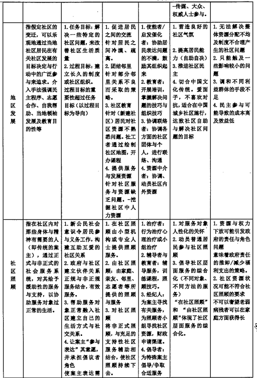

### 1. 社区工作的涵义与特点
#### 1.1. 社区工作的涵义
社区工作是专业社会工作的一种基本方法，以社区和社区居民为案主，通过组织和发动社区居民参与集体行动，确定社区的问题与需求，动员社区资源，争取外力协助，有计划、有步骤地解决或预防社会问题，调整或改善社会关系，减少社会冲突，培养自助、互助及自决的精神，加强社区的凝聚力，培养社区居民的民主参与意识和能力，发掘并培养社区的领导人才，以提高社区的社会福利水平，促进社区的进步。

#### 1.2. 社区工作、社区发展与社区组织
社区工作、社区发展和社区组织三者是非常相近的概念。在此有必要对三者的相同之处和相异之处有一个清晰的认识。
1.社区发展
所谓社区发展，概指居民、政府和有关的社会组织整合社区资源、发现和解决社区问题、改善社区环境、提高社区生活质量的过程，是塑造居民社区归属感和共同体意识、加强社区参与、培育互助与自治精神的过程，是增强社区成员凝聚力、确立新型和谐人际关系的过程，也是推动社会全面进步的过程。
2.社区组织
社区组织的特定涵义是指在社区内开展工作或活动，执行一定的社会职能，完成特定的社会目标的社会组织。广义的社区组织，可以指在来自于社区外的，以从事社区公共事务或社区政治、经济、文化事业，参与社区活动为目标的各种社会组织及机构。狭义的社区组织，则是指由社区建立的以满足社区需要和促进社区发展为目标的，从事社区管理与服务的各种社会组织和机构。
3.社区工作、社区发展与社区组织的异同
就其广义而言，社区工作、社区发展和社区组织都可以被认为是相同的概念，在很多时候三者是可以互相换用的。但是，三者实际上关注的置点，在工作方向和运用上都是不同的。不同的国家对三者的用法也是不同的。总的来看，社区工作、社区发展与社区组织三个名词当中，社区工作一词涵义最为广泛，同时包括社会工作的一些元素。严格区分的话，社区发展及社区组织都可以视为社区工作的工作模式。

#### 1.3. 社区工作目标
（1）任务目标
所谓任务目标，是指解决一些特定的社会问题，包括完成一项具体的工作和服务，满足社区需要，达到一定的社会福利目标等，如修桥铺路、解决老旧小区停车难问题、安置无家可归者、照顾贫穷孤寡残障人士等。这些活动给社区及其居民所带来的改善是具体而实在的。
（2）过程目标
所调过程目标，是指在达到任务目标的过程中实现的中间目标，主要是指培养社区居民的一般能力，包括增强居民解决社区问题的能力、信心和技巧，提升其对公民权利和义务的认知能力，培养居民与社区邻里交流、协商与合作能力，发掘和培育社区骨干的领导能力等。
（3）谭马士的分类法
1.分配资源：组织居民争取合理而平均的资源分配。
2.发展市民：一方面，促进公民权利的发展，培养市民的“政治责任感”；另一方面，促进社会发展，培养居民的“社区凝聚力”。
（4）具体目标
1.促进居民解决自己的问题，提高社区居民的社会意识；
2.调整和改善社会关系，减少社会冲突；
3.社会需要与社会资源的有效配合，以满足社区需要，解决或预防社会问题；
4.追求权利和资源的公平分配；
5.发挥居民潜能，发掘并培养社区的领导人才；
6.培养互相关怀、互助互济的美德；
7.增强社区的凝聚力。

#### 1.4. 社区工作的特征
社区工作是社会工作的三大工作方法之一。要完整地理解社区工作，不仅仅要将它视为一种服务，更它是一种方法。作为一种工作方法的社区工作是有其独特性的，其与个案工作和小组工作的区别主要有以面：
（1）分析问题的视角更为结构取向
社区工作认为，问题的产生并不完全是个人自身的原因，而是与社区周围的环境、社会制度及整个社切的关系。因此，社区工作者应重点考虑社区环境及制度如何影响人的社会功能，如何限制了人的能力。
角是结构取向的，而非个人取向的。
（2）介入问题的层面更为宏观
社区工作方法认为，解决问题的责任不应完全放在个人身上，政府、社区均有责任提供资源，协助处决问题。因此，社区工作较多涉及社会层面，牵涉社会政策分析以及政策的改变，注重资源和权力的分配。
（3）具有一定的政治性
社区工作的工作内容会涉及政治范畴，因为从广义上来看，凡关系到资源和权力分配的都可视为政治案社会工作和小组社会工作相比，社区工作的内容较为政治化。社区工作者更关心社区居民，尤其是困难权利维护，更多时候会采取多种行动为社区居民争取合理的资源。
（4）富有批判和反思精神
社区工作善于从社会结构、社会政策、制度和资源分配角度分析和处理个人问题，加上社会工作专业：特点就是关注在社会急剧变迁中困难群体的权利，所以社区工作总是在关注问题，并且试图从根本上找出症结，由此引发出对现存社会结构和政策的反思和评判，而不是一味地顺从。

#### 1.5. 社区工作的社会功能
1.社会福利功能：指立足于社区居民的福利需求，开发和利用社区的社会福利资源，以解决社区的问题，改善社区的生活，促进社区的进步。
2.社会服务功能：指国家无力满足或无法直接提供的、而企业又不愿意以非营利的途径去满足社区居民要求的那些非市场的、社会领城的服务。
3.社会行动功能：主要的帮助对象是社区中的弱势群体。此外，当整个社区的利益受到损客时，帮助的对象则是全体居民了。
4.社会稳定功能：社区工作在维护社会秩序、解决社会问题、化解社会矛盾与社会冲突、控制各种非稳定因素等方面，具有特殊的地位和作用。表现在社区管理与组织具有的社会控制作用及运作机制；好坏取决于社区是否拥有一套社区社会救助与社会福利服务的体系和解决社会问题的运作机制；蕴含在社区文化建设、社区服务、环境卫生等各项社区事业计划与社区生活中。

#### 1.6. 社区功能的基本原则
（1）以社区发展为主要目标
社区工作以整个社区及社区中的居民为服务对象，必须充分考虑社区的利益主体——社区居民自身的权利和需要，积极促进社区发展，提高社区福利水平。在社区工作实践中，以社区发展为主要目标的原则体现为不同的策略：
1.以解决社区函待解决的社会问题为目标。认识社区中存在的社会问题（如失业、贫困、犯罪等）及原因（如组织不利、资源缺乏、经济不平等、公民意识弱等），通过社区工作或社区组织手段缓解或解决这些社会问题，从而达致社区发展。
2.以人的发展为目标。在社区工作中，人的发展比社区的物质建设更加重要，因为只有居民对社区事务有参与感和责任感，建立起持久的集体力量，才能影响政策制订和社会资源的分配，社区的改变和发展才能得以实现。
因此社区工作者应当特别意视居民知识素质和合作意识的培养。
3.以社区能力建设为目标。社区能力建设指促进各种社区“资源——资产”的增长，体现了社区工作的新视角、新策略。通过教育、整合等手段，丰富组织资源，积累无形和有形资产，增强社区自我发展的内驱力和能力。
4.以集体增权（collective emporerment）为目标。不同子“个人增权”，集体增权主要产生于居民所获得的相互责任感（lerbertJ.RubinkTrene S.Rubin，2001）；通过社区集体行动，居民增强了社区联系、归属感和义务感；这些连接要素最终形成“社会资本”，使居民的工作更有效率，从而也提高社区的能力。
（2）根据实际条件制订工作计划
社区工作是有计划的社会变迁或社会行动，必须根据特定的社区背景和条件制订工作策略。不同的社区有不同的需要和发展目标，社区工作者应当充分了解社区的状况，因地制宜选择工作方式。一般来说，社区工作的基本过程包括研究、规划、介入、干预、总结等阶段，具体工作程序要分清轻重缓急，制订目标优先次序，根据实际能力和条件来制订目标、选择方式、评价成果。
（3）强调居民参与
社区工作作为一种有计划的集体行动的方法，必须重视居民参与。居民参与是社区工作的灵魂，没有居民的广泛参与，也就无所谓社区工作，社区工作就会失去方向和动力。居民参与可分为动员式参与和自主式参与两种类型，社区工作者应当特别注意动员式居民参与和自主式居民参与之间的联系和区别，通过培育、引导、组织、服务等多种手段，发展自主式参与。实现居民参与的具体过程包括根据由居民意见自下而上制订工作计划；由居民从事或组织社区发展项目和相关活动；将社区居民的参与率、认同感和满意度作为评估社区工作效果的基本指标。这就要求社区工作者将外源式社区工作介入手段和内发式的社区工作组织方法有机结合起来。
（4）尊重社区自决
1.尊重社区自决的基本涵义
A.由社区组织和居民自主选择或确定社区发展方式和行动策略；B.由社区自主管理属于自治范围内的事务。
2.社区自决原则的依据
A.社区具有特定的主体地位和权利，任何外部组织不能以自己的价值观控制社区居民的行动；B.只有听取社区组织和居民的意见，才能够了解社区成员的切身需求和具体利益，依靠民主动员开发社区内资源：
C.增强社区自主能力是社区工作的基本目标之一，因此要在工作过程中始终尊重社区组织和居民的意愿（5）开展广泛合作
社区发展需要广泛的团结合作，协力解决非少数人所能解决的问题。这不但包括与社区组织和居民之间的合作与协调，与社区内政府部门的合作，也包括社区同外在环境的协调，特别是同资源占有者的合作。社区工作者需要从共同利益和共同需要出发，有计划地引导社区内的居民与组织共同参与，合理地利用社区的资源和外来的援助，改善社区的经济、社会与文化的状况。

### 2. 社区工作的主要模式
#### 2.1. 地区发展模式
地区发展模式是由类国学者杰克·罗斯曼根据社区发展以及社区建设的相关经验所提出的社区工作实务模式，该模式强调在一个较大的社区范围内鼓励社区居民通过自助或互助的方式，广泛参与社区事务，解决社区问题，推动社区发展。地区发展模式的含义包含了三方面的意义：一是强调是一种以地区为基础的经济、社会、文化等实质内容的发展；二是强调是一种发展理念，促进当地居民的需求与当地的资源、环境和人口的协调、可持续发展；三是强调是一种社会工作的介入手法，推动社区居民自下而上的参与、合作，让居民集体组织起来掌握、利用社区资源，解决社区问题，满足社区福利需求，增强社区归属感和凝聚力。
（1）基本假设
1.关于个人的假设：个人本来在自然社区里互相团结、互相合作。随着城市化和工业化的推进以及社会结构的科层化，个人倾向冷漠、孤立和封闭的状态，个人日益软弱和无助，个人和社区问题很难得到解决。
2.关于社会构成的假设：社会正越来越丧失传统社区的自然联系，变成一种现代正式的工具理性的制度化的组织关系和市场交易关系。做法是重视地区范围的广泛民主参与，通过互助和合作，重建和谐团结的社区关系。
3.关于行动动机的假设：个人是倾向于团结的、合作的，个人是愿意沟通交往，参与民主讨论的。在集体行动中照顾个人的需求和动机，并且能够培养一种集体归属和认同感。
4.关于发展和变迁的假设：早期的社区发展是发展即意味着进步，发展是一种线性的进步关系。20世纪70年代，出现了小群体主义、生态发展模式和种族发展模式。
（2）目标
1.任务目标：在社区中完成的具体的实质性的工作项目，或者是要解决的具体的社区问题。社区经济发展、社区社会发展、社区公共基础设施建设、社区文化发展。
2.过程目标：在社区具体项目的建设中，通过居民的广泛参与和社区工作者有目的的组织和教育，使社区当事人个人、社区人际关系和社区整体等不同层面达到发展和增强的目标。各种社会网络的或新建立、居民互动及交往的增加、邻里关系的改善、居民与团体之间重建紧密的联系、居民认识到参与的重要性，并愿意承担责任、居民对社区更加认同及投入。
3.鲁宾夫妇的目标：通过解决共同的问题，来改善居民的生活；减少因贫困、种族、性别等引起的社会不平等；执行和保护民主的价值，并作为社区组织的一部分和社区发展的结果；促使个人作为一个个体发挥他们的潜能；创造社区意识，使人们从中可以感到，作为社区的一员对大社会做出的有效贡献。
（3）任务
1.项目选择的原则：当地居民是主要决策者，社工是协助当地居民；遵从社区居民的广泛参与；考虑社区生态资源的可持续发展；能够为居民带来利益分享。
2.任务：当地社区的物质经济建设、社会环境建设、社会组织建设和社区团结互助的文化价值建设。
（4）策略
把所有的人团结在一起，然后讨论、决定。努力让广泛的社区居民参与到决定他们的需求和解决他们的问题上来。
1.总体：内部资源的动员、参与和行动为主，外部的资源帮助和技术引进是辅助；内部以广泛的讨论、协商一致和团结合作为主，避免冲夹，化解矛盾；注重居民的组织和教育，培养居民的发展项目的能力比在社区引进成立一个具体的项目更熏要；发动、动员居民、广泛讨论，自下而上地民主决定社区公共发展事务，而不是自上而下地由精类决定。
2.具体：立足社区基础群众公共利益的扩大，通过沟通、对话和讨论促进成立不同居民小组；社区组织之间的协商、妥协和合作；对社区精类的争取、团结和支持；对社区大众的争取、包容，并使其参与到发展项目中来。
（5）工作者的角色
启发催化的角色、支持鼓励的角色、协调联络的角色、资源中介的角色。
（6）社会工作者所用到的工作方法
1.进入社区阶段的方法
A.拜访关键人物
A1.内容：
一是对关键人物的尊重，利于事后争取对方的合作；二是介绍自己的身份、机构背景、工作意图，便于社区接受工作者。
A2.技巧：事先认真准备；学会聆听、同理反应等沟通技巧：有目的的表达、专注的倾听、同理对方处境和感受，并恰当回应；事后的回忆总绪，以及跟进联系：目的是否达到、关系如何、缺点和不足.
B.和居民进行街头接触或深入访谈
B1.街头接触是随机了解社区日常文化和当地居民的生活问题，了解居民的话题、态度和情感反应、交往的方式和习惯。
B2.深入访谈是对关心社区事务的积极分子，了解个人的生活态度和抱负、对社区问题的看法和意见。
C.公共集合和公益活动一以联系广大居民，注意健藤、安全、尊重当地习惯、利于团结；同时注意在活动中发现人才、加强联系。
D.事件的介入和焦点小组一特定事件、兴趣小组和互助小组
2.社区研究调查的方法
A.社区调查A1.原则：
当地居民参与调查；调查研究与居民动员结合；选择适合当地居民掌握、使用的调查技术；横向资料和纵向资料结合：
一般资料的调查和问题为本的然点调查结合。
A2.范围和内容：环境和资源；社区规范、价值和动力体系；社区中的焦点问题。
A8.调查方法：
社区行走观察法（实地观察法）文献分析法
深入访谈法：与社区关键人物
问卷调查法：问卷调查是了解社区状况和社区问题的程度、范围、趋势等情况的工具A4目标：协助社区居民增强对本社区的了解，发现本社区的强势和资源，增强本社区的内部动力和资源解决社区问题的信心。
B.社区发展的项目计划（社区调查后做）B1.注意居民参与和居民组织的成立和维持，注塞通过居民的内在动力和能力发展社区。
B2.社区发展工作计划的组成结构
社区问题的认定和评估；
社区发展的目标和工作任务；社区发展中居民组织的策略选择；社区发展项目的评估计划。
3.建立和发展居民组织的方法
A.清楚界定和大家共识组织的目标：便于接受组织的任务、决定组织的工作项目和行动策略。
B.功能清楚的组织内部结构和岗位分工：开始时组织结构保持弹性和开放，但后来逐步使组织的结构和会议有更明确的功能和任务，组织的工作更加程序化。
C.对组织成员的激励和组织领袖的训练：
C1.居民参与社区组织的动机有追求自身利益、追求组织中的权力和身份、享受组织中接纳支持性的人际关系、选避自身在组织外的问题。居民参与组织的类型有担当居民组织的领袖、执行组织的任务、配合组织的活动、支持组织的活动。工作者应根据居民参与的动机和类型广泛地动员居民参与。
C2.社区居民组织的领袖最大特点是民主作风、联系群众、乐于奉献、敢于负责。应对其进行培训和督导。熔训的内容包括社区问题的分析策划能力、组织日常工作的运作程序和办公技巧、一般性活动的程序设计和执行、组织危机及冲突事件的处理。
D.组织的财政资金支持：
D1.外部筹资：基金会申请、政府的社区发展拨款机构申请、国际机构或外国政府驻华机构：
D2.内部筹资：会员会费、对外服务收费、社区经济开发、其他。
E.对外关系和公共关系社区内外的组织、机构打交道，手段拜访相关组织的领袖、举办联谊会、主动参与对方的典礼和仪式、主动邀请对方参加自己的臭礼和仪式。
4.社区项目管理的方法
地区发展模式以社区居民的组织和居民教育为主，注重发展过程中居民的参与和能力建设。
A.鲁宾夫妇组织管理技巧：
A1.建立组织机构：社区组织要发展项目，应该组建成一个非营利公司，申请免税，选择一个主任委员会，以利于公司获得支持和优待，促进社区发展。
A2.修改管理技巧以适应一个民主的组织：社区居民组织不注意营利效益，注意公司发展中让组织成员民主参与和在参与中获得成长。
A8.组织赛集资金和财务管理：为了管理运行组织，如何募集资金和分配使用资金。
B.鲁宾夫妇项目管理的技巧
B1.项目策划：如何选择社区问题作为解决对象，然后评估需要、设定目标、计划项目活动的次序，然后进行成本、收益分析，决定项目的可行性。
B2.获取项目资金：项目获准立项后，通过自己的产品销售、申请各种拨款、贷款成立商业、游说政府资助等措施，获取资金，支持项目发展。
B8.执行项目：建立项目发展的时间表，有计划地监督项目活动的执行，并预计突发事件，应对危机和冲击，也包括把某些项目承包给其他机构完成，或者合作完成等。
B4.项目评估：监视项目的执行情况，评估项目的结果和影响，评估项目目标的完成程度，处理意料之外的一些影响。
（7）地区发展模式的评价
1.优点：
A.营造良好的社区气氛；B.提高居民的能力：
C.推进社区民主；D.切合中国文化传统。
2.缺陷：
A.无法解决整体资源分配不均及制度不合理产生的社区问题：
B.调和不同利益群体的手段不足：
C.民主参与导致的成本高而效益低。

#### 2.2. 社会策划模式
社会策划也叫社会计划模式，是指在理性方法指导下，依靠专家的意见和知识，在准确把握社会服务机构的使命、宗旨、政策、资源的基础上，确立社区工作目标，并依循社区工作目标的引导下，从多个预选方案中选择一个最佳的工作方案，然后结合社区需要，动员和分配资源，并在工作过程中根据不断变化的实际状况随时修改计划，保障计划朝向预定目标前进，在工作结束时对计划执行情况加以总结和反思，最终解决社区问题。
（1）基本假设
1.关于人的假设：人都是理性的，人是理性追求自我利益最大化的，人际关系一般都是理性选择的工具性的交换关系，这种关系会带来社会活动效率的提高。
2.关于社会的假设：社会系统是建立在个人之上，而又相对客观、独立的一个系统整体，有自己的平衡机制，有自己的分化增长机制，各个子系统通过能量交换实现自己的功能。
3.关于行动动机的假设：人理性地追求个人、社会利益的最大化增长。人必须进行管理和规矩，这样才能带来社会的秩序和合力。
4.关于发展和变迁的假设：通过对社会发展规律的系统研究认识，掌握社会发展的内在规律，然后统一计划、管理、促进社会的发展和变迁，或者说是一种有计划，有组织的控制和引导社会发展的社会工程论。
（2）目标：完成具体的任务
1.西方：解决社区中存在的主要问题。
2.中国：社区建设范围的规划目标；社区组织建设的目标：社区建设管理体制和运行机制的目标：社区服务项目的规划目标；社区建设人员队伍的规划目标。
（3）基本原则
1.杰克·罗斯曼认为基本策略原则是收集事实和采取逻辑性的步骤，设计出理性和可行的合适的服务方案。
2.弗瑞德曼认为，该模式的四个历史传统
A.社会改革传统：策划者积极参与国家的社会改良，通过民主制度影响政府决策，改善社会结构和资源分配，促进社会公平；B.政策分析系统：策划者受聘于政府，负责提供技术指导，协助行政人员或政治家做出决策；C.社会学习系统：策划者协助居民一起分析、研究问题，共同收集资料，设计方案，比较分析出理性选择；D.社会动员传统：和主流社会脱离，发展自力更生的另类集体社区；参与社会运动及社会改革，改变社会现有的政治经济环境。
（4）工作策略
1.理性一全面主义（赫伯特·西蒙）A.策划就是一个从多种方案中的理性选择行为，所谓的理性选择是要充分地分析各种方案及其后果，然后选择出最能增加决策者的价值的方案。理性全面的决策要求分清价值和目标，分清事实和手段，并始终采取逻辑的、全面的、有目的的行为方式。
B.后来进行了修改，改为有限理性模式，即只要作出令决策者满意或足够好的决策就可以了，对于方案的选择是简化成表决、选择现实中可能遇到的方案。
2.渐进主义（查尔斯·林德布鲁姆）实际的决策是在相关利益群体间协议作出的。相关利益群体的协议是令当事人妥协一致的过程。两种类型：
A.在党派力量均衡的条件下，党派间的互相调整妥协，包括适应性调整（根据周围决策作适应调整）和操纵性调整（根据其他决策者作出理想的反应）。
B.在党派主导的条件下，一个组织在没有对手的条件下，一步步调整自己的决策，适应新的环境变化。
3.最适宜性决策模式（多尔）理性主义和渐进主义两种原则的综合，强调决策过程的理性和超理性因素。
A.理性因素强调综合分析、澄清价值目标：
B.超理性因素包括使用判断、创造创新、头脑风暴等方法。
4.混合扫描决策（艾兹奥尼）：将决策分为两种：基础性的重大决策和渐进的小的决定。
A.重大决策要靠理性的广泛的评价；B.具体的小的决定则是根据情景进行的渐进的决策过程。
（5）社会工作者的角色
项目的规划者角色、项目经理的角色、监督实施的角色、专业人员的协调角色、动员居民参与和反愤意见的角色。
（6）基本步骤
1.澄清规划机构的服务理念和规划者的角色：防止偏高服务宗旨和超出自己承担能力的服务项目。
2.社区问题的调查分析：定义共同问题，问题的成因和结果，相关的意识形态和价值，谁是获得者和损失者。
3.需求和目标的界定：
AL目标群体的异定：谁具有什么条件是目标群体
B.目标群体的需求：
B1.规范性需求：专家或社会所确定
B2.自觉性需求：自己觉察
B3.要求性需求：透过行动去表达
B4比较性需求：与某一标准比较。分析服务方案要实现的目标。
4.澄清自己可动员的资源：澄清本机构所拥有和可动员的资源。
5.服务方案的制定、分析和优选：制定不同的服务方案，选拆成效高、风险低的方案。
6.方案测试和调整：在小规模、小范围内测试。
7.方案的执行：工作的布置指挥、人事的激励、工作程序的优化、工作进度的检测、工作质量的控制和服务对象的意见训查。
8.方案的反馈和调整：根据对工作质量、进度和服务对象的意见调查，反馈给决策部门，调整和优化服务方案。
9.方案的评估：评估工作成效、资源消耗、相关的社会影响，以激励工作人员。
（7）工作方法
1.社区问题和资源调查的方法
A.主要目标是任务目标，即为了调查清楚社区的问愿和可动用的资源，然后选择什么问题为重点解决介入的焦点。居民的参与程度取决于四种工作传统。
B.地区发展模式强调社区工作者与社区居民的协同行动，将社区调查当作对居民教育、增强能力的过程，双方是合作关系，而且是以居民的能力增强为主要目的。
2.服务方案制定和决策的方法
A.服务方案的设计组成：
A1.目标：综合目标一长远、宏观、综合性；理性目标一清楚、具体、可量化、可操作；A2.服务对象：异定条件有自然和社会；A8.服务的形式和手段：根据其生理性、物质性和情感性、社交性的需求；A经财力安排和人力安排；A5.服务活动时间进度表。
B.服务方案的优选方法：
B1.被选方案的设计原则：
一是需求导向的：根据需求变化的概率预测来确定业务量的高、中、低不同标准，分别设计相应的服务方案；二是资源约束为本的：根据筹资可能性，分出高、中、低不同标准，设计相应的服务方案。
B2.选择最优方案原则：
效率原则的方案优选方法：净现值计算法、现值指数计算法、内部收益率计算法。
风险回避原则：盈亏平衡分析法、敏感性分析和概率分析。
C.方案的实施管理方法C1.规划服务规划表：
C11.业务的逻辑流程图：
内容：分析业务发生的逐辑步骤顺序，分析每一步骤所花费的时间、资源、人力和服务标准。
作用：帮助机构提高工作效率，减少资源浪费，同时提高服务效果，令服务对象满意。
格式如下：
开始——顺序列出各种活动——该步骤完成——检查流程图——结束修改流程图
C12.业务进展时间表：针对各种活动，按照计划的完成时间列成表格，并用图示来表示已经完成、正在进行、完成效果等内容。
C2.监视服务进展：
C21.利用时间进度表记录活动的进展完成情况：
C22.利用分析工具，分析项目进展过程的成效和问题，以便找出原因，改进项目的执行程序及部门结构，以提高服务效率。
C3.反馈调整服务计划：在监视、分析服务的成效、问题时一方面不断改善服务的执行程序，提高服务成效；另一方面提出一些服务方案本身的合理性问趣，这时需要综合考虑资源、客户需求和自己机构的能力来调整方案。
3.方案评估的方法
A.分类：过程评估和结束评估。
A1.过程评估：对服务方案的执行过程进行的动态评估。
A2.结束评估：
A21.服务投入评估：项目所投入的人力、物力和财力等综合消耗；A22.服务产出评估：项目投入的直接产出；A23.服务结果评估：服务产出所实现的服务成效或实际影响；A24.服务效率指标：服务项目的投入产出比，每一个单位的投入所实现的服务产出；A25.服务效能指标：服务项目的投入结果比，每一个投入所产生的服务效果；A26.服务质量评估：服务产出质量的评估；B.三大类：
B1.努力程度评估：服务项目的投入、产出进行的评估；B2.成果评估：服务项目合乎当初服务方案的原定目的的程度的评估；B3.效益评估：服务项目的成本收益比例进行的评估。
B4.具体方法
B41.逻辑框架评估方法：把一个服务项目分投入、产出、微观目的和宏观目标等不同层次，然后分析不同层次的垂直和水平逻辑关系；B42.对比评估法：比较项目前后、有无等不同情况下的指标程度，来评估项目的成效；B43.快速农村评估法：所谓快速农村评估法是指为避免前述评估方法的烦琐、资源浪费和阅读使用者少等缺点，而产生的一种新型快速、有效、节约、直接面对受益群体的评价方法，它一般是采取人类学、社会学中的参与观察、非结构的访谈、焦点小组等调查方法，多专业、多学科小组的三角信息检验，快速形成直接、有用的评价信息；B44.参与式评估法：在快速农村评估的基础上发展的强调评估过程的当事人的参与评估，把评估当做不断学习、不断改进项目的问题、不断增强当事人能力的手段：
B45.综合评估法：给各个项目活动分配比重权数，然后评估各自的完成程度，最后加权计算项目的综合得分。
B5.具体步骤
B51.确定服务项目的具体清晰的目的；B52.建立成果量度标准；B53.制定研究设计：
B54.选择合适的收集资料的方法收集资料；B55.分析资料，形成评估结论；B56.根据分析结果形成评估结论，撰写评估报告。
（8）社会策划模式的评价
1.优点：保证服务质量；较有效率。
2.不足：
A.民主参与率低：服务目标方面，常常由社会工作者来确定什么是民众需要，可能未真正表达民众心声。
B.由于决策过程中缺少民众参与，可能导致民众对计划本身缺乏兴趣和投入。
C.服务对象对所提供的服务的依赖性上升，可能导致被动民众群体出现。
1.注意任务目标的实现；
2.强调运用理性原则处理问题；
3.注重自上而下的改变；
4.指向社区未来变化。

#### 2.3. 社会行动模式
（1）基本假设
1.对问愿成因的分析：利益冲突。认为社会问题的出现是由于社会上不同利益群体之间存在着利益的冲突。
2.冲突假设：
A.社会问题产生于冲突，要用局部冲突的方式来解决社区的问题；B.利益被忽视及受到剥夺的弱势群体，有权获得更符合社会公正与民主的资源及待遇；C.因制度和政策不公正形成的冲突和分歧，通过协商和正规途径不容易获得级和。
（2）目标
1.总目标：改变不公平的政策，实现一定程度的社会改革。
2.任务目标：
A.争取权益及资源的重新分配；
B.通过行动争取利益
C.获得应得的资源，改善环境，伸张居民权益，并加强参与决策的能力。
3.过程目标：
A.提高自我意识：
B.提升社会意识；C.认识团结的熏要性。
（3）策略
1.拜因的两种策略：
A.交易策略：在正规组织福架和制度下可以解决问题；B.对峙策略：在利益出现两极化，而传统的正规组织框架下不能解决问题时采取的策略。
2.沃伦的三种策略：
A.合作式策略：通过理性讨论及教育达成共识；B.运动式策略：通过游说、宣传、社会有名望人士的推介及强化公共技巧；C.竞争式策略：通过游行、示威和罢工迫使对方让步。
3.莫庆联和甘炳光的四种策略：
A.对话性行动：群众和当权者有不同的意见，但双方之间仍存在信任，希望在正规的组织框架和制度下解决问B.抗议性行动：通过传媒暴露政府政策的不完善之处，争取其他民众的同情与支持，以此向政府施加压力，迫使其因内疚而自责。
C.对抗性行动：通过行动直接影响对方的利益或令对方不能够正常运作，迫使对方因有所损失而愿意与群众谈判。
D.暴力性行动：情急之举，或无计可施的情况下的反抗行为。
（4）原则
1.渐进原则：以上四种行动是由温和走向冲突的连续性及一体化的渐进过程。
2.争取让步而非破坏：最终目的是迫使当权者让步。
3.行动的连串性：当某一行动不成功时，应有一连串的行动形式跟进。
4.争取奥论支持，避免使用暴力：通过有秩序及和平的方法，在法体允许的范圈内争取奥论及公众的支持。
5.认真考虑有关因素：群众的资源、群众的投入程度、社会气氛、事件的本质。
（5）社会工作者的角色
倡导者、行动者、教育者和资源提供者。
（6）工作方法
1.介入的方法：
A.集体行动：要求居民团结起来，参与集体行动，以加强行动的声势，使当权者感受到问愿的严重性。
B.由居民的切身问题及具体事件介入：首先找出居民最关注及最急切需要解决的事件，然后将居民联系起来，
表达对事件的不满，共同找出彼此想要争取的目标及可行的解决方法。事件的性质是社会行动成败的决定性因素，若事件反映了社会的不公平、不合理及居民被压迫的现象，就容易获得公众的支持。
C.较多运用冲突策略及非建制途径：冲突、对诗或破坏性的策略是较多使用和较有成效的。非建制途径是指非政府框架下的途径，通过居民大会、记者招待会表达民众的不满。当居民通过建制化的途径提出的要求没有得到合理的答复和回应时使用。
D.争取第三者支持：所谓的第三者是指社会大众、传播煤介及有影响力的人士。因为政府不太在乎行动者所施加的直接压力，而较为惧怕奥论或公众的指责。
2.介入的步骤：
A.工作者觉察居民对莱些问题特别关切：
B.利用这些问题为中心，发动居民参与及商讨对策；C.将问题对外宣传，引起社会人士及政府的关注、同情及支持；D.问题得以解决。
3.考虑的因素：（详见：社区工作，徐永样，p131）目标、工作着及群众的取向、组织考虑、盟友及对手、当权者和战术。
（7）评价1.优点：
A.易广泛吸纳群众；B.易于培养社区领袖：
C.能够使问题迅速解决
2.缺点：
A.易被政党和利益团体操纵；B.可能激化矛盾；C.长于挑战，但不善于建设。

#### 2.4. 社区照顾模式
社区照顾模式是指社区中各方成员组成的非正式网络与各种正式社会服务系统相配合，在社区内为需要照顾的人士提供服务与支持，促成其过正常的生活，加强其在社区内的生活能力，达到与社区融合，并建立一个具有关怀性的社区的过程。其中社区照顾的非正式网络一般由家人、亲戚、朋友、邻居和志愿者组成；正式的社会服务系统一般是指医院、养老机构、精神障碍照原机构、残障廉复机构等政府、非苦利机构，也包括少量的营利机构。而需要照顾的人士一般包括老年人、儿童、残障人士、精神障碍人士等。
（1）基本理念
社区照顾是指社区内对那些身体和精神有需要的人，通过正式或非正式的社会服务系统对其给予援助性的服务和照顾。1960年，社区照顾才正式成为英国政府的政策，源于英国的“社区照顾”可以分为两类：
1.在社区内接受照顾：是指有需耍，并且依赖外来照顾的人，在社区内设的小型服务机构或家庭住所中，接受专业人员的照顾。
2.由社区负责照顾：是指有需要的人的照顺服务，其一部分是由家庭、朋友、邻居及区内志愿者为其提供，强调社区内非专业人员提供照原。
（2）基本假设
1.服务对象生活的原环境优于机构的环境。长期的院舍照顾会导致被照顾人士的生活能力的下降，而应让服务对象在自己生活的原环境过正常的生活，社区提供适当的照顺和支持。
2.社区可以有效地利用非正式资源对需要康复服务的服务对象实现支持和照顾。
（3）目标
1.新公民社会意识：居民的义务参与，互助关爱的关系；
2.政府与社区建立伙伴关系；
3.帮助服务对象正常地融入社区；
4.使服务使用者参与表达他们的愿望，并能够承当倡议者的角色：
5.建立理想和关怀的社区。
（4）任务
1.将社区内有特殊困难而自己不能解决并需要长期照顾的服务对象留在社区内接受服务；
2.使有困难的社区居民（个人或家庭）所需要的家庭照顾社会化，减轻家庭的负担；
3.挖据社区的各种人力资源，建立社区支持网络，使社区居民建立起互助、互帮的责任意识，实现社区成员之间的高度互动，形成社区内居民的良好的人际关系。
（5）策略
1.确定社区照顾的服务对象群及居住所在，与之建立其相互信任的关系，并探索他们自身的措能和资源，帮助他们建立自信心。
2.建立社区照顾网络和自主组织。
A.直接服务的自助服务系统一高被照顾者最近距离的人构成，家人、亲友和邻居；B.同类型服务对象的互助组织的服务系统一各种互助小组，如单亲妈妈、癌症病人等；C.社区危机处理的自助组织服务系统一动员具有不同专业技能的退休老人和热心的社区居民组成不同类型的小组。
（6）社会工作者的角色
治疗者、精导者、倡议者、顾闻
（7）专业技巧和服务方式
1.资源调动：
A.分类：来自政府福利的正式资源和志愿者服务、民间社团和服务对象家人等非正式资源。
B.做法：
B1.在社区内通过多种形式拓展社区照顾的服务资源：
B2.联合社区周边固定的福利服务机构：
B3.将需要专业性服务的被照顾者集中起来以节约资源；B4.考虑志愿者服务队伍的稳定与壮大的问题；B5.考虑资源有效利用的问题。
2.社区联络：指维护和发展社区整体良好公众形象的公共关系工作。可以通过的活动有公关活动（新闻发布会、发放宣传品）、开展筹款活动。
3.社区教育：社区教育可以理解为在社区居民中广泛地开展“社区照顾”理念的传播和推广的教育。发展方式：
A.以社区为单位，对服务需要者的家人、朋友和社区志愿者进行宣传；B.以社区服务对象的需要为内容，进行大型巡回宣传工作、小型讲座，提升社区内居民互相关爱、互相帮助的意识；C.以社区照顺所提供的服务为内容，向社区居民介绍社区照顾的各类服务。
4.社区照顾训练：调练是指在社区内对非专业人员进行一些有关照顺的基本知识与技能的训练。
A.对社区志愿者及服务对象的家人进行家居照顾训练；B.对社区照顾的服务对象进行心理健康和身体健廉训练；C.在社区从事全职服务的工作人员，要定期进行更新知识的服务培训和拓展服务知识的培训。
5.支持服务：是指在社区建立一支以专业服务机构为依托，通过热线呼叫，为社区有需要人士提供各类家居服务的服务支持系统。在发展这类支持服务时，要注意：
A.对提供免费服务的家庭界定十分费力，可根据最低生活保障的家庭对象；B.支持服务要防止服务的营利性倾向。
（8）评价1.优点：
A.对服务对象人性化的关怀；B.动员社区普通居民参与社区照顾；C.倡导社区层面服务的综合化：
D.以社区为依托家庭为露点的社区照顾，避免了机构照顾的负面影响和家庭在照顾工程负担过意的问题；E.志愿者服务使社区公民参与意识提升。
2.不足：
A.资源及权力下放可能引起的政府责任与角色问题；B.社区资源状况可能不符合社区照顾的要求；C.激励机制问题：
D.非正规照顾的服务质量难以保证；E.社区对有困难人士的排斥和歧视问题；F.照顾者主要是女性，强化了女性在家庭和社会中照顾角色的意识；G.缺乏政府的投入，尤其是所需资源的配置。
（9）特点
1.协助服务对象正常地融入社区；
2.强调社区责任；
3.强调非正规照顺的作用；4.提倡建立相互关怀的社区

### 3. 社区工作的技巧
#### 3.1. 社区分析的技巧
1.探索社区背景：
A.社区的基本情况：社区居民的人口及其成分；住房状况；就业情况；社区的地理环境、交通；社区的基础设施与资源状况；社会服务；社区的历史、经济、政治、文化传统；价值观念。
B.社区居民及团体的关系与权力结构
B1.社区机构和组织；B2.社区权力分配和领导。
C.社区问题和社区需要
C1.社区问题：社区中对社区居民生活有不良影响的事件或问题；C2.社区需要：在以上这些方面还有哪些不足够的地方。
2.收集社区资料的方法：
A.文献分析方法：人口普查数据、地方志及其政府相关资料、社区机构原始记录资料、媒体报道和评论、个人或团体资料。
B.参与式观案法：人们聚集的日常活动场所，主动积极地交流。
C.访问法：
C1.口头方式，针对社区中部分有代表性的任务收集资料，适用于较大型且较难进行家庭苷查的社区。
C2.先从熟悉的人（可以是地方领导人物，应注意年翁、性别、职业和社会经济地位的分布）开始，再请其建议值得访间的人（让其了解他是代表某个群体的，引导其表达对这一群体的看法、意见）。
D.社区普查法：同卷成访同社区中每一户。
方法步骤：确定调查的主愿及目标；界定调查的问愿及范圈；设计问卷；同卷的发放及回收；数据整理及分析；公布“社区普查结果”。
（2）问题及需求分析1.需要的层次与类型
A.马斯洛的需求层次论：生理、安全、归属和爱、尊基、自我实现。
B.伯列绍（J.Bradshex）的需求类型论
B1感觉到的需要。是指大多数居民感觉到某些需要和期望不能得到满足并且把它说出来的需要。这些需要可能是基于现实的考虑，有时也可能是主观的感觉而已。因此，工作人员在进行社区工作时，一方面要充分尊意居民的这种需娶，同时又要注意区分一些期望过高，不切实际的需要。
B2.表达了的需要。当一项服务的需求人数增加使得供不应求时，那么社区就会对这种服务存在需求。这种由居民的实际需要表达出来的需求，称为“表达了的需要”。
B3.标准上的需要。当某项服务的专家认为该项服务必须符合他们定下的质和量的标准时，才合乎规格。不符合规格时就会有“标准上的需要”。
B4.比较性的需要。当某个社区使用莱种服务，而与此类型相似的社区却没有此项服务时，则后者便有因比较而产生的对于此项服务的需要，称为“比较性的需要”。
2.社区问题分析
A.描述问题：居民是怎样感受这种问题的；
B.界定问题：从居民的立场上考虑；C.明确问愿范围：影响人数、影响方式、持续时间、集中的地点人群、价值冲突、改善问题的得失和影响；D.问愿的起源和动力：问题产生、加剧的深因、解决问燃可能的动力因素。
3.社区动力及资源分析
社区动力主要是指可以对社区发展起到积极推动作用的力量。
A.社区动力分析的两个方面
A1.社区体系分析
对存在于社区内众多的个人、团体或组织做个别的分析，以了解其特性，然后分门别类，并按其共同点归纳成不同的体系，如家庭、经济、政治、教育、卫生、福利等。分析体系时，可以将注意力放在影响体系和外界关系的因素上面，包括目标（成文或不成文）、信念（指导思想和取向）、构成（人或组织）、资源及来源（权力、影响力、金钱、人力、资讯）、期望（结果和益处）和其他。
A2.社区互动分析
A21.含义：运用社会交换理分析社区体系之间的互动，即对社区内各种群体的关系、被此之间的交往联系的程度及状况进行分析，进而摸清工作者可以利用和发展的关系和动力，以便更有针对性地整合社区的资源，推进社区工作。
A22.社区中的互动关系：交换关系（按需要和动机分享资源和影响力）、权力依赖关系（以权力促使对方提供资源）、授权式关系（基于法律、法规的限制，或财政上的赞助与受助关系）、联合组织（与其他组织结为联盟）、竞争关系（为了获取相近的资源而出现的竞争和对立）。
A23.基本假设：每个社区体系都有其独特的需要及期望，组织的行动取向决定于这些需要和动机；社区体系的取向是希望达成其目的和取得所需的物资、权利、满足感等；假如缺乏互动的基础，组织就不会有互动。
A24.体系间交换的原则：按照组织体系的目标、期望和需要及环境因素的影响来导求回报与代价：若体系因某种行为或决定获得回报，就倾向继续这些行为和决定；若体系缺乏某些资源和回报。体系会倾向于付出较多的代价去换取这些资源和回报。
A3.社区互动分析的步骤
A31.找出社区内活跃的个人、团体、组织、机构，分析他们的目标、组织结构、信念和期望、资源及权力来源等特性，以获得对其行动取向和动机的把提：
A82.将各个组织进行分类，然后分析被此之间的关系状况，进而获得对社区不同体系的互动关系的全面了解；A83.从社区事件入手，通过观寨分析发现各组织团体的不同的立场、行动取向和行为的动机。
A4.工作项目和计划的制定步骤：
A41.掌提活动的基本目标：
A42.衡量服务对象的特色、兴趣、需要；A43.配合机构的宗旨、赞助团体的期望；A44.评估本身拥有的资源及可以动员的资源；A45。制定初步计划；A46.评估可行性；A47.确立详细计划；A48.预期困难及解决方法。

#### 3.2. 社区工作关系建立和问题介入
（1）社区工作关系建立和维系的原则
1.动员群众参与的动机，有针对性地进行动员；
2.让群众看到参与带来社区问题解决的成效；
3.为参与者带来个人的改变；
4.注意选择动员对象；5.让参与者有成就感；
6.减少参与者付出的代价；
7.注意工作者自身素质对居民参与的影响。
（2）社区工作关系建立的过程与方法
1.与社区居民接触
A.接触的动机：增强对居民与社区了解，便于制定计划开展工作；建立关系，提供居民参与社区工作的热情。
可分为探案性接触和招揽性接触。
B.接触原则：注意运用人格魅力去影响和感染居民，以真诚、热情、认真而开放的态度，保持与居民沟通的顺畅：运用互动过程，让居民自己面对处境，深刻地反省自己的位置和问题的成因，看到不同的选择和行动带来的不同效果，以便有机会再选择和行动。
C.接触过程
C1.准备：考虑清楚接触的目的和出发点；选择建立联系的对象：选择访问的时间：准备话题，引导访间的开始：衣着得体：预想可能遇到的问愿和克服困难的方法；对前往访问的场所有所了解；C2.与居民接触：介绍自己、展开话题、维持谈话；C3.结束对话和访问：初次接触时间不要太长；C4.接触以后：记录主要资料、总结。
2.与地区团体和政府部门的接触
影响组织行为的各种因素：
A.组织分析：
A1.了解组织的目标、任务、结构，组织文化的表现和特点；A2.关注组织内有影响的人士：
A3.组织成员执行任务的表现、价值观和性格：
A4.为组织机构建立档案；A5.收案资料的方法。
B.组织关系分析：
B1.组织关系不是不变的，交往要因时制宜，维持和谐关系和增加未来合作的可能性：
B2.服务对象遇到问题时，根据具体情况分析可以予以协助的组织：
B3.分析不同组织在某问愿上的利益及组织间的关系：交换、权力依赖、授权等；B4.摸索不同组织在提供资源上的合作意愿和动机；B5.根据不同组织间的关系计划不同的交往工作。
3.介入社区工作的策略
A.工作前期的重点：
A1.筹划工作机构的规模：办公经费、地点和工作者：
A2.建立人事管理制度；A3.深入基层，建立信任关系：
A4.加强地区联络，摘好地区关系：
A5.了解社区需要。
B.进入基层，建立关系的方法：
B1.进入基层，建立关系：
Bl1.开展全区性活动：“综艺晚会”、“慰间演出”之类的全区性的大活动，让更多的居民有机会接触和了解社区机构及其工作人员；B12.举办大众化的参与性活动：家庭运动会；B13.宣传咨询活动：晨板、传单、专家：
B14.介入社区事件：代表座谈会、居民大会：
B15.经常深入社区；家庭访问：
B16.利用社区媒介开展宣传活动。
B2.选取工作对象的考虑：
B21.工作对象是否面临十分紧急的社会不公？
B22.受影响的工作对象人数是否很多？他们自己拥有的资源又是否充裕？
B23.工作者的价值取向如何？人力资源调动是否充足？
B24.整个社会有没有去协助这种工作对象的气氛？
B25.受影响的工作对象想改变现状的动机及能力是否强大？社区工作者选取介入对象的另一考虑是居民自己是否也想改变？
B26.区内有没有其他人正协助这些工作对象？如果有，是否有效？
B27.能改变这群对象处境的机会是否很大？
B28.所提供的服务是否会影响到其他群体的利益？
B3.介入工作的原则：能改善市民的生活：令居民感到自己有能力改变环境和值得花工夫去争取；事件有胜算的机会：事件是很多居民广泛感受到的：事件是社区居民深刻、迫切感受到的：事件是很容易掌握和了解的；事件针对的政府部门是相当清楚的；事件有清楚的时间表；事件不会令居民内部分裂：事件能培养一些社区领袖；事件能与一个类好的社会价值观吻合。

#### 3.3. 社区组织工作技巧
（1）社区宜传教育与传媒利用
1.社区宣传教育：
A.含义：是在一定区域内利用各类教育资源开展自在提高社区全体成员素质和生活质量，服务经济建设、社会发展的一体化的教育活动与过程。
B.目标：促进社会教育与学校教育双向开放，统筹社区各类教育，促进社区内各类教育资源的协调发展，最大限度满足社区发展和社区成员教育的多样化需求，最终实现教育社会化和社会教育化，构楚终身教育体系，形成学习型社区。
C.意点：重点在社区成人教育与弱势群体的教育上。
D.宣传动员的方法：印制、张贴或发放宣传资料；社区党员、居民代表、居民小组长进行宜传；黑板报、宣传栏、标语、微幅等：小区的广播、网络、有线电视等；组织专题宜传月、宣传周及邀请活动。
2.传播媒介运用：
A.制定媒介策略，发展媒介关系B.制造媒介事件，吸引传蝶报道
C.运用传煤的途径和技巧：
C1.邀请记者与提写新闻稿
C2.记者招特会
C3.接受新闻采访C4.运用社区媒体（2）居民活动组织
1.群众发动：
A目的：
A1.扩大群众的支持与参与，增加社区工作力量：
A2.堆加社区工作力量；A3.充分挖规和使用人力资源：
A4.工作者与参与者共同学习，体验成长。
B.步骤：
B1.准备：动员的对象，如何动员，动员做什么，对抗拒的应变B2.开始接粒：自我介绍，取得信任；了解对方，建立关系；探讨问题，探听虚实B3.鼓动群众情绪：让群众感觉不公平、不合理之处；使之认识到必须合力解决问题；与之探讨集体行动的得失；使之对自己的参与能力有信心
B4.要求群众参与：时机成熟时邀请参与，如答应留下联系方式，告知行动步骤和准备，如没有及时答应，留一定考虑时间
B5.提酸群众参与：对答应的若时间太久，家访电联提醒；对没有及时回答的，也要提醒B6.群众参与：欢迎支持参与者；参与者之间认识。
C.方法：
C1.直接接触C2.间接接触
D.劝服技巧：熟人参与、成功示范、互相帮助、体谅他人、赞赏对象、告别失意、纠正以偏概全、诉诸权威、减少代价、诉诸公平、努力尝试。
2.召开居民会议
A.会议目的：
A1.对参加者成长的促进作用
A2.交流、分亭信息，报告工作进展；A8.讨论问题作出决定；A4.学习解决问题的方法：
A5.增进参加者的关系和合作；A6.提高民主参与的意识。
B.会议的步骤：
B1.会前准备：目的；内容和程序安排、资料准备；参会人员的确定和通知；场地的安排：会前接待：
B2.会议进行：会议气氛把握，民主、平等、轻松；注意把提时间；决议要反复讨论、谨慎通过：观察与会者的反应；主持人集中总结，突出主题；B8.会议促进：明确会议决定；着手会议决定的工作；通知未与会者相关决定：整理会议记录，落实任务：
B4.行动：执行会议决定，并随时与与会者通报工作进展情况。
C.会议主持的技巧
C1.聆听：要让发育者知道你在仔细听他发表的意见，要从讲话人的语官内涵和表达方式中收集更多的信息，还要同时观察到其他与会者的反应。
C2.提问和邀请发言：启发、引导发言，用开放式提问给每个人均等机会：邀请有关人员发言或阻止滔滔不绝的发言；C3.注意澄清和引导：为使发言不离主题，要适时复述成员的意见，及时核实和纠正一些观念。
C4.综合与集中：及时综合各方的意见，作出总结分析，找出共同点、分域点，把握会议进程。
C5.多用赞类和鼓励：对发言和提供信息的人予以鼓励和肯定。
C6.运用身体语言：主持人的目光、面部表情、身体姿态都可以辅助会议的主持。
D.会议的组织要点（甘炳光）会议目的清楚：认真计划会议进程：邀请有关或有需要的人士参加；事前向有关人士简介会议情况；主持人
主持会议而不是垄断会议；让所有人有发言机会，互相沟通；使参加者身心舒畅，有所收获；保证会议带来行动；小心会而不议、议而不决、决而不行、行而无人负资。
3.社区领袖的培调技巧
A.鼓励参与：
B.给予鼓励和肯定；C.宣传当家做主的精神：
D.建立民主的领导氛围和精神：
B.不断提供居民领袖学习的机会；P.建立从检讨中学习改进的习惯；6.建立居民领袖权责分工的意识；且.培养理性讨论，充分沟通和尊重少数的领导作风。
4.志愿者队伍的培询
A.志愿者招募：
A1.目的：填补人手、拓展服务、备用资源、志愿者人数准则、保持小组活力。
A2.方法：志愿者介绍（介绍给亲友）、举办志愿者训练课程、活动推广（职员聚会、学校演讲等）对外宣传（大众传蝶、海报、巴士车身）、举办志愿者招募周、印制志愿者服务资料册、运用互联网及电子邮件。
B.驱选志愿者：
B1.准备事项：考虑机构和服务的需要；由机构职员和资深志愿者共同进行：设计详尽的志愿者登记表：应用测验帮助志愿者了解自己的需要：因材誓用：安排志愿者认识服务内容；安排时间和地点。
B2.注意事项：解释工作的性质和要求；提供志愿者一定的适应期；告诉可能遇到的挑战；说明必须参加有关训练课程；资深志愿者分拿志愿者的乐趣和经验。
B3.增进效果：加强培调和发展；评估招募的途径（评估大众传媒的影响力，特别是广告宣传）。
C.志愿者调练：
C1.目的：了解志愿者工作（社区的工作、目标；个人目标与社区目标相一致）：实务工作训练（掌握所需知识、技能和态度）：志愿者个人发展需要。
C2.策划：分析机构状况一工作和任务分析一列出所需的知识和技能、选择训练对象一说明训练要求一决定训练目标一拟订训练课程（确定时间表、编排训练课程、选择训练方法）一实践应用及评估一修订建议。
C3.安排：通知参与训练的志愿者内容、时间安排、学员人数、课程讲义、视听器材、上课地点。
C4.策略：
C41.基础训练：对象是函投入志愿者工作行列的志愿者；活动是迎新课程：内容包括志愿者工作的须知、了解机构和志愿者小组对志愿者工作的目标、志愿者应掌握的基本技巧。
C42.专题训练：对象是已委派工作岗位的志愿者；活动是专门技巧训练；内客是了解服务对象特征、需要及期望。
C43.进深训练：对象是资深的志愿者：活动是领油训练；内容包括领袖才能、服务策划及评估、团队合作技巧、资源管理。
D.志愿者训练管理实务
D1.策划与进行调练时考虑的因素：志愿者参与（活动策划）、使用者（志愿者机构和社区）参与、成本控制（机构小组的资源限制）、时间配合（保证投入服务前接受足够的训练）。
D2.训练内容：
D21.基础理论内容：志愿者工作的概念：志愿者工作须知和社区对志愿者工作的期望；服务对象：掌握社区的需要及资源、了解服务对象的特征与需娶：
D22.技巧训练：志愿者工作技巧：人际沟通、自我认识、活动程设计：特别技能训练；探访技巧、与其他服务提供者的合作技巧、急教训练、带领游戏的技巧、小组工作技巧；管理技巧训练：服务策划技巧、领袖才能训练、资源管理。
5.社区资源整合
A.资源共享的作用：
A1.增强社区服务功能，提高居民群众的生活质量：
2.增强社区的凝案力：
A8.丰富社区文体生活。
B.社区资源共享是指整合社区内的资源，由社区居民共建共亭，使闲置的资源得以开发利用，使社区资源得以调整优化，最大福度提高资源效益。
C.推进资源共事应树立的意识：
C1.“资源”意识：凡是为社区居民提供生活服务的资源都是开发利用的对象。
C2.“经营”意识：社会效益与经济效益、福利性与经营性并举。
C3.“效益”意识：社区资源充分利用的同时，居民以最低价格获得服务：社区服务场所的调整、置换；挖游（改造简陋的场所）；优化组合（图书联动）。
C4.“前瞻”意识：纳入规划。
D.资源共享实现的途径：
D1.发挥政府的主导作用：宜传引导：完幕政策法规；协调遇到的问题；下放权力；闲置办公场所由社区使用：
建立激励补偿机制：
D2.发挥社区居委会的主体作用：整合社区资源，形成社区服务网络；D3.发挥社区单位的协同作用：
D4.发挥信息技术的整合作用：建立统一的社区服务呼叫平台、社区服务门户网站。

#### 3.4. 社区项目评估
（1）评估的过程及步骤
1.确定程序目标：
A.与机构对项目的期望相联系：
B.应该是认为适当的；C.必须是清楚和明确的；D.工作者之间就目标互相认可。
2.建立成果景度准则：
A.操作化是指将项目目标的表达转变为可以观察和度量的指标。
B.注意事项：操作性指标必须是具体及可供量度的：测量指标应该是有效的测评标准：往往涉及多个指标或标准。
3.选择适当的研究设计：
A.运用比较和控制组的方法：一组接受服务、一组没有接受服务：
B.运用时间序列测量：测量和比较不同时段的成果转化。
4.选择合适的资料收集方法：问卷调查、面谈访问、观察方法、现存资料
5.评估项目的有效性：定量分析有单、双、多变量分析；定性分析。
（2）评估设计注意问题
1.主要的评估问题和项目达成的标准是什么：
2.评估的自交项和干预交项是什么；
3.评估的对象；
4.是否包括控制组：
5.什么时候进行测量：
6.测量的频率如何。
（3）评估方法
1.过程评估：评价有关达成项目的活动质量：
2.成果评估也称效能评估：检讨程序的成果是否合乎当初订立的目标；
3.效益评估：着重程序的成本效益，即在一定的成本下提供服务的成果是什么。

### 4. 我国的社区工作
#### 4.1. 中国社区服务
（1）社区服务的内容
1.社区社会福利服务是指在政府的倡导下，以一定层次的社区组织为主体和依托，以自助一互助的广泛群众参与为基础，既突出露点对象又面向全体社区成员的，用服务设施和服务项目来增进公共福利，提高生活质量的区域性、社会性的福利事业。
2.城市的社区服务包括：
A.救助福利性服务：对象是社区中的失业人员、贫困家庭、老年人、残族人和危重病人。一方面，具体落实政府的制度化的社会救助工作；另一方面，通过社区中和社会上的慈善捐赠以及其他的社会扶贫帮困活动。
B.社区事务性服务：对象是全体社区居民。对政府指派的行政性服务经费主要是财政拨款：对社区内的自助性服务经费主要来自居民自筹的活动经费，有时政府部门给予一定的支持。
C.市场化的营利性服务：对象是全体社区居民，有时扩展到社区之外。资金来源通过市场的方式解决。
（2）社区服务的功能
1.满足居民的基本的生活需要；
2.创造了一些就业机会：
3.支持了国有企业的市场化改革；
4.培育人们的社区理念。
（3）社区服务工作中存在的间愿与发展
1.存在的问题：
A.社区服务的性质定位问题；福利服务还是营利服务；在服务项目上如何区分。
B.社区服务的队伍建设问题：专业化的服务工作，还是任人进入的就业领域：
C.社区服务的行政化问题：社区服务中心怎样处理与政府的关系。
2.发展：
A.进一步明确社区服务的性质并进行分类；B.发展公共服务；C.发展社区志愿服务；D.社区福利服务的职业化

#### 4.2. 社区发展与社区建设
（1）农村社区发展
1.可追测到20世纪20-30年代的乡村建设运动：由知识分子发起并推动的旨在发展农村、振兴中国的运动。
在这场规模空前的乡村建设运动中，最有影响的是梁激溪在山东邹平主持的乡村建设实验和晏阳初在河北定县主持的平民教育实验。
A.梁激溪的“多村建设实验”：试图通过社区组织等方法意建农村，也注意社区的内在发展。
梁漱溪（1893-1988）从文化的角度分析了中国传统社会的组织结构，认为文化类型不同，社会构造也各不相同。他认为，中国传统的社会组织结构和西洋不同。主张从多村建设着手，构建调和了中国固有精神与西洋文化长处的新型社会组织构造，他将其概括为“团体组织、科学技术”八个字，以最终挽救中国。他于1931年去山东邹平创办“乡村建没研究院”，着手多村建设各类人才的培养工作。然后以他们为骨干，分赴全县实际推进乡村建设实验。其具体做法是：组织乡学、村学，以取代原有的乡公所、村公所。学长由地方名流担任，学众为全体乡民，并由研究院毕业的学员担任教员。借助乡学、村学，梁淋溪希望训练乡民对团体生活和公共事务的注意力与活动力，熔养乡民的新政治习惯，锻炼乡村自治组织的能力。在这方面，应该说柔激溪取得了一定的成就。同时，这类新型组织也推行了一些社会改良工作，如禁烟、禁赌、兴办合作社、鼓励妇女放足等。此外，在推动先进的农业科技、设备、耕作方式的运用，农作物品种改良等方面，他们也做了不少工作，提高了当地农产品的产量，曾经在一定程度上改善了农民的生活。
B.晏阳初的“华北平民教育运动”：从提高平民的能力入手，通过参与的方法，力图解决中国人的恳、穷、到、私四大基本问题。
晏阳初（1890-1990）主持的定县平民教育实验，其理论基础是他提出的“通穷弱私论”。他认为，中国的社会问题主要是农村问题：而农村问题的根本，则是人（农民）的问题。中国人身上存在四大瘤疾，即愚穷弱私。在这四大瘤疾中，“愚”的问愿是最基本的。由于这四大瘤疾的存在，中国人缺乏生存和发展所必需的知识力、生产力、强健力和团结力，中国的一切建设也就无从谈起。他主张从推进平民教育入手以解决这四大病根：以文艺教育培养知识力，解决“愚”的问题；以生计教育培养生产力，解决“穷”的问题：以卫生教育培植强健力，解决“弱”的问题；以公民教育培植团结力，解决“私”的问题。他同时提出了学校式、家庭式与社会式三大教育方式，以推进“四大教育”，其中“学校式”是主体，通过普违没立平民学校来进行。定县平民教育实验在晏阳初及“中华平民教育促进会”的领导下，自1926年开始在该县的覆城村先行试验，到1930年时向全县推广。
2.经济体制改革后，在农村进行新的社区发展主要是发展社区经济、改善农民生活状况的实践。
AL.在贫困的农村地区，由政府支持、多方参与的扶贫开发对改变落后农村的面貌，提高农村居民的素质和能力发挥了积极的作用。
B.但是由于许多农村经济基础差，村级组织乏力，农村发展进程缓慢。
（2）社区建设
1.社区建设：指在党和政府的领导下，依靠社区力量，利用社区资源，强化社区功能，解决社区问题，促进社区政治、经济、文化、环境协调和健康发展，不断提高社区成员生活水平和生活质量的过程。
2.内容：拓展社区服务、发展社区卫生、繁荣社区文化、美化社区环境、加强社区治安。
3.提出背景：社区建设是在国有企业改革、向市场经济体制转轨和原来的城市管理体制严重不适应的背景下提出的。
4.目标：加强社会管理和促进民生。
5.原则：以人为本、资源共享、管理有序、居民自治、循序渐进。
6.参与者：政府、社区组织和社区居民，涉及经济、政治等多个领域。
7.意义：探素体制改革中产生的问题的解决之道，即探索新的社区管理模式，加强精神文明建设，巩固城市基层政权，加强民主政治建设，提高居民生活质量。应把提高居民社会水平和生活质量放在首位，坚持民本主义的社区建设观。
8.实践：有的以社区服务为主，有的突出社区文化，有的尝试推进社区民主。既有政府自上而下的强有力的推动，又有自下而上的社区基础的力量。

#### 4.3. 存在问题和对策
（1）问题
1.发展方向问题：近年来社区服务向产业化、市场化的方向发展以后，有些社区服务实体偏高了办社区服务的初衷，出现了“向钱看”的倾向；
2.发展不平衡问题：既有地区之间的发展不平衡，也有项目之间的不平衡：
3.农村社区服务问题：至今仍未被摆上议幕日程：
（2）对策
1.随着我国第三产业或社会化服务的发展，以及国家和社会的财力的增强，对目前社区服务的三个层次，将其边缘部分或辅助内容大部分（但不会全部）从社区服务剥离出去，而与商业服务融合。而其核心部分（重点内容）和中间部分（一般内容）则向一个新的方向发展，提高到纯粹意义上的社区福利服务的地位。
2.对社区服务的资金流程及其他方面的管理进行有效的调控：
A.把握方向：福利性服务是社区服务的出发点和归宿，在任何时候、任何情况下都不可将其忽略，更不可因其赔钱而把它放到次要地位：
B.加强管理：对行政事业性服务部分要加强成本核算，谋求收支平衡，以维持一般再运作为限；C.适度发展商业性服务：商业性服务除了为方便居民以外，还有为社区服务筹措一部分资金的任务。这方面的发展要强调适度，以维持社区服务系统整体的一般再运作和适当的扩大再运作为限。

#### 4.4. 基于内源性发展的农村社区能力建设
（1）内源性发展
概括来说，就是要把当地社区居民看成发展的主体，鼓励他们根据自己的经济、文化及社会的特点，探素发晨的道路，确定发展的目标，并且在这种探索中，使他们的认识和能力得到提升。其中，最重要的是发据潜能，培养自主精神，发展自助能力。
（2）社区能力
一般说来，社区的能力存在于人们所掌握的知识、技术、物质财富、价值观和他们生活实践所形成的生活信念与目的追求中，它表现为人们利用各种资源服务子个体目的的能力。广义的社区能力包括物质经济的能力和文化能力，前着为人们的创造活动提供物质基础，后者则是作为观念性的东西存在于人们的意识和目的性活动中。对于农村社区的能力建设而言，通过发展经济提高人们的物质财富水平是必要的，但更重要的是如何提升他们有效地运用各种资源创造财富的能力，只有后者才能赋于一个社区、一个农民以创造性，实现自主发展。
（3）发展观点
内源性发展的观点把社区能力的发展看做是基于社区特殊性的发展，是一个全面的能力提升和创造性的培养的过程。也就是说，能力建设不是简单地培养和发展某种适应现代社会需要的技能的问题，它也是一种态度、一种价值观和一种理解力及批判精神的培育与发展的过程。内源性的能力需要在与社区传统相结合的过程中得以发展，它必然是独特的，具有文化个性的，它所表现的精神特质是不能用其他的技术或文化取代的，它是一种深深框根于地方性知识的能力。

#### 4.5. 社区矫正
（1）矫正社会工作的概念
矫正社会工作在一些国家和地区也称感化工作，是指将社会工作实施于司法矫正体系中，是专业人员或志愿者在社会工作专业价值观指引下，运用社会工作的理论、知识、方法和技术，为犯罪者或具有犯罪倾向的严重违法人员（如吸毒者），在审判、监禁、社区矫正、刑释或强制戒毒期间，提供思想教育、心理辅导、行为纠正、信息咨询、就业培调、生活照顾以及社会环境改善等方面的服务，使其消除违法犯罪心理结构、修正行为模式、适应社会生活的一种福利服务活动。
（2）矫正社会工作的功能与作用
1.针对违法犯罪人员的功能与作用
A监管功能。矫正制度即刑罚执行制度，在一些国家或地区的立法和司法实践中，矫正社会工作者被法体授予依法对非监禁罪犯实施监管的职责。其目的：一是通过限制一定程度自由的办法（如定期汇报、不可随意高开居住地等规定）对犯罪行为作一定补偿；二是通过监管预防其再犯罪。
B.矫正功能。犯罪行为的实施有个人因素的影响。个人因素包括生租因素、心理因素、思想观念、行为特征、生活方式等。娇正社会工作者通过运用专业的理论、知识、方法和技巧，使犯罪者或具有犯罪候向的违法人员得到生理、心理、思想和行为上的娇正治疗，从而重新融入社会，成为其中的正常成员。
C.服务功能。矫正社会工作从本质上讲是在司法体系中的社会福利服务，其服务对象是特殊社会困难群体一一罪犯或违法者。矫正社会工作的服务贯穿整个刑事司法过程，内容涵盖生活照料、经济支持、疾病医治、心理辅导、就学就业指导、家庭关系调适等，服务手段包括直接的专业服务、转介性的间接服务等。
2.针对社会环境的功能与作用
A.营造有利于更新改造的家庭和社区环境。许多研究表明：一些人之所以犯罪，是因为其生活的家庭及周围的社区环境彩劣，存在许多不利于人健康成长的影响因素，如父母离异、家人翻酒、家庭教育方式失当、邻里失和、毒品泛液、赌博盛行、偷盗猖豪等。这些现象的存在不利于罪犯的更新改造。矫正社会工作者的工作意心，除了针对罪犯个人的监管、教育和服务外，还应着眼于家庭和社区环境的改善，营造有利于罪犯更新改造以及预防的健廉和睦的家庭和社区环境。
B.促进刑罚制度朝人性化、科学化方向发展。现代世界各国的刑法观念和刑罚制度大多期着非刑罚化、非监禁化的方向发展。矫正社会工作制度既是这一发展趋势的产物，又是进一步推进这一变革的动力。矫正社会工作本着人道主义的精神，运用科学的理论和方法，从事更新改造罪犯和改善社会环境的活动，用有力的事实向世人表明，人性化、科学化的刑罚制度比戚概至上的严刑峻法更有利于罪犯的改造和社会的安全。