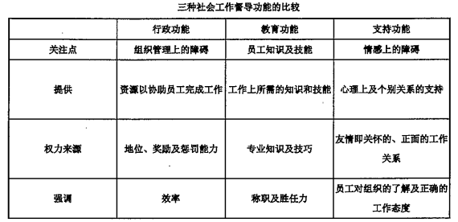

### 1. 社会行政的涵义与功能

#### 1.1. 社会行政的涵义**（2011 名词解释、2012 名词解释、2015 名词解释）**
>社会行政又称社会福利行政。广义一针对全体人民的，社会福利行政主管机关及其他行政机关有关社会福利的各种措施。狭义一政府的社会福利行政主管机关依照国家的立国思想、社会政策和社会立法，在其辖区内的有关社会福利的措施。

#### 1.2. 社会政策的意义

社会政策对于一个社会的稳定、进步和发展具有不可忽视的功能。社会政策的功能具体表现为以下几个层面：
a.它直接通过利益分配的形式使社会弱者受惠，改变他们的生活处境，过正常的社会生活：
b.它可以减缓社会问题所造成的压力，从而维持社会秩序的稳定；c.这种稳定局面反过来可以支持社会成员的正常活动，促进社会的进步。
d.社会政策的意义还在于它的作用空间的广阔性，即它不是处理少数人的问题，而是要改变相当数量的有困难者的共同性问题。

#### 1.3. 社会行政的地位
a.社会政策的重要意义决定着社会行政的地位。没有社会行政过程，任何社会政策只能是一纸空文。社会行政人员依其对社会政策的理解、解释和推动影响着社会政策功能的发挥。
b.社会行政的地位还在于它在社会福利和社会服务体系中的不可替代的作用。长期以来，在社会工作比较发达的西方国家，社会工作多以直接服务为主，而社区工作也是在小范围内实施具体的服务。这种直接的社会服务帮助受助者解决了他们所面临的重要困难而具有重要的作用。
c.社会行政侧重于从宏观的、政策的角度考量社会福利服务，并借助行政体系推进社会福利服务的落实，从而在社会福利和社会工作体系中占有重要地位。

#### 1.4. 社会行政与社会管理、公共行政区别**（2013 论述题）**
在我国，社会管理是一个被广泛使用的概念，它是指对整个社会系统的运行过程的有目的的影响。公共行政涉及的是社会生活中的公共领域，诸如公共安全、交通、教育等。公共行政是对这热领域活动的行政管理，其目的是使公民们享受上述服务以正常地生活和工作。
（1）公共行政与社会行政或社会福利行政的不同之处
1.社会行政涉及的对象一般较公共行政狭窄，只是公民中在日常生活方面遇到困难者，是社会弱势群体；
2.社会行政的内容带有更强的福利性，而不是一般服务：
3.就行政过程而言，社会行政多带有社会工作的特征。
（2）社会管理、公共行政、社会行政三者之间的关系
1.就涉及范圈而言，社会管理是针对整个社会的，公共行政则涉及社会的公共领域，社会行政涉及的是所遇到的社会问题的一部分，它属于社会工作领域。
2.就直接目标取向而言，社会管理追求整个社会的协调运行，公共行政关心的是全体公民的公共福利，社会行政关心的主要是社会弱势群体的合法利益。
3.就其执行者来看，从事社会管理的是对整个社会运行负有责任的部门，如整个政府及其综合管理部门，公共行政的承担者是与公共福利有关的政府有关部门及其下属机构，社会行政责任的承担者是社会福利行政机关及社会福利机构

#### 1.5. 社会行政与社会管理的联系与区别
（1）社会管理一般带有综合性特点，即它站在整个社会的高度，解决社会问题、协调社会关系、为社会发展创造适宜条件的管理活动。
（2）联系：如果我们把社会管理看作在整体上协调社会关系、解决社会问题的活动，那么，政府制定和实施社会政策，解决困难群体的问愿也可以纳入社会管理的范畴。
（3）区别
1.对象不同：社会行政的对象是社会福利活动，特别是对困难人群和弱势群体的福利性支持，而社会管理的对象是一般的社会活动，是要协调社会结构中的各种重要关系
2.方法不同：社会行政作为一种组织、协调和管理活动包括使用一般的管理方法，但它更强调从支持弱势群体、有效提供社会福利的角度看待协调和管理，更强调对人的关心。如果说社会管理更强调权力的话，社会行政则更强调共同参与和治理
3.任务不同：二者都要追求活动的效率和效益，但社会行政更看重效果而不是单纯的效率，因为社会行政的根本任务是要对困难人群、弱势群体实施有效的帮助

#### 1.6. 社会行政与社会政策的关系
（1）社会行政是社会政策的执行过程：社会行政是实施社会政策的行动；
（2）社会行政是社会福利的传递过程：社会福利的传输需要行政协调；
（3）社会政策与社会行政实施之间的关系：
A.社会行政的效果受社会政策的科学性及其他条件影响；
B.社会行政过程对实施效果的影响。

#### 1.7. 社会工作与社会政策的关系
（1）联系
①社会行政是社会工作的四大工作方法之一。社会行政工作是一种专业性的服务实践活动。随着社会工作实务及理论研究的不断发展，在社会工作领域里逐渐形成了一些基本的方法。社会行政的地位还在于它在社会福利和社会服务体系中的不可替代的作用。
②工作中，社会工作既有直接性社会服务，又有间接性社会服务。直接性社会服务是直接面对服务对象的服务，间接性社会服务是通过支持一线的工作人员进行的服务，社会工作行政属于间接性社会工作服务。
（2）区别
①就两者概念而言，社会工作是根据一定的价值观念帮助有困难的人走出困境的专业助人活动；而社会行政是指依照行政程序，妥善利用各种资源，实施社会政策，以向有需要者提供社会服务的活动。社会工作的概念范畴明显包括了社会行政的概念范畴。
②就涉及范围而言，社会工作涉及的范围更广，它除了包括社会行政以外，还包括个案工作、小组工作、社区工作。
③就其执行者来看，社会工作的执行者范围很广，不仅包括社会行政责任的承担者的社会福利行政机关及社会福利机构。还包括一线的社会工作者等。

#### 1.8. 社会行政的层次
（1）宏观社会行政
1.指在政府的社会行政系统中和在大型非营利组织中，从事政策的设计、为其建立条件及规则并综合性地推动政策实施的活动。
2.特征：较强的政治性、广泛的协调性、对政策实施负有主要责任、运用权力系统推行政策
（2）微观社会行政：
1.与宏观社会行政相对，指的是在政府部门或社会服务机构中比较接近于具体服务的在基层从事的行政活动。
2.特征：实务性、局部协调、部分责任、科层权力和其他方法并用。
（3）二者之间的关系
1.从性质上来说，二者都具有某种相对性。宏观社会行政是在更大范圈内，面对复杂的情况对推行政策的设计、筹划和组织；微观社会行政主要面对局部地区、具体问题。
2.从结构的角度看，宏观社会行政是对于实施某政策的总体设计和推动，微观社会行政则是微观设计和对实际服务的推动，是宏观社会行政的必要延伸。
3.从功能上看，宏观社会行政处理的是与政治相关的问题，是建构资源筹集和分配的总体格局，是建立政策实施中的总规则，微观社会行政处理的是与实施服务相关的具体问题。
4.宏观社会行政的框架设计和搭建不科学、不合理、不符合实际，必然会影响基层服务领域中行政工作的模式和效果，反观，微观社会行政的效果对宏观社会行政目标的实现具有实质性的影响。

#### 1.9. 社会行政的功能
（1）社会行政的社会效果
1.增进社会福利：通过促进物质资源效用最大化、人力资源效用最大化和最有效地利用资源和配置资源来增加社会总福利。
2.满足弱势群体的需要
A.弱势群体的概念：弱势群体也被称为脆我群体或劣势群体，它指的是在某一社会生活结构中处于不利地位的群体。不过三者分析角度有所不同：
A1.弱势群体是从社会竞争、社会利益分配的角度分析问题的，对应的是强势群体。
A2.脆弱群体是从应付外界冲击能力的角度着眼的，即该群体承受外界冲击的能力脆弱，其能力脑弱的原因既是生理性的，更是社会性的。
A3.劣势群体：强调某一群体生活环境、生存状态的恶劣性和解决该群体问题的急迫性，要改变该群体低劣的生活环境、生存状态的恶劣性和解决该问题的紧迫性，需要在社会政策方面做出努力。
B.作用：社会行政在社会政策的指导下，结合运用社会工作方法，对困难群体、弱势群体给予物质的、服务的和精神的帮助和支持。
3.促进社会公平及社会秩序
A.社会政策的实施有利于缓解社会不公的现象，从而促进社会公平；
B.是社会紧张的减压器。
（2）社会行政的具体功能
1.社会政策的实施与改进：将政策转化为社会的行为，处理机构与环境的关系；处理政策执行部门同其他相关组织的关系；完善社会政策的功能。
2.提高机构服务效率：保证有组织地提供服务，以最有效地达到既定目标。
3.技术层面的功能：在开展服务之前对服务对象进行调查：在服务过程中制定具体的工作规则和标准；进行服务转介（在服务对象的需要超出机构的服务范围和能力的情况下，机构负责任地将服务对象向其他服务机构介绍，帮助服务对象获得所需并解决问题）。

#### 1.10. 社会行政的构成要素
（1）社会政策
社会政策是社会行政和其他社会服务活动的基础。
从宏观角度看，即从国家、政府层面看，社会行政就是实施社会政策的过程—没有社会政策就不会有落实政策的组织和机构，就没有合法地动员起来的资源，也没有针对它的实施行动即社会行政。
从微观或具体活动的角度看，没有社会政策，也就没有社会福利服务的传输系统，就没有强有力的制度去保证服务的有效提供。
（2）福利资源
社会福利资源是可以用来改善或增进人们的社会福利的资源。
社会福利资源包括物质性资源和服务性资源，前者是以物质或资金的形式存在的，服务性资源是人们所需要的、可以解决自己困难的服务活动。
社会福利资源的存在形式、数量和类型，对社会行政发生着直接影响。
（3）服务机构
社会服务机构是直接从事社会服务的组织，是社会福利传输的主体。无论是政府的福利活动，还是民间的福利行为，都是借助一定的组织、机构的参与而推进的。在市场经济比较发达的社会，实施社会福利的组织系统有三个，即非正式社会福利系统（由家庭、家族、邻里、朋友等初级关系组成，基于感情连带关系）、正式社会福利系统（由政府部门及其兴办的机构组成）及社会性社会福利系统（由非营利组织承担）。
政府部门之间、政府部门与服务机构之间、各社会服务机构之间以及组织和机构内部的合作协调，就是社会行政。
（4）行政人员
社会行政人员是在社会政策执行系统和社会服务机构中从事政策实施设计和对服务活动进行协调、督促的人员，他们对有效地实施社会政策、实现政策目标负有直接责任。
社会行政人员由两部分组成：一是政府系统实施社会政策的推动者和政策实施框架的设计者（公共行政体系中负责推动和落实社会福利政策的官员和一般工作人员）；二是与具体服务相连的行政人员，具体负责组织、协调服务活动，促进服务的落实（社会服务机构中的行政人员）。
（5）服务人员
社会服务人员是直接将社会福利资源传送到政策对象手中的工作人员，他们与服务对象之间的互动直接决定了社会服务的效果。
社会服务人员的承担者可能是专业社会工作者，也可能并不具有专业资格。对于后者，社会服务机构一般应对他们进行专业价值与专业方法的培训，以提高服务的效率与效果。
社会服务人员直接同服务对象打交道，会及时发现服务中的问愿、矛盾、障碍，对社会行政过程以及社会政策的修正和完善发生重要影响。

#### 1.11. 我国社会行政改革面临的主要问题
（1）社会行政部门职能条块分割，影响社会行政整体水平的提高。我国社会行政管理机构众多，机构之间职权设置条块分割。虽然民政部门可以被看做社会行政的主要部门，但是人力资源和社会保障部、卫生部、残联、妇联等机构也承担着相当一部分社会行政工作，导致我国社会行政总体上缺乏协调性与全局性，不可避免地造成效率低下，资源浪费。
（2）我国社会行政法律体系仍不健全。虽然我国社会行政的立法工作在不断推进，但仍缺少系统的法律体系。
（3）社会行政主体单一。虽然自改革开放以来，第三部门取得了较大发展，但是其份额仍然偏小。由于我国民间福利机构缺乏有力的政策支持，缺少广泛的资金来源，他们好似在夹缝中生存，还没等壮大就已经天折了，这种脆弱的生存状况直接影响其参与社会行政的能力。还有一些主要依靠政府资助的第三部门，习惯于行政命令式的福利执行体制，与政府部门没有太大差异。这导致了我国社会行政缺乏活力，缺乏民司回应意识。
（4）中央政府过于大包大揽，地方政府普遍缺乏主动性。我国目前仍然是高度一元化的社会行政模式，地方政府积极性不高，能够自我创新的空间不大。
（5）社会行政人员整体素质仍然偏低，专业化水平不高。目前从事社会行政的公务员或工作人员，大多没有接受过社会工作、社会保障、社会行政等相关知识的专业学习，理论水平不高，专业素养不够。虽然近几年有不少社会工作专业毕业生进入社会福利机构工作，但由于岗位设置、薪资待遇等问题，人才流失比较严重。

#### 1.12. 改革开放以来我国社会行政体制改革与创新的看法
①体制改革对社会行政体系的影响
政府总负责、单位分头落实、行政干部操办的社会福利导致了“企业办社会”现象。经济体制改革则力图改变企事业单位福利化、低效率的状况。
a.国有企业和事业单位开始将提供社会福利的职能外移，转由社区或社会机构提供服条，实行社会福利社会化。
b.私营企业及一些合资企业不直接向职工提供福利服务。在一些承包、租赁的企业中，工会、妇联等组织的功能严重弱化。
这样，社会福利政策和社会行政体制发生着重要的变化一政府和企业（单位）的社会行政能力弱化，社会行政的性质也由政治化向行政和经济相结合的方向转变。
②社会行政体系的创新
a.企事业单位社会福利职能的一定程度的外移，社会问题复杂性增加，建立服务型政府，政社分开及政府购买公共服务等一系列改革和变迁，一方面改变着我国原来的社会福利体系，另一方面催生了一批从事公共服务、社会服务的社会组织，其中包括社会工作机构。于是，社会福利服务格局由原先政府（通过单位）的一元化提供变为政府、单位、民间机构共同承担。
b.社会行政工作人员的结构也在发生变化。一些人员由于机构职能的转变也在增加自己的专业性，专业社会服务机构的出现和发展则倡导着新的社会服务和社会工作行政模式。
c.政府通过制定社会政策、控制社会资源、确定购买服务项目、委托或购买服务、监督社会服务过程和评价社会服务效果等手段主导社会服务发展。社会服务机构则通过具体组织服务满足服务对象要求，并反映民众和机构的意见，促进社会服务的完善。在微观层次上，社会服务机构内部的行政活动正在按照政策要求和专业规范展开，一种混合型的社会工作行政模式被施行。
③社会行政体系创新的意义
中共中央十八届三中全会做出全面深化改革的战略部署，提出要推进国家治理体系和治理能力现代化，要紧紧围绕更好地保障和改善民生、促进社会公平正义深化社会体制改革，要推进社会领域制度创新，推进基本公共服务均等化，加快形成科学有效的社会治理体制，这将为社会福利事业和社会工作的发展创造新的有利条件。
随着全面改革的进一步深入，市场经济发展，政府的行政体制改革，社会体制创新和社会事业的发展，特别是政府购买公共服务和社会服务的广泛展开，社会力量的激活及参与，我国社会服务资源的动员模式和服务提供模式也会发生相应变化，社会福利制度和社会工作制度建设也会加快。一个反映我国经济、政治、社会、文化特点，回应民生和社会进步要求，并借鉴国际先进经验的社会行政模式将会逐渐建立起来。
### 2. 社会行政的内容

#### 2.1. 社会服务计划
（1）内容
1.社会服务的需求状况和福利资源的储备状况；
2.服务可能遇到的来自经济、政治、文化、社会结构、社会心理的支持力量和阻力；
3.对具体服务过程的计划：具体目标、受益人、拥有的资源、需要和服务资源的配合；
4.编制预算：预算是对进行某一服务所需资源的计算，是获得财政支持的前提。类型有：
A.科目预算：按照开支项目逐项进行的预算；
B.成果预算：依据服务效果进行的预算：
C.方案预算：以一个方案为单位的预算。
（2）过程模式
1.传统推禁理性决策模型：认为决策是要寻求最佳决策，要以最小的投入获得最大收益。
A.其假设：
A1.获得关于决策的全部信息；
A2.找到实现目标的全部方案；
A3.能准确预测出每一方案的执行结果。
B.困难：常遇到难以逾越的困难，并不具有真正的现实性。
2.卡愿的计划过程模型：
A.在确定工作方案的过程中要考虑资源、利益群体、社会价值、行政系统等多种因素的影响。
B.模式：社会政策—社会需要和社会资源——计划任务的界定——经济、政治、文化、价值及服务体系分析（经济资源供求、利益群体格局、干预层次及力度、文化及社会心理、服务体系状况、选择的多样性）—一行动方案制定、比较与确定一—方案执行—评估与反馈。
（3）社会服务计划的程序
1.确定社会需要：问题识别、因果假设分析、评估需要
评估需要的原则：
A.分析服务对象对问题和目标的知觉性；
B.了解服务对象的需要是否可从现在所获得的服务方案中得到满足，避免因服务的重复而浪费资源。
2.提供备选的服务方案
A.集思广益、初步设计
B.精心设计、详细论证、反复计算
3.选择方案——方案评估、可行性方案的选择
A是否可行要考虑：政治制度的许可性、经济的可接受性和社会的可接受性；
B.遵守准则：效率、效能、可行性、要性、公平、附加的结果。
（4）社会服务机构计划的方法
1.确定总目标
2.目标分解
3.支持条件分析：包括法律制度保障、机构的管理架构的准备、人力资源准备、技术能力准备、财力准备、价值观念准备。
（5）社会服务计划的影响因素1.外部政治、经济环境的制约
2.服务对象
3.机构间关系
4.组织自身的能力
（6）社会服务计划的文本架构
1.方案名称：主标题和副标题联合使用。
2.实施依据：案主的问愿和需求，最好用量化资料说明。
3.宗旨和目标：方案应明确其宗旨、目的及目标，并坚持问题解决取向及正面的陈述来设定目标。
A.每个抽象目标分解为三到四个具体目标，具体目标又可分为过程和结果具体目标.
A1.过程具体目标：实现结果所经历的步骤和目标：
A2.结果具体目标：案主在行为、态度、观念等方面的改变。
B.可能出现的错误
B1.具体目标出现不恰当的结果；
B2.具体目标中涉及的需求和问题太多。
4.服务对象：一般人口群一危机人口群—一标的人口群—→服务人口群
5.方案服务的内容：何人来执行、如何执行：需要的资源：举办时间、地点和期限：
6.经费预算：来源、金额和用途；
7.工作流程：方案实施的步骤；
8.评估方法：投入评估、过程评估、结果评估。

#### 2.2. 社会服务的组织
（1）组织的一般结构类型
1.纯直线式的组织结构：最简单的组织方式，组织由上而下分为若干层级，各层级呈金字塔形状，是一种自上而下通过严格分工和权力分层而形成的组织形式。
2.直线幕僚式组织结构：是指机构阶层间存在的纵向关系和横向关系，幕僚专家则负责协助直线部门的管理者。
3.功能职权式组织结构：是指幕僚部门在特定工作范围内，可以直接对其他管理人员下达命令。
（2）团队式结构
1.团队的特征：
A.机构成员具有强烈的归属感和责任感；
B.所有层级的员工都将参与到机构运作中，团队成员有机会参与决策，具有团队领导意识；
C.团队成员之间具有充分的信任和沟通；
D.团队支持成员个人的发展，成员也将自己的发展融入团队的事业中；
E.团队成员之间存在积极地冲突，成员通过创新的方式来解决冲突；
F.团队是有效的学习型群体，团队成员个人的知识可以在团队内得以分享。
2.团队的类型
A.问题解决型团队：同一部门5到12个员工组成，定期聚在一起，讨论和解决工作中的具体问题；
B.跨专业团队：来自不同部门、不同专业领域的专业人员组成的一个群体；
C.自我管理型团队：员工有一定的自主性，可以控制工作节奏，决定工作任务的分配，成员相互进行绩效评估。
（3）组织成员的招聘和录用
（1）社会服务机构的组建方式
1.原有社会组织的转型，即原来的非社会服务机构交为社会服务的承担者，或一般行政机构变为社会服务机
2.根据任务需要新建社会服务机构：
A.机构工作任务的转换；
B.是招募成员建构新组织。
（2）招聘的思考：
1.是否是社会服务的关键岗位缺员；
2.是否可能通过内部调剂解决缺员问题；
3.是否可以以兼职方式解决这一问题；
4.某一岗位缺员的补充是否刻不容缓；
5.缺员问题是否有长远影响。
（3）聘用程序：
1.发招募通知：
A.可以在机构内部进行调配，由内部通告通知员工，由员工申请：
B.如果内部没有合适人员，需要发布公告，对外公开招聘。
2.收集申请者资料：对申请者的背景资料进行分析
A.学历、专业训练、经验及一般背景；
B.表达、思考及组织能力；
C.事业发展目标与期望；
D.申请者的进取心；
B.工作稳定性：
F.申请岗位的原因与动机；
G.体力、性格、兴趣、爱好
3.初步评估选择：
A.看申请者在以前工作经历中，最喜欢和最不喜欢的工作如何；
B.申请者对工作环境、职贵、性质、地点有何期望；
C.申请者的兴趣、爱好与工作所涉及的责任是否相同。
4.录用：经过人力资源计划的制定、工作岗位分析、申请人资料汇集、评估选择，最后选择最合适的人员以填补职位空缺；
5.安排职位：引导被录用者熟悉环境，使新员工尽快适应、掌握机构的要求及各项工作细节。
（4）注意
1.应聘者对社工价值观的认同；
2.应聘者的工作经历和人生经历；
3.应聘者的实际工作能力和合作精神。

#### 2.3. 督导和激励
（1）督导
1.含义：机构中的行政人员为更好地完成机构所承担的任务，对被督导者的工作给予指导、协调、强化和评价的活动。
2.督导的形式与被督导者的成熟程度有关
A.所谓成熟程度指一个人独立、自主、良好地理解自己的角色地位、判断其角色行为意义的程度和较好地完成其角色行为的能力。
B.对于不成熟的工作人员，采用指示型督导：手把手地教给下属如何去做：
C.对工作人员具有较强的工作能力但不甚成熟，应采用指导式督导：给予指导但不控制
D.对于较强工作能力，比较成熟的工作人员，采用支持性督导：对被督导者的督导行为进行辅导和支持；
E.对相当成热的工作人员，对其授权。
3.形式：
A.个别督导
A1.个别督导是指一个督导者对一位受督导者以面对面的方式定期举行讨论。
A2.优点在于不受干扰地解决某一议题，并且有充分的时间讨论个案，了解被督导者的工作进展，提供有效的工作方法，对会谈内容有较高的保密性。缺点在于：没有机会和其他督导交流，有可能与督导建立于工作无益的同盟关系。
B.一对一督导
B1.包括：一个督导者同时指导两位经验及背景相似的员工。这种形式适用于没经验的新员工；两位有相同经验的员工互相观率学习，督导者在旁观察：由一位有经验的员工指导没经验的员工，督导者则对有经验的员工进行监督。
B2.这种模式的优点在于具有同伴教育的督导效果。
C.小组督导
C1.包括：督导者直接督导一组有相似背景的员工：一组较为成熟、有经验的员工互相督导，督导者则在一旁观察；督导者带领一组有不同背景的员工。
C2.优点在于：省时，省人力，省经费，具有同伴支持气氛，提供更加开阔的专业知识和工作经验的视野。缺点在于：无法视需要对受督导者治疗，团体中的动力有时会对人有伤害，对每位受督导者的关注效果较差，无法讨论细节。
D.志愿者督导
对志愿者的督导可以减少或防止他们在助人过程中由子缺乏充分的知识或技能而可能引发的问题。对志愿者督导的两种方式是指在机构内和机构外与他们一起工作。在机构内，可指定专门成员与志愿者们建立督导者与被督导者关系，传授知识，开发技巧，协助培养专业态度。在机构之外，各种各样的研讨会和工作坊对志愿者来说意义重大。
4.督导的方法
A.讨论，最常用的讨论方式有自由发表意见和个案讨论。
B.计划，经过员工的思考、讨论，制定一个包括在特定时间内需达到的目标以及所需采用的方法及程度等内容的工作计划，作为执行和评估的依据和标准。
C.问题解决法，通过员工集思广益，有效地解决问题或提出解决问题的方案。
D.模拟方法，即用模拟的方法探讨问题所在。其主要方式为模拟练习和角色扮演。
E.直接督导，主要用于增进员工的实际技能和帮助其专业的发展，主要方式有示范和模仿。
5.督导的性质：
A.在专业目标上，属于一种继续教育或持续性的在职训练，以提高专业服务素质，实现有效的服务：
B.在专业体制上，属于一种职务和地位
C.在行政上，具有一种从属和指挥的领导和权感关系
D.在组织上，是一种分工合作的制度，以有效率的发挥功能E.在教育上，属于一种辅导性教育功能，以促进受督导者的学习成效
6.督导与领导的区别
A.督导具有一定的行破领导的功能，但督导还注重员工专业技能的培训和辅导，具有技术教育和心理、情感支持的功能。
B.领导从根本上说是一种影响力，是一种追随关系。
7.督导的基本原则
A.督导者传授知识、原则、技术，信任员工能进行自我管理
B.社会工作者通过选并那些与机构相协调的目的与目标，从而实现自我管理
C.需要时，社会工作者可获得督导者的帮助
D.必要时，社会工作者能与督导者取得联系
E.员工们周期性地评估他们的督导者
8.督导的功能：
A.行政的功能：督导者执行有关工作计划、工作安排和工作绩效评估等管理工作，以协调上下属之间的工作，确保员工完成机构所制定的服务目标
B.教育的功能：督导者协助员工增进工作知识、技能，提高理论与实践结合的能力，增加解决问题的办法以及对社区资源的发展与运用能力等，从而促进员工个人的成长并有效完成工作
C.支持的功能：督导者对员工在工作中产生的心理压力，情绪波动及思想困感给予高度关注，通过自己丰富的经验与理论对员工进行心理疏导，提供精神上的支持。

9.有效督导的实施
A.招聘有经验的督导者
B.设计督导者应有的绩效标准并给予适当的培训
C.设计工作程序步骤和评估指标体系，以便对员工的绩效加以评估，对员工的行为随时加以调控
D.建立和维持上下级之间的沟通和反馈
B.加强员工与机构外专家的联系
F.提供更多的发展机会
10.督导的效果体现的地方
A.生产力增加
B.素质控制
C.士气建立
D.教育
11.评估督导者绩效的准则
A.制定员工行为守则，员工工作程序手册
B.制定合理的工作绩效标准
C.为员工创造一个有利的工作环境
12.督导工作的伦理课题：
A.督导者的资格与能力是做好督导工作的先决条件：
B.督导关系与权力是督导过程中重要课题：
C.督导者对受督导着服务或工作表现负有行政责任：
D.督导是否会侵寄专业自主性；
E.督导者职业怠倦之处理。

（2）激励
1.含义：是激发人的动机，诱导人的行为，使其发挥内在滞力，为实现所遍求的目标而努力的过程。
2.激励因素：个人兴趣、时间管理、行政支持、批准和赞赏、成功的机会
3.耗尽与激励
A.耗尽的现象：
A1.薪水不具吸引力；
A2.工作环境不够理想，工作性质单一：
A3.工作成果是非实质性的，不能立即显现，得不到赏识和正面的反馈；
A4.服务对象问题复杂，难以解决；
A5.社工价值与商业化社会价值观冲夹：
A6.社会工作者面对各类社会问题，造成严意的心理负担：
A7.社会需求大于社会供给，工作负荷大；
A8.机构管理水平不高，同事间缺乏支持；
A9.情绪低落，没有成就感。
B.提高工作生活质量：
A.将工作范围扩大：增加员工任务，为员工带来多样性的工作机会：
B.增加工作的深度：在机构实施职位轮换：实行工作扩大化：实施工作丰富化；为员工提供参与机构决策的机会：建立完善的考核制度和良好的奖励、晋升制度：帮助员工挖据其工作潜能，实现更高层次的自我价值。
4.绩效考核；
A.绩效：是指员工在一定时间、空间等条件下完成某一任务所表现的工作行为和取得的工作结果。
B.表现方式：工作效率、工作数量和质量、工作效益。
C.考核方法：比较方法；绝对方法；成效量度
D.考核作用：薪激管理的依据：人事调整决策的依据：员工培训的依据；澈励措施的依据；员工进步的动力；正常工作关系的基础
另一种说法：（社会工作概论，王思斌，p163）考核方法：
投入评估：成员的工作投入情况，工作态度、专业知识和技巧的运用、资源运用和活动设计；过程评估：考察工作进展，包括工作进度、服务推进程序、过程中出现的问题；结果评估：对服务成效的评核，考察活动目标与结果的联系、活动的实际效果：

#### 2.4. 协调与控制
（1）协调
1.含义：是组织各部门之间、成员之间分工合作、协调一致达成目标的活动。
2.分类：
A.依据协调的对象划分：
A1.协调关系：使系统中的不同部分、不同成员之间建立良好的合作信任关系：
A2.协调工作：使他们在工作过程中进行良好的配合。
B.依据协调活动的设计划分：
B1.程序性协调：活动设计过程中，不同人员、部门的活动在时间和过程方面的合理搭配；
B2.工作性协调：服务活动进行过程中，行政人员协调、联系各方面的行动，使他们互相配合地行动。
3.法约尔的“跳板原则”：在管理机构中，从最高一级到最低一级应该建立关系明确的职权等级系列，这既是执行权力的线路，也是信息传递的渠道，一般情况下不要轻易地违反它。但在特殊情况下，为了克服由于统一指挥面产生的信息传递延误，设计了一种“跳板”。也叫“法的尔桥”，即在遇到一些需要快速办理的问题时，为提高办事效率，需要跳过原有的管理路径，在平行的两者之间建立直接联系的渠道，即建立跳板或天桥。
4.利克特“连接销”：通过某些成员的“一身二任”把不同层次、不同部门连接起来，而作为“连接销”的一身二任者由于了解多方面的情况，容易起到协调作用。
4.良好的协调是以有效的沟通及相互信任与认同为基础的。
A.沟通的方式有：
A1.上行沟通：自下而上传递信息，利于上级了解政策执行中的困难，及时控制和调整；
A2.下行沟通：自上而下，帮助下属解决困难；
A3.横向沟通：同级行政机构、同一行政机构内部和人员之间的沟通；
A4.斜向沟通：非同一层次不同部门或成员之间进行的沟避。
B.三大关系模式：
B1.聚联式：一个沟通中心统一向各方传递：
B2.单联式：成员与其相邻的两点发生沟通联系；
B3.互联式：各沟通点可以与其他点互通信息。
（2）控制
1.控制的含义：社会行政控制是指社会组织在动态变化的环境中，为确保实现既定目标而进行的检查、监督、纠偏等管理活动。这个概念包含三方面含义：
A.控制有很强的目的性，控制与计划密不可分
B.控制是通过监督和纠偏来实现的
C.控制是一个过程
2.控制系统包括：控制目标体系：控制主体：控制的对象；控剑的方法和手段。
3.控制的意义
A.社会行政控制对于确保行政实施计划的实施方向，促进行政实施的效率与效益等有着重要的保证作用。
B.通过行政控制，使行政实施的工作状态与行政计划的工作状态尽量相符合，确保行政实施的结果和人们预先计划的目标完全一致。
C.组织发展到一定的规模，就必须实行授权管理。
D.控制将有助于机构和管理者发现错误、纠正错误。
4.社会行政中的控制类型
A.科层控制
特点：层级化、制度化、规模化、追求效率、忽视下级的参与。
B.小团体控制
有效的团体控制：团队的规模和人员结构；明确的目标和强烈的归属感；有控制的授权和信息共事；有效的绩效评估与奖酬体系；适当的资源和培训教育：独特的团队文化和共同的价值观。
C.市场化控制
更重视管理，更意视绩效，借用市场机制对机构行为进行控刺。
5.冲突与控制
A.冲突的类型
A1.若以冲突后果为依据，可分为建设性冲突和破坏性冲突
A2.若以冲突范懂为依据，可分为个人层次的冲突、群体层次的冲突、组织层次的冲突
A3.若以冲突星现的基本内容为依据，可分为认识冲突、情感冲突、目标冲突、利益冲夹、程序冲突
B.冲突形成的原因
B1.人际因素：个性差异、沟通障碍、归因的失误
B2.群体间因素：目标不相容、相互依赖性
B3.组织因素：资源稀缺性、任务的不确定性、组织的变动性
C.社会服务机构常见的冲突表现：
C1.机构成员个人目标与机构目标的冲突：
C2.角色期特与机构成员心理的冲突；
C3.机构内的上级行政主管单位与下级服务机构之间的冲突
D.冲突管理的基本原则
D1.倡导建设性冲突，避免破坏性冲突，把冲突控制在适当水平
D2.实行全面系统的冲突管理，而不是局限于事后的冲突控制和解决冲突，减少冲突管理的成本
D3.不走极端，持中，以和为贵化解冲夹
D4.具体问题具体分析，灵活适宜的处理冲突
E.冲突管理的策略
E1.个人冲突管理策略：分析冲突原因——了解冲突当事人——选择自己的立场
E2.机构冲突管理策略：改变机构的组织结构—一重塑机构文化
F.利用冲突发展机构：
F1.改变机构文化来激发冲突：
F2.设计科学的续效考核机制、奖励机制，强调员工的差别比较，提高冲突水平，获得机构服务的效率与效益；
F3.改革机构组织结构，打破原有的平衡和利益格局，激发冲突：
F4.有意识的使用具有威胁性和模棱两可的信息，减少机构不思进取的态度，促进机构成员的积极思维；
F5.强调群体间的异限，倡导“内和外争”来激发冲突；
F6.引进外来的专业人员，激发机构内部新旧价值观念、新旧员工之间的冲突和碰撞，增加机构组织活力。
另一种说法：（社会工作概论，王思斌，p164）控制包括两个方面：
（1）机构工作进程的控制：按照某种计划对相关部门、成员的工作进度、效果进行的综合控制和影响，以实现机构运行的总体协调。
1.两种基本观点：
A.控制是机构中的领导、行政人员实施权力的过程，是自上而下的；
B.控制是人员间的相互影响，可以是自上而下、模向、自下而上的。
2.机构工作进程的控刺是以了解机构各部分工作进展的可靠消息为基础，同时，机构成员对工作任务、进程的了解有助于他们自我控制，而这与成员的素质和社会化程度有关。
（2）机构中冲突的控制：不同部门、不同成员、不同项目之间的冲突。冲突处理方法：
1.缓和策略：尽量减少、模糊冲突双方认为的差距，而强调双方的共同点，强调“和为贵”。
2.彻底解决策略：在冲突难以调节的情况下，公开冲突，从根本上解决问题，包括重新设计组织。

#### 2.5. 评估与报告
（1）社会服务机构评估的意义
社会服务机构评估是对整个机构的运行及所提供的服务的评价，是将现状或结果同计划相比较，从而判定机构功能状况的活动。社会服务机构的评估具有重要意义：
1.明了服务计划的执行情况，发现成续和不足以改善服务和更好地推进机构的工作；
2.可以发现问题，并通过解决问题实施服务计划；
3.可以向社会服务的支持机构作出交代；
4.对相关政策作出评估，并促进政策的修订；
5.达到总结社会服务经验、发展理论的作用。
（2）评估的内容：社会服务的投入情况、服务的工作进度、服务的效果、服务活动与工作计划的偏离情况。
（3）评估的类型
1.方案评估：对服务方案是否含理、可行、是否是较优方案、实施是否有把握的评估。
2.投入评估：对服务投入的人力、物力、时间和精力、财力的评估；
3.过程评估：对机构运行或服务提供过程的评估，及时发现问题，采取措施保证计划的落实。包括提供了哪些服务、服务如何提供、服务过程是否指向计划目标。
4.结果评估：对机构运行或服务结果的评估，包括受益人数、受益人结构及影响深度
5.效率评估：比较服务的投入和产出，进而发现资源利用率的评估方式。
（4）社会服务机构评估的方法
①社会服务评估主要采取社会调查方法进行。针对要评估的项目，评估人通过座谈、访问、问卷、观察等方式获取必要资料，同计划进行比较。在评估项目时，文字资料十分重要，特别是资金运用情况，尤其要依赖收支账目。在对服务过程进行评估时，关于实施服务的工作记录是重要的参考资料。
②在对服务项目进行评估时，费用----效益分析方法有广泛适用性。
费用----效益分析方法计算该服务项目的所有费用和效益，并将它们换算成可比较的量，同时考虑服务效果的分配性问题，这样就会对该服务项目的费用和效益做出评价。这种评价方法可用于服务方案的选择和最终评价。在对社会服务项目进行评价时，有许多内容是难以量化的，因此也难以进行综合比较。在对这类项目进行评估时，费用一效益分析是适用的，即当某些服务效果不能量化时，采用详细描述其效果的办法，表明此服务的重要性。费用----效益分析是一种定量与定性相结合的评估方法。
### 3. 社会服务评估

#### 3.1. 社会服务评估的理论与方法
（1）“3E”评估理论（经济、效率、效果）
1.经济是指以最低可能的成本供应与采购维持既定服务品质的公共服务，关心的是投入的数量，而不关注其产出与服务品质
2.效率通常包括服务水准的提供、活动的执行、每项服务的单位成本
3.效果是指公共服务实现目标的程度
（2）“3D”评估理论（诊断、设计、发展）
1.诊断是指非营利组织或项目的管理者能够正确识别组织或项目所面临的新的管理问题，能够考虑到主要的相关利益群体的需求和利益。
2.设计是指组织或项目管理者能够通过适当的策略解决这些问题，能够设计解决这些问题所需要的恰当的结构和战略。
3.发展是一种解决组织或项目实施过程中所遇到的问题的能力，以及相应的作为学习过程的管理交革或创新。
（3）服务对象满意度评估理论
顾客的满意度，即服务对象感受到的服务质量达到其期塑值的程度。
（4）比较：
1.“3E”评估侧重于评估是一个监督检查的过程，它注意的是组织或项目产生的结果；
2.“3D”评估侧意于评估是一个学习的过程，它注重的是实施政策、计划或项目的组织能力，这两种评估都是自上而下型的评估方式，且评估是以实施项目的组织为中心。
3.服务对象满意度评估的导向是自下而上的，面向的是被服务对象。

#### 3.2. 社会服务评估的作用
1.社会服务评估是检验服务的效率、效益和品质的基本途径
2.社会服务评估是决定服务发展方向的重要依据
3.社会服务评估是合理配置资源的有效手段

#### 3.3. 社会服务评估的类型
（1）事前评估、过程评估、事后评估——根据时间要素1.事前评估是指在服务计划形成后进行的评估工作，目的是评估计划的合理性。
2.过程评估是指在服务执行中进行的评估工作，目的是检查执行环节是否能够顺利达成目标。
3.事后评估是指在服务提供完毕后进行的评估工作，目的是检查服务是否达到和为下一次服务提供然验和研究资料。
（2）内部评估、外部评估——根据评估者的身份
1.内部评估是指由方案执行单位的成员所从事的评估工作。
优点：评估人员对于执行方案的组织结构以及所要评估的计划方案有更详细、更准确的了解，同时也有助于以后继续进行研究和评估工作。
2.外部评估是指由机构以外的专家对社会福利计划或方案进行的评估工作。
优点：比较容易保持评估工作的客观性；可以有一套评估的标准，可以对机构行政组织的基本结构进行监督；当社会福利机构组织内存在广泛而激烈的冲突时，“外来者”可以更客观地保持中立的地位，更有效的执行评估工作。
（3）努力评估、成果评估、效率评估、影响评估。（社会工作行政、王思斌、p181）
1.努力评估是针对达成服务目标的质和量所进行的评估工作。
2.成果评估是着重对社会服务所产生的效果进行的评估工作。
3.效率评估是对达成服务目标的资源成本进行的评估。
4.影响评估是针对社会服务方案对整个社区所产生的影响面进行的评估。

#### 3.4. 社会服务评估的组织过程
（1）确认评估的目标：明确社会服务评估的目的是什么，以及为什么要评估
1.通过评估可以帮助机构更好的规划未来，有利于机构进行服务方案的管理
2.通过评估可以更好地向损款人交代，维持责信
3.通过评估可以确定服务方案是否出现未曾预料的后果
4.对服务绩效进行系统的评估，可以获得政策执行和成果量化的实证资料
（2）完成评估前的准备工作
1.确定由谁来做服务绩效评估
2.明确评估检验的是输出还是影响
3.正确使用评估资料
（3）确认社会服务的目标
（4）确认评估的变量
1.确定分析的对象
2.选择分析交景
3.确认资料的来源
（5）收集与评估分析资料
（6）社会服务评估的结果

#### 3.5. 社会服务评估的模式
（1）形成性评估：关心的是正在进行中的社会福利服务或活动，以及这些服务或活动如何影响产出的结果
1.成本一效率评估
2.努力的评估
（2）总结性评估
1.成果的评估
2.适当表现的评估
3.成本一成效的评估
（3）结构与过程的评估
1.结构评估：尝试描述服务的一些面向。通常以理想的干预结构为基本假设，进而测量相关的服务：
2.过程评估：将焦点放在机构的运作和干预的方法上，用于描述案主的特质、服务活动本身，以及机构运作与案主动机间的交互作用。
（4）目标达成模式与因果评估模式
1.目标达成模式：聚焦于福利方案或计划目标的评估，检视达成目标的各种变量。
2.因果模式：聚焦于因果假设的前提，探讨因与果之间的关系，检验达成目标的原因。

#### 3.6. 社会服务组织的评估
（1）社会服务机构的责信评估
1.责信就是对社会负责和对社会的一种交代，具体是指社会服务组织对其使用的公共资源的流向及其使用效果的社会交代。
2.多元化交代：财政交代、政治交代、专业交代、服务交代、行政交代。
3.内容：
A.服务和活动与组织使命和宗旨的异质性
B.规范的治理结构
C.资金的合理使用和运作
D.财务与信息的透明程度
另一种说法：社会服务机构的公信力（社会工作综合能力中级，2015版）
（1）社会服务机构公信力的含义
社会服务机构的公信力是指社会服务机构获得政府、社会和公众信任的能力。社会服务机构实现了它的承诺就会获得各方信任，就具有公信力。社会服务机构必须通过评估向社会大众和资源赞助人提交服务表现和成果用来证明服务是有效的，满足了服务对象的需求，获得了应有的社会效果。这种社会交代会直接影响社会和公众对该机构的信任。
（2）社会服务机构公值力的展现
社会服务机构集多方资源为社会服务的特点，要求它必须在诸多方面作出交代。社会服务机构公信力的展现，就是要求机构根据社会福利的多元交代特质，主动、积极和负责地向社会提供机构的经费使用情况资料、服务成效评估资料，以证明机构履行了社会职贵、满足了服务对象的需要。具体而言，这些交代包括：
1.财政交代，主要是向提供或赞助服务经费的政府、基金会、捐款人提供财政报告，证明资金使用的适当性和效益；
2.政治交代，主要是向立法和权力机构、社会媒体交代机构履行社会责任和义务的情况；
3.专业交代，机构要证明其聘用的社会工作者在服务中遵守社会工作守则、坚守专业操守并提供了达到良好专业水平的服务：
4.服务交代，社会服务机构不仅要向服务对象提供服务，而且要提供令其满意的服务，而服务对象满意度的评估不但要反映问题的解决程度，也要证明服务是在机构内部严谨的行政监督、专业督导下提供的：
5.行政交代，主要说明机构内部管理剑度和程序的正常运作，包括向董事会、管理人员和前线工作人员等作（3）社会服务机构公信力的评估
评钻是建立社会服务机构公共信任的重要途径，而对机构的信任也是影响拥助人（包括政府和基金会）行为的最意要的因素。社会服务机构评估包括社会服务机构本身的评估和社会服务绩效的评估。公信力评估是确保社会服务机构诚信的一种制度安排，其作用在于帮助社会服务机构树立和强化社会公信。信力评估主要是外部评估，是在政府或外界力量的要求下进行的。一般来说，公信力评估包括以下4个方面：
1.资金的合理使用和运作
社会服务机构主要运作的是服务项目，政府、基金会和一些拥款者主要是赞助服务项目，而不是赞助机构。
因此，赞助人一般都希望将经费的大部分用于实际服务。社会服务机构必须说明其经费是否被合理地运用于服务项目。
2.服务和活动与组织使命和宗旨保持一致
社会服务机构的使命和宗旨是其对解决社会问题的公开承诺，具有较高的价值取向，反映的是期望实现的意图、努力从事的事业和志愿投入的精神，属理念层次。社会服务机构使命和宗旨的实现依托子具体的服务和活动，
脱离了机构使命和宗旨的服务和活动，即使有利于机构生存，也会招致赞助人、服务使用者以及社会大众的质疑，进而影响机构的公信力。
3.财务与信息的透明化
社会服务机构的资金主要来自政府、基金会、一般捐则和服务收费，政府除了直接给予财政支持外，有时也通过社会政策给予某些服务减免税的待遇。因此，社会服务机构要定期公开财务报告和服务评估报告，让主要赞助人、服务使用者及社会大众了解机构整体运行报告，为他们监督提供方便。社会服务机构必须在财务与信息的透明化方面作出说明。
4.规范的治理结构
社会服务机构要通过适当的治理结构来保证机构的主要管理者不会损害公众的利益。董事会是社会服务机构治理结构的主要内容，社会服务机构有必要对机构的治理情况作出说明。社会服务机构的监督体系有助于推进社会服务机构运作的规范化，包括内部的监督机制和外部的监督机制。内部的监督机制主要是确保社会服务机构的基本性质，包括监事会的监督、董事会的监督、机构规章制度的监督和机构信念、使命的监督。外部监督机制，主要是指其他利益相关者为了各自的利益，通过不同途径对社会服务机构的管理者和服务人员进行监督。
（4）社会服务机构的使命和战略规划评估
1.主要目的是明确组织的发展方向和发展战略，以此来证明组织存在的价值、增强组织的凝聚力、吸引更多人才，使命和战赔规划评估属于组织的自我评估
2.使命评估
A.我们的使命是什么？
B.我们的案主是谁？
C.案主的认知价值是什么？
D.我们追求的结果是什么？
B.我们的计划是什么？
3.战略规划评估
战略规划是社会服务机构通过对外部环境、内部环境、或胁与挑战、优势和机会的综合分析而制定出的长期性规划。这种评估方法主要有三部分组成：
A.前提控制
B.执行战略
C.战略监督
（5）社会服务组织的能力评估
1.组织质量的评估
A.组织的权力结构
B.组织制度建设
C.人员素质
D.设施及信息管理系统
2.组织行为的评估
A是否有共同的价值观
B.管理技能如何
C.领导的艺术
D.动员资源的能力
E.公共关系

#### 3.7. 社会服务方案实施的评估
（1）输出评估
1.期中输出评估：关注的是“服务量”的测量，需要发展出不同种类的标准化服务单位来测量期中输出。
2.最终输出评估：关注的是“完成服务量”的测量，强调为服务对象提供一个完整的服务。
（2）品质评估
1.核心要素：
A.可倍度：指能提供一致性服务来满足服务对象对品质的期望，其中可以涵盖保证性、同理性、沟通力等要素；
B.及时性或适时性：指在最短的时间内为服务对象提供服务。
2.测量方法：
A.服务品质的输出：通过机构的资料记录，重点评价服务的可信度和及时性；
B.服务对象的满意度：通过对服务对象的满意度的调查，让服务对象不仅评价服务的品质，还要评价服务的结果、效益、影响和收获。
3.步骤：首先选择品质要素。其次将服务品质要素具体化，最后将要素测量与社会服务方案的期中输出评估连接起来。
（3）成果评估：
1.关注的是方案的结果和成就。收集的主要是服务完成量资料，包括完成处置或接受完整服务的人数。
2.方法：
A.数字计算：主要计算达成生活质量改善的服务对象的人数，一般用来评估服务对象的条件、地位与行为。
B.标准化测量：主要根据标准进行服务前后的测量，以此评估服务对象生活质量的改善，一般用于评估服务对象的感受、态度和想法。
C.功能层级量表：是机构或方案用来评估服务对象生活质量的改变所制定的服务前后的测量指标，一般用于测量服务对象的功能或服务对象家庭的功能。
D.服务对象的清意度：是指服务对象对生活质量改善的自我报告，一般用来评估服务对象的想法。

### 4. 社会工作督导
（1）社会工作督导的概念**（2019 名词解释、2014 名词解释） **
社会工作督导（supervision in social work）是一种专门的社会工作方法或程序。它是通过督导者对被督导者的指导、督促，使被督导者能够更有效地运用专业知识和技能并按照专业伦理开展工作，以提高服务质量，保证服务取得预期的效果。
1.定义中所涉及的“督导者”，是社会福利机构中实际从事督导工作的人员。他必须受过充分的社会工作专业教育，同时必须具备丰富的实际工作经验，还必须掌据深入的督导知识与方法。一个督导工作者应该是合格的专业社会工作者，机构措施和政策的忠实支持者，启发他人学习与改变的引导者，具有强烈社会责任感和事业心的职业工作者。
2.“被督导者”是指机构中接受督导训练的人员。一般包括以下四类：
A.已经受过一定的社会工作专业教育的新社会工作者；
B.正在接受社会工作专业教育的实习学生；
C.未受过专业教育的社会工作从业人员：
D.非专业的志愿服务人员即俗称的“义工”。
（2）社会工作督导的功能
1.社会工作督导的教育功能体现为，通过督导过程，使社会工作实际从业人员在执行职责时，学习和了解更多的知识和实务，以改进对案主的服务质量。不同的实务领域应具备的知识、技术虽有所不同，但一般说来，督导者应使被督导者了解、掌握以下几个方面的内容：
A.社会工作哲理、价值，社会工作的历史、现状，以及社会福利机构的计划、政策；
B.社会工作专门知识、方法、技术、技巧；
C.社会工作者对自己的认识和了解：
D.机构和社区中可利用的各种资源；
E.个案服务的工作量安排与时间分配。
2.社会工作督导的行政功能体现为，通过督导过程促进社会福利机构行政职能、责任的实现。具体来说，可分为以下几点：
A.沟通与协调工作中涉及的各种关系，使之趋向统一的目标；
B.对工作的实施负责任；
C.对工作的结果进行评价；
D.个案的分派与工作的分配；
E.对工作者的情绪支持：
F.总结社会工作者的实际轻验，在机构内加以推广。
（3）社会工作督导的目标
社会工作督导的基本目标是塑造适应专业要求的社会工作者。在督导训练中，应不断启发、鼓励、引导、督促学习者，使他们经过一定时期的训练后，成为有充分的专业知识、丰富的工作经验和强烈的社会责任感，并且能够遵守专业伦理的合格的社会工作者。社会工作督导的意要性，就在于社会工作是一种实践性很强的专业，仅仅通过学校精心设计的课程学习是不够的，更应当从实习与工作实践中取得实际经验，使专业知识得到灵活运用，专业方法得到热练掌握。督导从中起到充分、有力的促进作用。
（4）社会工作督导的方式
1.个别督导
个别督导（individualsupervision）是社会工作督导调练中较常用的一种方式，也是最早使用的一种督导训练方式。该方式一般通过督导者与被督导者一对一、面对面地定期举行讨论会的方式进行。讨论的内容主要涉及工作者实际对案主提供服务时的各种专业程序和技术上的课愿，也包括业务学习、行政及社会政策方面的难趣。
采用个别督导方式的程序一般是，被督导着先以口头或书面形式向督导者提供一周以来的工作记录或工作中碰到的主要问题，然后督导者据此启发被督导者思考，引导他寻找答案，讨论不同的解决途径，并促使他选择或决定比较适宜的解决办法.
对督导着面言，每次会读一般涉及以下程序：
A.聆听。仔细聆听被誓导者的全部陈述。
B.补充。对被督导者选漏的内容成重点加以提示、补充。
C.质疑。向被督导者提问以开阔其思路，激发其走向新境界。
D.评价。对被督导者的工作做出评价。
E.建议。对案主问题的处理计划、行动提出具体建议，引导被督导者选择、决定。
2.团体督导
团体督导（group supervision）也可称为群体督导、集体督导，主要用于对在职社会工作者的督导。它一般由一位督导着与一些被督导者组成一个小组，通过定期、持续地举行小组讨论会的形式进行。为便于控制以取得实际的效果，小组规模不宜过大，三五人或七八人比较适宜，一般不要超过十人。小组讨论的内容主要涉及工作者在开展专业服务过程中遇到的各种问愿或难点，每次由小组中的一人或两人以书面或口头的形式提供工作记录和主要问题，让督导者及小组其他成员事先阅读、了解，然后由督导者主持小组讨论，以深入了解有关情况，寻找解决问愿的各种有效途径。小组成员可根据自己的实际情况和工作需要自行选择、决定使用的方法和技术。在使用团体督导方式时，督导者仍然起主导作用。督导者主持小组讨论的技巧如何，对督导效果的影响极大。督导者必须能够有效地引导小组成员自动、自由地提出问题、观点及建议，并能将各种不同的观点集中起来加以比较、分析和综合，而达到共同的认识和结论，以便于被督导者领悟和实施。
3.同事督导
按照社会工作督导的定义，同事督导（peer supervision）不是一种严格意义的社会工作餐导方式。因为这种督导方式没有指定的督导者，团体成员都以同等地位参与，督导人员比较而言没有权成性。它所采用的基本方式是同事之间的互相指导、互相学习。与团体督导相似，同事督导也是通过定期、持续地举行小组讨论来进行。所不同的是，同事督导小组的成员应当是更成熟的、更有实际工作经验的，能够对所讨论的内容做出重要贡献。同*督导虽然没有指定的督导者，但也有一人主持会议的进程。这位主持人可以是团体中的一位成员，也可以是一位行政人员。讨论的内容要经过小组成员共同认定。每个成员利用团体讨论获得对个案深入、全面的了解。对工作者工作能力和职责履行结果的评价不是此类团体的职责，而是要由社会工作机构的行政人员来做出。
（5）社会工作咨询与社会工作督导的比较
1.相似之处
A.主体与客体存在一定程度的相似。社会工作咨询所涉及的咨询者也有一部分是社会工作专业的资深人员，受咨询者也有一些为新进社会工作者。
B.服务方式存在一定的相似。社会工作咨询一般也可以通过个别或团体咨询的方式来进行。
C.服务内容存在一定的相似。社会工作咨询所涉及的社会工作专业知识、技术方面的内容，与社会工作督导相似。
D.最终目标一致。社会工作咨询和社会工作督导的最终目标都在于维护案主的福利，提高服务的质量和效益。
二者的直接目标都在于促进工作人员的发展与改变。
2.不同之处
A.主体与客体所涉及的范围不同。社会工作咨询的咨询者可以是社会工作专业人员，也可以是相关的其他专业人员；社会工作督导的督导者一般是本专业的资深人员。社会工作咨询的对象还包括其他专业人员或公众；社会工作督导的对象则仅限于本专业人员。
B.主体与客体在工作中的关系不同。咨询者与受咨询者之间的关系是平等的、自愿的，前者对后者一般不存在约束力。受咨询者是否接受咨询、是否采纳咨询者的建议，完全取决于他本人。而督导者与被督导者之间的关系则是一种上下级或类似的关系，前者对后者有制约性，后者对前者有服从的义务。
C.主体与客体工作的部门有所区别。咨询者和受咨询者不一定在同一机构工作；而督导者与被督导者一般属于同一机构。
D.服务内容存在一定的区别。社会工作咨询涉及其他专业的与案主相关的知识；社会工作督导所涉及的主要是社会工作本专业的知识、技术。