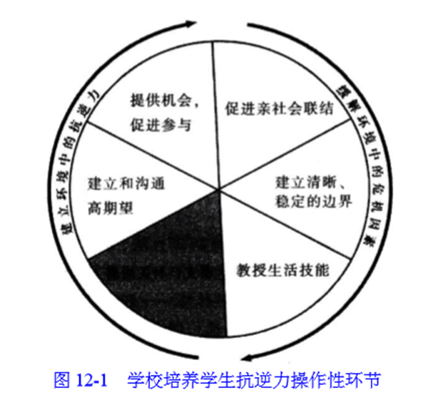
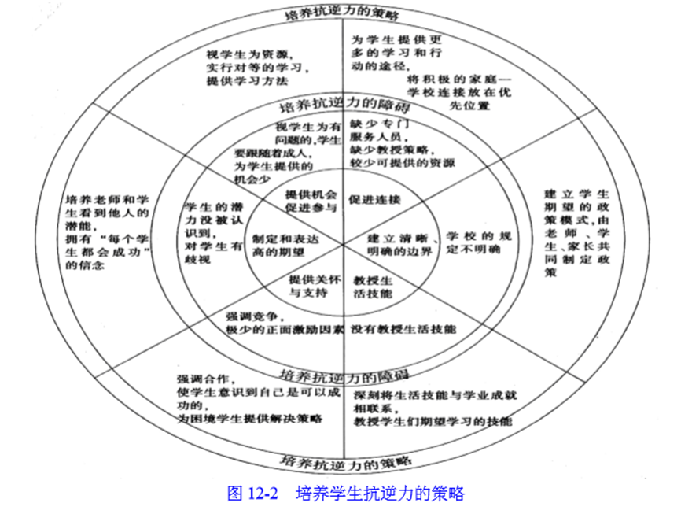

### 1. 学校社会工作的特点
1.专业性
学校社会工作是以各种社会科学知识，包括教育学、社会学、心理学的基本理论、研究范式、学术标准、研究方法等，探究学生个体的社会和心理需要、心理特征、心理困。要求开展学校社会工作服务的人员具备社会工作共有的专业知识、原则和价值观。学校社会工作的设立和开展必须遵从本专业的专业要求。
2.科学性
学校社会工作实务中经常使用的工作方法有个案工作方法、团体工作方法、社区工作方法。所有这些工作方法的程序和步骤都是在科学理念的指导下设计完成的。作为学校社会工作者，对于具体方法的运用和实施要遵循学科特点。
3.艺术性
学校社会工作更是一门艺术，是一门塑造人心灵的艺术。在学校社会工作实务中，要特别坚持接纳、尊重、真诚、同感、具体化等以人为本的价值追求和职业伦理，时刻把人放在第一位。
4.实践性
学校社会工作是做出来的，深入实际、联系现实，为学生的现实需要服务、为学生和社会公众的利益着想是每一个学校社会工作者义不容辞的责任。

### 2. 学校社会工作的定位
1.与德育的关系
（1）联系
在现有学校体制下，学校社会工作归属在学校德育范畴。
（2）区别
①学校社会工作以学生为本，学校德育以学校及社会的外在要求为本。
②学校社会工作工作路径自下而上，学校德育工作路径自上而下。
③学校社会工作工作重点是学生的成长，学校德育工作的工作重点是教育要求。④学校社会工作工作方法突出由内而外，学校德育工作工作方法体现由外而内。
⑤学校社会工作工作对象可以是学生、家长、教师以及社区，学校德育工作工作对象主要是学生。
2.与心理健康教育的关系
（1）联系
①学校社会工作遇到学生有心理困惑、心理求助时，需要转介给心理老师或者双方配合工作。心理健康教育要积极启动学生身边的各种良性资源，通过优化成长环境促进学生成长。
②二者的目的是一致的——帮助学生身心健康发展。
（2）区别
①学校社会工作注重个体生活环境的作用；心理健康教育更注重个体自身的作用。
②学校社会工作有个案、小组、社区等专业工作方法；心理健康教育运用的是辅导、咨询、治疗等工作方法。③学校社会工作强调学生作为社会主体，关注学生的社会关系与社会互动，从社会关系的角度挖掘社会与个体的资源；心理健康教育强调学生作为精神主体，关注学生的内在心理活动，从内心与环境关系的角度促进个体良性发展。
④从事学校社会工作的工作人员要具备专业社会工作的素养，并有从业资格；从事学校心理健康教育的工作人员则要具备心理学专业相关的知识和技巧，并具备从事心理工作的职业资格。
3.与班级管理的关系
（1）联系
在日常的学校工作中，社会工作者在校内要与班级管理者合作，加强学校社会工作者与班级管理者之间的沟通，双方应及时交换相关的信息、资讯和报告，主动了解对方的工作状况，积极回应学生们的需要，共同创造正面、充满关怀的学校环境，使学生们能够发挥潜能，健康成长。
（2）区别
①班主任是班级管理的主要承担者，并与学校职能部门、年级主任、任课教师等共同维护良好的班级环境。
班级管理的主要目的是保证班级秩序的良性运行，提高学生的学习成绩，促进学生的健康成长。而学校社会工作的执行者是专职的社会工作者，学校社会工作更多关注的是学生的身心发展和成长。②班级管理的重点是班级制度层面的，学校社会工作的重点是学生个人发展层面的。
4.与生活管理的关系
（1）在学校社会工作实践中，生活管理是学校社会工作的重要内容。学校社会工作注重培养学生独立生活的技能和技巧，养成学生顺利适应社会生活所必需的生活态度、生活方式和生活习惯，丰富学生的日常生活，使学生生活多样化。
（2）不能将学校社会工作简单地等同于生活管理，学校社会工作者不能时刻关注学生的日常生活，对于学生的生活情况也并不是十分了解。在工作中一定要与生活管理老师互相配合来完成工作。

### 3. 学校社会工作的要素与功能
#### 3.1. 学校社会工作的要素
（1）学校社会工作的属性。学校社会工作即在学校开展的社会工作服务。
（2）学校社会工作的对象。学校社会工作以全体学生为主要服务对象。
（3）学校社会工作者。学校社会工作者首先必须具有社会工作专业的知识、方法、技巧以及价值观。
（4）学校社会工作的功能。学校社会工作的主要功能是协助学生与“家庭一学校一社区”之间建立良好的关系，解决学生在社会和情绪方面的困扰或问题，调适其偏差行为，帮助学生更好地成长，最终达到促进全社会和谐发展的目的。
（5）学校社会工作的目的。学校社会工作的主要目的是实现学校教育的目的，协助学生准备面对现在及未来的生活，养成健康人格，培养积极品质，优化社会关系，实现满意人生。
#### 3.2. 学校社会工作的功能
（1）帮助处境不利学生，促进教育机会均等。社会工作是一个整合个人资源与社会资源的工作，它用整合、包容的视角看待个人、团体与社会。重构案主一—“困境学生”的环境，将是工作的切入点及重要内容。教育机会均等不仅要求入学机会均等，更要求每个学生得到适才适性的教育，保证每个学生在接受教育的过程中得到公平公正的专业服务。
（2）推进学生知识学习，为丰富人生奠定基础。学校社会工作者要积极协助学校提供最有利于学生学习的环境与条件，满足全体学生在知识、能力、情绪等方面的需要。学校社会工作既要重视学生在关系、情绪、动机和人格等方面的发展问题，又要关注学生在学习、思考、解决问题等能力方面的成长。
（3）协助学生能力提升，适应社会发展需要。学校社会工作者应协助学生与其所处社会环境适应的能力，了解社会经济、政治、文化的发展状况，明确自己的发展方向，清楚个人发展与社会进步的关系，保持与社会同步，不断从社会进步中汲取养分，获得资源，使自己成为社会进步的积极力量。
（4）促进学生人格完善，实现人生积极成长。学校社会工作者要重视学生人格的发展和完善，为塑造学生良好的人格特质发挥积极的作用，使学生能够发展个人潜能，积极面对生活上的挑战，有效地解决问题。
（5）协调各方教育资源，形成优质教育合力。要协调和推动社区及其他资源，让学生、家庭以及学校受惠，并促进不同社会服务之间的联系，为学校提供有力支援，促进学生的发展。

### 4. 学校社会工作主要内容
#### 4.1. 针对学生一般需要的学校社会工作
1.学业发展与生涯规划的需要
（1）学校社会工作针对学生的学业发展和生涯规划进行辅导时，主要通过小组工作的方式，让学生在参与中成长。
（2）小组设计的内容
①明确生涯目标；②注重能力培养；③结合学习生活；④优化学习方法。
2.协调人际关系的需要
学校社会工作者可以侧重从以下几方面入手：
（1）帮助学生自我觉察；
（2）提高学生个性品质；
（3）促进学生养成技能；
（4）协助学生自我成长。
3.自我认识与自我探索的需要
（1）中学生认识自己和控制自己的途径有三种：
①以他人为镜调节自己；
②以自己活动的结果为镜调节自己；
③通过对自己内部世界的分析，内省认识并调整自己。
（2）学校社会工作者在对学生进行辅导时，可以利用个案工作、小组工作和社区工作的方式，通过习作练习、极限挑战、情景剧等方式帮助学生达到以下目的：
①帮助学生悦纳自己。
②帮助学生肯定自我。
③协助学生发掘潜能。
④协助学生规划未来。
4.情绪觉察与情绪管理的需要
（1）青少年情绪情感最突出的特点是两极性的表现，具体表现出如下特征：
①强烈、狂暴与温和、细腻共存。
②可变性与固执性共存。③内向性和表现性共存。
（2）中学生情绪和情感具有明显两极性的原因：
①他们处于身心各方面迅速发展的时期。
②由于青春发育期性腺功能显现，性激素的分泌会通过反馈增强下丘脑部位的兴奋性，是下丘脑神经过程总的趋势表现出兴奋性的亢进，与大脑皮质原有的调节控制功能发生矛盾，是大脑皮质于皮下中枢暂时失去平衡，这种状态可能是青春发育期的中学生情绪和情感两极性明显的生理原因。
（3）学校社会工作者对学生进行情绪管理的辅导，让学生认识并掌握以下几方面的内容：
①学会认识情绪；②能够辨别情绪；③懂得掌控情绪；④正确处理情绪。
#### 4.2. 针对学生特殊需要的学校社会工作
##### 4.2.1. 针对学业困境学生
（1）学业困境是指学生的学业成绩没有达到学习上应该达到的标准。
（2）学业困境原因：
①学生自身的原因。学生如果存在生理缺陷和心理障碍，则很容易遭遇学业困境。
②学校的因素。有时候学生成绩不好，可能是由学校的学习环境导致的，教师的教学态度，学生之间恶性的竞争气氛，同学关系紧张，都有可能使学生无心学业，甚至对学习产生抵触心理。
③家庭的因素。家庭的学习环境和父母的管教方式，都会影响学生的学习成绩④社区的因素。社区的环境和学生的社交关系网络对青少年的学业影响巨大。
（3）学校社会工作对学业困境学生的辅导方法
①个案工作方法。对于一般原因引起的学业困境问题，可以采用个案工作的方法。
②小组工作方法。对那些在学习障碍方面存在共性的学生，可以采取小组工作的方法。
③学校社会工作者与任课教师合作。对那些有学习缺陷的学生，社会工作者在充分了解他们的情况后，可以代表其与学校和老师商谈，建议采取个别化教学的方法。
④学校社会工作者协调利用社会资源。对因家庭问题造成的学习困境的学生，可以与其家庭联系，请家人合作，以帮助学生营造一个良好的学习环境。
##### 4.2.2. 针对人际关系困境学生
（1）人际关系困境学生的类型
①沉默寡言型；②遭人排挤型；③行为偏激型；④专横霸道型。
（2）学校社会工作者的辅导方法
①个案工作方法。对那些遭遇严重人际关系困境的学生，可以对他们采用个案工作的方法。
②小组辅导方法。通过小组工作的方法，对他们进行自我肯定训练，并通过游戏、角色扮演等方式教导人际交往的良好方式。
③社会工作与学校教育结合（与德育）。应首先教导学生学习良好的人际互动方法，使其学会互相尊重与帮④资源整合的方法。学校社会工作者可以和学生的老师、家长以及同学多方联系，请求他们的协助，共同解决学生的问题。
##### 4.2.3. 针对家庭生活困境学生
（1）家庭生活困境学生面临的问题
①情绪问题；②经济压力问题；③照顾的问题。
（2）学校社会工作者的辅导方法
①予以情感支持。学校社会工作者可以通过个案会谈给予学生情绪支持，通过适当的感情介入与情感支持，帮助学生表达心声、宣泄情绪。
②发展支持系统。学校社会工作者可以采用小组工作方法，把相似家庭背景的学生组成一个互助或成长小组，让他们互相支持、互相学习，共同探讨解决问题的方法。
③挖掘社会资源。运用社会资源协助家长解决子女照顾问题，缓解经济问题。
④开发学生潜能。特殊家庭的学生并不是一无是处、一无所有，帮助他们以积极心态看待自己，在艰苦困难的环境下发现自己的优势，应该成为学校社会工作的重点。
##### 4.2.4. 针对心理状况困境学生
（1）心理困境表现
①沮丧；②压抑；③抑郁；④冷漠；⑤嫉妒；⑥焦虑；⑦孤独；③浮躁。
（2）学校社会工作者的服务方法
①个案工作方法。对那些一时存在心理困扰的学生，学校社会工作者可以通过个案工作的方式，与他们沟通交流，帮助他们缓解内心的压力，舒缓其情绪，从而使其回复正常的学校生活。
②小组辅导方法。对于那些有着相同问题的学生，可以把他们组成一个小组，使他们互相沟通，交流心事，同时也以他人为镜，发现并改正自己的问题，从而达到彼此之间互相促进的效果。
③学校宣传手段。通过学校宣传，使同学们正确理解心理困境并不等同于精神病，请同学们多给予理解和帮
④整合资源方法。社会工作者应与学校和老师合作，对这些学生给予区别对待。
##### 4.2.5. 针对特殊行为群体学生
（1）暴力倾向学生。校园暴力一般指发生在校园内的攻击行为，主要包括行为人针对在校的师生实施的身体的和心理的暴力行为。
（2）网络成瘾学生
网络成瘾原因：
①青少年心理发展不成熟，是非观不明确，一味地寻求好玩、刺激。
②父母工作繁忙。
③学习压力大，学生从网络中寻求解脱和释放。
（3）违纪行为
学校社会工作者对违纪学生进行辅导的具体做法有：
①深入细致的个案工作。学校社会工作者可以利用个案辅导探究问题行为的真正原因。
②建立团体，形成正向影响。学校社会工作者可以利用小组工作方法，通过开展兴趣小组、交流小组等互助成长小组，让学生们在小组中发泄情绪与压力，获得彼此的支持，交流成长体会，学习成长经验，增强正向动机，从而帮助学生获得成就、提高自信。
③关注家庭，凝聚力量。通过家访了解家长的管教方式、亲子父系及家庭状况，利用家长会宣传亲子教育方案，促使家长改善家庭环境、改变教育理念、提高教育技巧，帮助家长识别并改变孩子的问题行为。
④开发社会资源，争取社会支持。学校社会工作者应努力协调当地公安、城管、校外教育机构，取缔社区内的不良场所，优化社区文化，形成社区文明，为青少年创造健康、积极的社会环境。
c)	结合家庭与社区的力量，开展学校社会工作
1.深入了解学生的家庭状况
（1）定期访问学生的家长，促使他们关心子女的学校生活，并了解其子女的能力、兴趣、行为及问题所在。
（2）组织开展各种能够增进家长教育意识的小组等，如家长互助支持小组，使他们能共同探讨在青少年发展中家长应负的有关责任。
（3）组织学校领导、老师与家长会谈，共同讨论学生面对的困境，共同解决问题。
（4）为学生家长提供咨询服务。
2.搭建学校与社区沟通的桥梁
（1）积极投身于社区活动，从中观察并记录可能造成学生困扰问题的社区因素。
（2）联合家庭与社区的力量，使他们与学校一起探讨学生目前所存在的问题，发掘新问题，并改造那些不能满足青少年需要的社区环境。
（3）把学校的计划和需要提供给社区和家长，协助他们了解学校的教育方案，并与之一起制订有利于学生成长的教育计划。
（4）发掘和利用社区资源。学校社会工作者为了满足学生多方位发展的需要，通常需要整合不同的社会资源，如义工资源、机构服务、活动设施等。

### 5. 学校社会工作的基本方法
a)	抗逆力的理论与方法
1.抗逆力的理论来源（2015 名词解释）
抗逆力是指个人面对生活逆境时，能够理性地作出正向的、建设件的选择方法和应对策略的能力。抗逆力是优势视角基本信念中重要的一部分，是、模式与优势视角理论在社会工作实践中的具体运用。
抗逆力的基本思想是：个人或者家庭虽然面临比正常情况严重的问题和危险，但能够很好地适应所面临的危机状态，并达到比预想结果积极的发展状态。它侧重于对案主的“保护性因素”的挖据。
2.抗逆力方法的基本原则
（1）抗逆力的表现形式
①常规抗逆力通常表现出亲社会取向的行为方式，遵从社会规范与道德，认同主流社会文化，同时也得到社会的认可和接纳。
②非常规抗逆力通常表现出反传统、反社会、反主流的行为倾向，具有挑战常规、对抗成人、批判现实的特征，往往会受到成人的指责、朋辈群体的排斥、公众舆论的压力。
b)	抗逆力的构成要素
①外部支持因素（Thave）形成个体抗逆力的外在保护因素的必备条件：
a.正向的连接关系
正向的连接关系是指个体在其生活环境中拥有的良性人际关系。
b.坚定清晰的规范
坚定清晰的规范是指在个体的成长环境中有人能够帮助自己明确基本的生活规范、形成是非观念的界限。
c.关怀支持的环境
关怀支持的环境是指个体在生活环境中至少拥有一个值得信任的人给予无条件的关爱，无条件的接纳，使个体体验过被爱的牵福。
d.积极合理的期望
积极合理的期望是指个体的生活环境中有人寄予自己高度的期望，相信成功的可能，并且给予现实而有目的支持。
e.有意义的参与机会
有意义的参与机会是指个体在其社会活动、集体生活中拥有参与的机会，并能在其中发挥作用。
②内在优势因素（Iam）
内在优势因素包括完美的个人形象感、积极乐观感。
a.积极的个人形象感是指个体对自我具有较强的认同感，能够接纳自我，同时具有高自尊以及高度自我价值感。
b.乐观感即相信未来是光明和充满希望的。
c.效能因素（Ican）
包括人际技巧、解决问题的能力、情绪管理及目标订定等。
第一，人际技巧是指适应不同文化的灵活性、同理心、幽默感及沟通能力。
第二，解决问题的能力是指懂得运用资源及寻求帮助的能力。
第三，情绪管理是指能察觉自己的情绪并正面表达出来。
第四，目标订定是指了解自己的目标，并具备订定计划的能力，从而达到自己的目标。
c)	抗逆力方法的基本步骤
（1）学校培养学生抗逆力操作性环节，见下图12-1。

“抗逆力轮”指出了学校落实心理健康教育的操作方法，包括六个步骤两大部分：
1~3步属于危机缓冲系统，重在帮助学生面对危机与压力时学会缓冲、作出调整。
4~6步属于抗逆力建构系统，重在促进学生建构抗逆力，提升心理能量。
①促进亲社会联结。研究证实，富有良好人际关系的学生陷入危机与逆境的概率相对较少，身边的亲人与朋友正面因素为主，做人积极，等于在其周围建立了正向保护因子。
②建立清晰、稳定的边界。青少年之所以陷人风险与危机，源于他们界限模糊，使学生明确是非界限、保持清醒头脑、把握好行为做事的分寸与尺度，是避免问题行为的关键措施。
③教授生活技能。学生需要掌握的技能有：与人合作、冲突解决方法、抵制、决策、沟通、解决问题、自我决定、压力管理等。
④提供关怀与支持。关怀与支持是抗逆力形成的关键因素，缺少关怀的人几乎不可能克服逆境。⑤建立和表达高期望。强调合作，淡化竞争。老师通过关怀每位学生，表达对学生的殷切希望。
⑥提供机会，促进参与。学校应充分利用一切资源为学生提供参与机会。

（2）培养学生抗逆力的策略，如图12-2所示。
①图中最小的内圆表示的是抗逆力方法的基本步骤（在上一部分中已经作了详细的介绍）。
②图中次小的内圆表示的是在运用抗逆力方法的过程中每个步骤会遇到的不同困难和障碍。
③图中最大的内圆表示的则是采用怎样的策略来解决在
运用抗逆力方法的过程中遇到的困难和障碍。

### 6. 个案管理办法的组织与运用
1.定义
个案管理是一种提供服务的方法，运用这种方法，专业社会工作者评估当事人及其家庭的需要，在适当的时候安排、协调、监管、评估和争取包括多种服务的一揽子服务，满足特定当事人的多种需要。（美国社会工作者协会理事会）
2.个案管理的适用对象
学校社会工作者进行个案管理的对象应是那些处境不利的学生。
3.个案管理的过程
（1）识别服务对象
识别途径：
①班主任或者任课老师的推介。班主任或任课老师，他们和学生们朝夕相处。对每个孩子的性格特点、学业成绩都了若指掌。班主任或任课老师的推介是学校社会工作者选择服务对象的最主要途径。
②朋辈的推介。这里所指的朋辈包括潜在案主的同学和朋友。
③案主或者其家庭主动寻求帮助。在中国社会工作发展的现阶段，要案主或其家庭来主动寻找学校社会工作者请求帮助，并非一件容易的事情。
④社会工作者主动发掘。学校社会工作者通常会对学校提供个人工作、小组工作，以及一些拓展性的社区工
（2）对案主的生态系统进行评估，确定案主所需要的资源学生的基本生态系统包括社区、学校和家庭。因此，学校社会工作者在确定自己的服务对象后，应广泛收集这三个系统的资料，评估究竟是某一个系统的问题影响了案主，还是几个系统共同作用的结果，从而确定案主所需要的资源。
（3）评定案主的社会支持网络
学生的社会支持网络来自学校、家庭和社区三个系统。在这里，学校社会工作者的主要任务是分辨出在解决案主的问题时，哪些支持网络是可以利用的，且能被利用的程度如何。
（4）完成资源一社会支持网络一案主的对接
在这一阶段，学校社会工作者最重要的任务是调动学生解决问题的能力。
（5）监管服务的传输
社会工作者在与学生及其家庭共同工作的过程中，可能同时需要为他们提供专业技巧上的服务。通过这种专业技巧，帮助学生和家庭发现他们的优势所在，从而实现他们的增权。
（6）评估
评估应包括两个方面：当事人的评估和服务系统传输的评估。
4.个案管理者的角色
（1）服务经纪人
通常来说，学生的处境不利不会只受一种关系的影响，而是各个方面共同作用的结果。这时，学校社会工作者就需要通过做这些学生的工作，识别问题所在，找出解决的办法，通过学生的家庭、其他群体活动、社区活动来帮助学生们处理这些问题。
（2）使能者
在这个过程中，学校社会工作者应邀请学生及其家庭共同参与制订计划、资源整合和评估的过程。通过这种共同合作，拓展学生及其家庭寻求资源、寻求社会支持的途径，从而达到助人自助的目的。

### 7. 团体辅导方法的组织与运用
1.团体辅导方法的基本程序
（1）选题
学校社会工作者应进行前期的调查评估，了解学生的问题及需求，根据学生的实际需要决定团体活动的开展，并根据学生的需要确定团体的目标。
（2）招募
根据计划进行招募活动，招募活动的设计要适应学生的特点。
（3）甄选
对有意愿参加团体辅导的学生可以进行个别会谈，了解学生个体的需求和目标，从而进行选择，选择的原则是要看学生是否在这个规划的团体辅导中有需求，也即学生个人的目标与团体辅导的目的是否是一致的。
（4）实施
①团体辅导前期开始第一次团体辅导聚会，使成员面对面进行互动，共同发展团体辅导的目标。
②团体辅导形成期成员开始了解团体辅导的目标，发现自己在团体中的角色，知悉参加团体辅导活动的方向，并逐渐满足自己的期待。
③团体辅导协商期，即团体辅导的整合阶段，但整合之后也可能因冲突而分化，然后再整合。
④团体辅导成熟期，团体经过辗转挣扎后逐渐表现出团体的功能，团体的目标也变得更有意义，成员对于团体的归属感也建立起来，彼此间沟通良好、相互支持。
（5）评估
团体辅导结束时，对团体辅导的过程进行评估，看是否完成了团体辅导目标，并总结经验与不足，使团体经验具有完整性。
（6）跟踪
结案后，学校社会工作者应将每次聚会的记录整理成团体辅导工作记录，并提供追踪服务，安排与团体成员间不定期的咨询，从而巩固和促进团体辅导工作的效果。
2.团体辅导方法的实际运作
（1）考察与预评估阶段
①按需开展
团体辅导的开展一定要建立在满足学生实际需求的基础之上，即学生有需求才开展相关的辅导，否则小组就容易流于形式，难以取得好的效果。
②自愿原则
团体辅导涉及的参与人员要比个案和小组多。是否参加团体辅导同样要遵循学生自愿选择参加的原则，绝对不可以硬性强迫参加。
（2）制订计划阶段
学校社会工作者根据前期的调查评估，了解学生的问题和需求后，根据学生的实际需求制订了活动计划书，包括团体辅导的目的、场所、时间和人员安排等，最重要的是要制订出辅导活动的整体计划，包括活动的主题、预期目标、活动内容等。
（3）实施计划阶段
这是团体辅导过程中非常重要的一个阶段，是解决问题的阶段。这个阶段有不同的时期，分为前期、形成期、协商期和成熟期，每个时期有不同的任务。
（4）评估与调整计划阶段
对于团体辅导的成效测量和评定，找出进步与不足，对接下来的工作内容和计划进行调整。
（5）实施调整后计划阶段
①前期。②形成期。③协商期。④成熟期。
（6）再评估阶段
①学生们对上一阶段活动的评价和感受。②学生们对于下一阶段活动的建议和期望。

### 8. 举例说明如何为厌学学生服务？
（1）为厌学学生服务，首先要了解导致学生厌学的原因，一般可以分为以下几点：①对任课老师的反感；②缺乏良好的学习习惯和学习方法：③过分看重分数；④人际交往问题；⑤缺乏正确的学习目标和动机；⑥学习负担过重。社会工作强调从人与环境的互动看待问题，学生厌学的现象，需要从学生自身因素、家庭因素与学校因素三方面分析深层原因。私立学校的学生家庭相对富裕，家长已为他们安排好未来，这可能抑制孩子的求学动机。当然，学生自身的学习态度、智慧水平及学校的教学和激励方法也可能存在问题，社会工作者需要就不同学生的情况具体分析。
（2）针对某个厌学同学可以开展个案工作，要了解导致厌学的问题所在，并制定个案目标和服务计划，开展个案工作，并进行个案评估。针对多个厌学的学生开展小组工作，需注意以下事项：①从小组工作本身来看，要适当采取和运用开放的态度和方法，对学生予以鼓励，调动其积极性，增进对小组的认同，从而有利于小组目标的实现。同时，小组工作计划要注意灵活应变，要使这些厌学学生的年龄、兴趣与小组的性质、目标相适应。②从在校工作与学校其它工作的关系来看，要与行政性、命令性、自上而下的教育任务相区别，以学生为本，强调心灵分享，淡化功利色彩，充分关注这些厌学、逃学学生的发展需要。
（3）学习知识、掌握技能是青少年的本质需求，也是青少年工作的重要内容，青少年工作者有义务引导和帮助他们更好地学习。这包括：
①激发青少年的学习动机，激励远大的与社会相联系的动机，强化直接与学习相关联的动机，不断提高青少年学习的自觉性；
②帮助青少年树立正确的学习态度，增加青少年学习的主动性、自觉性和独立性，使之能正确认识和对待学习中的各种问题；
③发展青少年的学习兴趣，使之更为广阔和深刻；
④帮助青少年提高学习能力，更好地掌握新的学习方法，促使其创造性的独立学习能力的形成和提高；
③帮助青少年化解、处理学习中的困惑和问题，帮助他们克服在学习过程中个体与群体、与社会之间产生的压力，克服学习中的困难和问题。