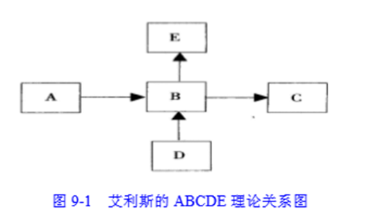
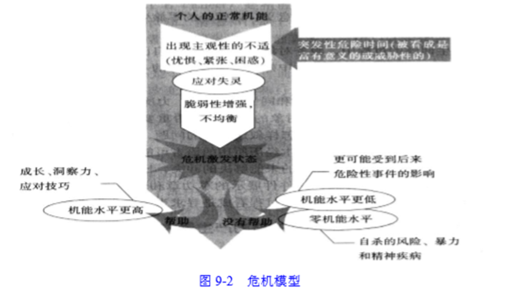
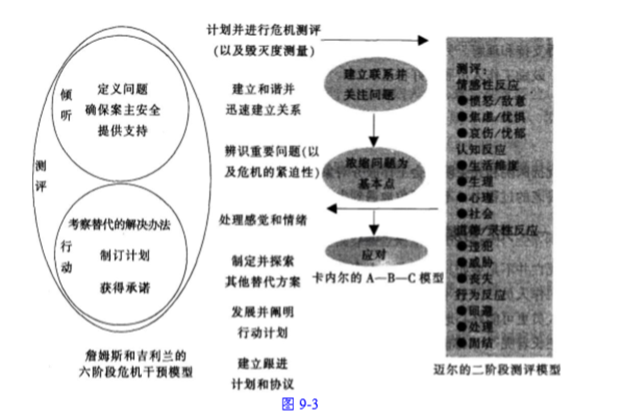
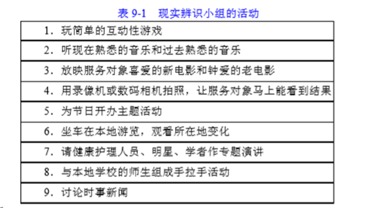
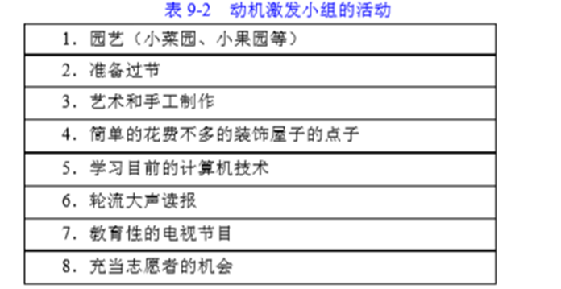

### 1. 优抚安置社会工作服务对象的需要和问题
1.优抚安置工作服务对象
优抚安置社会工作的服务对象是一个相对特殊的为军队和国防建设作出或正在作出贡献和牺牲的特殊群体。
主要包括：优抚医院社会工作服务对象、光荣院社会工作服务对象、烈士褒扬社会工作服务对象、军供社会工作服务对象、复员退伍军人安置社会工作服务对象军休社会工作服务对象。

2.服务对象的需要
（1）优抚医院社会工作服务对象的需要：
①治疗康复需要。无论是慢性病、残疾军人还是精神病患者，身体、心理或精神方面的治疗和康复都是其最基本的需要。
②基本生存需要。由于抚恤补助标准低，在农村安置的复原退伍军人慢性病患者的基本生活需要非常紧迫。
③家庭生活需要。由于生理或心理等诸多原因，不少服务对象都没有成家，他们对幸福家庭的渴望，需要引起关注。
④社会交往需要。作为社会成员服务对象也渴望与他人交流参与社会活动，渴望被社会接纳。
⑤社会尊重需要。现如今，服务对象享有的社会尊重不如以前，地位下降，相对剥夺感增强。
（2）光荣院社会工作服务对象的需要：
①健康维护的需要。健康维护是孤老优抚对象最为关注和渴望满足的需要。
②婚姻家庭的需要。孤老优抚对象对美好婚姻家庭尤为向往。
③社会参与的需要。孤老优抚对象非常渴望与他人交往，渴望获得亲情与温暖，渴望发挥自己的作用。
④社会尊重的需要。他们渴望得到别人的尊重、重视和赞赏。
（3）复员退伍军人安置社会工作服务对象的需要：
复原退伍军人安置社会工作的服务对象主要包括退出现役的义务兵、复员士官、转业士官、复员干部以及伤病残初级士官和义务兵。
①就业权益的保障需要。当前复原退伍军人的需要主要集中在就业方面。
②社会再适应的心理调适需要。大部分复原退伍军人处于军地转化的过渡期，普遍感到社会在适应的压力，存在焦虑、愤怒、抑郁等不良情绪。
（4）军休社会工作服务对象的需要：
军休社会工作的服务对象主要为移交政府安置的军队离休退休干部和退休士官。军休干部需要汉族要包括：
①军队情结。
②社会尊重。
③健康维护。
④居家养老。
⑤社会参与。

3.服务对象的问题
（1）优抚医院社会工作服务对象的问题：
①生活适应困难，缺乏病理常识和自理、护理知识。
②心理障碍严重，难以接受伤病残导致的障碍。
③生活保障问题。由于抚恤保障标准过低，服务对象出现了生活困难等问题。
④家庭婚姻障碍，生儿育女困惑。
⑤社会隔离，缺乏社交网络，身心非常孤单。
（2）光荣院社会工作服务对象的问题：
①老化问题。在变老的过程中每个人的身心系统都会有某些改变，有些变化会给服务对象的生活带来严重的挑战。
②老年慢性病增加与生活质量受损。受疾病的折磨，生活质量受到影响。③心理失衡。有些服务对象与同辈群体相比会有失落感，引起心理失衡。
④社会地位下降。由于长期处于和平环境，一些人的国防意识、拥军观念有所淡化，服务对象社会地位有所下降。
⑤社会隔离。对孤老优抚对象多实行相对封闭的院舍式照顾，与外界接触较少。
（3）复员退伍军人安置社会工作服务对象的问题：
①就业难。随着企业实行减员增效，就业形势日趋严峻，现实的就业状况与服务对象的择业标准存在很大的②隐性失业。一些复原退伍军人不同程度的存在着隐形失业现象，少数被安置复原退伍军人的工作、工资、福利待遇无法得到有效的保障。
③延迟上岗。一些部门和单位在接收安置复原退伍军人问题上，存在推诿、扯皮现象，有的甚至故意拖延上班时间，使部分复员退伍军人不能及时上岗就业。
（4）军休社会工作服务对象的问题：
①角色失调。由军队到社会、由军人到老百姓、由在职到离职，在实现角色模式转换的过程中，由于心理上、行为上的惯性，军休干部不太容易适应新的角色模式要求。
②地位下移。军休干部在离开职位、退出现役之时，造成了事实上、心理上社会地位向下流动的现象。
③心理失衡。随着社会地位发生相对变动，军休干部将自己的利益得失与同辈群体进行对比时产生一种不平衡心态，即相对剥夺感。

### 2. 优抚安置社会工作服务对象的特点
1.覆盖范围广
服务对象分优抚和安置两大部分，五类，二十多种，几乎涵盖了各个年龄层次的人群。
2.军队情结深
这个群体当中多数人具有较长的军旅生涯经历，有着根深蒂固的军旅情结。
3.需要层次多
服务对象构成的复杂性决定了服务对象的需要几乎涵盖了马斯洛有关人类需要的七个层次。
4.问题压力重
服务对象的问题主要包括：老龄化问题，生活困难问题，医疗保障问题，就业难问题，隐形事业问题，合法权益维护问题，社会地位维护问题等。

### 3. 优抚安置社会工作的涵义
1.什么是优抚安置工作
优抚安置工作是指国家依据法定的形式对现役军人、退役军入及其家属提供优待、抚恤和安置，以确保其生活水平不低于所在地的平均生活水平的一项褒扬性和优待性的社会保障制度。
（1）优待。优待是指按照国家规定对优抚对象从政治上、经济上给予优厚待遇。
（2）抚恤。抚恤是指国家因工伤残人员、因公死亡以及病故人员家属所采取的一种物质抚恤形式。
（3）安置。安置是指对特定对象或生产生活有困难者的扶持帮助或就业安排。

2.什么是优抚安置社会工作
（1）优抚安置社会工作的界定
优抚安置社会工作是军队社会工作的重要组成部分，它是在优抚安置领域，综合运用社会工作的专业知识、技能和方法，以优抚安置社会工作服务对象及其相关人员和系统为工作对象，协助有需要的优抚安置社会工作服务对象，整合社会资源，协调社会关系，预防和解决问题，恢复和改善社会功能，使优抚安置社会工作服务对象有更好的社会适应和福祉的活动。
（2）优抚安置社会工作的分类
①优抚医院社会工作。优抚医院社会工作主要包括复原军人慢性病医院社会工作、荣誉军人康复医院社会工作和复原退伍军人精神病院社会工作。
②光荣院社会工作。光荣院社会工作致力于孤老优抚对象有更好的社会适应和福祉的活动。
③烈士褒扬社会工作。社会工作者运用社会工作的专业理论、方法和技巧，去推行与凭吊人群、烈士遗属、工作人员和系统有关的社会政策或措施的工作过程。
④军供社会工作。社会工作者将社会工作的知识、技术、态度与价值应用于军供工作中。
⑤复员退伍军人安置社会工作。社会工作者将社会工作的知识、技术、态度与价值应用于复原退伍安置工作中，协助复原退伍军人顺利的度过军地转化的过渡期。
⑥军休社会工作。社会工作者将社会工作的知识、技术、态度与价值，帮助军休干部有更好的社会适应和福祉的活动。

### 4. 优抚安置社会工作的特点
1.政治性
（1）直接服务于国防和军队现代化建设。
（2）直接服务于为国家革命和建设做出贡献的功臣。
（3）直接关系部队和社会的稳定。
（4）直接促进社会的公平。
2.政策性
（1）政策性强。
（2）政策的政治含义高。
3.协调性
（1）协调部门多。
（2）协调任务重。
4.特殊性
（1）服务对象身份特殊。
（2）服务对象需求多样。
（3）服务保障环节复杂。
5.矛盾性
（1）政治化与市场化。
（2）计划与市场。
（3）主体化与边缘化。

### 5. 优抚安置社会工作的主要内容
（一）优抚医院社会工作的内容
1.总体内容
（1）协助处置服务对象及家庭的问题。
（2）协助增强服务对象对医院环境的适应。
（3）协助处理服务对象与医疗系统的关系。
（4）出院及跟进服务。
（5）其他方面。
2.特别内容
（1）复员军人慢性病医院社会工作的内容
①协助复员军人慢性病患者形成良好的应对慢性病和失能的生活方式。
②协助融入社会环境。
③辨别和安排社会资源来协助患者离开医院或入住其他机构。
（2）荣誉军人康复医院社会工作的内容
协助退役伤病残军人，充分发挥其应有的潜在能力，克服各种环境障碍，以提高其社会生活适应功能。
（3）复员退伍军人精神病院社会工作的内容
复员退伍军人精神病院社会工作属于精神病理社会工作（或心理卫生社会工作），它是最深入的社会工作治疗的一种，同时也部分从事环境的调适服务工作，主要包括心理治疗和个案管理。

（二）光荣院社会工作的内容
1.做好服务对象人住前的评估和准备工作。
2.协助服务对象适应光荣院的新生活，发展积极的人际关系。
3.为服务对象提供个案心理辅导，如运用怀旧、生命回顾方面的技巧，帮助服务对象重塑自我，找回生命的意义。
4.通过策划、组织一些简单易学的活动，增进服务对象群体之间的交流，互帮互助。
5.协助服务对象提高自我管理和自我服务的能力，充分发挥个人的潜能。
6.鼓励服务对象参与力所能及的院舍活动。
7.引导服务对象正确看待死亡而不会焦虑和恐惧。
8.利用社区或社会资源为服务对象服务。
9.推动志愿服务并对志愿服务进行督导。
10.促进光荣院专业服务的发展和专业质量的提高。
11.影响社会及环境的决策。

（三）烈士褒扬社会工作的内容
1.引导讲解员，引导参观群众，加强阵地宣传，开展群体性的心理辅导。
2.策划有针对性的宣传纪念活动。
3.协助烈士遗物史料的收集。
4.协调烈属与陵园的纠纷。
5.协助做好前来扫塞的烈属及亲朋的精神抚慰工作，帮助其走出心理阴影。
6.协助完普解说词，针对不同人群突显宣传教育重点。
7.推动志愿服务并对志愿服务进行督导。
8.推动相关政策完善，协助做好宣传解释。

（四）军供社会工作的内容
1.及时发现过往部队中存在的生理、心理问题，配合部队做好预防、解决和转介。
2.动员社会力量，整合社会资源，完成好军供保障任务。
3.协调组建工作人员的支援网络，加强工作人员的心理辅导及沟通技巧，协助工作人员进行压力释放、情绪疏导和问题解决。
4.开展研究工作，提供军供站管理和发展方面的政策建议。

（五）复员退伍军人安置社会工作的内容
1.协助服务对象适应新工作和新生活，顺利度过军地转化的过渡期。
2.协助服务对象充分利用和发掘自身和外部的正式和非正式社会支持网络。
3.加强协调沟通，推进政府主导、部门协作、社会参与的安置格局形成。
4.做好信访接待工作，倾听心声、舒缓情绪、提供供慰藉。
5.协助搭建信息咨询平台。
6.积极推进社会政策的良性改变。

（六）军休社会工作的内容
1.协助军休干部实现角色转换.做好心理关怀和精神服务。
2.协助军休干部适应军休服务管理机构里的新生活，发展新的人际关系，树立积极健康的休养观。
3.协助军体干部认识老龄化的过程，适应晚年生活。
4.协助军体干部发挥自身政治、经验、智力优势，力所能及地服务社会。
5.协助整合社会资源，拓深服务内容，拓宽服务领域，提高工作水平，提升生活质量。
6.协助依法维护军休干部的合法权益。
7.协助推动相关政策的制定和完善，在政策规定范围内实现军休干部利益最大化。
8.协助做好工作人员的情绪疏导和压力释放工作。
9.培训工作人员，促进专业服务的发展和服务质量的提高。
10.推动志愿服务并对志愿服务进行督导：

### 6. 优抚安置社会工作的主要方法
（一）优抚安置社会工作各领域需掌握的共性方法
1.认知和情绪问题的处理——敏感、焦虑、紧张、失落与无奈艾利斯：理性情绪行为疗法一—ABCDE理论

A（Activating events）是指由现职到离职、由军队到地方、由军人到老百姓的转变这个先导事件。
B（Beliefs）是指优抚安置社会工作服务对象对这一事件的非理性信念，“我被部队抛弃了”的想法主辛着自已的思维。
c（Consequences）是指优抚安置社会工作服务对象情绪和行为反应的结果，即不合理、消极地对待角色转变，有些甚至产生过激行为。
D（Disputing）是指用合理的信念驳斥不合理信念的过程，借以改变原有信念。
E（Efect）是指驳斥成功，便能产生有效的治疗效果，使优抚安置社会工作服务对象在认知、情绪和行动上有所改善。
在REBT过程中，社会工作者充当着咨询者和教育者的角色，其实质是要引导服务对象树立一种豁达的人生态度：
（1）要让服务对象明白，不是个人遭遇的事件而是个人的非理性信念造成了情绪和行为上的困扰，以及如何通过认知改变来改善情绪和行为。
（2）认知干预是REBT的生命，在问题探索阶段，社会工作者要帮助服务对象探查隐藏在情绪困扰后面的
“自语”，借此明确问题所在，社会工作者要激励服务对象反省自已在感到焦虑抑郁时对自己“说”了些什么，检查非理性信念所在。
（3）与非理性信念辩论是REBT的核心，社会工作者可以运用认知技术帮助服务对象质疑非理性信念和思维，认识其对当前和今后生活的影响，进而产生放弃这些不合理信念的愿望和行动。
（4）社会工作者引导服务对象对军队到地方这个环境事件作出适宜的理性的反应，接受组织安排的现实，树立积极健康的生活观，积极参与社会，提高生活质量。

2.精神问题的解决方法——寻求当下生命的意义
按照费希尔（Fischer）在观察和描述精神对于老人的重要性时总结的五个共同主题，在将精神介入优抚安置社会工作实践中：
（1）要引导服务对象珍惜现在的重要性.欣赏时间的珍贵，“学习享受或者”。
（2）要引导服务对象找到往事的意义，以曾经的军旅生涯经历来建构生命的意义，这是人生回顾过程的重要作用。
（3）在人生回顾的过程中，服务对象常有机会直面自己的局限.
（4）引导服务对象坦然接受生活中好的一面和不好的一面，重新激活疏远的关系，寻求与自己、与他人的和解。
（5）引导服务对象“拓展个人爱和同情的圈子”，力所能及地关怀他人、服务社会。

3.危机干预方法——最小的努力产生最大的效果

危机干预模式是围绕服务对象的危机而展开的调适和治疗工作，注重不同服务介入技巧的综合运用，目的是在有限的时间内快速、有效地帮助服务对象摆脱危机的影响。
（1）詹姆斯和吉利兰的三种危机干预模型
①平衡模型。
②认知模型。
③心理转折模型。
（2）罗伯茨七阶段危机干预模型

 

4.对工作人员压力问题的处理方法——建立支持性小组优抚安置社会工作服务对象大多是要管一生的，死后还要管遗属。工作人员与服务对象朝夕相处，面临着许多压力。
社会工作者可以开办工作人员支持小组，给他们提供情绪上的支持和具体的建议，让工作效率更高，更有收获。支持性小组可以围绕主题开展活动，不管工作人员支持小组的重点是什么，特别重要的是小组成员能有足够的时间相互交谈，有机会从有共同经历的人那里获得支持和理解。另外，社会工作者可以做一些切实的事情，提高工作人员的自我保健意识，鼓励工作人员照顾好自己。

（二）优抚医院和光荣院的介入重点
1.死亡与濒临死亡问题
（1）临终关怀
临终关怀是指向临终服务对象及其家属提供的一种全面的照料，包括生理、心理、社会等方面，使临终服务对象的生命得到尊重，症状得到控制，生命质量得到提高，家属的身心健康得到维护和增强，使临终服务对象在临终时能够无痛苦、安宁、舒适的走完人生的最后旅程。
（2）临终服务对象的五个心理反应阶段
①否认期（denial）
②愤怒期（anger）
③讨价还价期（bargaining）
④抑郁期（depression）
⑤接受期（acceptance）
（3）社会工作者要做好针对性的工作
①否认期
要真诚地对待服务对象，但不要揭穿服务对象的防卫机制，经常陪伴服务对象，愿意与服务对象讨论死亡的话题。②愤怒期
要倾听服务对象的心理感受，允许服务对象有发怒、抱怨、不合作等发泄行为，做好家属的工作，给予服务对象宽容、关爱和理解。
③讨价还价期
要予以指导和帮助，使服务对象更好地配合治疗，控制症状。
④抑郁期
要给予服务对象精神支持，陪伴服务对象，预防自杀，尽量满足服务对象的合理要求。
⑤接受期
要尊重服务对象，减少外界干扰，不强迫与服务对象交谈，加强生活护理。
在后事处理方面，社会工作者要做好家人的丧亲辅导，提供支持性服务：代表服务对象及其亲属争取合理权益：提供相关资讯；同时还要做好自我保健。
2.体恤性与亲密关系
（1）优抚安置领域的工作人员倾向于避免与他们讨论性和亲密关系。
（2）社会工作者应该组织尽可能多的社交联谊活动，以满足服务对象对归属与爱的需要。
（3）当他们成家的需要不太现实或不可能时，工作人员和朋友可以通过拥抱给服务对象更多身体上的关爱，满足他们对情感的需要。
3.失禁问题的处理
（1）老年人保持身体健康需要低脂肪、高碳水化合物、高蛋白质的平衡饮食。
（2）体育运动和锻炼身体对老年人保持身体健康非常重要。
（3）社会工作者谨慎对待这种很深入的隐私问题。
4.药物滥用与药物依赖问题的预防
（1）服务对象的要药物滥用和要务依赖分为两大表现：
①服用违禁药物。
②滥用处方药。
（2）预防措施
①社会工作者要把监察服务对象的服药情况纳入评估工作，使之成为固定的一部分，
②要与医护人员携手工作，教育服务对象，防止因不当用药造成致命后果。
5.疏于照顾问题
（1）疏于照顾的形式
①服务对象丧失基本日常活动的选择权。
②隔离。
③“贴标签”，
（2）措施
①对服务对象疏于照顾的迹象保持警惕，运用自己的专业知识和训练，识别可能会遇到这一问题的高风险服务对象，并给行政管理人员提供建议。
②社会工作者应发挥重要作用，充当特别脆弱、容易被疏于照顾，或者由于身心问题自己不能采取行动的服务对象的代言人。
③在制订避免服务对象以后受伤害的干预策略时，做服务对象和工作人员双方的工作。
6.建立专门小组
（1）基本原则
①不要先行假设有些服务对象爱参加小组活动，有些服务对象不爱参加小组活动。
②社会工作者一定要有耐心、细致、周到的工作态度，要尽可能周到地考虑每个服务对象的特殊需要。
③小组组员的选择要恰当。
④不强求的原则.
④尊重服务对象的自决权。
（2）具体方法
①社会工作者在小组活动之前，要做好充足的准备工作。
②所组织的活动或游戏一定要简单易学。
③社会工作者要不失时机地赞赏组员的能力。
④社会工作者要关心每个组员对活动的感受，发现一些组员对活动反应冷淡时，要适当调整活动程序，以避免冷场。
③在小组活动行程过半时，社会工作者应协助组员真实表述对小组活动的感受，从中发现问题，总结经验，以使下一阶段的活动更符合组员的兴趣爱好。
③小组行将结束时，社会工作者应评价小组活动的成败及每个组员的发展。
⑦要尤为关注那些经常不参加小组活动的服务对象，了解背后的原因和隐情，开展针对性服务。
（3）专门小组
①现实辨识小组
现实辨识是一个过程，在这一过程中轻度到中度认知混乱的服务对象会在环境中获得一些提示，会得到确认时间、方位或者是人的帮助。

②动机激发小组
动机激发小组瞄准的是仍然有良好的辨识能力，但是却对现在和将来的事情失去了兴趣的服务对象。通过刺激他们的感官，帮助他们建立社会关系，在现有能力的基础上学习新技能。
③社交与娱乐性小组
社交与娱乐性小组通过让服务对象参与乐在其中的活动进行社会交往，从中取得治疗性效果。
④支持性小组
支持性小组用来帮助服务对象在富于支持性的小组环境中度过生活转变带来的惊涛骇浪，服务对象可以学会把负面的感受表达出来，同时建立新的应对技巧，处理由生活转变带来的一些新的挑战。

⑤治疗性小组
患有抑郁症、焦虑症或其他精神疾病的服务对象常常能从这类小组中受益，既得到治疗小组给予的支持，又感受到小组在解决问题过程中的力量。

（三）复员退伍军人安置社会工作的介入重点
1.压力预防与减压
（1）社会工作者要协助复员退伍军人做好压力预防工作。
（2）社会工作者要协助复员退伍军人做好减压的工作。
（3）社会工作者通过与复员退伍军人以尊重、关注和接纳的方式进行沟通。
2.构建支持网络
（1）社会工作者要积极协调有关部门，通过上下协调、横向沟通，广泛而深入地了解用人单位的需求，做到尽可能合理地下达安置任务，使各单位承受的安置压力大致均等。
（2）要积极推进安置渠道多元化，引导国有企业、集体企业、私人企业、合资企业、外资企业主动安置复员退伍军人，充分调动和发挥他们参与社会公益事业、承担企业社会责任的积极性，利用社会财力、人力、物力以及管理服务的优势，拓宽安置渠道。

（四）军休社会工作的介入技巧
1.接收安置前
（1）收集、分析列入交接计划的军休干部的相关资料，做好待移交军休干部需求的预评估和问题的预诊断。
（2）协助军体干部了解移交地方后的相关政策。
2.接收安置中
（1）协调移交部队解决具体问题，配合做好交接中的军休干部的思想工作。
（2）审核军休干部档案时，及时发现可能存在的问题，做好评估和诊断。
（3）利用上门“家访”机会，开展有针对性的个案工作。
（4）利用移交部队、服务管理机构、军休干部“三见面”机会，做好群体性的政策解答和心理疏导。
（5）协调相关部门为军休干部办理医疗、落户、组织关系、档案移交等方面的手续。
3.接收安置后（主要是提供服务管理）
（1）积极引导军休干部进行平民化角色转换，做好心理补偿和精神慰藉，帮助适应新的生活，发展积极的人际关系，融入社区和社会，提高幸福指数。
（2）协助有关部门落实军休干部的政治待遇和生活待遇，实现“老有所养”。
（3）协助策划、组织形式多样的文体活动，积极培育自发性文体组织，丰富精神文化生活，实现“老有所乐”。
（4）协助做好军休干部的医疗保障工作，实现“老有所医”。
（5）协助推进军休社区建设，整合社区资源，推进服务管理社会化，便捷军休干部居家生活。
（6）协助军休干部力所能及发挥余热，实现“老有所教”、“老有所为”。同时帮助军休干部学习新知识，实现“老有所学”。
（7）做好高危军休干部的临终关怀工作，引导正确面对生命的终点。
（8）培训工作人员，促进专业服务的发展和服务质量的提高。
（9）训练、组织、督导志愿者。
（10）协助促进社会政策的良性改变，推进军休干部同步享受地方离退休干部待遇、同步享受经济社会发展成果，实现管理规范化、利益均等化、保障一体化的军休工作发展目标。

