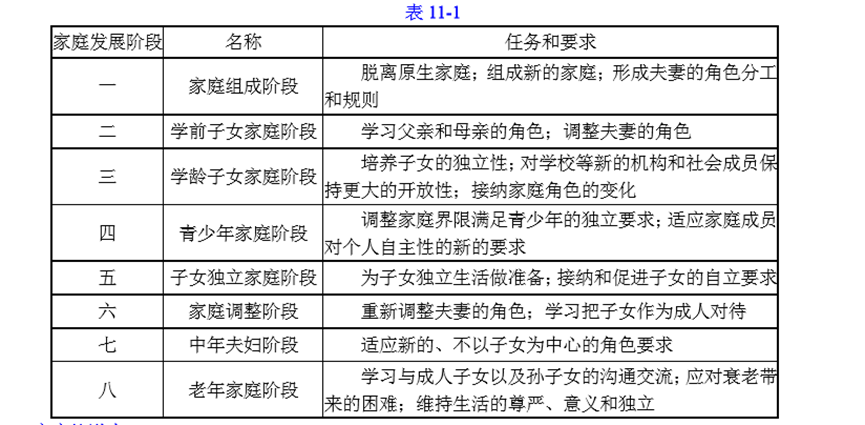
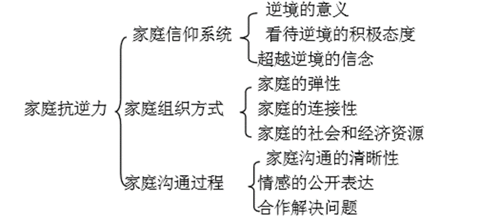

### 1. 家庭社会工作的定义
#### 1.1. 家庭社会工作基本内涵
（1）定义
家庭社会工作是指，运用社会工作的专业理论和方法帮助家庭解决面临的困难，更好地发挥家庭的社会功能，以满足所有家庭成员的发展和情感需要的专业服务活动。这个定义包括三方面的内容：
①家庭社会工作是运用社会工作的专业理论和方法而开展的专业服务活动。
②家庭社会工作的目的是帮助有需要的家庭更好地发挥家庭的社会功能。
③家庭社会工作关注整个家庭成员的需要。

（2）家庭社会工作内容
①以家庭作为背景的专业服务活动。
②以家庭作为对象的专业服务活动。
③以家庭作为活动单位的专业服务活动。

（3）不同类型家庭社会工作的共同特征：
①针对家庭的日常生活和沟通交流方式进行干预。
②协助家庭成员改善家庭困扰产生的环境因素。
③为家庭成员提供直接、具体的支持和帮助。

（4）基本功能：
①增强家庭的能力，帮助家庭成员做好改变的准备。
②结合家庭的治疗和支持，保证家庭维持有效的家庭功能。
③促进家庭功能的改善，维护家庭成员满意的日常生活方式。

#### 1.2. 家庭社会工作与家庭治疗的关系

##### 1.2.1. 家庭社会工作与家庭治疗的区别**（2019 简答题）**
①起源不同
家庭社会工作的产生要比家庭治疗早，它源于社会工作初期美国慈善组织运动中的“友好访问者”活动，已有一百多年的历史。而家庭治疗则是系统理论产生后把心理治疗从个人延伸到家庭的尝试和实践，时兴于二十世纪六七十年代，只有五六十年的历史。
②关注焦点不同
与家庭治疗相比，家庭社会工作关注的焦点更为广泛，既包括家庭成员之间的沟通交流，也包括家庭成员在不同层面的互动交流；而家庭治疗的焦点主要集中在家庭本身的结构和互动关系。因此家庭治疗通常以整个家庭作为关注的焦点。而家庭社会工作就更为自由，它的关注焦点既可以是家庭中的个人，也可以是家庭中的次系统，甚至可以是家庭与家庭之间的互动关系。
③解决方式不同
家庭社会工作更为关注家庭成员在日常生活中的具体困难以及相互影响的方式，并且通过解决这些具体困难以及改善家庭成员日常沟通交流的方式发挥家庭的正常社会功能。而家庭治疗则更为强调家庭成员的家庭角色和关系的调整，以保证家庭功能的正常发挥。
④工作理念不同
家庭社会工作更为强调“人在情境中”的服务理念，注重在受助家庭的自然生活场境中开展专业服务；而家庭治疗更为注重家庭系统的服务理念，关注家庭成员之间的互动方式和结构。
⑤专业关系不同
在家庭的自然生活场境中开展专业服务，这要求社会工作者与受助家庭建立良好的合作关系。这样的良好合作关系的建立超出了一般意义上的“专业合作关系”，包含很多情感方面的交流。如果缺乏这些情感方面的交流，社会工作者就无法深入到受助家庭的自然生活场境中。而这一要求在家庭治疗中并不突出。

##### 1.2.2. 家庭社会工作与家庭治疗的联系
①服务领域的相互影响
两者都以家庭作为帮助的对象，服务内容存在交叉和重叠，很容易出现相互替代的现象。
②服务模式的相互影响
很多社会工作者学习家庭治疗的服务模式、方法和技巧，并把它们运用于家庭社会工作的服务项目中。
③工作人员的相互影响
不少社会工作者学习家庭治疗的方法和技巧在辅导室里从事专业服务活动；同时也有不少家庭治疗师走出辅导室在受助家庭的自然环境中开展各种服务活动。

#### 1.3. 家庭与家庭社会工作
（1）家庭的定义
家庭就是一群通过血缘、婚姻或者法律联结起来，并且拥有共同历史和未来以及深厚感情联系的人。
（2）家庭的特征
①家庭是依靠血缘、婚姻或者法律联结起来的一群人。
②家庭成员拥有共同分享的历史和未来。
③家庭成员之间存在深厚的情感联系。
（3）家庭的类型
①核心家庭。核心家庭是指由一对夫妻以及未婚子女组成的家庭。
②主干家庭。主干家庭是由父母亲和一对已婚子女组成的家庭。
③联合家庭。联合家庭则包括父母亲和多对已婚子女组成的家庭。
④重组家庭。重组家庭的夫妻至少有一方带有子女。
⑤领养家庭。领养家庭则是通过法律长久收养子女的家庭。
⑥寄养家庭。在寄养家庭中，父母亲暂时托管和抚养未成年的子女。
⑦单亲家庭。单亲家庭是由父亲或者母亲一方与未成年子女一起生活的家庭。
（4）家庭社会工作者应注意的问题
①作为社会工作者，需要将家庭结构的改变等家庭成员互动关系的转变以及家庭成员需要的变化连接起来，并且将这些变化放在家庭的自然生活场境中考察。
②社会工作者在开展家庭服务时，要对自己的家庭生活经验保持警觉，从而避免自身的误解，了解受助家庭成员的真实需要。

### 2. 家庭社会工作的基本假设**（2017 简答题）**
1.提供以家庭为基础的支持
家庭是家庭成员生活的基本生活场所，是孩子学习基本生活技能和知识的重要场所，家庭生活的改善离不开家庭成员的投入和参与。因此，只有以家庭为基础为家庭成员创造和提供必要的支持，才能满足家庭成员的基本需要，真正改善家庭成员的生活状况。

2.坚持以家庭为中心的理念
运用以家庭为中心的视角就能把受助家庭成员放在家庭的自然环境中考察，了解家庭成员与家庭环境之间的相互影响过程，从而准确地掌握家庭成员的需要；某个家庭成员遇到困扰，不仅与个别家庭成员相关联，往往同时与整个家庭成员之间的互动交流密切相关。只有把遇到困扰的家庭成员放到整个家庭的互动关系中去理解，才能真正了解受助家庭成员的要求。

3.采取危机介入的策略
对于社会工作者而言，要把握危机介入的时机，能够保证顺利地走进家庭成员的日常生活中，并且结合危机在家庭成员的日常生活中寻找危机解决的方式，以对家庭成员的日常生活发生直接的影响。

4.运用生态视角
运用生态视角不仅要求社会工作者把受助家庭成员放在家庭环境中考察，同时也要把家庭放在更大的社会环境中去理解。尤其对处于弱势的家庭来说，社会环境的影响非常突出，而且家庭环境的影响又常常与周围环境的影响交错在一起。另外，生态视角还特别强调社会环境中重要他人的影响。

### 3. 家庭社会工作的主要内容
#### 3.1. 家庭社会工作的重要理论与概念
##### 3.1.1. 家庭系统理论**（2015 名词解释）**
（1）基本观点：
①家庭成员的问题是由整个家庭不良的沟通交流方式导致的。
②家庭所面临的危机既是机会，也是挑战。
③因“问题”而导致的家庭功能的失调能够有效解决。
（2）家庭系统核心要素
①家庭作为一个整体大于各部分之和。
②家庭系统努力维持改变和稳定之间的平衡。
③家庭系统中一位成员的改变影响所有其他家庭成员。
④家庭成员的行为遵循相互影响的循环因果的原则。
⑤每个家庭系统既包含很多个系统，又归属于更大的社会系统。
⑥家庭系统依据已经建立的规则运行。

##### 3.1.2. 家庭生命周期理论
家庭也像人一样有一个成长、发展的自然变化过程，这就是家庭生命周期理论的核心观点。家庭生命周期理论强调家庭成员的互动交流关系以及需要会随着家庭的发展在不同阶段呈现出不同的特征，每一家庭发展阶段都有不同的任务和要求需要家庭成员去面对，让家庭成员感受到一定的压力。
根据家庭成员之间的互动关系和面临的任务，可以把家庭生命周期分为八个阶段，如表11-1所示。

##### 3.1.3. 家庭抗逆力
（1）基本假设
家庭成员在逆境中并不一定必然成为“问题”，任何家庭在“问题”面前都拥有应对困难的能力，并且通过克服逆境的过程寻求新的发展。
家庭抗逆力要求社会工作者从不利的危机因素（risk factors）和有利的保护因素（protective factors）两个方面考察家庭应对逆境的过程。
（2）家庭抗逆力内涵（三个方面九个因素）

##### 3.1.4. 生态系统理论
生态系统理论假设影响个体发展的环境可分为四个系统，这四个系统分别为：微观系统（microsystem）、中观系统（mesosystem）、外部系统（exosystem）及宏观系统（macrosystem）。这四个系统环环相扣，形成影响家庭以及家庭成员发展的完整的系统。
（1）微观系统是指个体直接面对面接触和交往而组成的系统，它对个体的影响最直接、最频繁，构成个体最重要的生活场所。
（2）中观系统是个体积极参与的两个或多个微观系统之间的互动关系。
（3）外部系统是指对个体有影响但个体并不直接参与的系统。
（4）宏观系统是指影响个体的思想和行为的社会文化价值系统。它通过生态系统中的微观、中观和外部系统影响家庭成员的思想和行为，反映社会的道德标准。

#### 3.2. 家庭社会工作的基本内容
##### 3.2.1. 改善亲子关系的服务
（1）定义
改善亲子关系的服务是以父母亲和子女关系的改善为服务焦点，并且以增进亲子之间的沟通交流和家庭社会功能为目标而开展的各项社会工作专业服务活动。
（2）常见服务
①家庭行为学习。家庭行为学习是根据行为学习理论的原理对家庭中的年轻子女在成长过程中遇到的行为问题进行干预的服务。
②家庭照顾技巧训练。家庭照顾技巧训练也是根据行为学习理论的原理设计的，而是针对家庭中的父母亲，尤其那些在与孩子沟通交流中感到困难的家长。
③行为问题和亲子冲突的消除。亲子之间的冲突常常伴随孩子的行为问题，亲子之间冲突的解决需要结合孩子的行为问题的考察。行为问题和亲子冲突的消除就是基于这样的观察而设计的服务活动。它要求社会工作者把孩子行为问题的矫正与亲子之间沟通交流障碍的消除放在一起解决，运用的原理类似于家庭行为学习的服务。
④家庭心理健康教育。家庭心理健康教育是将家庭教育、技能训练和社会支持等方式综合一体的服务活动，它最初运用于精神疾病患者的家庭，后来扩展到涉及其他健康问题的家庭。

##### 3.2.2. 改善夫妻关系的服务
（1）定义
家庭社会工作服务活动的焦点集中在家庭夫妻关系的改善上的服务活动就属于改善夫妻关系的服务。
（2）常见服务
①婚姻辅导。**（2018 名词解释）**
婚姻辅导是针对夫妻的婚姻状况而开展的服务活动，涉及夫妻角色的界定、扮演以及相互之间沟通交流方式的改善等。
②家庭暴力的干预。家庭暴力的干预是针对家庭中的暴力现象而开展的服务活动，通常涉及妇女、儿童权益的保护。此外，还包括对家庭施暴者的心理辅导等内容，改善亲子关系的服务和改善夫妻关系的服务的联系前者重点是关注家庭生活中的纵向关系，后者的重点则是关注家庭生活中的横向关系。现实生活中，二者交错，相互影响。

##### 3.2.3. 我国开展的家庭服务
1.家庭的救助和帮扶
家庭的救助和帮扶是以整个家庭作为帮助的对象，其目的是保障整个家庭的基本生活水平。
2.改善亲子关系的服务
在改善亲子关系的服务活动方面，常见的有家庭生活教育、有关家庭的主题活动以及家长学校等服务活动。
这些家庭服务活动以预防和发展为主，目的是改善家庭成员之间的沟通交流，增进家庭成员之间的感情联系，促进社区的和谐。
3.改善夫妻关系的服务
改善夫妻关系的服务有婚姻调解和婚姻学校等形式，其目的是解决夫妻之间的矛盾和冲突，改善夫妻之间的沟通交流，维护家庭的稳定与和谐。

### 4. 家庭社会工作的主要方法
#### 4.1. 家庭社会工作的基本原则
1.家庭处境化原则
家庭处境化原则假设家庭是家庭成员生活的自然场境。它要求社会工作者在观察和评估家庭成员的需要时，把家庭成员放在家庭的日常生活中，观察和了解家庭成员之间以及家庭成员与周围环境之间的互动交流状况，关注家庭成员的日常生活。
2.帮助家庭成员增能原则
帮助家庭成员增能原则假设每个家庭成员都有自己解决困难的能力，有效帮助家庭成员克服困难的方式是增强他们克服困难的能力。
3.家庭个别化原则
家庭个别化原则认为，每个家庭都是独特的，都有自己的生活环境和沟通交流的方式，社会工作者只有从受助家庭所处的特殊处境和方式着手，才有可能把握受助家庭成员的真实需要，提供符合受助家庭成员要求的服务。
4.满足家庭成员需要原则
满足家庭成员需要原则是指社会工作者既要关注受助家庭成员的目前需要，也要关注受助家庭成员的长远需要，并且随着受助家庭成员需要的变化将问题的解决和预防以及发展结合起来。

#### 4.2. 家庭社会工作的实施步骤
1.接触阶段
接触阶段是社会工作者与受助家庭成员初次见面，评估受助家庭成员的问题，并且与受助家庭成员建立初步的信任合作关系的阶段。其主要任务包括
（1）与受助家庭约定初次会谈的时间和安排。与受助家庭约定初次会谈的时间和安排是接触阶段的重要任务。通常，社会工作者需要预先通过电话和信件等方式与受助家庭确定初次会谈的时间、地点和其他安排等。
（2）为初次会谈做好准备。在初次会谈之前，社会工作者需要做一些准备工作，以了解受助家庭的基本情况。特别需要关注的是家庭成员的会谈安排，尤其注意会谈时孩子的安排。
（3）安排第一次会谈等。在初次会谈中，社会工作者有两项基本任务需要完成：初步评估受助家庭的问题以及与受助家庭成员建立基本信任关系。另外，在初次会谈的安排中还需要考虑社会工作者自身的安全。

2.开始阶段
开始阶段是社会工作者正式开始与受助家庭开展服务介入活动的阶段，除了与受助家庭建立稳定、信任的合作关系之外，同时还需要与受助家庭成员一起制订服务介入的目标和签订服务合同。
在开始阶段，社会工作者的主要服务包括：
（1）与受助家庭成员建立稳定的合作关系。社会工作者在开始阶段需要创造良好的家庭会谈的气氛，保证家庭成员能够自由地谈论自己和其他家庭成员，让家庭成员感觉到社会工作者也是家庭中的一员。当然，在此阶段，社会工作者需要保持“中立”的立场。
（2）全面评估受助家庭成员的需要。一项完整的家庭成员需要评估报告包括五个方面的基本内容：家庭成员的问题；家庭成员的能力；家庭系统的互动方式；家庭与外部环境的交流；家庭的生命周期。
（3）明确服务介入的目标和基本安排。

3.介入阶段
介入阶段，即社会工作者制订服务介入计划并且运用专业服务方法和技巧直接影响受助家庭成员的过程。
这一阶段社会工作者的主要任务是：
（1）制订服务介入计划。它的内容主要包括四个方面：一是问题；二是总目标；三是阶段目标；四是介入方案。
（2）明确自己的专业角色，并且运用专业技巧影响受助家庭成员解决面临的问题等。

4.结束阶段
结束阶段是家庭社会工作服务活动的最后阶段，是社会工作者与受助家庭成员协商服务活动结束的相关事项，并且结束、退出服务活动的阶段。
在这一阶段，社会工作者需要完成的主要任务是：
（1）与受助家庭成员协商服务结束事项。
（2）总结和巩固整个服务活动的成果。

#### 4.3. 家庭社会工作的常用方法
1.家庭评估的常用方法
（1）家庭结构图：
①定义
家庭结构图是指用图形方式来表示家庭的结构、家庭成员之间的关系以及家庭的一些重要事件等，它帮助社会工作者迅速、形象地了解和掌握受助家庭成员的结构、成员关系以及其他一些家庭情况。
②原则
a.长辈在上，晚辈在下。
b.同辈关系中，年长的在左，年幼的在右。
c.夫妻关系中，男的在左，女的在右。

（2）家庭生态图：
①定义
家庭生态图是指用于表示家庭成员与家庭外部环境之间的互动交流关系，帮助社会工作者了解受助家庭成员与家庭外部环境互动交流的状况以及家庭拥有的资源和面临的困难。
②构成
家庭生态图由不同的圆圈组成，中间的圆圈代表家庭，圆圈内家庭成员的关系按照家庭结构图的要求表示，家庭外的圆圈代表与家庭有密切关系的个人和机构。

2.家庭干预的常用技巧
（1）观察技巧，是指运用系统记录实际行为表现的方式，让受助家庭成员了解自己面临的问题以及改变的状况，从而帮助受助家庭成员随时调整自己的行为，增强行为的有效性。
（2）聚焦技巧，是指社会工作者帮助受助家庭成员收窄注意的焦点，将受助家庭成员的注意力集中在需要解决的问题上，以便对问题作出深入的探索，保证服务介入活动的效率。
（3）例子使用技巧，是指社会工作者经常运用例子向受助家庭成员解释、描述和传递重要的信息和想法，让受助家庭成员了解困难解决的不同途径和经验，并且舒缓受助家庭成员的压力。
（4）再标签技巧，是指社会工作者帮助受助家庭成员从更为积极的角度界定问题，改变受助家庭成员以往的消极态度和认识，从而促使受助家庭成员产生新的、积极的行为。
（5）问题外化技巧，是指社会工作者将受助者家庭成员的问题转化为整个家庭需要共同解决的难题，让家庭成员从相互指责转变为一起共同解决的难题，让家庭成员从相互指责转变为一起共同努力解决面临的困难，从而促使家庭成员之间建立积极的沟通交流方式。