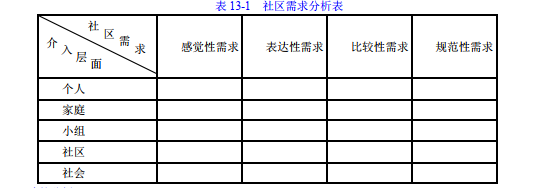
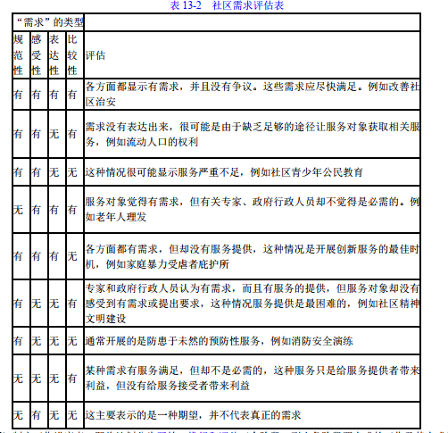
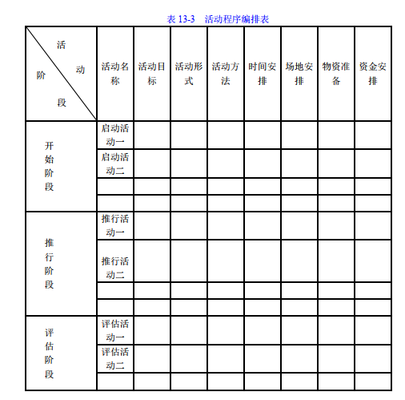

### 1. 社区社会工作概述
#### 1.1. 社区的含义
社区是指聚居在一定地域范围内的人们所组成的社会生活共同体。城区社区的范围，一般是指经过社区体制改革后作了规模调整的居民委员会辖区。（《（关于在全国推进城市社区建设的意见>的通知》）

#### 1.2. 社区社会工作的含义
1.社区与社会工作
从社会工作的角度理解社区，它包括了三种意义：
（1）社区指一个工作地点和环境，社会工作者可以依托“社区服务中心”、“社区服务站”掌握了解社区居民和服务对象的生活环境、问题、资源和文化背景，为他们提供多元化服务。
（2）社区是一个互相关怀和照顾的网络，社会工作者重点发展和强化社区居民之间的互动、互助关系，提升居民的自助能力，既解决社区居民的个人化问题，又解决社区共同问题，增强社区居民的归属感。
（3）社区是影响社会政策的基地，社会工作者要从维护社区居民集体利益的角度，收集居民的意见，反映居民的利益诉求，争取资源，倡导制定或修订有关政策或措施。

2.社区社会工作的含义
社区社会工作主要代表了两个层面的意义：
（1）社区社会工作是社会工作的一个实务领域，即社会工作者针对某一个目标社区，运用各种专业方法，如个案工作、小组工作、社区工作、社会工作行政、社会工作研究等提供多元化服务，提高居民社会意识，协助居民运用社区资源，解决社区问题。同时社会工作者还协助社区居民建立友善邻里关系，鼓励互相照顾和关怀，满足社区需求，实现社区和谐。
（2）社区社会工作是社会工作的一个专业方法，主要强调综合运用实践模式（如地区发展、社会策划、社区照顾），通过科学的工作过程，采用系列专业技巧，处理社区问题和推进社区发展。

#### 1.3. 社区社会工作的目标
1.促进居民参与，解决社区问题
社会工作者认为社区问题的解决主要应依靠社区居民，相信居民有能力处理与他们日常生活密切相关的问题，因此社会工作者的重要任务是帮助居民建立参与解决社区问题的信念，树立信心，推动居民参与集体行动，群策群力解决社区问题。
2.改善社区关系，提升社区意识
社会工作者认为在社区关系主要有两种表现形式，一是对外关系，是指社区通过与政府机构、辖区单位建立良好互动关系。二是对内关系，一方面是指社区内部各组织之间的关系，社会工作者致力于推动各个组织建立互信互赖的关系，合力解决社区问题，促进社区凝聚力的形成。另一方面是指居民和居民之间各种关系。社区工作者致力于推动社区居民之间的交流、沟通、协商和合作，促进社区居民之间的互惠、互助，培养相互关怀的社区美德，促进社区归属感的建立。
3.挖掘社区资源，满足社区需求
社会工作者在社区的重要工作是挖掘社区的人力、财力和物力资源，并通过资源的酝置工作，来满足社区居民的需求。

#### 1.4. 社区社会工作的特点
1.以社区为对象
社区社会工作的第一个特点是以社区为对象，即为居住在社区中的个人、家庭提供服务，更重要的是服务整个社区。
2.重点解决社区居民所面临的集体性问题
集体性问题主要是指社区居民，无论男女老少都不得不面对的问题。这些问题扰乱了居民的日常生活秩序，给他们造成了诸多的不便与困扰。
3.采用宏观结构的视角分析和介入问题
社区社会工作是以整个社区为对象的，而社区问题常常与社会转型和社会变迁有关，涉及整个社会的政策和制度，因此社会工作者在分析社区问题时较多采用宏观结构视角分析问题。
4.强调社区参与，关注人的发展
社会工作者所倡导和组织的居民参与行动，包括参与社区决策和资源分配，共同商讨设计服务方案，执行服务方案，并保障决策和服务方案有效惠及社区的居民。
5.重视社区资源的挖掘和运用
社区资源包括社区的人力资源、物力资源、财力资源、组织资源和文化资源等，社会工作者在社区中的重要作用是挖掘、组织和善用社区的各种资源，为社区作贡献。

### 2. 社区社会工作的主要内容
#### 2.1. 社区服务
1.面向各类弱势人群的福利服务
（1）为老年人提供的福利服务
①养老服务。
②文化教育服务。
③健康服务。
④再就业服务。
⑤婚姻服务。
（2）为残疾人提供的福利服务
①康复服务。
②安置服务。
③生活服务。
（3）为优抚对象提供的福利服务
①贯彻落实政府的优抚政策，开展拥军优属活动。
②帮助优抚对象解决住房、就医等日常生活方面的困难。
③开展军民联谊活动，开设培训军地两用人才的培训班等。
（4）为青少年提供的福利服务
①生活照顾服务。
②校外教育。
③失足青年的帮教。
（5）为贫困者提供的福利服务
①通过发展小区服务业，帮助他们再就业。
②执行政府的“最低生活保障制度”，为他们提供必要的经济援助。
③动员小区各方面的力量开展多种形式的扶贫济困活动。
（6）为外来经商务工人员提供的福利服务
如组织外来青年俱乐部、举办文化知识讲座等。
2.面向小区普通居民群众的便民利民服务
（1）居民生活服务
居民生活服务以方便居民的日常生活为宗旨，开设多种服务项目。实行有偿、低偿或无偿服务。
（2）家务劳动服务
家务劳动服务以适应家务劳动生活化的需求而产生的，目的在于减轻双职工家庭的负担，减少其后顾之忧。
（3）文化生活服务。
文化生活服务的开展丰富小区居民的文化生活，进行精神文明建设。

#### 2.2. 社区就业
1.开发社区就业岗位，鼓励多种形式就业
（1）开发社区就业岗位
①结合社区居民多方面、多层次生活服务的需要，大力开发便民利民服务岗位，特别是面对军民家庭和个人的家政服务岗位。
②结合驻社区企业事业单位、政府机关剥离部分社会服务职能的需要，开发物业管理、卫生保洁、商品递送等社会化服务岗位。
③结合对企业退休人员实行社会化管理的需要，开发健身、娱乐以及老年生活照料等工作岗位。
④结合社区组织建没、公共管理和公益性服务的需要，大力开发社区治安、市场管理、环境管理等社区作岗位，特别是开发社区公益性就业岗位。
（2）鼓励多种形式就业
①鼓励和支持下岗职工和失业人员在社区组织起来就业创办各种便民利民盼社区服务企业等社区就业实体。②积极鼓励下岗职工和失业人员以个体、私营等各种经济形式，兴办投资少、机制灵活、适应性强的社区服务型小企业从事社区服务，实现自谋职业。
③鼓励企业事业单位、街道基层组织等兴办以安置下岗职工和失业人员为主的就业型中小企业、劳动就业服务企业等社区就业实体。

2.宣传和执行落实再就业优惠政策
（1）促进下岗职工和失业人员再就业的各项优惠政策：
①税收优惠政策。
②工商登记优惠政策。
③贷款担保等金融服务政策。
④场地安排优惠政策。
（2）社区社会工作者一方面要向社区中下岗失业人员宣传、解释政策，协助政府执行和落实政策；另一方面制作发放“再就业人员优惠卡”，对各部门优惠政策执行情况进行登记，保障社区就业的各项优惠政策落到实

3.开展社区就业服务和就业培训
（1）开展就业服务工作
①充分运用市、区、街三级社区就业服务工作网络，配合街道和社区居委会，发挥基层组织的优势，充分采集社区岗位需求信息。
②利用连接到社区的“城市劳动力市场就业信息网”为下岗失业群体寻找就业岗位，及时将信息传递给下岗职工和失业人员。
③要积极探索社区就业服务的有效方法，如通过开展有针对性的职业指导，帮助下岗职工和失业人员切实转变就业观念。
④建议街道公共服务大厅采取开设专门服务窗口、实行劳动保障事务代理等措施，为下岗职工和失业人员提供代管档案、代缴保险、代办有关证明等项就业服务，引导他们在社区实现再就业。
（2）开展就业培训
①结合社区就业实际需求，努力开发适应社区就业岗位需要的再就业培训项目和培训课程，采取实用有效的培训方式方法，为下岗职工和失业人员在社区就业创造有利条件。
②开展创业培训，培养一批创办社区就业实体的带头人，以培训促进创业，以创业带动就业。

4.解决社区下岗和失业人员的社会保险接续等实际困难
（1）及时向基层政府和劳动保障部门反映情况，呼吁完善相关政策措施。
（2）与社会保险经办机构的工作人员合作，掌握接续社会保险关系的程序、办法和个人账户基金的结存情况，帮助在社区就业的下岗职工和失业人员学习查询社会保险档案及个人账户状况。
（3）呼呼有关部门制定适合本地实际情况，促进灵活就业形式的政策和制度，协助灵活就业人员妥善处理劳动关系和劳动争议问题，保障其合法权益。

#### 2.3. 社区治安
1.我国社区治安的组织体系
（1）社区治安的管辖部门，从狭义上讲，是指管辖本地区治安工作的公安机构及其派出所。
（2）社区治安的管辖部门，从广义上讲，包括与治安工作密切相关的城市街道办事处、社区居民委员会以及社区内企业事业单位的保卫部门。
（3）治安保卫委员会。

2.社区治安的主要内容
（1）宣传教育工作
①法律政策的宣传。
②社会治安防范知识的宣传。
（2）协助公安机关开展工作
①群防群治的工作：防盗、防火、防破坏、防其他治安灾害事故。
②保护案发现场，提供破案线索。
③依法对被管制、剥夺政治权利、缓刑、假释、监外执行、保外就医的刑事处罚人员和监视居住的被告人进行监督和管理，对有违法犯罪行为的人进行帮助教育。
（3）协助有关部门加强对外来人口的管理
①要搞好宣传。
②建立户口协管队伍，协助公安机关宣传有关法令、督促外来人口申报登记、协办暂住登记、注意发现可疑情况。
③深入了解人口情况。
（4）向政府及公安机关反映社区治安动态，以及对社区治安管理工作的意见、要求和建议。

#### 2.4. 人民调解
1.我国的调解制度的组成
（1）法院调解
法院调解又称诉讼调解，是指在人民法院的主持下通过说服教育，促使双方当事人达成和解协议的活动。
（2）行政调解
行政调解是指在具有调解纠纷职能的国家行政机关主持下对纠纷进行调解的活动。
（3）人民调解
人民调解是指在人民调解委员会主持下，依照国家法律、法规、规章、政策和社会道德规范，对民间纠纷当事人说服劝解，促使双方当事人互让互谅、平等协商，自愿达成协议，消除纷争的一种群众自治活动。
2.人民调解工作的基本原则
（1）平等自愿原则
纠纷的受理，必须基于当事人自愿，如果当事人不愿意接受调解，或者不愿意接受某个组织和个人调解，或者有一方当事人不愿意接受调解，均不能强行调解。
（2）合法合理原则
人民调解范围，程序步骤、工作方法必须符合有关法律、法规和规章制度的规定，调解行为规范、公正、合理。要依照国家法律、党和政府的政策以及社会主义道德对当事人进行说服教育。
（3）不限于当事人诉讼权利原则
人民调解不是诉讼的必经程序，不得因未经调解或者调解不成而阻止当事人向人民法院起诉。
3.人民调解受理民间纠纷的范围
（1）人民调解委员会调解的民间纠纷，包括发生在公民与公民之间、公民与法人、其他社会组织之间涉及民事权利义务争议的各种纠纷：
①公民与公民之间的纠纷，一般是指发生在家庭成员、邻里、同事、居民、村民之间，因合法权益受到侵犯或者发生争议而引起的纠纷。
②公民与法人、其他社会组织之间的纠纷十分广泛，例如，农村村民与农村合作组织、企业职工与所在企业之间、城市居民与城市市政管理组织等引发的纠纷。
（2）人民调解委员会不得受理调解下列纠纷：
①法律、法规规定只能由专门机关管辖处理的，或者法律、法规禁止采用民间调解方式解决的。
②人民法院、公安机关或者其他行政机关已经受理或者解决的。

#### 2.5. 社区卫生
1.概念
社区卫生服务是以基层卫生机构为主体，全科医师为骨干，以人的健康为中心、家庭为单位、社区为范围、需求为导向，以妇女、儿童、老年人、慢性病人、残疾人为重点服务对象，以解决社区主要卫生问题、满足基本卫生服务需求为目的，融预防、医疗、保健、康复、健康教育、计划生育技术服务等为一体的，有效、经济、方便、综合、连续的基层卫生服务。

2.社区疾病预防与康复工作
（1）疾病的社区预防工作
①配合社区卫生工作人员进行传染病和多发病的预防，慢性病控制以及社区公共环境卫生的监督和管理工
②积极开展社区健康教育。
③开展计划生育宣传教育工作。
④组织社区居民接受社区卫生工作人员进行的计划生育技术指导。
（2）社区康复工作
充分利用社区资源，使患者或残疾者在社区或家庭通过康复训练使疾病好转或痊愈，生理功能得到恢复，心理障碍得到解除。

3.社区精神健康工作
（1）为社区普通人群提供心理咨询，普及精神卫生知识。
（2）开展社区康复治疗，促使其早日回归社会。
（3）维护精神残疾者的合法权益，争取社会支持。
（4）广泛开展健康宣传活动，减少社会歧视。

4.社区环境卫生
（1）社区环境改造
主要是在当地街道办事处的支持下，修缮、改造和维护社区的基础设施。
（2）社区环境卫生
①保证社区、楼区和平房区的环境卫生能够定期清理，并有日常保洁：公厕设施干净整洁，使用功能完好，有专人负责日常清洁维护。
②规范收集、运输和处置垃圾，教育社区、楼区居民以及卫生保洁人员将生活垃圾倾倒在指定地点。
③加强居住区养殖管理。规范居住区内养殖畜禽，倡导楼区和居民区文明饲养宠物。
（3）宣传教育工作
①积极宣传、倡导健康文明的生活方式和良好的卫生行为，曝光不文明行为，形成广大群众主动参与，共建共享的奥论氛围。
②定期开展“清洁家园，共享文明”卫生文明日活动，健康教育进社区等活动，动员居民志愿参与社区环境卫生治理工作，逐步建立社区居民参与院落环境卫生整治的机制。

#### 2.6. 社区教育
1.社区教育的含义
社区教育是以建立社区居民的互助关系为基础，鼓励居民参与社区公共事务，提高社区居民的觉悟，进而改善生活质量，建设一个互相尊重和团结的社区，其实施主体是社会福利机构和社会工作者。

2.社区教育的内容
（1）从社区教育的基本目标看
①补偿式教育
补偿式教育即通过社区教育课程及其有系统的活动补偿社区居民没有接受的正规教育的知识空间，通常采取非正规的教育方式。
②控制式教育
控制式教育即通过一些宣传教育的活动，重点控制不守公德和秩序的行为。这种社区教育是以阻止性为主，通常不是树立正面的模范去宣传理想公民所应有的态度和表现。
③发展式教育
发展式教育着重于人的全面发展，重点挖掘居民在知识、行为、态度和价值观念等方面的个人潜能和积极性，核心是达到思想的解放，形成批判性思维，其重点是对居民进行意识提升过程，使社区居民了解社会对每个个体的责任和应提供的权利保障，同时也教育居民掌握个人对社会的应尽的义务和应作出的努力和贡献。
（2）从社区教育的服务功能看
①家庭生活教育。推动家庭生活教育的目的是预防家庭解体及其引发的相关社会问题。
②公民教育。公民教育的目标是为了让公民能够面对当今日益多样化，甚至不断发生互相冲突的社会，充分作好在未来能够有效参与社会经济、政治生活的准备。
③成人教育。成人教育主要以因各种原闲失学或未能接受正规教育的人士为对象，为他们提供教育机会。
④健康教育。健康教育主要是以社区为单位，向居民提供健康和预防疾病的知识。

### 3. 社区社会工作的主要方法
#### 3.1. 社区社会工作的过程
##### 3.1.1. 社区分析
（1）社区类型分析
中国城市社区类型：
①商品住宅区。此类住房主要是2000年以后建设的，居民通过市场购买的方式获得。
②单位型社区。主要是指政府机关、大学、军队、大型国企的宿含区，一般采取封闭式管理，居民多是本单位的职工，既是工作同事也是邻居。
③经济适用房住宅区。这类社区的住房是政府为了照顾中低收入市民而开发的住宅区。
④老旧小区。住房的建筑年代一般是20世纪90年代以前，最老的住房有1949年以前建设，每套房屋的面积较小，在30平方米到80平方米之间。

（2）社区基本情况分析
①社区的名称、发展历史。
②社区的地理位置及其周围的生态环境。
③社区的人口结构。
④社区组织或单位资源。

（3）社区问题分析
①社区内共同性问题的分析
共同性问题是指社区所有居民都卷入其中，带有明显的“集体性”。因此可以通过政府公开的统计资料、学者的研究报告、媒体的报道等资料了解，也可以通过访问社区居民获得。
②社区内群体性问题分析
包括社区中的老年人、青少年、妇女、残疾人、失业者、贫困者和低收入者等，分析的角度有：
a.该人口群的共同属性是什么？
b.人口的分布和人口的数量如何？
c.群体所存在的问题是什么？
d.政府是否有相关政策扶持，内容如何？
e.民间和社区组织是否提供服务，内容如何？

（4）社区需求分析
社区需求分析较为常用的方法是布雷德绍（J.Bradshaw）1972年提出四种需求的类型：
①感觉性的需求。指社区居民或服务对象感受到或意识到，并用言语表述出来的需要。
②表达性的需求。指社区居民或服务对象把自身的感觉通过行动表达出来的需要，例如申请服务，排队等候服务等。
③规范性的需求。指由专家学者、专业人士、政府行政官员评估而决定的需求。
④比较性需求。指社区居民或服务对象将所得到的服务与其他类似社区进行比较，而认为有所差别的需要在分析社区需求时，社区社会工作者可以将布雷德绍（JBradshaw）的四种需求与专业介入层面相结合，通过填写下列表格（表13-1）综合分析社区需要。

##### 3.1.2. 政策分析
（1）分析社会政策的层次
一般而言，高层政府制定的社会政策涵盖面大，政策规定也较为笼统，基层政府和企业事业单位的福利政策则较为具体，更具有操作性。
（2）分析政策内容和政策过程
社区社会工作者进行政策内容分析目的是向政策制定者建议选择政策内容需要依据的准则。政策过程分析包括政策制定和执行过程，分析侧重于描述性。

##### 3.1.3. 社区服务（活动）方案的策划
（1）服务（活动）策划前的分析工作
①服务对象分析。
②问题分析。
③服务（活动）的逻辑推进步骤分析。即界定和确认问题一—确认要达到的目标——选定评估的指标一一寻找各种可行的方案—一计算每个方案的成本（包括人力、物力、时间）—一计算每个方案的成效——列举方案并进行比较分析。

（2）服务（活动）策划的过程
①确认社区需求。可以通过规范性需求、比较性需求、表达性需求和比较性需求来界定社区需求。
②了解社区居民或者服务对象的特征。了解社区居民或者服务对象的特征。包括社区居民或服务对象的兴趣、特点、能力、生活习惯和方式、休闲时间的安排，以及与社区其他群体的关系。
③订立工作目标。
a.清楚界定整个服务（活动）方案是以哪些人为服务对象。
b.清楚列出服务（活动）的内容。
c.表达出期望服务（活动）成效，即社区居民或服务对象参与该服务后可能产生的改变。
④评估自身的能力。这里主要是评估提供服务的机构及其工作人员的能力。

⑤制定工作进度表。即将计划分为开始、推行和评估三个阶段，列出各阶段要完成的工作及其完成的期限，然后按照指定完成日期排列出先后次序，保证服务可以按照计划的时间来完成。
⑥程序编排。方案设计了一系列与目标相关的活动，而且每个活动都有其具体的目标，因此要将这些活动一方面按照推行时间先后排出次序，另一方面还要根据服务活动的目标、场地（环境）、资源等要素进行编排。

##### 3.1.4. 社区服务（活动）方案的执行
（1）筹备阶段
①经费筹措。
②人力安排。
③场地安排。
④服务（活动）的宣传推广。
（2）服务或活动阶段
①在预算管理方面，应本着节约和“量入为出”的原则。
②时间进度管理。
a.整个服务（活动）安排的期限管理。
b.服务（活动）各个阶段的进展时间管理。
c.服务（活动）进行环节的时间管理。
③服务品质管理。
④士气激励和提升。
（3）结束阶段
①经费报销。
②对服务资料及时归档。
③对专业社会工作者和志愿者进行表彰。

##### 3.1.5. 社区服务（活动）方案的评估
（1）社区服务（活动）方案的评估方法
①定量评估法
特点：
a.用数字表现评估结果。
b.评估者事先预设了某些答案，再由参加服务（活动）的社区居民或服务对象对答案进行选择。
②定性评估法
特点：
a.用文字来表达评估结果。
b.评估者事先不预设答案，只是听取参与服务（活动）的社区居民或服务对象的意见、看法，再进行归纳和总结。
（2）社区服务（活动）方案的评估内容
①社区服务（活动）方案的评估内容包括方案成效评估和方案过程评估。
②方案成效评估的方法：
①定量：
②定性。
③方案过程评估方法：定性评估法。

#### 3.2. 社区社会工作的主要方法
##### 3.2.1. 资源连接
①社区资源的含义
社区资源是指可以被社区运用为社区居民服务的一切的人力、物力、财力、文化和组织资源。

②社区资源的连接方式
a.资源整合
资源整合强调的是社区内各类组织在强调社会分工的同时，通过整合既有资源和争取更多资源，建立功能上的互补与互赖，达到共同的目标。
b.资源共享
资源共享是指相邻社区都有资源，但资源的种类不同，如一个社区有丰富的场地资源，另一个社区有丰富的人力资源，为了改善社区的环境和促进社区的发展，相邻的社区通过共同合作的方式，各自获得自己的利益或达到自己的目的。
c.资源流通
资源流通是指在社区服务过程中，社区社会工作者根据资源的不同特征配置资源，采取组织、培训、咨询、合作等不同方法进行弹性使用，以保障资源能够被有效地协调和使用，发挥资源的最大效率。

##### 3.2.2. 推动居民参与
社区参与是指社区居民共同期望社区进步与发展，愿意投入思想、行为，投入个人有形无形的的资源，包括时间、金钱、劳力等，通过这种个人参与社区活动的过程，增强个人对社区的认同，而这种认同又能够转化为个人对社区环境的情感认知，也就是形成了对社区的归属感。

①社区参与的层次和形式
a.告知（最低层次的参与）。属于最低层次的参与。社区居民单方面获得上级对社区进行建没或改造的规划和信息，却没有任何机会改变既定规划。
b.咨询。有关部门除了告诉基层社区、重要利益关系人和相关组织将要进行社区建设或改造的规划和信息，并进一步征求他们的意见，同时也会在规划修订过程中，考虑他们提出的意见。
c.协商。社区进行建设和改造时，邀请受此影响的社区居民一起了解和讨论计划内容，推动居民成为决策过程中的一分子。
d.共同行动。在决策过程中，社区建设或改造的规划由大家共同决策，并在决策过程中分配任务，计大家共同分担执行责任，形成了分工与合作。
e.社区自治（最高层次的参与形式）。这是最高层次的参与形式。社区自己决定什么是本社区重要的事务、何时去做等议题，并负责执行这些决策。

②影响社区居民参与的因素分析
a.对参与价值的肯定。社区居民参与社区事务的兴趣，关键在于这些事务与他们的切身利害是否有密切关系，如果社区参与对其生活质量改善不大，他们就不会参与。
b.参与意愿。即使社区居民肯定参与的价值，也仍要看其是否愿意，或有动机参与其中，并身体力行。
c.参与能力。社区居民参与能力受两个主要因素限制：第一个是时间和金钱。

③推动社区居民参与的策略
a.促进社区居民对参与价值的肯定。通过社区教育和社区宣传的方法，唤醒居民对社区问题的关注，改变他们对社区的冷漠态度，加强其对参与成效的信心。
b.提升社区居民的参与意愿。社会工作者在选择工作的目标和方向时，最好能与居民的利益挂钩。
c.提高社区居民的参与能力。首先是进行参与知识和技巧的培训：其次是妥善处理时间与资源的缺乏问题。

##### 3.2.3. 居民能力建设
①认知和思维能力的培养
a.社区居民认知和思维能力主要表现在四个方面：
第一，能够掌握社区生活和共同问题的知识和资料。
第二，能够理解资料的相互关系，批判地分析问题。
第三，能够引申和推理。
第四，能够进行分析和评价，并提出创新的建议。

b.培养策略
第一，社区社会工作者可以通过反复练习的方法，让居民学习知识和技能，使之逐步成为个人的常识和习惯。
第二，可以通过思考能力的训练，将个人的感觉经验提升进入概念层面的抽象思维中。
第三，可以通过鼓励居民不断发现，让居民学会总结经验和不断产生新体会。
第四，可经常利用个案阐释政策，或将资料简化成为容易记忆的或顺口流畅的口号和歌曲，来有效地帮助社区居民掌握知识和资料。

②行为和技巧能力的培养
社会工作者采取的方法主要有：
肯定模仿学习（Modeling）的重要性。
a.可以采取个别训练和督导的方式，即根据居民个体的水平和兴趣，设计训练内容。
b.可以采用示范、录像带、心理预习、自我引导、复习等方法，帮助居民学习公开演讲、协商、游说等复杂技巧。
c.带领居民进行事后的总结。

③情感和价值观的培养提升
a.社会工作者需要从感受、兴趣、态度取向和价值观四个方面下工夫，改变他们对参与、社会正义、居民权益的观感和价值取向。
b.可以通过行动反思（Actionreflection）的方法澄清价值观（Value Clarification），分享个人经历和感受，引起居民的共鸣，并巩固“服务社区”的精神。
c.要不断给居民灌输公民意识和价值，另外建立“典型”和“模范”。

##### 3.2.4. 建立社区支持网络
①个人网络
主要是针对服务对象个人的现存人际关系以及其所置身的环境内具有发展潜力的成员，通过建立联系和提升助人能力，让这些成员来协助服务对象。
②志愿者联系网络
用于社区中拥有极少个人联系的服务对象，将他们与可以提供帮助的志愿者建立联系，建立一对一的帮助关
③互助网络
把面对相同问题或具有相似兴趣或能力的人聚合在一起，帮助他们建立联系，促进他们互相帮助和互相支援。
④邻居协助网络
社会工作者认为，社区中的邻里、社区商店员工、物业公司职工、保洁县、保安员等在为服务对象提供支援上扮演着重要角色，并且可以用最自然，最快捷的方式，为服务对象提供支持。